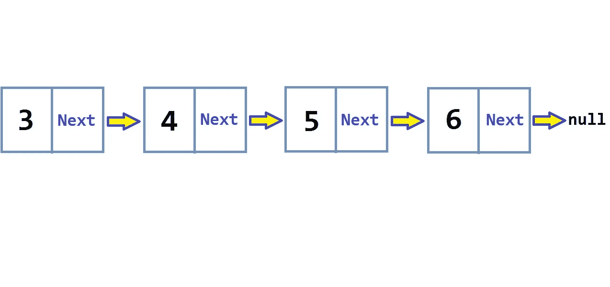
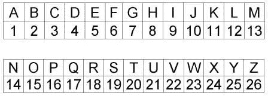

# 区块链:基础和技术基础

> 原文：<https://medium.com/coinmonks/blockchain-the-basics-and-technical-fundamentals-4f5e6b37e62a?source=collection_archive---------6----------------------->

在这篇文章中，我想探讨一下科技行业中一个超级热门话题的基础知识和技术基础:**区块链**。你们中的许多人可能听说过这个术语，但也许你很困惑或不太确定这种所谓的“革命性技术”是如何工作的。我认为大多数人面临的困难是缺乏对这项技术如何工作的基本理解。许多人知道区块链的用例，但许多人并不真正知道“引擎盖下”发生了什么今天，我将简单介绍一下区块链绝对的、基本的技术方面。

在我们能够理解什么是区块链之前，我们必须首先访问计算机科学中最基本的数据结构之一:**链表。**

***链表段***

Linked List Diagram

那么，为什么叫链表呢？嗯，它只是一个包含列表格式信息的列表，但是信息是以“链接”格式排列的。为什么这是必要的，甚至是一个好主意？

好吧，让我们想一个简单的购物清单。假设你想去商店买牛奶、鸡蛋和黄瓜。然后，您的列表将如下所示:

**杂货清单**

*   牛奶
*   蛋
*   黄瓜

如果我们将它编码到一个链表中，我们将从第一个包含牛奶的节点开始，然后购买牛奶。然后我们去下一个节点买鸡蛋。最后，我们会去下一个节点，买黄瓜。

让我们用 Python 做一个快速教程，展示链表的这种功能。

Creating a Linked List in Python

上面的代码片段向您展示了如何用 Python 定义一个简单的链表类。对于那些不熟悉编码或 Python 的人来说，这段代码本质上定义了链表对象。链表对象有两个参数叫做 ***val*** 和 ***node*** 。

在 Python 中 *def __init__* 指定了我们将如何初始化或创建这个对象。我们已经在实现中定义了，我们将使用一个特定的值创建这个对象，*，和一个 ***next*** ，它将指向链表中的下一个节点。*

*下面是一个如何在 Python 中遍历这种链表的例子。*

**

*Interactive grocery list example in Python*

*在最后，我们得到一个错误，因为我们已经接近列表的末尾，因此没有更多的信息了。这就是为什么在第一张图中，在链表的末尾有一个空值。所有链表在列表的末尾都有这个空值，因为这表示列表的结束。*

*关于这个实现需要注意的一个重要事实是，我们将链表从第一个节点遍历到最后一个节点。在我们的例子中，从牛奶到鸡蛋，再到黄瓜。你**不能**以任何其他顺序遍历链表中的节点。*

*既然我们已经讨论了链表的基础知识，让我们回到区块链的概念。我们需要理解链表数据结构的原因是因为区块链实际上是一个链表，但是该结构有一些附加内容，使区块链略有不同。*

****密码术部分****

*区块链中包含的许多附加功能都与**密码术**有关，更具体地说是**哈希**。*

*什么是**密码学**？根据维基百科，密码学“是在被称为对手的第三方存在的情况下，对安全通信技术的实践和研究。”*

*让我们假设你和你的朋友想通过在课堂上传纸条来聊天。不幸的是，你们没有坐在一起，所以你必须把纸条传给班上的其他人，然后你的朋友才能看到。*

*为了保持你们的对话，你们两个想出了一个主意。您决定将英语中的每个字母加密成一个从 1 到 26 的数字，并决定将每个单词用括号括起来，而不是用标准英语书写。*

**

*Letter to Number Cipher*

*从那里，你决定发送信息:“嘿，你好。”*

*您加密消息:“[8 5 25] [8 15 23] [1 18 5] [25 15 21]”*

*然后你的朋友收到信息，他用数字解密，并把它们变成字母。*

*这里潜在的问题是什么？有趣的是，我们可以看到很多 20 多岁的人，没有超过 25 岁的。由于字母表中有 26 个字母，也许你和你朋友之间的一个学生会试着通过将数字与英语字母表匹配来破解密码。如果有人这么做了，那么这个加密方案就被破解了。*

*要改进这种加密方案，您可以将数字的数量从 1–26 增加到 1–52。把你用的数字的大小增加一倍，那么每一对连续的数字就相当于同一个字母。所以，1 和 2 都是 a，2 和 3 都是 b，以此类推。*

*我们将如何决定是用 1 还是 2 来代表“a”，还是用 2 还是 3 来代表“b”好吧，我们可以抛硬币。如果是正面，我们就选较小的数字，如果是反面，我们就选较大的数字。*

*使用这个新方案，让我们再次加密“嘿，你好吗”。*

*"嘿，你好吗":= "[16 9 50][16 29 46][1 36 10][49 29 41]"*

*与原始方案相比，该方案更加稳健，因为您的朋友仍有可能解密消息，但现在我们在选择使用的数字时引入了一些随机性。这种随机性将使我们的方案更难破解。随机性在加密函数中非常重要，因为我们希望它们安全且不可破解。*

*现在这是如何在区块链中发挥作用的？嗯，区块链中的每个区块除了原始的链表结构之外，还包含了前一个区块的 **hash** 。*

*什么是**哈希**？嗯，散列是一个叫做**散列函数**的特殊函数的输出。散列函数接受一个输入，并返回一个对该输入唯一的输出。每个输入只有一个唯一的输出。例如，假设我们启动了一个移动应用程序，我们决定要对所有用户进行哈希运算。*

*假设我们的用户列表看起来像这样:*

***用户列表***

*   *约翰·史密斯*
*   *莎莉·布里奇斯*
*   *马克·萨班*

*我们可以使用的一个简单的哈希函数是 f(x) = x + 1，其中 x 是现有用户的数量。因此，用户约翰·史密斯将被散列到数字 1，莎莉·布里奇斯被散列到数字 2，马克·萨班被散列到数字 3。*

*因此，本质上，数字 1、2 和 3 唯一地标识了我们的三个用户，不可能有“混淆”换句话说，不可能出现 3 识别约翰·史密斯而不是马克·萨班的情况。也不能有任何哈希冲突，当两个不同的输入具有相同的哈希值时会发生哈希冲突。*

*这里的安全有哪些问题？假设某个对手出现，并决定他/她想要通过发现用户的哈希来尝试访问应用程序上用户的私人信息。*

*假设对手可以访问他/她的特定散列。为了尝试破解我们构建的哈希函数，对手通过编写一个程序，在一秒钟内创建五个独立的帐户，从而非常快速地创建多个帐户。假设在这一秒钟内，没有人注册账户。对手现在将会看到每个连续的散列与前一个散列相差 1。由此，对手可以知道我们的函数获取了现有的用户数，并将其递增 1，然后将其设置为新用户的散列。有了这些信息，对手就可以玩弄数字，并试图通过他们的散列找到用户的私人信息。*

*将所有这些放在一起，我们得到了**加密散列函数**。这些函数旨在解决我们已经讨论过的所有问题，以及更多问题。根据维基百科，“理想的加密哈希函数有五个主要属性:*

*   *它是[确定性的](https://en.wikipedia.org/wiki/Deterministic_algorithm)，所以相同的消息总是产生相同的散列*
*   *计算任何给定消息的哈希值都很快*
*   *除非尝试所有可能的消息，否则从消息的哈希值生成消息是不可行的*
*   *对消息的一个小的改变会导致哈希值的大范围改变，以至于新的哈希值看起来与旧的哈希值不相关*
*   *找到两个具有相同散列值的不同消息[是不可行的](https://en.wikipedia.org/wiki/Computational_complexity_theory#Intractability)*

*这里有一个来自维基百科的很好的例子，关于 SHA-1 加密哈希函数如何计算不同消息的哈希:*

**

*SHA-1 Hash Function Example*

*正如我们所看到的，对消息的微小改变会导致完全不同的散列。这正是我们想要的加密哈希函数。*

*加密哈希函数与区块链的相关性在于，它们用于哈希每个区块，然后该哈希存储在区块链的下一个区块中。加密哈希函数非常安全，这也是它们在区块链中如此必要和重要的原因。这是区块链安全的原因。*

*今天，SHA-3 系列加密散列函数是散列的标准集。*

****大树节****

*我想回顾一下另一个主题，名为 Merkle Trees，用于比特币区块链。我们应该从计算机科学中的树形数据结构开始。*

*一种树形数据结构，包含连接到其他节点的各种节点。数据存储在这些节点中。让我们来看一个例子:*

**

*An example of a Tree Data Structure from Wikipedia*

*Merkle 树也类似于原始的树数据结构，但是它们也被称为“散列树”,因为 Merkle 树中的每个节点都包含一个散列。区块链中的每个区块都包含一棵记录其所有交易的 Merkle 树。*

**

*Wikipedia: Merkle Tree Example*

*正如您在上面看到的，Merkle 树是通过分解事务的散列来使用的，并沿着它一直到数据所在的 Merkle 树。*

*为什么使用 Merkle 树而不是列表来存储事务？好吧，如果我们使用一个列表，那么每当我们想要验证一个块上的事务时，我们就必须遍历整个列表。相反，我们可以使用这种树结构，通过每次只考虑树的一半来更快地找到数据。*

*在上面的例子中，如果散列从 1 开始，我们就进入右边的分支。如果又是 1，那么我们又回到右边的分支。这样，在我们的树中搜索事务散列比遍历一个列表要快得多。*

****结论****

*将所有这些信息放在一起，让我们来看看简化版的比特币区块链:*

**

*[https://bitcoin.org/en/developer-guide](https://bitcoin.org/en/developer-guide)*

*我们已经涵盖了此图中的每个概念！希望你看完这篇文章后对区块链技术有更好的理解。*

*现在，我希望你能对这项技术形成自己的看法，并决定它在未来有多重要。如果你喜欢这个故事，请鼓掌，评论，并在脸书和推特上分享这篇文章。感谢您的阅读！*