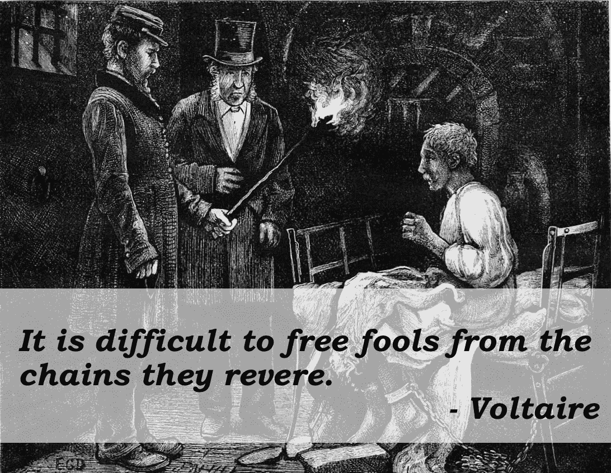
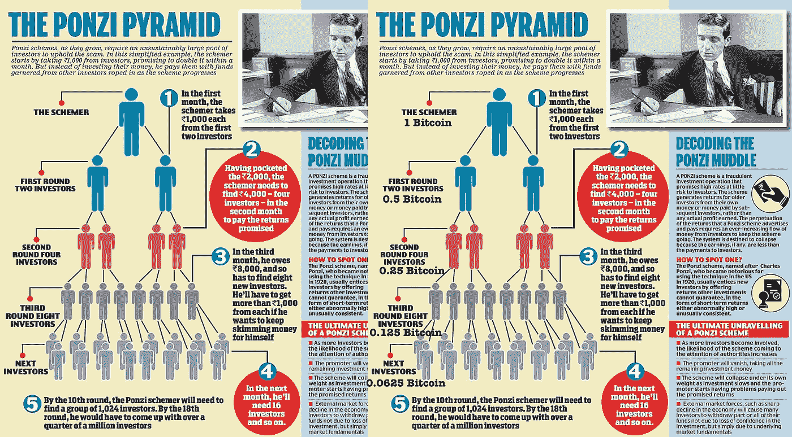

# 区块链:最好的人性，最坏的人性，人类智慧的时代，愚蠢的人性的时代……

> 原文：<https://medium.com/coinmonks/blockchain-the-best-of-humanity-the-worst-of-humanity-the-age-of-human-wisdom-the-age-of-124e8c9540bf?source=collection_archive---------6----------------------->

# 序言

首先，我想澄清一下，我不反对资本主义，也不反对社会主义，共产主义，甚至君主制。我也不相信金钱是邪恶的。

我认为，作为人类，我们不知何故注定要自我毁灭。或者这可能是所有生物体内固有的东西。起初，动物被认为不会自残(即自杀)，直到被圈养的动物证明并非如此(即使如此，一些科学家认为这不是自杀)。如果一只被囚禁的动物会因为不能适应环境而自残，那么同样的事情也可能发生在我们人类身上，这难道不合理吗？我们自己似乎都无法认识到这一点，就像被囚禁的动物不了解自己的处境一样。

货币的发明对人类来说是一件好事，它让人类社会超越了物物交换体系，进入了更先进的经济体系，几百年来一直做得很好。只是在最近，金钱扮演了一个更加邪恶的角色。虽然不是钱的问题，而是围绕钱的两个不同的问题:

1.  利用当前货币形式的先进经济工具，
2.  通货膨胀的死亡螺旋。也就是通货膨胀的真正原因。

我们可能没有意识到这一点，或者我们可能睁一只眼闭一只眼，但我们的生活被当前的金融体系所控制，这个体系首先是庞氏骗局，其次是金字塔骗局。部分准备金银行就是证明。然后，我们有了越来越聪明的金融工具，比如出售贷款，然后将其组合起来，创造出各种风险的创收资产，然后再出售这些资产，或将其用作获得贷款的抵押品。

除了部分准备金银行，我们还有一种不可持续的金融模式，这种模式将我们的经济送入了死亡螺旋。这个症状就是众所周知的通货膨胀，我们有货币通货膨胀和价格通货膨胀。货币供应增加导致的货币通胀，以及价格上涨导致的价格通胀(废话！).价格上涨的一个常见原因是基本商品的成本增加，如石油、劳动力、电力等。但在我看来，通胀最常见的原因是融资成本。当你有部分准备金银行时，整个经济都在偿还债务。偿还债务意味着提高价格以弥补债务成本。所以每个人都要求更高的工资，更高的价格，来偿还债务，偿还债务，偿还债务…债务才是真正的罪恶，而不是金钱…

把我们的经济变成一场“饥饿游戏”遇上“叠衣服”遇上“吃鸡”的恶战，每个玩家都小心翼翼地确保他们的要求不会破坏经济；工人罢工，卡特尔减产，房价上涨，商品和服务变得更加昂贵。

# 比特币反映了金融体系的问题

比特币是当前金融体系问题的简单反映。一些人将比特币称为庞氏骗局或金字塔计划，而另一些人认为比特币与股票或资产没有什么不同，由供求关系控制。不管是什么，沃伦·巴菲特的下面这句话是准确的，适用于比特币和任何东西。

"股票市场是一种把钱从没有耐心的人身上转移到有耐心的人身上的工具."——沃伦·巴菲特。

它适用于任何事物，因为所有的资源都是有限的，有了像部分准备金银行这样的庞氏骗局，我们可以肯定，任何有价值的事物从长远来看都会增值。

比特币*是*一种资产，但只有当我们处理最小的不可分割单位时，比如 0.000……0001 比特币。可惜，喜欢“1”这样的大胖整数是人之常情。因此，当我们处理 1 个比特币时，它会将比特币变成一个伪庞氏/金字塔计划。下图描绘了一个庞氏骗局。左边是原作。右边有比特币的添加。

非常合身。(难怪比特币有时会被认为是庞氏骗局。)然后到处都是 FUD，市场崩溃了，阴谋家又以低廉的价格买回比特币的碎片，只是为了重复这个过程。

即使上述情况不是实际发生的(高层没有一个阴谋家)，问题是比特币和当前的加密货币是一个“烫手山芋游戏”，比特币被传递给另一个人，然后传递给另一个人，每个人以更高的价格出售以赚取一些利润，直到市场因谁持有比特币而崩溃。每过一个阶段，可以购买的比特币数量就会变得越来越少。

除了两者都是“烫手山芋游戏”，而且都涉及分数之外，上述描述与部分准备金银行没有任何相似之处。

# 区块链是一个有所不同的机会

但加密货币和智能合约的底层技术是一线希望。它开启了创造/设计一个新的金融系统的可能性，而没有我们当前系统的缺陷。

有了正确的想法以及人民和政府的支持，区块链技术将允许我们构建一种不能像部分储备银行那样被操纵的货币，并且不会遭受比特币和其他加密货币所遭受的“烫手山芋游戏”或“斯托克霍德尔综合症”。

现在是我们摆脱不可持续的金融模式和体系的时候了，这种模式和体系只会让我们更深地陷入永无止境的债务泥潭，让我们进入一个可以在不危及我们经济独立的情况下创造财富和货币的新体系。

我们应该接受区块链和加密货币所提供的一切，而不是应用旧逻辑或旧系统，我们必须鼓励新的思维方式和利用技术。

> [在您的收件箱中直接获得最佳软件交易](https://coincodecap.com/?utm_source=coinmonks)

