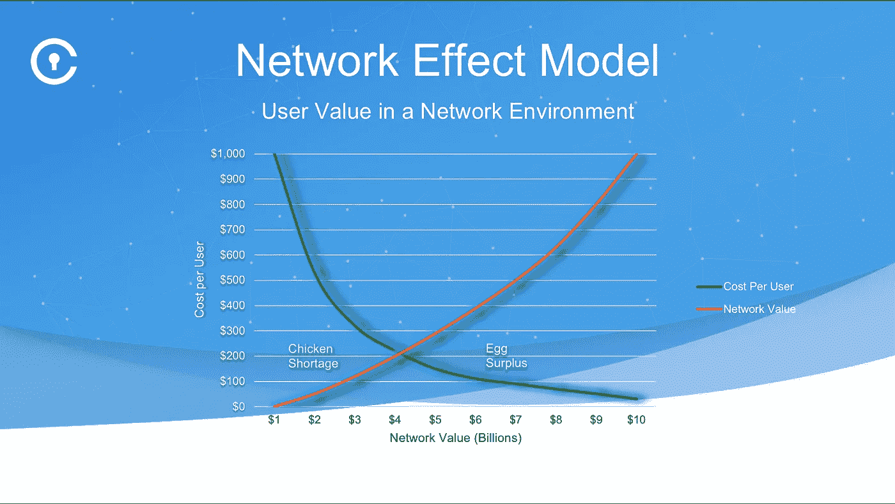
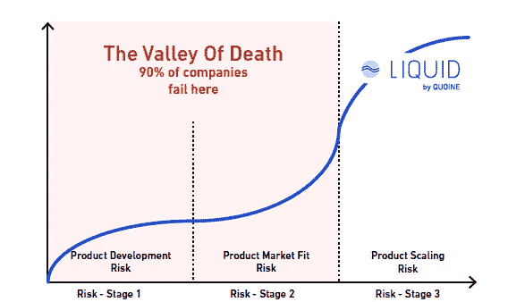
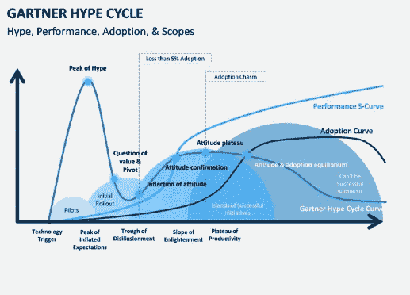

# 区块链令牌采用问题:为什么网络效果不够

> 原文：<https://medium.com/coinmonks/blockchain-token-adoption-problem-why-the-network-effect-is-not-enough-4aacc0f32973?source=collection_archive---------5----------------------->

**Blockchain Dilbert Cartoon by Scott Adams**

区块链的未来取决于数字身份、web 3.0 项目的发展，以及解决可扩展性、残酷的延迟、计算能力、有限的存储和互操作性等关键问题的令人信服的解决方案。这听起来像是很多密码术语。是的，对普通人来说是这样。

尽管加密货币处于熊市，但去年席卷加密市场的巨大估值热潮仍在继续其在 ICO 市场的牛市。仅在 2018 年，ICO 筹集的集体资金就接近 60 亿美元 ***，但其中有多少转化为代币采用？有多少令牌采用者将令牌产品或平台用于个人或商业用例？他们是否已经将忠诚度/使用从传统系统有机地转移到加密平台或产品？***

***代币领养市场是否存在空白？***

*(阻碍大规模采用加密货币和代币的法律问题超出了本文的范围。)*

# 先有鸡还是先有蛋的问题

早在 2016 年，密码专家就呼吁，代币的采用将为创业公司解决**鸡和蛋的问题**，即 ***如何在没有产品但只有创新的改变世界的想法的情况下建立客户/信徒的基础？*** 答案被认为是利用了“网络效应”——[一**网络效应**(也称为**网络外部性**或**需求方规模经济**)是经济学和商业中描述的一种积极效应，即一种商品或服务的额外用户对该产品对其他人的价值的影响。当存在网络效应时，产品或服务的价值随着使用它的其他人的数量而增加”。](https://en.wikipedia.org/wiki/Network_effect)

有人提出，如果早期信徒可以转化为早期参与者，进而成为 idea 业务的投资者，那么令牌的采用可以通过网络价值来建立。下面是 [Vinny Lingham](https://medium.com/u/220c1c547a96?source=post_page-----4aacc0f32973--------------------------------) 众所周知的关于通过网络效应模型解决先有鸡还是先有蛋的问题的图表。

Courtesy Vinny Lingham Civic

在 ICO 期间用于筹集资金的代币已经达到了采用周期危机。许多希望从加密货币价格突然上涨中赚快钱的散户投资者在 2017 年将资金投入了 ICO 市场。但是这些散户很少采用加密产品来使用。

***截至目前 90%以上成功和不成功的 ICO 代币都已登陆*******。****

*顶级加密初创公司只有大约 78000 个令牌采用者，这实际上是一个非常令人难过的数字。几年前，如果你的初创公司有 7-8 万用户，那么你知道你有牵引问题。现在，每一家加密初创公司都面临着这场危机。*

***那么，我们是如何在代币采用率如此之低的情况下走到这一步的，这实际上损害了区块链大规模采用的前景**。*

*忽视秘密骗局和暴富的创始人，他们在快速获利后放弃了他们的秘密创业；许多拥有优秀产品的合法区块链创业公司正在努力为成功采用代币创造一个生态系统。我们听说过很多关于网络效应的事情，但目前这些代币需要消费者采纳效应的魔力。那么可能的原因是什么呢？*

**

*Courtesy Quoine*

# *为什么网络效应没有解决代币采用问题。*

1.  ****如果你的产品或平台没有粘性:*** 麻省理工学院斯隆商学院教授@Catherine Tucker [最近有一篇文章，https://HBR . org/2018/06/why-network-effects-matter-less-than-these-used-to](https://hbr.org/2018/06/why-network-effects-matter-less-than-they-used-to)指出，“只有当你的产品也有粘性时，网络效应才真正成为竞争优势的来源”。“如果你的客户明天就全部离开，规模不会通过网络效应带来未来的竞争优势。”*
2.  ****没有解决任何实际问题:*** 如果你没有解决任何现实世界的问题或创造任何新的市场或改变市场行为，那么你需要真正研究这些加密业务的使用案例。我听说过优步加密航空公司、bnb 加密航空公司等等..我不确定在已经价值数十亿美元的现有业务中加入加密技术是否能解决任何紧迫的问题。*
3.  ****人是习惯的生物:*** 在现有的遗留产品或平台上增加一个具有象征性经济性的额外功能不会转化为巨大的客户群。你可以制造一些噪音，说你正在拖垮市场巨头，可以吸引牛市中的 FOMO，最初有助于在几秒钟内为你的 ICO 筹集数百万美元，但有多少客户会真正从这些遗留系统中过渡出来。人是习惯的产物，“消费者现有的习惯是抵制新产品使用的主要驱动力”——[习惯滑坡:当消费者无意中抵制新产品](https://link.springer.com/article/10.1007%2Fs11747-016-0482-9)*

# *所以问题是我们如何增加令牌的采用？*

*创造一个易于采用和使用令牌且对消费者友好的环境并不是出发点。为产品建立一个社区，真正强调现实世界中令人信服的问题的解决方案，这与努力工作于那些客户服务交付，然后检查每个问题解决和成功采用的用例是一样重要的。这个代币采用问题的一些答案在于传统的创业建设方法，每个成功的创始人都在他们的竞争分析中利用和区分建立忠诚和可扩展的消费者基础。*

**

*Gartner Hype Cycle*

## *Gartner 炒作周期中的区块链技术*

*Gartner 炒作周期的成熟和采用阶段提供了对新技术如何解决实际业务问题以及如何通过各种用例发展的洞察。在炒作周期的各个阶段中，我们目前正进入*

****【幻灭低谷】*** 区块链阶段——当兴奋感随着一些项目未能交付而消退时，这里的采用率不到 5%(图)。“只有当幸存下来的项目改进了他们的产品，使早期采用者满意时，投资才会继续。“我们正在研究第三代区块链产品如何帮助克服采用鸿沟。*

*对普通人来说，试图在交易所中使用密码的进入壁垒很高，区块链技术的深奥性质使我们想起了 20 世纪 80 年代计算机的早期，那时人们需要知道 DOS 命令和各种命令行界面才能与计算机进行交互。随着图形用户界面的出现，事情发生了变化。发布的计算机指南手册(如果你想读一本[这里](http://polaris.gseis.ucla.edu/pagre/how-to-help.html))现在很有趣，已经成为过去。人们不需要向他们的奶奶或 2-3 岁的孩子提供如何使用电脑或 iphone 的手册。区块链需要经历类似的技术用户进步过程，才能搭载更多不懂密码的消费者。到那时，我们需要专注于如何解码这些复杂性和不便之处，无论是记住长私钥还是缺少对被盗密钥的问责。*

***区块链不是万能的解决方案***

*在一个被炒作的牛市中，这项技术引发新进入者宣传区块链是一切的解决方案。*

*不负责任的创业，无纪律的投资，都是不好的行为。这种行为故意操纵市场，造成市场扭曲，损害所有人的利益。“市场分析师得到的是糟糕的或失真的数据，这些数据无法让他们理解真正的潜在市场动态。本可以充分利用资金的区块链公司可能会资金不足，老练的投资者会赔钱，幼稚/散户投资者会血本无归。”*

*比特币是作为 2007 年金融危机的解药而诞生的。这个想法是为了保护人们免受不公平系统的影响，无论是政府还是金融系统*，因为他们的工作有利于那些“大到不能倒”的人，而牺牲了那些“小到不能关心”的人。”——正如 Ray Dillinger 所说(他在比特币早期发展过程中与 Satoshi 共事——此处阅读完整采访***)***

**从分散化运动到许多更集中的促销活动，再到商业企业利益和一些区块链实现，令牌化已经走过了漫长的道路。新的筹款协议真正分散了我们筹集资金的方式，但我们不能对每个项目都采用区块链来获得资助，除非有一个经过充分研究的真实世界用例解决方案，而这些解决方案无法通过丰富的数据库或简单的数字账本实现来解决。建立令牌采用需要时间和集体创新，在此之前，让我们专注于基于区块链解决方案的令人信服和可行的用例研究。**

*****注:*** *本文不应被视为金融或法律建议，仅是作者的观点。***

***Gayatri Sarkar 是基于区块链的风险投资基金 SportVEST 的普通合伙人，专注于投资体育的未来。***

# **SPORTVEST 风险投资基金:**

***有关 SportVEST 私人销售的更多信息，请联系我们:*[*hello @ sport vest . io*](https://scorum.com/hello@sportvest.io)*或访问我们的网站:*[*sport vest . io*](https://sportvest.io/)*。别忘了加入我们的* [*电报*](https://scorum.com/telegram.me/sportvestico) *和关注我们的* [*推特*](https://twitter.com/SportVESTico) *。***