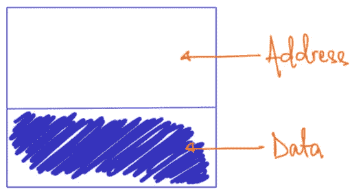
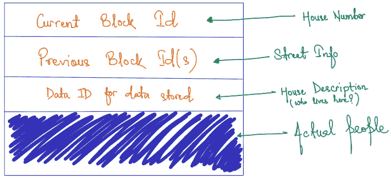
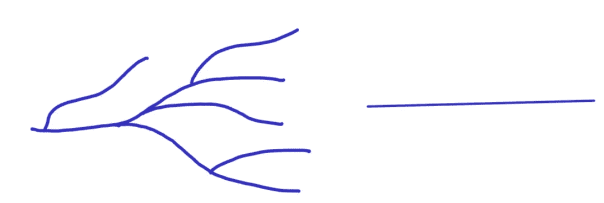
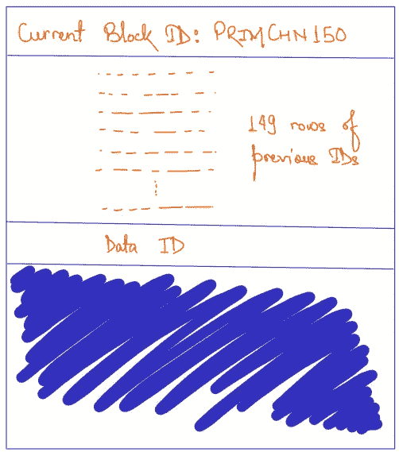
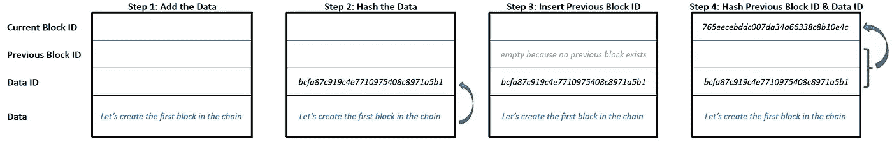
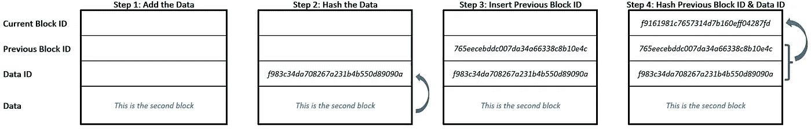
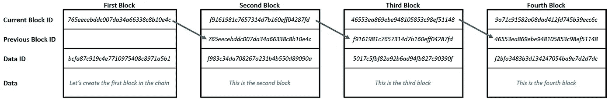
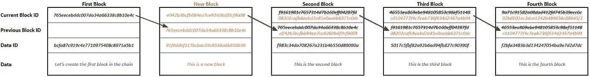
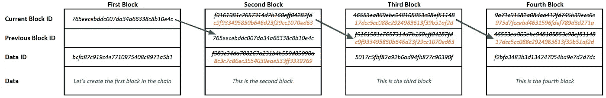

# 区块链 Ep02:取消区块装箱

> 原文：<https://medium.com/coinmonks/blockchain-unboxing-the-block-598b633741b3?source=collection_archive---------6----------------------->

在我之前的文章中，我们创建了一个非常原始的区块链。但是我们也定义了一个非常简单的模块结构——事实上，如果没有这个结构，我们不会走得很远。今天，我们将把这个结构放在显微镜下，揭示其内部发生的所有神奇现象。事实上，我们将试图从零开始建造一个几乎真正的***街区**。*

**

*A primitive block*

# *放大地址*

*就像你街上的每栋房子一样，每个街区也有自己独特的地址。就像写下你家庭地址的通用方式一样，我们也将创建一种通用方式来表示我们链中的块地址。*

**

*The Address System — with a real world analogy.*

***当前块 ID***

*就像门牌号一样，唯一地标识每个单独的房子(或公寓单元)，当前街区 ID 是每个街区的唯一地址。我们将故意忽略这个 ID 是如何分配的，因为我们还没有配备这样做的协议。我们只是相信存在一种方法来分配一个非常唯一的 ID。*

***先前块 ID***

*这就是真实世界的例子与块版本不太相似的地方。该链是一个单一的街道宇宙，这就是为什么它不需要像在现实世界中那样的整个(街道名称、县、城市、州、国家、邮政编码)集。所以我们需要的只是一个地标，邻居就可以了。我们就在那栋两层红砖房的旁边。*

**

*Streets in the real world (left) vs ‘one lane’ chain (right)*

*但是我们的链要求所有前面的块的地址 id 以正确的顺序存储。随着链开始变长，这就成了一个问题，将会有太多的 id 需要写下来。*

**

*The 150th block on our primitive chain would need 149 rows of previous block IDs. What if the chain becomes 1,000,000 blocks long?*

*现在你会说，这不实际。我同意你的观点。我们需要一种方法来将这些庞大的信息压缩到可管理的大小。幸运的是，有一件魔法可以做到这一点，在短暂的一瞬间，我们将传送到这片神奇的土地！*

> *作者注:数据 ID 是存储在块中的数据的标识符。我将跳过这一段，但稍后我会告诉你它是如何工作的。*

***哈希的神奇世界***

*哈希在当今世界如此普遍，可以毫不夸张地说我们的生活在很大程度上依赖于它。因此，这是无数 YouTube 视频、博客、大学讲座和咖啡讨论的主题。但是对于我们今天的目的，我只想强调一下**哈希**的主要特性。*

1.  ***散列**是一个不可逆函数，它接受任何输入并产生一个输出；您不能从输出中重新创建输入*
2.  *不管输入的大小如何，输出总是随机出现的固定长度的字母数字串(一系列字母和数字)*
3.  *散列对输入极其敏感，即使输入的微小变化也会导致完全不同的输出；输入不变输出也不变！*
4.  *两个不同的输入产生相同输出的概率几乎为零，每个输入产生一个独特的输出，就像指纹一样*

***散列**是真实的，它存在，事实上今天有许多不同类型的**散列函数**被使用！这种东西的存在似乎太方便了，因为我们马上就会看到它是如何解决这个链条中的几乎所有问题的，甚至是那些我们还没有谈到的问题。但是今天，我要求你们带着这些**哈希**的特征去信仰。我保证我会在另一天的另一篇文章中解释这一切是如何运作的。*

*不过，在我们离开这片神奇的土地之前，我会把这块金块留给你。Hashing 得名的原因和 hash browns 得名的原因差不多。*

**

*Crispy potato hash browns and Hashing have much in common. How? Details in the next post…*

*让我们建造一些积木吧！*

*既然我们已经见过了**散列**并且知道了**散列函数**的存在，我们就有了创建唯一地址 id 的方法。这可能会有点复杂，但完全值得。我们要从头开始建一个积木！太令人兴奋了..*

*让我们创建链中的第一个块——创世纪块**块*。我们所需要的是创建这个块的一些数据。任何数据都可以，甚至是句子— *让我们创建链中的第一块*。**

**创建新块的步骤是-**

1.  **获取要存储在新块中的*数据***
2.  **将*数据*输入到**散列函数**中，以获得第一个散列输出——将其存储在该块的*数据 ID* 字段中**
3.  **将前一个块的*当前块 ID* 插入到这个新块的*前一个块 ID* 字段中，这个步骤创建了链的块之间的链接(仅对于链的第一个块，这个是空的，因为没有前一个块，所有随后的块都有一些值)**
4.  **组合*数据 ID* 和*先前块 ID* 作为**散列函数**的一个输入，以创建新的散列输出——这是新块的*当前块 ID***
5.  **冲洗并重复任何新块**

****

**Different steps of creating the Genesis block**

> **作者注:示例中的散列是使用 [MD5 散列函数](https://en.wikipedia.org/wiki/MD5)创建的，这是许多可用散列函数之一。建议您使用[这个 MD5 散列生成器](https://www.md5hashgenerator.com/)或任何在线 MD5 散列生成器来验证下面每个示例的输出。MD5 不是一种安全的哈希算法，这意味着它是可逆的。但即使在今天，它也是一个很好的例子。**

**现在让我们在链中创建第二个块，包含数据— *这是第二个块。*下图说明了步骤，类似于创世纪区块的步骤**

****

**Steps to create the second Block, with first block’s ID in the mix**

**重复这个过程总共 4 块，我们现在有一个链看起来像这样…**

****

**A chain is shaping up**

**但是等等，在这个链中*先前的块 ID* 并不包含所有先前块的 ID。这不正是我们希望我们的连锁店拥有的吗？这怎么有效呢？
所发生的是，散列函数神奇地将前面块的整个历史压缩到一行 ID 中。为了看到这一点，让我们看看如果我们试图在链的中间插入一个新的块会发生什么。**

****插入新块****

**如果我们在第二个块之前插入一个新块，我们必须更新第二个块的*以前的块 ID* 以保持链连接。但是这样做会立即更新第二个块的当前块 ID！因为*先前块 ID* 是创建*当前块 ID* 的散列函数的输入，我们知道散列对输入极其敏感。现在，第二个块的更新后的*当前块 ID* 需要插入第三个块的*先前块 ID* (否则链验证将失败)，这将立即改变第三个块的*当前块 ID* ！**

****

**Every hash after the new block is inserted will have to be modified because the current block ID takes previous block ID as input. Modifications in orange, previous values in strike-out**

**因此，必须手动更新每个块，否则链验证协议将拒绝此更新。这正是我们想要的连锁店！**

****散列函数**神奇地将前面块的整个历史压缩到一行 ID 中。但这也解决了我们的另一个问题…**

****检测数据变化****

**如果我们稍微改变任何块中的*数据*，我们将改变该块*、*的*数据 ID* ，因为**散列函数**对输入敏感。*数据 ID* 是*当前块 ID*的输入之一，因此改变*数据*会改变*数据 ID* ，进而改变*当前块 ID。*与上述相同的效果再次通过链传播，需要改变下游的每个块。**

****

**Even a small change of adding a period ‘.’ to the data of second block requires a wholesale change to the chain downstream**

****总之****

**在上一篇文章的结尾，我们的区块链有两个主要问题。首先，地址管理系统效率不高。第二，我们甚至没有触及存储的数据，以及如果有人试图篡改数据会发生什么。**

****哈希**神奇地解决了这两个问题。无论有人试图篡改链(通过在中间插入新块)，还是试图篡改块内的数据，我们的系统都确保每个块都需要更新才能通过链验证协议。相比之下，这比仅仅在链的末端添加一个新块要困难得多，因为需要做更多的工作。**

**尽管这仍然不是不可能的！**哈希函数**快如闪电，对于任何给定的输入，获得哈希输出几乎是瞬间的。所以做这些更新只需要几秒钟。**

**那么到底是什么让**区块链**不可改变呢？这是我下一篇文章的主题。到时见…**

## ****扣人心弦****

**散列很快，但它确实是随机的，我们不知道对于给定的输入，输出会是什么样子。如果我想让我的散列输出看起来像某种方式，会发生什么？**

> **加入 Coinmonks [电报频道](https://t.me/coincodecap)和 [Youtube 频道](https://www.youtube.com/c/coinmonks/videos)了解加密交易和投资**

## **另外，阅读**

*   **[最佳比特币保证金交易](/coinmonks/bitcoin-margin-trading-exchange-bcbfcbf7b8e3) | [比特币保证金交易](https://blog.coincodecap.com/bityard-margin-trading)**
*   **[加密保证金交易交易所](/coinmonks/crypto-margin-trading-exchanges-428b1f7ad108) | [赚取比特币](/coinmonks/earn-bitcoin-6e8bd3c592d9)**
*   **[WazirX vs CoinDCX vs bit bns](/coinmonks/wazirx-vs-coindcx-vs-bitbns-149f4f19a2f1)|[block fi vs coin loan vs Nexo](/coinmonks/blockfi-vs-coinloan-vs-nexo-cb624635230d)**
*   **[BlockFi 信用卡](https://blog.coincodecap.com/blockfi-credit-card) | [如何在币安购买比特币](https://blog.coincodecap.com/buy-bitcoin-binance)**
*   **[火币交易机器人](https://blog.coincodecap.com/huobi-trading-bot) | [如何购买 ADA](https://blog.coincodecap.com/buy-ada-cardano) | [Geco。一次复习](https://blog.coincodecap.com/geco-one-review)**
*   **[加密复制交易平台](/coinmonks/top-10-crypto-copy-trading-platforms-for-beginners-d0c37c7d698c) | [五大 BlockFi 替代方案](https://blog.coincodecap.com/blockfi-alternatives)**
*   **[在美国如何使用 BitMEX？](https://blog.coincodecap.com/use-bitmex-in-usa) | [BitMEX 审查](https://blog.coincodecap.com/bitmex-review)**
*   **[最佳期货交易信号](https://blog.coincodecap.com/futures-trading-signals) | [流动性交易所评论](https://blog.coincodecap.com/liquid-exchange-review)**
*   **[南非的加密交易所](https://blog.coincodecap.com/crypto-exchanges-in-south-africa) | [BitMEX 加密信号](https://blog.coincodecap.com/bitmex-crypto-signals)**
*   **[MoonXBT 副本交易](https://blog.coincodecap.com/moonxbt-copy-trading) | [阿联酋的加密钱包](https://blog.coincodecap.com/crypto-wallets-in-uae)**
*   **[雷米塔诺评论](https://blog.coincodecap.com/remitano-review)|[1 英寸协议指南](https://blog.coincodecap.com/1inch) | [购买 Floki](https://blog.coincodecap.com/buy-floki-inu-token)**
*   **[MoonXBT vs Bybit vs 币安](https://blog.coincodecap.com/bybit-binance-moonxbt) | [Arbitrum:第二层解决方案](https://blog.coincodecap.com/arbitrum)**
*   **[买 PancakeSwap(蛋糕)](https://blog.coincodecap.com/buy-pancakeswap)|[matrix export Review](https://blog.coincodecap.com/matrixport-review)**
*   **[最佳免费加密信号](https://blog.coincodecap.com/free-crypto-signals) | [YoBit 评论](/coinmonks/yobit-review-175464162c62) | [Bitbns 评论](/coinmonks/bitbns-review-38256a07e161)**
*   **[OKEx 回顾](/coinmonks/okex-review-6b369304110f) | [Kucoin 交易机器人](/coinmonks/kucoin-trading-bot-automate-your-trades-8cf0ca2138e0) | [期货交易机器人](/coinmonks/futures-trading-bots-5a282ccee3f5)**
*   **[AscendEx Staking](https://blog.coincodecap.com/ascendex-staking)|[Bot Ocean Review](https://blog.coincodecap.com/bot-ocean-review)|[最佳比特币钱包](https://blog.coincodecap.com/bitcoin-wallets-india)**