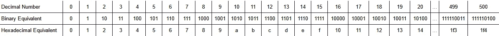
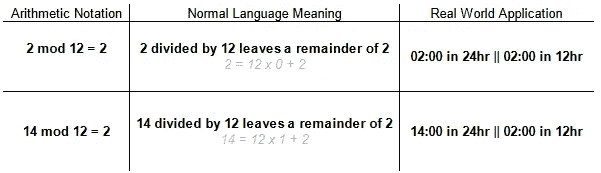
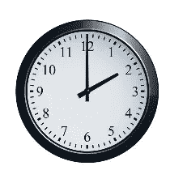
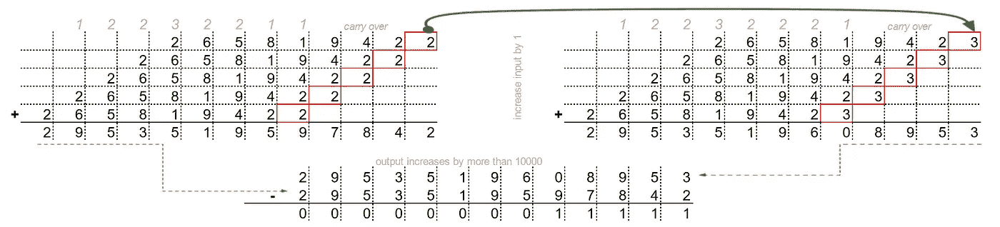
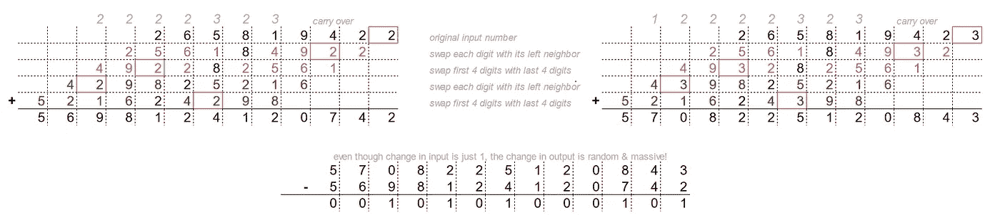

# 区块链 Ep03:解除哈希函数杂凑—第 1 部分

> 原文：<https://medium.com/coinmonks/blockchain-unhashing-the-hash-functions-part-1-3ac047148211?source=collection_archive---------3----------------------->

基于[之前的帖子](/coinmonks/blockchain-unboxing-the-block-598b633741b3)，我们将更仔细地看看**哈希函数**的特性，以及它们是如何获得这些特性的。因为主题很复杂，我把它分成了两篇，而不是一篇。老实说，我将在这篇文章中涉及的概念可以跳过，只要你乐意相信**散列函数**。如果没有，请继续阅读…

# 计算机靠 0 和 1 生存

美国人使用 **Dec** imal 系统进行计数，该系统使用**10**digits 0–9。这对我们来说是很自然的，因为大多数人都有 10 个手指，用手指来数很容易。

计算机依靠电流运行，它们使用二进制系统，该系统使用二进制系统。这对计算机来说很自然，因为要么有电流(1)，要么没有电流(0)。

十进制和二进制都是兼容的系统，也就是说能用十进制写的也能用二进制写。但是二进制有一个缺点，它变得很长，甚至代表很小的数字。于是我们开发了一个新的兼容系统， **Hexadec** imal 系统，将二进制表示缩短了 4 倍。十六进制使用 16 个十六进制数字，0–9 和 a-f。

Comparison of the Decimal, Binary and Hexadecimal Number Systems

前一篇文章中的**哈希输出**是由基于**哈希函数**的计算机生成的长二进制数的十六进制表示。重申一下—

*   对于我们在十进制系统中能看到或做的任何计算，在二进制系统中也存在着等价的计算
*   计算机运算会产生大量的二进制数，我们可以用输出的十六进制等效值来缩短它们

# **哈希的特点—第 1 部分**

下面讨论的**哈希**的特性来自极其复杂的数学。我的目的不是揭示散列的确切内部工作原理，而是想向您展示，原则上，使用更简单的概念来构建这些特性是可能的。真实的世界将会与我们下面讨论的大不相同，但这并不意味着它一定很难理解。这就是目标——理解！

> 作者注:我将使用十进制来推动数学概念，因为它更容易与十进制计算联系起来。请记住，我们在这里所做的一切，计算机都会在等价的二进制系统中完成

**特点 1:单向性**

***哈希*** *是一个不可逆函数，取任何输入，产生一个输出；您不能从输出*重新创建输入

我们都见过两种版本的时钟——12 小时制和 24 小时制。当挂钟显示 2:00 时，可能是凌晨 2 点或下午 2 点，以 24 小时制分别表示为 02:00 和 14:00。

为什么 24 小时制中的 02:00 和 14:00 都表示为 12 小时制中的 02:00？这是使用一种叫做*模运算*的算法的结果，简单来说就是*输出除法*的余数。对于时钟，这意味着将 24hr 格式的时间(即 14)除以 12，输出余数(即 2 ),表示 12hr 格式的时间。这个庞大的句子可以简单表示为—*14****mod****12*。

Modular Arithmetic with base 12

这就产生了一个难题。如果你被困在一个没有窗户的房间里，只有一个看起来像下面的挂钟，你能绝对肯定地说外面是不是黑的吗？

Is it time for a healthy lunch? Or is it time for post mid-night (un)healthy snacking?

现在我们来玩个游戏吧！我心里有个数， *x.* 我告诉你 *x mod 12 = 5* 。我脑子里的数字是多少？你有三次猜测的机会…

如果我脑海中的数字是 5， *x = 5* ，那么很有可能你猜对了。如果 *x = 2249，*你猜对的可能性极小。如果 *x = 10559585774837* ，我可以 100%肯定你从来没想过！

所以在某种程度上，*模运算*是一种方式。对于同一个输出，有许多可能的输入，所以你不可能猜出所有无限选项的正确输入。而**哈希函数**用这个来实现 ***单向*** 。

**特性二:压缩**

*不管输入的大小如何，输出总是随机出现的固定长度的字母数字串(一系列字母&数字)*

这个很容易看出来。如果您 *x mod 12* ，对于任何输入 *x* ，输出将总是在 00 和 11 之间。如果您 *x mod 257* ，对于任何 *x，*输出将总是在 000 和 256 之间。当然，真正的**哈希函数**并不只是使用 **mod** 进行压缩。但是很容易看出单独使用 **mod** 是完全可能的。

**特性 3:输入灵敏度**

***哈希*** *对输入极其敏感，即使是输入最轻微的变化也会导致完全不同的输出；输入不变输出也不变！*

很明显 **mod** 不会实现这一点。所以我们必须有点创意。让我们把一个数和它本身相加，只有一个小技巧，我们在加法之前把这个数左移 1 位。这个*移位相加*过程通过移位的数量放大了输入的变化。

A simple *shift-addition* gives high input sensitivity, in this case, 4 shifts cause a magnification of >10⁴ times

***哈希数字&土豆薯饼***

除了*移位相加*之外，我们还可以对输入数进行斩波、切块和混合，进一步增加输入灵敏度。例如，我们可以在第一个*移位加法*中将每个数字与其相邻数字交换，然后在第二个*移位加法*中将整个数字的前半部分与后半部分交换。这类似于哈希布朗食谱中所做的。我们把土豆煮熟，碾碎，混合在一起，然后一起加入土豆煎饼中——我们把土豆做成土豆泥。这里我们**散列**这些数字！

The mathematics of creating Hash Browns from the a number input! See how different the outputs are, even though the different in inputs is so small.

真实世界的**散列函数**以预定的方式利用**散列**和**模**的多个步骤。时不时还会有和大质数相乘的步骤，只是为了额外的随机性。然后就是更多的 **Hash** 和 **mod** 。一遍又一遍，直到输出看起来一点也不像输入。

# 最后

总的来说，**散列函数**是这样工作的

*   计算机中的一切，数字或文本，都是一系列的 0 和 1，它是基于二进制系统的机器
*   **散列函数**将一个二进制数作为输入
*   他们做的步骤包括内部交换数字，将数字本身相加，再与另一个大数字相乘
*   偶尔，**散列函数**也会取一个**模**，但是它们使用一个非常大的质数作为基数
*   然后重复数字交换，加法和乘法运算，再次取模，重复交换，加法和乘法，再次取模…
*   最后，输出是给定输入的**散列输出**

这很复杂，我不否认。但本质上，这是幕后正在发生的事情。

现在，我们就到此为止。下一次，我们将讨论第四个特性，也可能是**哈希函数**最重要的特性——抗冲突。

> 加入 Coinmonks [电报频道](https://t.me/coincodecap)和 [Youtube 频道](https://www.youtube.com/c/coinmonks/videos)了解加密交易和投资

## 另外，阅读

*   [OKEx Review](/coinmonks/okex-review-6b369304110f)|[coin switch 俱吠罗 Review](/coinmonks/coinswitch-kuber-review-1a8dc5c7a739) | [比特币基地费](/coinmonks/coinbase-fees-831e77d4f2c5)
*   [AscendEX Review](/coinmonks/ascendex-review-53e829cf75fa) | [OKEx 交易机器人](/coinmonks/okex-trading-bots-234920f61e60) | [OKEx 交易机器人](/coinmonks/okex-trading-bots-234920f61e60)
*   [霍笔交易机器人](https://blog.coincodecap.com/huobi-trading-bot) | [如何购买 ADA](https://blog.coincodecap.com/buy-ada-cardano) | [Geco。一次回顾](https://blog.coincodecap.com/geco-one-review)
*   [币安 vs Bitstamp](https://blog.coincodecap.com/binance-vs-bitstamp)|[Bitpanda vs 比特币基地 vs Coinsbit](https://blog.coincodecap.com/bitpanda-coinbase-coinsbit)
*   [如何购买瑞波(XRP)](https://blog.coincodecap.com/buy-ripple-india) | [非洲最佳密码交易所](https://blog.coincodecap.com/crypto-exchange-africa)
*   [非洲最佳密码交易所](https://blog.coincodecap.com/crypto-exchange-africa) | [Hoo 交易所点评](https://blog.coincodecap.com/hoo-exchange-review)
*   [eToro vs robin hood](https://blog.coincodecap.com/etoro-robinhood)|[moon xbt vs Bybit vs Bityard](https://blog.coincodecap.com/bybit-bityard-moonxbt)
*   [风暴收获评论](https://blog.coincodecap.com/stormgain-review) | [菜鸟评论](https://blog.coincodecap.com/probit-review) | [北海巨妖评论](/coinmonks/kraken-review-6165fc1056ac)
*   [如何在不可阻挡的域名上购买域名？](https://blog.coincodecap.com/buy-domain-on-unstoppable-domains)
*   [印度的秘密税](https://blog.coincodecap.com/crypto-tax-india) | [altFINS 审查](https://blog.coincodecap.com/altfins-review) | [Prokey 审查](/coinmonks/prokey-review-26611173c13c)