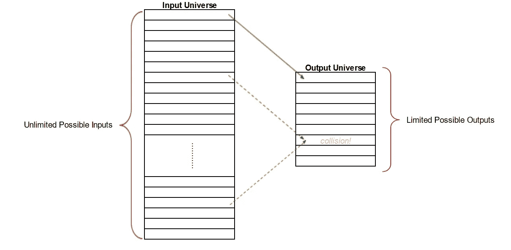
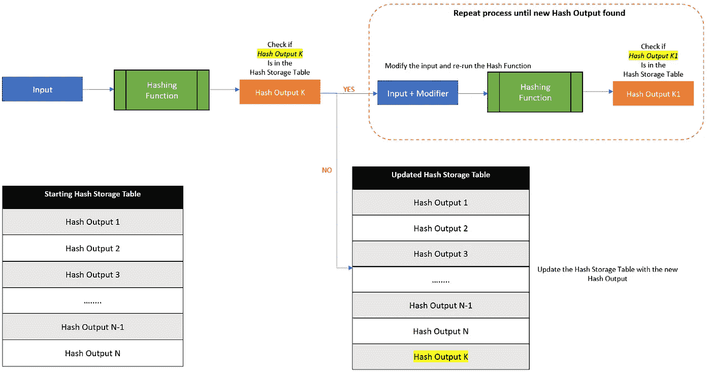
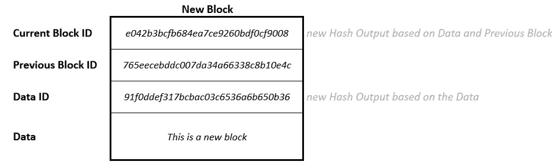
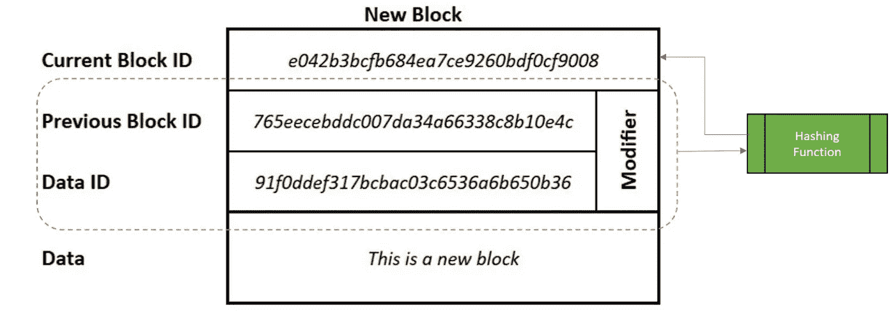

# 区块链 Ep04:解除哈希函数杂凑—第 2 部分

> 原文：<https://medium.com/coinmonks/blockchain-unhashing-the-hash-functions-part-2-a343ea00ec7d?source=collection_archive---------2----------------------->

在本系列的第二篇[帖子](/coinmonks/blockchain-unboxing-the-block-598b633741b3)中，我们看到了第一次提到的**散列函数**，在之前的[帖子](/@lbhy.mshr/blockchain-unhashing-the-hash-functions-part-1-3ac047148211)中，我们深入探讨了这些函数是如何获得这些特性的。到目前为止，我们看到的特征是—

*   由于*模运算*而不可逆
*   固定长度输出部分归因于*模运算*
*   伪随机性，意味着由于*散列*(剪切、切割、混合、混合等)，输出看起来一点也不像输入。)
*   由于*哈希*导致的极端输入灵敏度

在这篇文章中，我们将看看**散列函数的第四个特性**如何确保两个不同的输入不会产生相同的输出——碰撞阻力**。与上一篇文章不同，我建议你阅读这篇文章。它并不复杂，我们将在下一篇文章中对此进行阐述。但首先，一个新概念…**

# **鸽子洞原理(PHP)**

如果你的鸽子数量超过了墙上可以容纳鸽子的洞的数量，至少有一个洞要容纳不止一只鸽子

Where am I supposed to go?

从[上一篇文章](/@lbhy.mshr/blockchain-unhashing-the-hash-functions-part-1-3ac047148211)的特征 2 中，我们知道**哈希输出**是一个固定长度的数字。这意味着我们可以生成的不同散列输出的总数有一个固有的限制。例如，如果散列输出被限制为 4 位数，那么我们只有 10000 个可能的散列输出(*0000–9999*)。然而，对可能的输入数量没有这样的限制，输入比输出多。因此，通过 PHP ，一些输入将不得不映射到相同的散列输出。

How Collision happens when mapping an infinite set of inputs to a limited set of outputs

这叫做**碰撞**，两个输入*在同一个输出上碰撞*。我们不希望在我们的**散列函数**中出现冲突。

# 特点 4:抗碰撞

*两个不同的输入产生相同输出的概率几乎为零，每个输入产生一个独特的输出，就像指纹*

我们真的无法避开 PHP，这是事实，这个世界不可避免的事实。但是我们可以设计一些东西来尽可能长时间地避免它。具体来说有两种方式—

## 方法 1:增加所有可能输出的数量

我们发现，如果我们把自己限制在 4 位**哈希输出**上，我们就有 10000 或 10⁴可能的输出可用。如果我们使用一个 78 位长的输出，我们会得到 10⁷⁸可能的散列输出,*,它大于已知宇宙中的原子总数*。这是非常可行的，也是 **SHA-256** 所做的。

[SHA-256 或安全哈希算法-256](https://en.wikipedia.org/wiki/SHA-2) 是比特币块链使用的哈希函数。*砰！*我们刚刚将我们的《区块链》与现实世界中的积木链连接起来！

## 方法 2:探查

仅仅因为有很多可能的**哈希输出**，并不意味着我们已经避免了**冲突**。两个随机输入仍然可以生成相同的哈希输出。但这是有可能的。让我们将所有生成的哈希输出存储在**哈希存储表**、 **HST** 中。然后，我们对每个新输入执行以下操作——

*   如果新的输入产生了一个新的&看不见的哈希输出，我们将其添加到 **HST** 的底部
*   如果新输入生成的哈希输出已经在 **HST** 中了(*啊碰撞发生了！*)，我们稍微改变一下输入，生成一个新的哈希输出，希望是(*！*)避免碰撞
*   我们一直对输入稍加修改，直到找到无冲突的哈希输出

Probing in action

***修饰语*** 是附加在原始输入末尾的一个数字。我们通常从 0 开始，不断重复增加修改器 1，直到我们能够找到避免冲突的**哈希输出**。这个*修改器*为每个输入单独存储，因为我们想保持原始输入完整。这有助于*的再现性*——如果再次提供相同的输入，我们知道需要应用什么*修改器*来再现输出。

# ***将改性剂分块储存***

正如我们在[先前的帖子](/coinmonks/blockchain-unboxing-the-block-598b633741b3)中已经看到的，连锁店中的每个区块存储 3 个不同的哈希输出。*数据标识*、*先前块标识*和*当前块标识*。这意味着，对于链中的每个新块，我们将添加 2 个新的哈希输出-*数据 ID* 和*当前块 ID* 。

Two possible Collision points. Reminder that these Hash Outputs are written in the Hexadecimal System

我们其实并不太在意*数据 ID* 中的碰撞。如果两个块有完全相同的数据，这是完全可能和允许的，那么它们将有相同的*数据 ID* 。很好！

但是我们不能在当前块 ID 为的*中发生冲突，因为两个块不能有相同的*当前块 ID* 。所以我们需要执行 ***探测*** ，并且我们需要在某个地方存储 ***修饰符*** 。当前的块结构没有空间来存储它！*

> 作者注:为什么两个不同的块不能有相同的当前块 ID？

A modified block structure to store the probing modifier!

首先， ***修饰符*** 对于新块总是空的。如果发生冲突，我们将 0 放入*修改器*中，并使用*数据 ID* 、*先前块 ID* 和*修改器*作为**散列函数**的输入，重新计算*当前块 ID* 。通过包含*修饰符*，我们有了一个不同的输入来改变**散列输出**，希望这能解决冲突。然而，如果碰撞仍然存在，我们将把*修改器*的值增加到 1。我们将继续增加*修改器*的值，每次增加 1，直到碰撞被解决。因此*修改器*增加 1，直到在块的*当前块 ID* 中没有**碰撞**。链条现在是**防撞的**！

# 最后

老实说，我们不需要**探测**真实世界的区块链。鉴于大量可能的散列输出(~10⁷⁸可能输出)和内置于**散列函数**中的智能和复杂随机性，冲突永远不会发生。我没有空间也没有数学能力来证明给你看，但这是真的！我们并不真的需要 ***修改器*** 来防止现实世界中的碰撞。那我为什么要提起它呢？

区块链中的块还为*修饰符*留有空间，称为*，代表 ***数一次*** *—* ，因为每个数都试一次！每个块都有一个 *Nonce* ，大量的时间、金钱和精力都花在寻找 *Nonce* 的正确值上。在下一篇文章中，为什么 *Nonce* 存在，它真正服务于什么目的。到时见…*

# *扣人心弦*

*什么是**工作证明**？为什么说比特币和以太坊很耗电？*

> *加入 Coinmonks [电报频道](https://t.me/coincodecap)和 [Youtube 频道](https://www.youtube.com/c/coinmonks/videos)了解加密交易和投资*

## *另外，阅读*

*   *[MXC 交易所评论](/coinmonks/mxc-exchange-review-3af0ec1cba8c) | [Pionex vs 币安](https://blog.coincodecap.com/pionex-vs-binance) | [Pionex 套利机器人](https://blog.coincodecap.com/pionex-arbitrage-bot)*
*   *[我的密码交易经验](/coinmonks/my-experience-with-crypto-copy-trading-d6feb2ce3ac5) | [比特币基地评论](/coinmonks/coinbase-review-6ef4e0f56064)*
*   *[CoinFLEX 评论](https://blog.coincodecap.com/coinflex-review) | [AEX 交易所评论](https://blog.coincodecap.com/aex-exchange-review) | [UPbit 评论](https://blog.coincodecap.com/upbit-review)*
*   *[AscendEx 保证金交易](https://blog.coincodecap.com/ascendex-margin-trading) | [Bitfinex 赌注](https://blog.coincodecap.com/bitfinex-staking) | [bitFlyer 点评](https://blog.coincodecap.com/bitflyer-review)*
*   *[麻雀交换评论](https://blog.coincodecap.com/sparrow-exchange-review) | [纳什交换评论](https://blog.coincodecap.com/nash-exchange-review)*
*   *[支持卡审核](https://blog.coincodecap.com/uphold-card-review) | [信任钱包 vs 元掩码](https://blog.coincodecap.com/trust-wallet-vs-metamask)*
*   *[Exness 评测](https://blog.coincodecap.com/exness-review)|[moon xbt Vs bit get Vs Bingbon](https://blog.coincodecap.com/bingbon-vs-bitget-vs-moonxbt)*
*   *[如何开始通过加密贷款赚取被动收入](https://blog.coincodecap.com/passive-income-crypto-lending)*
*   *[加密货币储蓄账户](/coinmonks/cryptocurrency-savings-accounts-be3bc0feffbf) | [加密交易机器人](https://blog.coincodecap.com/best-crypto-trading-bots)*
*   *[BigONE 交易所评论](/coinmonks/bigone-exchange-review-64705d85a1d4) | [CEX。IO 审查](https://blog.coincodecap.com/cex-io-review) | [Swapzone 审查](/coinmonks/swapzone-review-crypto-exchange-data-aggregator-e0ad78e55ed7)*
*   *[最佳比特币保证金交易](/coinmonks/bitcoin-margin-trading-exchange-bcbfcbf7b8e3) | [比特币保证金交易](https://blog.coincodecap.com/bityard-margin-trading)*