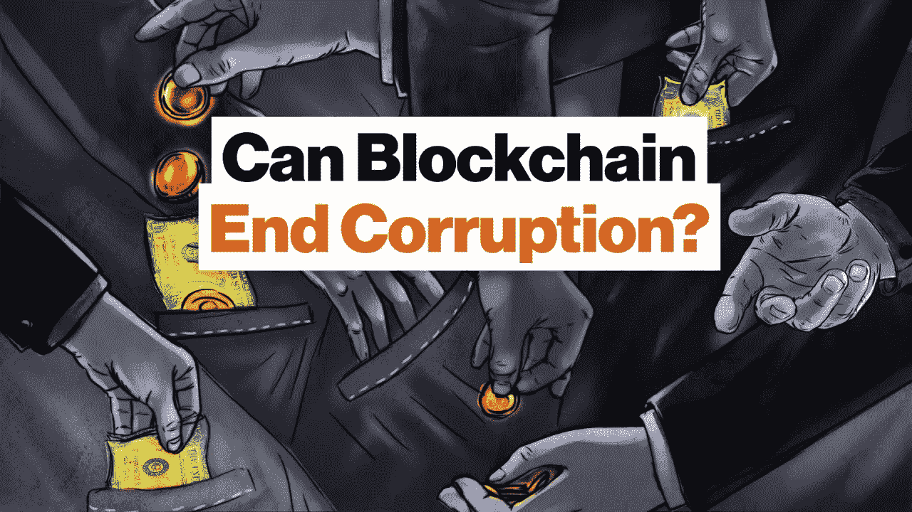

# 区块链与腐败

> 原文：<https://medium.com/coinmonks/blockchain-vs-corruption-a2c7a3eb983d?source=collection_archive---------1----------------------->

## 解决老问题的新技术

今天，腐败问题仍然是一个严重的社会和政治问题。这一现象自国家形成以来就根深蒂固，具有极其复杂的演变性质。腐败问题仍然很重要，这主要是因为几代人都认为腐败是正常的。尽管为制定有效的反腐败方法进行了无数次尝试，但我们不断遇到腐败的各种表现形式。这既包括为公共部门提供服务的象征性财政激励，也包括政治精英高层的重大腐败计划。无论如何，这种“资源分配”为各国的经济和社会发展创造了完全非法的基础，并成为世界许多地区的头号问题。

最容易发生腐败的行业是医药、教育、地籍、道路交通、内政当局、住房和公用事业以及司法系统——这些是任何国家的公民最经常经历的领域，因为他们的服务在人口中需求量最大。反腐败政策领域的许多专家认为，这个问题应该通过解决腐败的根源来解决，而不是通过将那些对所实施的非法行为负有责任的人绳之以法来解决。这种方法更有效，但需要大量的时间和经济资源来改变环境和改变整代人的集体思维。

## **区块链作为反腐败技术**

经验表明，现有的反腐败措施没有取得令人满意的结果。但是这个问题越来越多地从创新技术的角度来讨论，也就是说，从密码产业的角度来讨论，这个产业越来越受欢迎。在这方面，区块链技术的应用可以确保真正有效的反腐败机制。那么，区块链技术的优势是什么，它如何有助于降低腐败水平？

区块链是一个连续的块链，可以包含有关已完成事务的信息。由于每个后续块都包含前一个块的数据，因此块中包含的信息可以被验证，但不能被更改或删除。此外，去中心化和分布式数据库的原则表明不存在单一的存储和管理中心——所有交易都以加密形式在所有系统参与者的计算机上注册。这确保了数据的开放性、透明性和不变性。此外，该技术应用了智能合约——一种计算机算法，旨在使用区块链技术在各方之间缔结和维持数字货币或资产的转移。智能合同的运作原则在于完全自动化和可靠地履行各方规定的义务。因此，参与者澄清并指定这些算法起草智能合同所基于的条款和条件。它存储在分布式环境中，并通过加密方法进行加密。一旦满足所有指定的条款和条件，交易就会自动执行。

区块链的普遍性还在于它在各个领域应用的可能性:国家行政管理、国际经济关系、私营企业、生产、贸易、司法系统、医学、教育、科学等。毫不奇怪，这项技术正引起许多爱好者甚至国家机器代表的关注，试图改革最容易腐败的领域。因此，基于区块链的电子投票系统的想法由于过程的透明度而引起了公众的极大兴趣，并因此增加了对这种选举结果的信心。2017 年 6 月，作为实施这项技术的领导者之一的乌克兰政府和全球反腐败组织“透明国际”将一个财产登记册转换为区块链技术。据乌克兰[土地政策和食品部](http://www.minagro.gov.ua/en/node/24722)的代表称，区块链的实施将确保可靠的数据同步，防止因外部干扰而被取代，并提供对系统进行公共控制的机会。

正如你所看到的，区块链在不同领域的应用刚刚开始加速。但需要提到的是，这个数字区块链网络有自己的价值计量单位(支付工具)——加密货币。网络运作的主要缺点在于无法监测交易参与者，并为非法活动提供了有利环境:转移通过犯罪手段获得的资金、无限量购买非法商品、敲诈、勒索和腐败。

臭名昭著的 Petya 病毒同时[阻止了数千台计算机的访问并关闭了数百家公司的运营](https://www.bloomberg.com/news/articles/2017-06-27/ukraine-russia-report-ransomware-computer-virus-attacks)，这是与加密货币应用相关的欺诈的一个很好的例子。攻击者要求将 300 美元的比特币转入他的数字钱包，以便解锁电脑。

因此，加密货币的矛盾性质不允许它们完全满足有效消除不同形式腐败的必要要求。

**新区块链特色**

现在我们都见证了密码产业发展的速度。每天都在创造越来越多的加密货币。出现了新的区块链项目，旨在解决各个领域中尚未解决的问题。基于区块链技术的 Bitbon 系统就是这样一个项目。这是一个投资平台，Bitbon crypto value 被用作支付单位。事情是这样的，Bitbon 是由实物资产支持的；这意味着它的价格是在此类资产价值的基础上形成的。它赋予比特币特殊的功能，这些功能超过了普通加密货币的功能。该系统的主要优势之一是多级验证，这为监控交易以及在必要时识别每个用户提供了机会:如果比特币丢失或被盗，可以将其归还给所有者。

让我们考虑一个例子:从国家预算中拨出一定数额的 Bitbons 资金用于建造学校。由于区块链技术，关于该操作的信息(资金数量、日期、时间和提供资金的目的等。)记录在 Bitbon 系统中。然后，资金按照之前指定的金额进行分配，转入相关主管部门的数字钱包；这些操作以及事务的所有细节都存储在块链中。随后的块将包含关于通过不同渠道为各种目的转移资金的信息，例如，用于项目规划、购买建筑材料、工程付款等的资金。在项目实施的每个阶段(学校建设)，Bitbons 的所有操作都将记录在系统中，以确保能够识别资金的发送者和接收者。如果在此过程中，全部或部分资金被非法从一个钱夹转移到另一个钱夹，则在分布式分类帐中将创建一个包含此操作数据的新块。由于这些区块链功能，这些数据不能被更改或删除，并且没有匿名将允许识别欺诈者。

**结论**

因此，上述例子表明，创新投资平台的基本运作原则排除了非法活动的可能性，使其成为打击腐败的有效工具。

*最初发表于*[T5【coinmarketalert.com】](https://coinmarketalert.com/page/press-releases/blockchain-vs-corruption-new-technologies-for-solving-old-problems-359)*。*

> [直接在您的收件箱中获得最佳软件交易](https://coincodecap.com/?utm_source=coinmonks)

