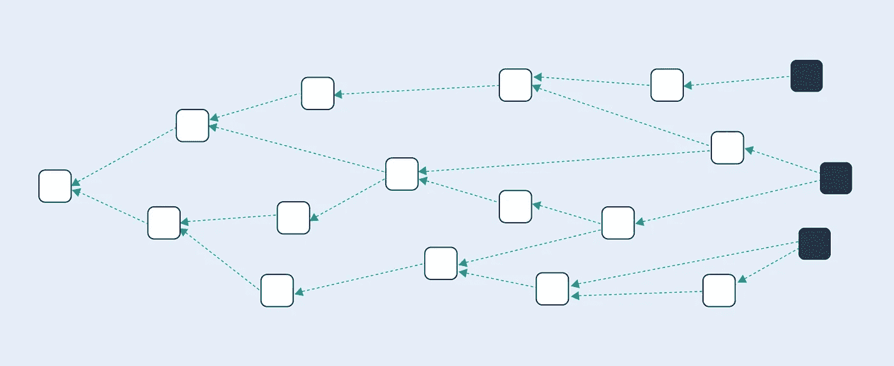
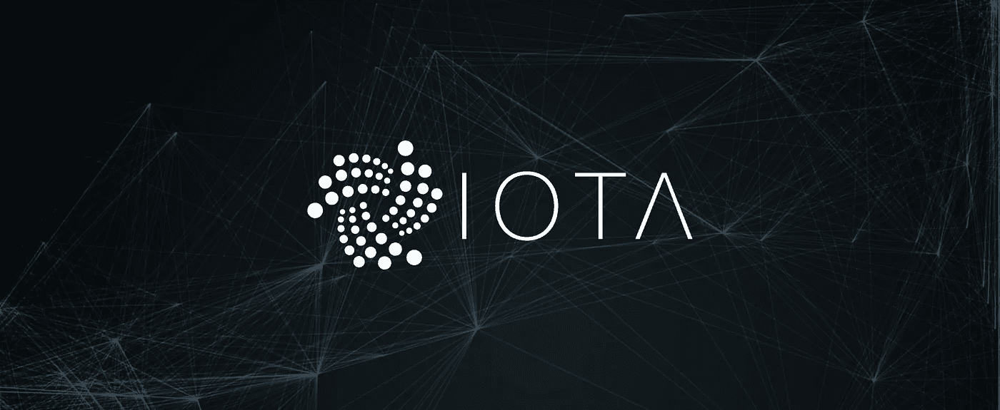

# 区块链 vs DAG(有向无环图)vs Byteball

> 原文：<https://medium.com/coinmonks/blockchain-vs-dag-directed-acyclic-graphs-vs-byteball-c10250702521?source=collection_archive---------10----------------------->

事实证明，攀登区块链是一项艰巨而复杂的任务。正是因为这个原因，所有数字货币的先驱比特币多年来一直是一个停滞不前的低吞吐量网络。

目前，围绕加密领域有许多旨在增强比特币(和其他平台)TPS 的计划。一些专家提议增加块的大小，另一些专家希望减少网络上的处理时间。关于应该改变哪个变量存在大量争论，鉴于比特币社区对任何修改都非常反感，不知道这个问题何时会得到解决。

然而，一些项目提供了一种更激进的方法来解决区块链的问题:他们建立了完全不使用区块链数据结构的全新网络。IOTA 和 Byteball 等已经在加密领域掀起了波澜，它们将重新定义加密货币的托管方式。代替区块链，他们正在寻求实现一种叫做有向无环图(DAG)的东西。

今天，我们将简要概述什么是 DAG，有向无环图如何工作，并详细描述 IOTA 和 Byteball 试图通过使用它来实现什么。

# 什么是 DAG(有向无环图)？

就数据结构而言，区块链可以被视为简单的[链表](https://www.geeksforgeeks.org/linked-list-set-1-introduction/)。比特币或以太坊(或其他网络)上的每个条目都被放在它所引用的前一个条目之上。这就是我们如何得到数字事件的线性序列，我们称之为链。

区块链允许人们追踪分类帐历史中存储任何记录，但是它们的顺序结构也是显著阻碍它们的交易吞吐量的原因；区块链的扁平列表特性是其扩展能力的最大瓶颈。

嗯， [DAG 操作](https://en.wikipedia.org/wiki/Directed_acyclic_graph)不同。这种数据结构类似于一个流程图，其中所有点都指向一个方向。您可以将有向无环图(DAG)与文件目录结构进行比较，在文件目录结构中，文件夹包含分支到其他子文件夹的子文件夹，依此类推；它们像树一样。

无环这个词只是意味着图中没有节点可以引用回自己；不能是自己的母节点。

# IOTA 如何使用 DAG (Tangle)？

当谈到 DAG 时，我们必须提到的第一个加密项目是 [IOTA](https://iota.org/) 。这种“新一代”加密货币旨在彻底消除矿工费的概念。

如你所知，比特币和以太坊用户目前有不同的角色；一些人提交交易，另一些人批准交易。这些费用对于这样的异构系统是必不可少的，因为总是需要激励验证者写入区块链的历史并保护网络。

使用 DAG(IOTA 称之为 Tangle), IOTA 能够分配相同的任务给它的每个成员；网络上的所有用户同时是问题和事务验证者。

要让 IOTA 验证一个交易，必须批准之前的两个交易(并确保它们不冲突)。此外，人们需要附上少量的工作证明，因为需要低难度的计算来防止网络上的垃圾邮件。

这完全消除了向矿工支付费用的需要，从而为执行价值可能只有几美分的微交易提供了可能性。

此外，IOTA 的 DAG 数据结构使得网络易于扩展。每个人都参与达成共识，因此，使用 IOTA 的人越多，网络就变得越快。

除了资产，网络还允许将数据附加到交易中；它有可能实现快速的机器对机器交易。最初，IOTA 被专门设计为物联网的主干(因此得名 IOTA)。但是它所引入的特性肯定可以用于无数的其他用例。

所有这些确实看起来很有希望。

# IOTA 缺点

IOTA 和每一项突破性技术一样，都有其缺陷。人们对 it 最常见的担忧包括以下几点:

*   IOTA 正在使用自己的加密算法。大多数世界知名的密码学家对没有经过彻底审查的专有算法持怀疑态度。任何推出自己的密码的项目都被认为是可疑的。正因为如此，IOTA 一直被批评为具有潜在的脆弱性。2017 年 9 月，[麻省理工学院发布了一份报告](https://github.com/mit-dci/tangled-curl/blob/master/vuln-iota.md)，揭露了 IOTA 系统的一个严重缺陷。自那以后，该项目已经修补了这个问题，但它的可信度仍然受到了动摇。
*   目前，IOTA 有一个中心故障点 T1。由于在 IOTA 上发起 34%的攻击(相当于在比特币上发起%51 的攻击)并不需要很多资源，因此网络有一个临时的集中式元素——协调器节点(“Coo”)——来防止恶意活动。每个事务都通过 Coo 进行验证，因此，在这一点上，集中式实体正在指引 IOTA 的 DAG 树的路径。这也导致了网络变慢。根据创始人的说法，一旦网络产生足够的有机活动，能够在没有帮助的情况下进化，协调节点将被淘汰。然而，在平台(无 Coo)经过野外测试之前，没有办法证明这些说法。

# Byteball 是什么？

我们将要讨论的第二种著名的无区块链加密货币是[字节球](https://byteball.org/)。它也利用了树状 DAG 数据结构，但与 IOTA 不同，它并没有被设置为在没有交易费用的情况下运行(也没有试图摆脱集中化)。

Byteball 有自己的硬币字节，由 12 名证人操作，验证网络上的每笔交易。毫无疑问，这些节点受到开发人员的信任，并且已经暴露了它们的真实身份。如果发生不诚实的行为，他们将被追究责任。

Byteball 在其他方面也不同于 IOTA 它提供了大量的附加功能。它提供原生智能合约功能和有条件支付平台(远不如 EVM 先进)、信息系统、通过专门货币 blackbytes 的私人交易，甚至还有聊天机器人。

也就是说，Byteball 并不完美。有些人对它的 12 个证人共识结构有异议。虽然这是一种减少垃圾邮件和防止 33%攻击的聪明方法，但这种解决方案是以分散化为代价的，这是大多数密码爱好者不喜欢的。12 个人操作网络使得 Byteball 看起来更像一个私有的小公司，而不是一个公共网络。

如果 IOTA 移除其协调器节点(从而提供完全的去中心化),而 Byteball 保持其当前的共识系统不变，则 prior 肯定会成为一种更有吸引力的基于 DAG 的加密货币。

# 结论

IOTA 和 Byteball 都是雄心勃勃的项目，前景广阔。他们使用的技术仍然非常年轻，还没有经过测试，但是，在我们看来，开发者仍然有很多需要改进的地方。技术进化——发现和修补问题的过程——是比特币和以太坊成为今天强大平台的原因。IOTA 和 Byteball 注定要走同一条路。

*喜欢这篇文章吗？想了解更多关于区块链理工大学的信息吗？* [*联系我们的专家*](https://perfectial.com/contact-us/) *您现在可以自由咨询了！*

*原为发表于*[*perfectial.com*](https://perfectial.com/blog/dag-vs-blockchain/)*。*