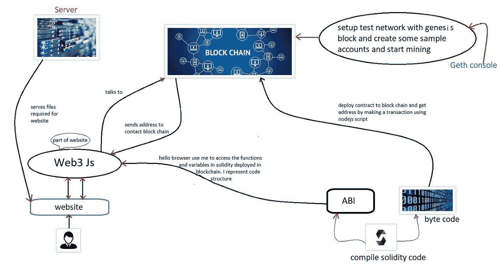
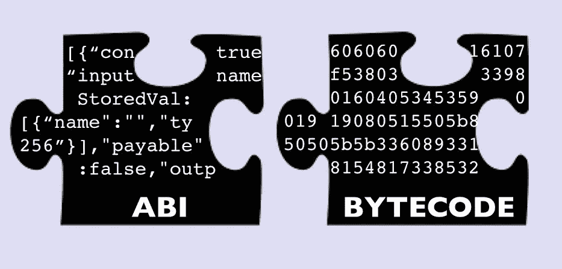
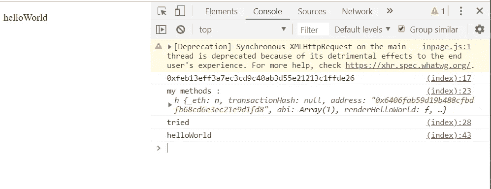

# 区块链与 Web 开发

> 原文：<https://medium.com/coinmonks/blockchain-with-web-development-dfb474508fb4?source=collection_archive---------0----------------------->

当我开始学习区块链时，我对如何将网站与区块链联系起来感到非常困惑。最初，为了用区块链构建 DAPP，我使用了松露、加纳切、meta-mask 和 web3-js。

> *TL；dr:这篇文章是关于建立一个与区块链互动的网站(包括代码)和它的架构流程。因此，如果你有兴趣了解当区块链与网站互动时，建筑是如何流动的。请继续:-)*

作为初学者，我只知道 HTML，CSS，JS，NodeJS 之类的基础 web 开发。所以我没有太多的选择来选择一个[松露盒](https://truffleframework.com/boxes)来开发我的应用程序。

*   Truffle 是一个被称为“区块链的瑞士军刀”的框架，它基本上是一个帮助我们编写可靠代码、测试代码、部署代码以及与 web 开发前端交互的模板。

> 例如:如果您正在开发一个包含 reactJs 和区块链的 web 应用程序。Truffle 将提供一个 truffle box，其中包含一些显示 reactjs 与区块链交互的示例代码，一个针对您的 solidity 代码和许多其他功能的适当测试设置

*   Ganache 是一个应用程序，它用 10 个初始帐户建立测试以太网，每个帐户有 100 个以太网，并被预编程为自动运行挖掘。

松露盒子提供了直接的功能，但理解区块链如何与网站互动的整个工作流程是很重要的，否则就没有必要制作一个学习区块链的应用程序。因为所有这些框架通过提供开发区块链应用程序的抽象使生活变得更容易。然后我决定通过避免使用这些框架和工具来弄清楚事情到底是如何工作的。让我们看看它们是如何工作的。

观察下图。我的全部解释都遵循这个数字。这代表了区块链如何与网站互动。



我认为在开始这个开发练习之前，我们知道以下事情。

*   使用 HTML、CSS、Java Script 和 nodeJS 开发基本的 web 应用程序
*   S [实体](/@w_n1c01a5/hello-world-on-solidity-ethereum-b6a4de6a4258)用来写[智能合约](/emusic-official/what-is-a-smart-contract-3760a1f69bfc)。
*   获取控制台以创建一些帐户(公钥和私钥对)，并通过创建本地区块链开始挖掘。如果你想亲自动手，请点击[这里](/@chim/ethereum-how-to-setup-a-local-test-node-with-initial-ether-balance-using-geth-974511ce712)

[](/@chim/ethereum-how-to-setup-a-local-test-node-with-initial-ether-balance-using-geth-974511ce712) [## 以太坊:如何使用 geth 设置具有初始以太平衡的本地测试节点

### 我不得不花费不必要的时间来设置以太坊本地测试节点/网络的初始以太平衡(即…

medium.com](/@chim/ethereum-how-to-setup-a-local-test-node-with-initial-ether-balance-using-geth-974511ce712) 

*   [web3Js](https://www.youtube.com/watch?v=t3wM5903ty0) 用于从我的网页访问我的 solidity 代码中的函数和变量，并进行交易。

注:请浏览以上博客。因为这整个博客是基于上面博客中[的 geth 设置。](/@chim/ethereum-how-to-setup-a-local-test-node-with-initial-ether-balance-using-geth-974511ce712)

考虑有一个网站托管在本地服务器上，现在我们需要添加区块链功能的网站。让我们做一个网站，在 solidity 中调用一个函数`renderHelloWorld()`，并在网页上打印返回值。

这是我们的全球安全合同

*   现在我们有了 solidity 代码，让我们使用定制的 nodejs 脚本使用 [solcJS](https://www.npmjs.com/package/solc) 模块来编译它。
*   编译 solidity 代码给了我们 ABI(应用二进制接口)和字节码。

> 这里解释什么是 ABI 和字节码

> 在 c++或者 java 中，我们编译代码，得到执行的二进制代码。字节码与此类似。它用于在区块链上部署智能合同。
> 
> ABI 一边帮助 web3Js，一边和区块链说话。因为我们的代码不知道区块链的确切结构。我所说的结构是指函数的名称、输入、输出和类型。



> ABI 对前端代码说:每当你和 block-chain 对话时，用我来访问部署在区块链的 solidity 代码中的任何特定对象。

如果你想了解更多关于 ABI 的信息，请浏览[这个](https://www.sitepoint.com/compiling-smart-contracts-abi/)

足够的理论让我们使用 nodejs 脚本生成一些 ABI 和字节码。请访问下面的 git-hub 库并下载代码。

[](https://github.com/abhilashreddyy/hello-world-webdev-with-blockchain) [## abhilashreddyy/hello-world-webdev-with-区块链

### 回购支持我的媒体博客。通过创建……为 abhilashreddyy/hello-world-web dev-with-区块链的发展做出贡献

github.com](https://github.com/abhilashreddyy/hello-world-webdev-with-blockchain) 

在这个回购中，您应该观察文件结构，如下所示

compile.js 编译 solidity 代码，生成 ABI 和字节码

## 编译固体代码:

该代码片段导入了 solc(solidity 编译器)模块，该模块用于编译 solidity 代码。第一个命令行参数`process.argv[2]`代表固化代码的路径，第二个参数`process.argv[3]`代表输出文件的路径。

从提供的路径中读取 solidity 代码并编译它

将生成的 ABI 和字节码写入 hello_world 文件夹中的文件

让我们使用命令`node .\compile.js hello_world.sol ..\hello_world`来编译`compile.js`。现在你应该可以在 **hello_world** 文件夹中找到两个文件`helloWorld.abi & helloWorld.code`

现在我们已经编译了 solidity 代码，并得到了编译后的 ABI 和字节码。

为了从网页上访问 solidity 中的函数和变量，我们使用 web3JS。这需要两件事。

*   区块链的地址。因为我们在主网络中部署了我们的应用程序以及许多其他智能合同。因此，基本上我们需要一些东西来唯一标识我们部署的应用程序，这里的地址是我们在区块链部署的合同的唯一标识符。
*   ABI(应用程序二进制接口)如前所述

## 生成地址:

现在 geth(go-ethereum)控制台进入画面。geth 是一个拥有许多超自然力量的超级英雄，我们在应用程序中使用的一些力量是…

*   它可以用公钥和私钥以及一些假的以太网创建账户
*   它可以基于 [genesis](https://en.bitcoin.it/wiki/Genesis_block) 块在本地主机的特定端口初始化测试区块链网络。
*   它可以在部署在特定端口的特定区块链网络上进行挖掘。如果你浏览过这个博客，你会看到类似这样的东西

```
geth --identity “LocalTestNode” --rpc --rpcport 8080 --rpccorsdomain “*” --datadir ~/mychain/data/ --port 30303 --nodiscover --rpcapi db,eth,net,web3,personal --networkid 1999 --maxpeers 0 console
```

*   这里，本地以太坊节点设置在端口 8080 上。这意味着目前我们的以太坊网络提供商运行在“localhost:8080”。

> 建立一个本地区块链网络，如这个博客中的[所示，并在 geth 控制台中使用`miner.start()`开始采矿。请记住，](/@chim/ethereum-how-to-setup-a-local-test-node-with-initial-ether-balance-using-geth-974511ce712)[这篇](/@chim/ethereum-how-to-setup-a-local-test-node-with-initial-ether-balance-using-geth-974511ce712)博客对于进一步理解非常重要。所以请去用一些假乙醚安装一个区块链，启动你的 geth 控制台，按照这个[博客](/@chim/ethereum-how-to-setup-a-local-test-node-with-initial-ether-balance-using-geth-974511ce712)进行采矿。

回到 address，现在让我们理解通过运行这个 nodeJS 代码来生成地址的`compile_and_deploy/deploy.js`

导入所需的模块并设置提供者的地址。目前我们的提供者是运行在 **localhost:8080** 上的 geth 控制台

读取编译期间生成的 ABI 和字节码，并生成一个对象来执行一个示例事务并获取地址

解锁用于交易的账户。在这种情况下，我们使用 geth ie 中的第一个帐户:`web3.eth.accounts[0]`。

web3

部署新的智能合同，为了进行部署，我们发送`code` 变量，该变量是智能合同的字节码、最大气体量和账户公钥详细信息，以发挥作用。

等待 geth 控制台，它目前作为一个挖掘器来验证我们的事务并将其附加到区块链。在下面的代码中，我们正在等待交易收据和地址，只有当我们的交易成功添加到区块链时，才能返回。

让我们看一下完整的 deploy.js 文件

在终端`node deploy.js`中编译上述代码。这样，这个地址将会显示在控制台上。

在这个阶段，我们有 ABI、字节码和部署智能合约的地址。让我们设置 web3 以便与智能合约交互。

## 前端的 java 脚本代码:

设置 web3 提供者的地址，创建一个 web3 类的对象，并用 account 的`public key`定义一个变量 account。

`print_hello()`函数使用我们之前声明的账户调用 solidity 函数`renderHelloWorld`

下面是最后一段代码，这段代码使用智能合约的 ABI 和地址来调用 hello world 函数。如果帐户被锁定，它会提示输入密码，否则会直接调用 hello world 函数。观察上面这段代码，其中`print_hello()`函数与可靠性代码交互。

如果一切正常，您应该会在 web 浏览器中看到类似这样的内容



> **注意**:当你调用函数或进行事务处理时，请确保你的节点正在 geth 控制台上进行挖掘，因为每一个事务都应该包含在区块链中。因此，在我们开始采矿之前，基本上没有人来验证我们的交易并添加到区块链。

再看一下这个数字。现在读完博客后，你可能会更好地理解它。


就这样，伙计们，我希望你们能理解我写的东西。如果没有，请随时评论。如果某段代码不能工作，或者如果你不能理解我所解释的文本内容。

总结:任何一个刚刚进入区块链事业的人，请不要用所有的框架和捷径来发展。从长远来看，从零开始学习肯定会对你有帮助。因为好的建筑是建立在坚固的基础上的。

> 我只是一个写博客的初学者。这是我的第一篇博客，我打算写更多。我的下一篇博客将是关于如何使用 IPFS 协议和区块链使应用程序完全去中心化。如果你想得到通知，请跟我来。你对我的文章有任何疑问。最后，别忘了鼓掌，它帮助我计算我帮助了多少人写作，让我有动力继续写下去。好吧，让我们在我的下一个博客里见面吧…

> 直到那时

> 加入 Coinmonks [电报频道](https://t.me/coincodecap)和 [Youtube 频道](https://www.youtube.com/c/coinmonks/videos)获取每日[加密新闻](http://coincodecap.com/)

## 另外，阅读

*   [复制交易](/coinmonks/top-10-crypto-copy-trading-platforms-for-beginners-d0c37c7d698c) | [加密税务软件](/coinmonks/crypto-tax-software-ed4b4810e338)
*   [网格交易](https://coincodecap.com/grid-trading) | [加密硬件钱包](/coinmonks/the-best-cryptocurrency-hardware-wallets-of-2020-e28b1c124069)
*   [西班牙 5 大最佳文案交易平台](https://coincodecap.com/copy-trading-spain)
*   [Pionex 双重投资](https://coincodecap.com/pionex-dual-investment) | [AdvCash 审查](https://coincodecap.com/advcash-review) | [支持审查](https://coincodecap.com/uphold-review)
*   [面向开发者的 8 个最佳加密货币 API](https://coincodecap.com/best-cryptocurrency-apis)
*   [7 个最佳零费用加密交易平台](https://coincodecap.com/zero-fee-crypto-exchanges)
*   [最佳网上赌场](https://coincodecap.com/best-online-casinos) | [期货交易机器人](/coinmonks/futures-trading-bots-5a282ccee3f5)
*   [密码电报信号](http://Top 4 Telegram Channels for Crypto Traders) | [密码交易机器人](/coinmonks/crypto-trading-bot-c2ffce8acb2a)
*   [最佳加密交易所](/coinmonks/crypto-exchange-dd2f9d6f3769) | [印度最佳加密交易所](/coinmonks/bitcoin-exchange-in-india-7f1fe79715c9)
*   [面向开发者的最佳加密 API](/coinmonks/best-crypto-apis-for-developers-5efe3a597a9f)
*   最佳[密码借贷平台](/coinmonks/top-5-crypto-lending-platforms-in-2020-that-you-need-to-know-a1b675cec3fa)
*   [杠杆代币终极指南](/coinmonks/leveraged-token-3f5257808b22)