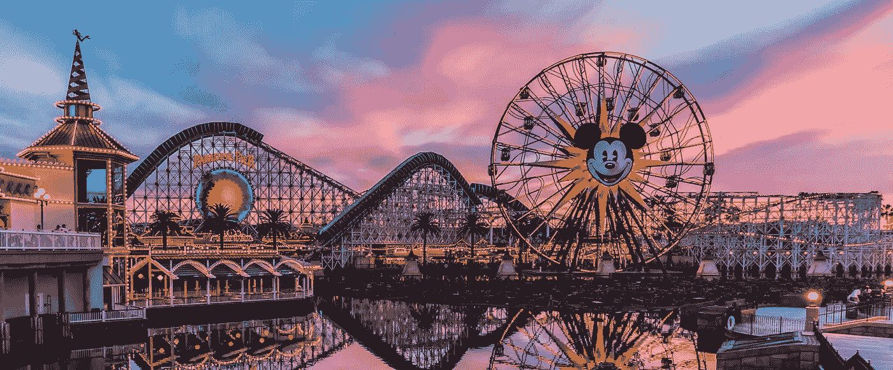
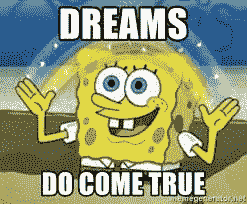

# 区块链王国:你的梦想可以变成 ico 的地方

> 原文：<https://medium.com/coinmonks/blockchainland-where-your-dreams-can-become-icos-84a599da6ac8?source=collection_archive---------6----------------------->

# 现在是 **Blockchainland** 的清晨！

阳光明媚，鸟儿歌唱，很快就唤醒了整个城市。
*“我们应该做好我们的 ICO”*——**说一个老家伙变成了一个加密支持者**——*“我告诉过你”！*

原因？

## **block chain land 每个人都在做一个 ICO！**

从歌手到农民，从足球运动员到教皇，每个人。

> 对任何事情都一无所知的人害怕错过区块链列车，因此正在做一个可以购买火车票的 ICO。

我无法停止惊讶有多少人在做**疯狂的 ico**，**区块链地**是你需要躲藏的地方，或者人们会要求**成为他们的顾问，**阅读他们的白皮书或者**参与预售**。*只有配得上的人才能得到这样的好处。*

这是突出的项目数量，具有最不同的范围— *(如果有的话)* —令牌模型、共识等等..真正让我想到的是，区块链世界似乎真的有每个人的空间。做好你的 *ICO* 就好了，**钱会下雨**。
*某老家伙终于卖掉了一家生产油灯的公司的股票，准备潜入未来的未来:区块链*。

我们能责怪他们吗？不尽然，但这导致了*部门的**污染，以及一种**藏红花和杂草长得一样的未开垦的田地**。我呼吁**最高自然法则**和**自由市场**尽快发挥作用，拯救我们，*赐予我们达尔文式的自然选择，只留下有价值的项目，那些真正增加价值的项目。****

**区块链**在当下就是这样一个复杂而困难的技术；我们为什么要让自己的生活变得复杂？使用区块链最有可能**没有必要**，除非你的业务依赖于*不可信的第三方，而这些第三方恰好与你有不同的利益，你还必须协调一组需要在他们之间共享信息的其他参与者。那么，你可能要权衡一下收养区块链的可能性。但万不得已只有**。***

**..即使你最终决定采用区块链的技术，你为什么还要做 ICO 呢？周围有很多可爱的项目，*请开发您的应用程序并使用现有的令牌！！！！***

**我不想听你的激励机制，也不想听你的代币有多神奇和与众不同，*我们都知道它是*。但现实是，没人在乎你的代币，**除非你是排名前 50 的硬币。最有可能的是，99%的项目会失败，因为缺乏社区、用例以及区块链引入的不必要的复杂性。****

****区块链国**现在是一个快乐的地方，大量的 **FOMO** 。*世界各地的人们来到这里学习和复制，适应和采纳*。什么都想当公民，想和朋友炫耀。他知道**密码**，他有 **0.000001 BTC** ，他是**投资者**。**

# **哇，在**区块链中**梦想真的实现了！**

****

****然而，在社区宣扬的**价值观** **和外面真正发生的**之间，似乎存在着冲突。我们正面临着人类历史上最大的高估事件，这个行业正在经历一场淘金热，黄铁矿被用来换取黄金。********

**很好，该行业正在增长，我们看到了采用的第一个迹象— *现在你可以自慰，并用一种有缺陷的、声称是私有的但不是加密货币—* **进行支付，但这是我们想要的方向吗？****

> **我们想让区块链的活动看起来像马戏团吗？我们想要不是专家但仍然是专家的专家吗？做 ico 的人在做糟糕的推销，他们对“你为什么真的需要一个区块链”这个常见的辛辣问题的回答是:“因为我们有，否则我不会在这里”？我们想要一个万物皆是 ICOed 的超全球化世界吗？**

****我想向你提出这些问题，让你想象一下你理想中的区块链地区，或者，如果你有灵感的话，区块链世界是什么样子的。请随意把它们贴在评论区，我期待着阅读它们。****