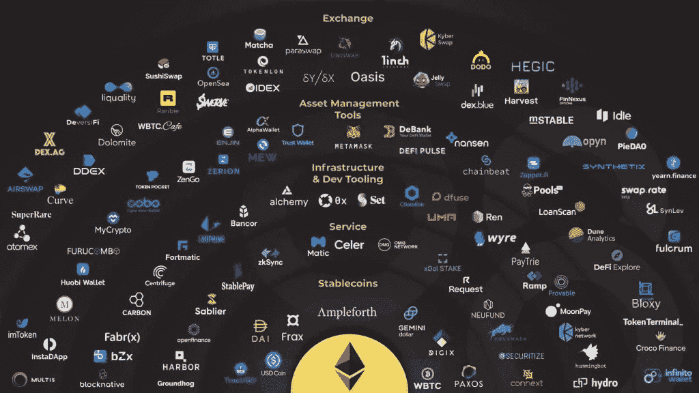
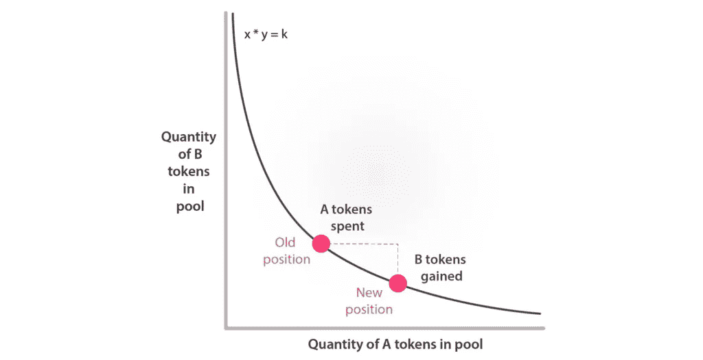

# 区块链的金融服务去中心化——去中心化的交易所

> 原文：<https://medium.com/coinmonks/blockchains-decentralisation-of-financial-services-decentralised-exchanges-3c6f2bb81c11?source=collection_archive---------2----------------------->

image: [https://www.coolwallet.io/what-is-defi-guide-to-decentralized-finance/](https://www.coolwallet.io/what-is-defi-guide-to-decentralized-finance/)

自从比特币问世以来，随着区块链技术的快速发展，我们已经看到了许多令人兴奋的新实现。提供金融服务就是这样一个例子。传统上只有大型、富有的组织才能提供的交换、借贷等服务，现在正通过分散的“组织”提供，更好的说法是协议。这些服务的分散化也意味着利润的分散化。也许这就是推动分散金融日益流行的原因，或者也许是人们对集权组织运作方式的普遍不满。无论动机是什么，很明显这些新服务将会继续存在。在这篇文章中，我们将看看一种类型的金融服务提供链；分散式交易所(DEX)。

> 注意:本文纯粹出于教育目的，绝不是财务建议。

# 什么是 DEX？

DEX 是一个为用户提供资产交换的平台。在传统的、集中的意义上，它可以是一个货币交易所或任何其他资产到现金的平台，如黄金或石油。在去中心化的空间里，资产就是代币。这些令牌可以是任何加密资产，如以太网和比特币，也可以是或戴等稳定账户。作为一种去中心化的服务，没有中间人或做市商。互换是点对点或点对点合约，由协议的智能合约管理和执行。与使用指令簿系统根据供求关系设定价格的集中式交易所不同，dex 使用一种算法来自动设定和调整资产价格。

## 为什么要用 DEX？

人们使用 dex 的原因和你使用集中交易的原因一样；将一项资产转移到另一项资产。使用 DEX 的优势包括:

获得更大范围的资产

*   整个 Defi 生态系统以及其中的资产都可以通过 dex 访问。

资产的安全性

*   为交易所提供流动性的投资者不需要担心他们的资产会因为交易所崩溃或被黑而损失(稍后会有更多相关内容)。

匿名

*   使用 DEX 不需要共享任何个人信息，这对一些用户来说是有吸引力的。

更便宜的价格

*   根据交易所的不同，dex 可能是比集中交易更便宜的代币交易方式。

然而，也有一些缺点:

不退款

*   如果用户错误地执行了交易或丢失了钱包，交易将无法取消或撤销。

没有期权交易

*   大多数(如果不是全部)dex 不提供止损或保证金交易等期权交易。

低流动性

*   与集中交易相比，dex 的流动性相对较低。

智能合同违约

*   如果智能合同没有正确编码或审核，攻击者就可以利用它们为自己谋利

我希望你现在明白什么是 DEX，什么时候以及为什么要使用它们。现在让我们更深入地了解一下它们是如何工作的。

# dex 是如何工作的？

无论是集中交易还是分散交易，为了成功促进互换，该平台都需要流动性。集中交易提供了自己的流动性，而且是大量的流动性。因为 dex 没有一个集中的实体来提供流动性，所以它从社区获得流动性。通过承诺分一杯羹，社区受到激励提供流动性。在 DEX 上执行的每个掉期交易都会产生一笔费用，通常为 0.3%，这笔费用在为促进交易的池提供流动性的人之间分配。例如，如果您作为流动性提供者，向 A-B 流动性池提供令牌 A 和令牌 B，并且您的贡献是总池的 10%，那么您将从该池促成的所有交易中获得 10%的费用。

健康的 dex 有大量的流动性。通过承诺收取部分费用，dex 试图吸引流动性提供者。如果你想学习更多关于提供流动性和“高产农业”的知识，有很多资源可以比我在这里学到的更详细。

dex 最初遇到的问题是自动调整资产价格以跟上当前市场价格。集中交易所通过跟踪当前买卖订单的订单簿来实现这一点，并可以通过这种方式调整价格。为了克服这个问题，dex 使用一种算法来自动调整每个流动性池中的价格。这种算法是 DEX 的基础，也是它成为自动做市商的原因。

## 自动做市商(AMM)

AMMs 的目的是自动调整资产池中资产的价格，以便交易总是能够执行。这叫做市。如果代币 A 的市场价格上涨，那么流动性池中的价格需要反映这一点。这是通过算法或公式完成的。虽然不同的 dex 有不同的精确公式，但最常见和最简单的公式是: *x * y =k*

image: [https://mvpworkshop.co/wp-content/uploads/2021/04/constant_product_curve-1-1024x526.png](https://mvpworkshop.co/wp-content/uploads/2021/04/constant_product_curve-1-1024x526.png)

在这个等式中， *x* 是池中令牌 A 的数量， *y* 是池中令牌 B 的数量， *k* 是某个常数。根据这个公式，如果代币 A 的市场价格在池外上涨，那么池内的价格将在很短的时间内下跌，从而产生套利机会。这个短暂的套利机会将会看到 *x* 减少而 *y* 增加，同时保持 *k* 直到 *x* 和 *y* 的值反映真实的市场价格。虽然这种方法允许套利交易，但它对于控制池内价格至关重要。这种情况也发生在集中交易中，这也是它们在订单簿中调整价格的方式。

我想回到我之前说过的内容。“健康的指数有大量的流动性”。这是因为一种叫做滑移的东西。当 DEX 中的流动性池的流动性较低时，便利交易中出现的滑点就越多。因此，流动性池希望拥有尽可能多的流动性。当流动性池中每种资产的比率受到交易影响时，就会出现滑点；受影响越大，滑动越大。更进一步，如果资金池有更多的流动性，该比率将受到更小的影响。这就是我所说的“健康的 DEX 拥有大量流动性”的意思。

## 非永久性损失

提供流动资金是相当有利可图的，但是你的资本也有很大的风险。其中一个风险是暂时性的损失。作为流动性提供者，你向流动性池贡献了两个代币。每个代币的数量由它们的价值决定——它们的价值由 AMM 决定。当流动资金在池中时，您有权随时提取您的供款。但是，您的贡献以及您的回报不会作为您提供的代币的价值或数量进行跟踪。取而代之的是，你将被返还你所提供的总流动性的比例，每种代币的新数量由 AMM 公式决定。说明这一点最简单的方法是用一个例子。

假设代币 A 值 10 美元，代币 B 值 2 美元。因为您必须向 A/B 流动性池提供等值的代币，所以您贡献了 5 个代币 A 和 25 个代币 B，总价值为 100 美元。当你的流动性被锁定时，市场价格变动，代币 A 现在值 20 美元，代币 B 值 2.50 美元。此时，如果您提取流动资金，您将获得价值约 79.06 美元的约 3.953 英镑代币 A 和价值约 79.06 美元的约 31.623 英镑代币 B，总价值为 158.12 美元。所以你赚了 58.12 美元的利润，加上你作为流动性提供者积累的费用，不错。

然而，让我们看看，如果你不提供流动性，而是持有代币，会发生什么。你的初始资本 5 英镑的代币 A 和 25 英镑的代币 B 价值 100 美元。市场变动后，新价格分别为 20 美元和 2.5 美元。你的资本现在价值 162.50 美元，如果你提供流动资金，这比你将拥有的还要多。因此，你的资产已经损失了一些价值，而这种损失直到你提取流动性时才被意识到。这就是为什么它被称为无常的损失。希望作为流动性提供者，你积累的费用能弥补你的损失。

让我向你展示这一现象背后的数学原理。

AMM: x * y = k

你的贡献是 *x* (令牌 A)5， *y* (令牌 B)25。

*5 * 25 = 125*

125 是常数。无论市场如何变动，k 永远是 125。随着市场的变化， *x* 和 *y* 将会变化，以反映它们相对于彼此的价值。如果代币 A 现在值 20 美元，代币 B 值 2.50 美元，那么 *y* 将是 *x* 的 8 倍。

*x * 8x = 125*8x = 125
y = 8x

要找出提取流动性时你将获得的代币数量，你可以解这个简单的联立方程。

*x = sqrt(125/8)
x = 3.953
y = 8 * 3.953
y = 31.623*

为了检查这些值是否正确，让我们将它们插回到原始公式中。

*3.953 * 31.623 = 125*

很好，都核实了。这可能会有点令人困惑，总体而言对 dex 并不太重要，但如果你要为这些交易所提供流动性，你应该记住这一点。希望你作为流动性提供者所获得的费用能够抵消你所遭受的任何非永久性损失。

# 结论

从表面上看，dex 本质上与传统的集中式交易所相同——它们提供了一个用一种商品交换另一种商品的平台。然而，因为他们是连锁的，分散的，他们为那些愿意与他们合作的人提供更多的效用。自动化做市商是所有 dex 的基础。如果你想了解更多关于 dex 的知识，我鼓励你在钱包里存一小笔钱，并与他们交往。这是最好的学习方法。

> 加入 [Coinmonks 电报频道](https://t.me/coincodecap)，了解加密交易和投资

## 也阅读

 [## 最佳加密交易所| 2021 年十大加密货币交易所

### 加密货币交易所的加密交易需要了解市场，这可以帮助你获得利润…

blog.coincodecap.com](https://blog.coincodecap.com/crypto-exchange)  [## 2021 年 9 大最佳加密借贷平台

### 当谈到加密货币贷款时，大量因素等同于良好的收入状况。此外，借款的一部分…

blog.coincodecap.com](https://blog.coincodecap.com/crypto-lending)  [## 2021 年最佳加密交易机器人(免费和付费)

### 2021 年币安、比特币基地、库币和其他密码交易所的最佳密码交易机器人。四进制，位间隙…

medium.com](/coinmonks/crypto-trading-bot-c2ffce8acb2a)  [## 最佳 6 个加密交易信号电报通道

### 这是乏味的找到正确的加密交易信号提供商。因此，在本文中，我们将讨论最好的…

medium.com](/coinmonks/best-crypto-signals-telegram-5785cdbc4b2b)  [## BlockFi 评论 2021:利弊和利率

### 今天，我们提出了一个全面的 BlockFi 评论，这是一个成立于 2017 年的加密贷款平台，拥有其…

blog.coincodecap.com](https://blog.coincodecap.com/blockfi-review)  [## 如何在印度购买比特币？2021 年购买比特币的 7 款最佳应用[手机版]

### 如何使用移动应用程序购买比特币印度

medium.com](/coinmonks/buy-bitcoin-in-india-feb50ddfef94)  [## 加密税务软件——五大最佳比特币税务计算器[2021]

### 不管你是刚接触加密还是已经在这个领域呆了一段时间，你都需要交税。

medium.com](/coinmonks/best-crypto-tax-tool-for-my-money-72d4b430816b)  [## Pionex 评论 2021 |免费加密交易机器人和交换

### Pionex 是为交易自动化提供工具的后起之秀。Pionex 上提供了 9 个加密交易机器人…

medium.com](/coinmonks/pionex-review-exchange-with-crypto-trading-bot-1e459d0191ea)  [## 存储比特币的最佳加密硬件钱包[2021]

### 保管您的数字资产很容易，但找到正确的存储方式却是一项繁琐的任务。在线钱包有一个风险…

blog.coincodecap.com](https://blog.coincodecap.com/best-hardware-wallet-bitcoin)