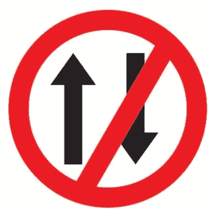
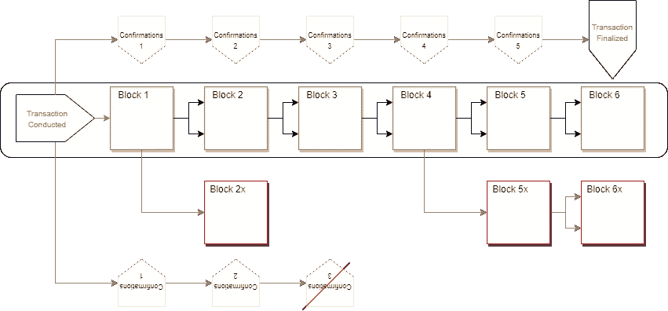

# 区块链终结的味道。

> 原文：<https://medium.com/coinmonks/blockchains-flavors-of-finality-a019deb4d003?source=collection_archive---------3----------------------->

## 直到区块链说它结束了，它才结束；算是吧。

如果你卖了你的车&一个小时后又赔了钱，你会有什么感觉？你搜索数日，提交报告&乞求你的朋友帮助；但是，唉，什么都没有。当你陷入财务困境并开始后悔自己的行为时，你发现买你车的人拿走了你的钱&他们根本没有义务把钱还给你，因为没有证据证明交易曾经发生过…

在区块链和加密货币的背景下，存在一个被称为终结的概念。终局性是任何区块链共识机制的一个典型的重要属性；这是一项交易已经结算且不可逆转的确定程度。

终局性决定了许多与行业相关的细微差别，如商业活动的结算率。*(交易所认可用户存款或商家可以处理商品交易的速度)。*

每当进行一个事务时，它就被通告给网络并放入一个 mempool 中。mempool 由节点操作者监控，他们看到事务，验证它并将其传播到网络上的其他节点。一旦交易被验证，它就被打包成一个块，等待被发布到网络/链。这是事情开始变得有趣的地方。一旦一个事务被发布&可以被公开检查，似乎可以安全地假设该事务已经完成；对吗？

不完全是。

发布后，包含该交易的区块必须由区块链网络的全球共识机制进行注册；如果出于某种原因，网络认为该块实际上是无效的，或者恶意的参与者能够“倒回”链的活动，那么事务就会被逆转。*(放在上下文中，如果有人将价值 1000 美元的 BTC {当时价值 0.01}存入交易该 BTC 的交易所&，但交易被逆转，储户将保留他们价值 1000 美元的交易商品&拿回他们的比特币；导致交易所不得不承担这些交易的巨额损失。}.*

这就引出了一个问题:什么时候交易变得安全，可以考虑完成？

这个问题的答案取决于支撑交易所依据的区块链的共识体系。

终局性存在于三种不同的变体中——绝对的、经济的和概率的。

## **绝对终结(瞬间)**

绝对终局性是指在交易发生的那一刻交易的不可逆转性。这种终结的味道通常出现在更高吞吐量的区块链机制(如 pBFT)中，这并不奇怪。

## 经济终结

经济终结是基于这样一种观念，即扭转区块链在财务上是不合理的。这种类型的终结性是基于这样的假设，即由于成本太高，任何恶意活动都不会发生。这种假设存在于工作证明和利害关系证明共识系统中。

> 作为一个例子，我们可以拿一个 10，000 美元的交易。
> **——在功率上；**如果一个恶意实体想要重组他们在以太坊这样的区块链上的 10，000 美元的花费，这将花费他们大约([【420，000](https://www.crypto51.app/) )每小时)&这决不能保证他们的交易返回(他们在技术上只有 51%的机会)。
> **-在 PoS 典型的利益证明系统有一个适当的抑制因素来阻止矿工滥用他们的权力来操纵链条。因此，如果一个网络有 101 个赌注者，每个赌注 100，000 美元，网络安全性是 10，100，000 美元；该网络可以处理高达 33%的颠覆，因此攻击者需要支付最少约 3，033，000 美元来尝试撤销一笔 10，000 美元的交易(如果他们被发现，这笔交易将被没收——为了 10，000 美元而冒超过 3，000，000 美元的风险，这在经济上是不明智的。)**

## 概率终结性

概率终结也被称为“最长/最重链赢”逻辑。这里的终结是通过事务的*深度*建立的。每个新的块被附加到该链上；包含有问题的事务的块在链&中被埋得更深，反过来，变得更需要计算来反转。概率终结也许是区块链终结最流行的版本；这是基于工作验证 utxo/链的开放区块链结构(如比特币、莱特币、& Monero)中存在的最终结果。

Probabilistic Finality Visualization (BTC reference blocks)

但是有不同类型的终结有什么意义呢？

从用户的角度来看，似乎很明显，即时终结是最理想的终结形式。然而，无论何时更进一步考察事物，每个版本的终结都带来了它自己的一套权衡。

区块链是一种分布式账本技术(DLT)；& DLT 的服从在计算机科学中被称为 ***CAP*** 定理( ***C*** 一致性， ***A*** 可用性， ***P*** 分割公差。)CAP 定理表达的是，在网络分区的情况下，分布式账本只能维持两者之一，要么一致性，要么可用性。如果选择一致性，那么网络将停止。如果选择可用性，那么网络将允许事务继续进入(但是它们将被认为是不可靠的事务)。

绝对最终性=一致性
概率最终性=可用性
经济最终性=两者之一。

简而言之，这意味着绝对终结的 ***系统*** 更倾向于由中央实体控制&次级服务；同时 ***概率终结*** 系统更具弹性&分散化。

感谢您阅读
&🥂，愿区块链与你同在

> 加入 coin monks[Telegram group](https://t.me/joinchat/EPmjKpNYwRMsBI4p)并了解加密交易和投资

## 另外，阅读

*   什么是[闪贷](https://blog.coincodecap.com/what-are-flash-loans-on-ethereum)？
*   最好的[密码交易机器人](/coinmonks/crypto-trading-bot-c2ffce8acb2a) | [网格交易](https://blog.coincodecap.com/grid-trading)
*   [3 商业评论](/coinmonks/3commas-review-an-excellent-crypto-trading-bot-2020-1313a58bec92) | [Pionex 评论](/coinmonks/pionex-review-exchange-with-crypto-trading-bot-1e459d0191ea) | [Coinrule 评论](https://blog.coincodecap.com/coinrule-review-a-perfect-trading-bot)
*   [AAX 交易所评论](/coinmonks/aax-exchange-review-2021-67c5ea09330c) | [德里比特评论](/coinmonks/deribit-review-options-fees-apis-and-testnet-2ca16c4bbdb2) | [FTX 密码交易所评论](/coinmonks/ftx-crypto-exchange-review-53664ac1198f)
*   [n 零审核](/coinmonks/ngrave-zero-review-c465cf8307fc)
*   [Bybit Exchange 审查](/coinmonks/bybit-exchange-review-dbd570019b71) | [Bityard 审查](https://blog.coincodecap.com/bityard-reivew)|[inter tax 审查](https://blog.coincodecap.com/interdax-review)
*   [3Commas vs Cryptohopper](/coinmonks/3commas-vs-pionex-vs-cryptohopper-best-crypto-bot-6a98d2baa203)
*   最好的比特币[硬件钱包](/coinmonks/the-best-cryptocurrency-hardware-wallets-of-2020-e28b1c124069?source=friends_link&sk=324dd9ff8556ab578d71e7ad7658ad7c) | [BitBox02 回顾](/coinmonks/bitbox02-review-your-swiss-bitcoin-hardware-wallet-c36c88fff29)
*   [莱杰 vs n ave](https://blog.coincodecap.com/ngrave-vs-ledger)|[莱杰 nano s vs x](https://blog.coincodecap.com/ledger-nano-s-vs-x)
*   [密码拷贝交易平台](/coinmonks/top-10-crypto-copy-trading-platforms-for-beginners-d0c37c7d698c) | [比特码拷贝交易](https://blog.coincodecap.com/bityard-copy-trading)
*   [Vauld Review](https://blog.coincodecap.com/vauld-review)|[you hodler Review](/coinmonks/youhodler-4-easy-ways-to-make-money-98969b9689f2)|[BlockFi Review](/coinmonks/blockfi-review-53096053c097)
*   最好的[加密税务软件](/coinmonks/best-crypto-tax-tool-for-my-money-72d4b430816b) | [CoinTracking 评论](/coinmonks/cointracking-review-a-reliable-cryptocurrency-tax-software-5114e3eb5737)
*   最佳[加密贷款平台](/coinmonks/top-5-crypto-lending-platforms-in-2020-that-you-need-to-know-a1b675cec3fa)
*   [莱杰纳米 S vs 特雷佐 one vs 特雷佐 T vs 莱杰纳米 X](https://blog.coincodecap.com/ledger-nano-s-vs-trezor-one-ledger-nano-x-trezor-t)
*   [block fi vs Celsius](/coinmonks/blockfi-vs-celsius-vs-hodlnaut-8a1cc8c26630)|[Hodlnaut 审核](https://blog.coincodecap.com/hodlnaut-review)
*   [Bitsgap 审查](/coinmonks/bitsgap-review-a-crypto-trading-bot-that-makes-easy-money-a5d88a336df2) | [Quadency 审查](/coinmonks/quadency-review-a-crypto-trading-automation-platform-3068eaa374e1)
*   [埃利帕尔泰坦评论](/coinmonks/ellipal-titan-review-85e9071dd029) | [赛克斯斯通评论](https://blog.coincodecap.com/secux-stone-hardware-wallet-review)
*   [DEX Explorer](https://explorer.bitquery.io/ethereum/dex) 和[区块链 API](https://explorer.bitquery.io/graphql)
*   [最佳区块链分析工具](https://bitquery.io/blog/best-blockchain-analysis-tools-and-software)
*   [加密套利](/coinmonks/crypto-arbitrage-guide-how-to-make-money-as-a-beginner-62bfe5c868f6)指南:新手如何赚钱
*   最佳[加密制图工具](/coinmonks/what-are-the-best-charting-platforms-for-cryptocurrency-trading-85aade584d80) | [最佳加密交易所](https://blog.coincodecap.com/crypto-exchange)
*   了解比特币的[最佳书籍有哪些？](/coinmonks/what-are-the-best-books-to-learn-bitcoin-409aeb9aff4b)

> [直接在您的收件箱中获得最佳软件交易](/coinmonks/newsletters/coinmonks)

