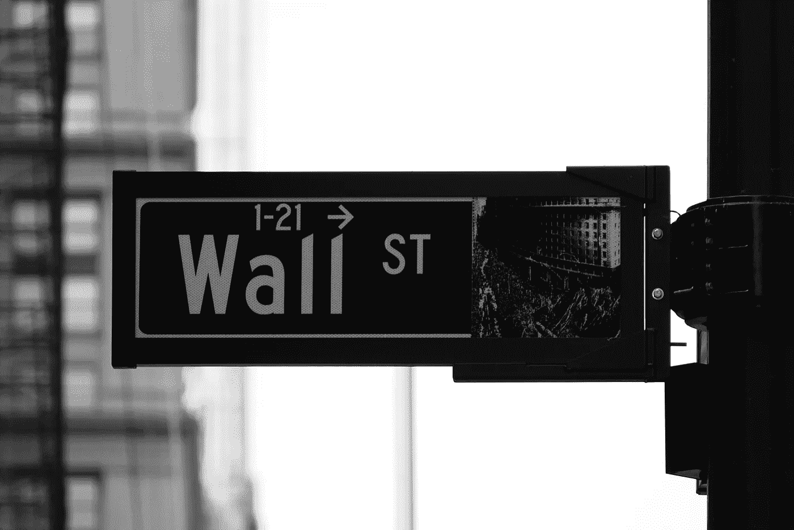

# 区块链最大的承诺

> 原文：<https://medium.com/coinmonks/blockchains-greatest-promise-3f91e65a1120?source=collection_archive---------2----------------------->

Photo by [Rick Tap](https://unsplash.com/photos/uJhgEXPqSPk?utm_source=unsplash&utm_medium=referral&utm_content=creditCopyText) on [Unsplash](https://unsplash.com/search/photos/wall-street?utm_source=unsplash&utm_medium=referral&utm_content=creditCopyText)

在 HBO 的*硅谷中，*主角理查德·亨德里克斯正漫无边际地对风险投资家拉斯·汉内曼说:

> 我们可以建立一个完全去中心化的互联网，没有防火墙，没有收费，没有政府监管，没有间谍活动。**从任何意义上来说，信息都将是完全免费的。**

在我之前的文章《 [*区块链公司的未来*](/coinmonks/the-future-of-blockchain-companies-d725100a0811) 》中，我曾简要地…