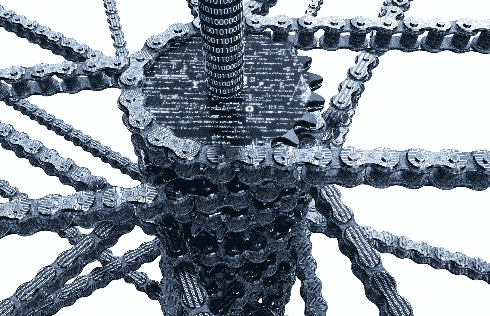
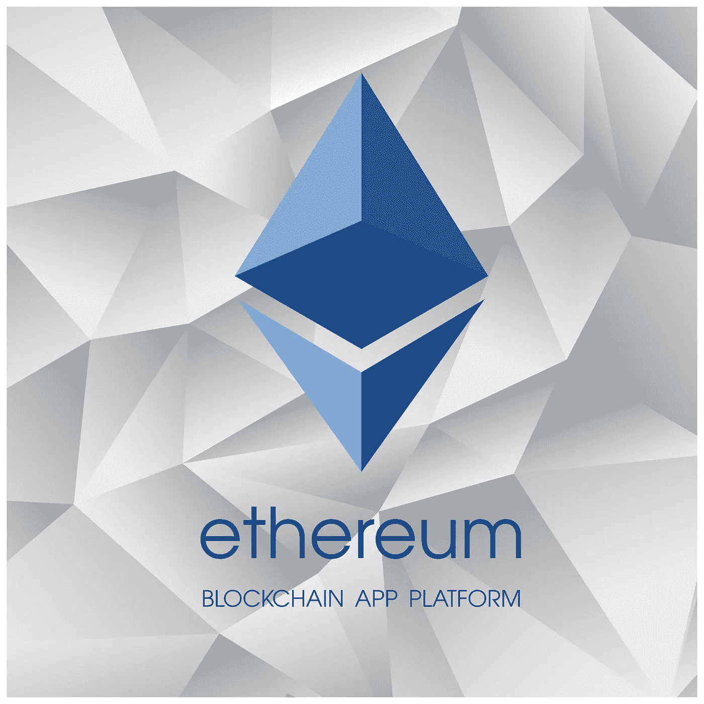
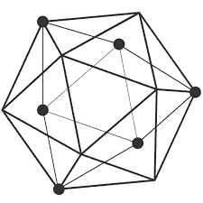
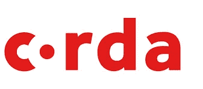
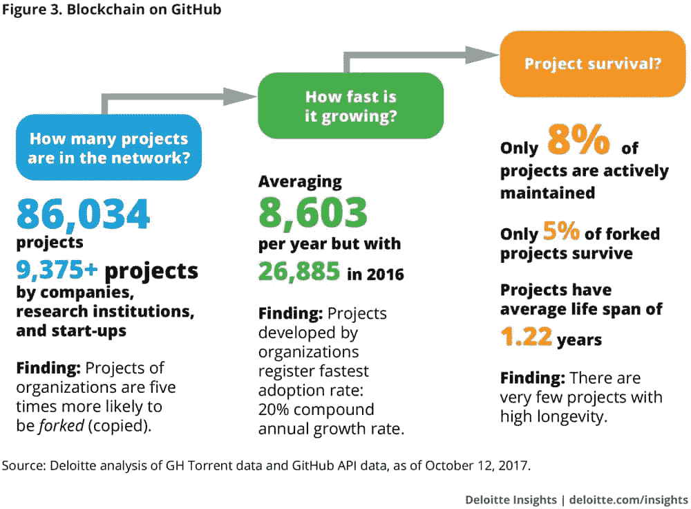

# 区块链对 DLTs

> 原文：<https://medium.com/coinmonks/blockchains-vs-dlts-8fe03df39737?source=collection_archive---------5----------------------->

## 其基础资源的简要对比分析

由[塔蒂亚娜·雷弗雷多](http://linkedin.com/in/tatianarevoredo)

## 介绍

我们正在目睹一种现象的发展，这种现象可以说是当今世界变革的催化剂，这种变革影响着治理、生活方式、企业模式、全球范围的机构以及整个社会。

Image: Shutterstock

挑战几个世纪以来占据我们头脑的旧模式和想法**【1】**，区块链架构将挑战治理以及集中和受控的交易方式，将其定义为只是分布式注册中心是不公平的。这只是其众多维度中的一个，其人员和公司范围仍无法定性和量化。

区块链的概念、特征和特点仍在探索中，但可以预见，区块链问题的解决需要对其潜在资源的认识和评估。

在这方面，本文的目的是对区块链和分布式分类账进行简要的比较分析，解决其一些关键特征，从而帮助确定其采用可能带来的优势和劣势。欢迎专家的评论来帮助修复技术上的缺陷。

## 区块链与分布式账本技术(DLTs)

虽然术语“区块链”和“DLT”(分布式账本技术)作为同义词使用非常普遍，但事实是，尽管区块链(例如比特币、以太坊、Zcash)与分布式账本技术(如 *Hyperledger Fabric* 或 *R3 Corda* )有相似之处，但 DLT 不是区块链。

Image: Shuttesrtock

分布式账本技术(DLTs)，或其他人更喜欢的分布式账本架构和结构，是为在已知参与者(例如，通过合同关系)共享的环境中处理交易而创建的，而真实的区块链被设计为陌生人可以安全地转移价值，以分配验证代理来获得交易和数据的确定性(准确性、真实性、保真度)和不变性**【2】**。这里值得注意的是，准确性和不变性对于资产充分数字化的成功至关重要。

另一方面，当分析以太坊、IBM *Hyperledger Fabric* 和 *R3 Corda* 中存在的一些各种技术资源时，我们可以确定“区块链”和“DLTs”之间的一些更多的差异。

## 以太坊

区块链*以太坊*中的事务存储在“区块”内，状态转换**【3】**产生新的系统状态(牺牲了数据库事务处理**【4】**的速度，牺牲了系统完整性)。

Image: Shuttestock

由于以太坊生态系统是由私有的区块链生态系统和公共的区块链结合而成的，对于本文来说，综合以太坊公共网络的细微差别更有意义。

因此，关于各方的参与，这是在没有许可的情况下进行的，即任何人都可以访问以太坊网络，而不需要授权。应当指出，参与的方式对如何达成共识有着深远的影响。

关于*以太坊*中的“共识”，所有参与者需要对已经发生的所有交易的顺序达成共识，无论贡献者是否对特定交易有所贡献。交易的顺序对于分类账的一致状态至关重要。如果不能确定交易的最终顺序，就有可能发生重复支出。因为网络可能涉及未知的部分(或具有任何合同责任)，所以必须采用一种合意机制来保护分类帐免受希望发生双重消费的欺诈参与者的侵害。在*以太坊*的当前实现中，该机制是通过挖掘基于劳动的*工作证明*(PoW)**【5】**来建立的。所有参与者必须同意共用一本书，所有参与者都可以访问所有已经注册的条目。后果是 PoW 对事务处理的性能产生不利影响**【6】**。关于分类帐中存储的数据，尽管记录是匿名的，但所有参与者都可以访问它们，这可能会危及需要更高程度隐私的应用程序。

另一个值得注意的特点是*以太坊*内置了一种叫做*以太*的加密货币。它用于支付对通过挖掘区块达成共识做出贡献的“节点”的奖励，以及支付交易费用。因此，可以为*以太坊*构建分散式应用(DApps)，允许货币交易。此外，可以通过部署符合预定义模式**【7】**的智能契约来创建自定义用例的数字令牌。这样就可以定义加密货币或资产。

此外，*以太坊*架构还允许“附属平台”能够向系统添加多层“秘密经济”激励。

最后，*以太坊*在资产的数字商品化中具有集成性，这意味着可以集成到数字商品的保存中，这在 *Hyperledger Fabric* 和 *R3 Corda* 中都是不可能的。

3 minute explanation of Ethereum by inventor Vitalik Buterin

## 超分类帐结构

IBM *Hyperledger Fabric* 取代了区块链系统的关键原则，在多通道架构内维持所有交易的执行，以确保可信环境中的高交易吞吐量。 *IBM Fabric* 是 DLT，不是区块链。

*Hypherledger Fabric* 架构牺牲了区块链系统的完整性和数据保真度，以在可靠的数据流环境中实现更快的交易处理和吞吐量。然而，尽管结构环境中的状态安排是有效的，但它不具备在去中心化的公共生态系统中以以太坊或比特币等区块链的方式保值的能力。

Hyperledger Fabric Explainer

关于参与，在 *Hyperledger Fabric* 中是授权的(许可的),因此网络参与者是预先选择的，网络访问仅限于这些参与者。

顺便说一句，对 Hyperledger Fabric 的一致解释更加精炼，并不局限于基于 PoW 的挖掘(工作证明)或一些衍生物。通过在许可模式下操作， *Hyperledger Fabric* 提供了对记录的更精确的访问控制，从而保护了隐私。此外，您获得了性能增益，因此只有参与事务的利益相关者需要达成共识。 *Hypherledger* 共识是广泛的，涵盖了交易的整个流程，也就是说，从交易的提议到网络，再到对分类账的承诺。**【8】**此外，计算设备(也称为“节点”)在获得共识的过程中承担不同的角色和任务。

在*总账结构*中，节点是有区别的，分为*客户端或提交客户端***【9】**、对等**【10】**或顾问**【11】**。在不涉及技术细节的情况下，Fabric 允许对共识进行精细控制并限制对事务的访问，从而提高可伸缩性和性能隐私。

Hyperledger 不需要内置加密货币，因为共识不是通过挖掘达成的。然而，有了 *Fabric* ，就有可能开发出一种本地货币或带有链码的数字代币。**【12】**

## R3 Corda

反过来，在 *R3 Corda* 架构中，共享数据的处理发生在“部分可靠”的环境中，也就是说，对方不必完全信任彼此，尽管他们的平台不具备能够确保明确、准确和不变的价值的区块链系统的组件。

Image: Shutterstock

在 *R3 Corda* 中，信息片段被附加到一个类似数据库的分类账中，该分类账将数据添加到事件链中，并允许在受控环境中追踪其来源。数据的来源由财团 *R3 Corda* 的成员控制，他们对软件平台的访问拥有一定的控制权。使用这种配置，银行和金融机构将能够在共享会计生态系统中最大限度地提高信息处理效率。数据可以在组织之间更好地移动和处理，减少了不信任方之间的信任需求。在 *R3 Corda* 进行的交易要想有效，必须:由相关各方签字，由决定交易的合同代码确认。

至于在 *R3 Corda* 中的参与，就像在 *Hyperledger Fabric* 中一样，它是被授权的(permissioned)，因此网络的参与者被预先选择，并且对网络的访问仅限于这些参与者。

Corda Overview

关于 *R3 Corda* 中的共识，其解释更加精炼，并不限于基于 PoW(工作证明)或衍生工具的挖掘。通过许可操作， *R3 Corda* 为记录提供了更精细的访问控制，从而增强了隐私性。此外，因为只有参与交易的各方需要达成共识，所以您获得了性能。与 *Fabric* 类似，Corda 中的共识也是在事务级别达成的，只涉及部分。交易的有效性和交易的唯一性受制于共识，并且这种有效性由与交易相关联的智能合同代码的执行来保证。被称为“公证节点”的参与者就交易的排他性达成共识。**【13】**

在这里，需要注意的是，由于一个系统是封闭的， *R3 Corda* 不具备必要的手段和技术特征来建立一个基于经济激励的生态系统，也不具备公共数字资产的环境。更重要的是， *R3 Corda* 不需要嵌入式加密货币，因为共识不是通过挖掘达成的，并且其白皮书没有规定加密货币或代币的创建。**【14】**

## 关于可能的用例的架构以太坊、Hyperledger Fabric 和 R3 Corda

在分析*以太坊*白皮书**【15】***Hyperledger Fabric*和 *R3 Corda* 时，这些结构对可能的应用领域有非常不同的看法。**【16】**

因此，开发 *Hyperledger Fabric* 和 *R3 Corda* 的动机是在具体的用例中。在 *R3 Corda* 中，用例是从金融服务领域中提取出来的，这就是为什么 *Corda* 的主要应用领域就在这个领域。*另一方面，Hyperledger Fabric* 旨在提供一种模块化且可扩展的架构，可用于从银行、医疗保健到供应链等多个行业。

以太坊还表明自己完全独立于任何特定的应用领域，但与 *Hyperledger Fabric* 相比，它突出的不是特殊性，而是为所有类型的交易和应用提供通用平台。

## 最终考虑

这里的结论是，这些平台本质上是彼此不同的。而区块链作为*以太坊*，它具有分布式总账中不存在的某些特征。反过来，DLT 具有*以太坊*目前无法达到的性能特征。

这里分析的所有体系结构仍在构建中，因此商人和经理应该仔细检查它们的协议，他们必须在任何实际实现之前将它们理解到必要的深度。

知道您计划去哪里，以及这些体系结构离复制所需功能的程度有多近，会产生很大的不同。

***免责声明:*** *本文仅反映作者朴实无华的个人理解。欢迎开发者为纠正技术缺陷而发表评论*。

## 文献学

以太坊。In:以太坊状态转移函数。Github。disponível em:[https://github . com/ether eum/wiki/wiki/White-Paper # ether eum-state-transition-function](https://github.com/ethereum/wiki/wiki/White-Paper#ethereum-state-transition-function)。

以太坊。在:哲学。GitHub。disponível em:[https://github . com/ether eum/wiki/wiki/White-Paper # philosophy](https://github.com/ethereum/wiki/wiki/White-Paper#philosophy)

候恩，迈克。在: *Corda:分布式分类账。Corda 技术白皮书*。科达，2016。disponível em:[https://docs . corda . net/_ static/corda-technical-white paper . pdf](https://docs.corda.net/_static/corda-technical-whitepaper.pdf)

威廉·穆加亚尔(作者)；Butterin，Vitalik(prolog)在:*商业区块链:下一代互联网技术的承诺、实践和应用*。亚马逊，2017。

雷肖恩。 *In:区块链与分布式账本技术的区别*。走向数据科学，2018。

Linux 基金会。在:*总账讲解人*。超级账本。https://youtu.be/js3Zjxbo8TM

Linux 基金会。在: *Hyperledger 架构，第 1 卷*。Hyperledger 白皮书。disponível em:[https://www . Hyperledger . org/WP-content/uploads/2017/08/Hyperledger _ Arch _ WG _ Paper _ 1 _ consensus . pdf](https://www.hyperledger.org/wp-content/uploads/2017/08/Hyperledger_Arch_WG_Paper_1_Consensus.pdf)

马丁·瓦伦塔；桑德纳菲利普。In: *以太坊、Hyperledger Fabric、Corda* 对比。法兰克福学派区块链中心，2017。

维基百科，一个百科全书。In: *白皮书*。https://pt.wikipedia.org/wiki/White_paper

许弯着腰。*见:区块链与分布式账本技术*。Consensys，2018。

## 尾注

**【1】**区块链有助于减少甚至消除我们对可信验证代理(如银行、政府、律师、公证人和监管合规官员)的依赖

**【2】**安托诺普洛斯，安德里亚斯。在:“*什么是区块链”，Youtube，2018 年 1 月。disponível em:*[https://youtu.be/4FfLhhhIlIc](https://youtu.be/4FfLhhhIlIc)

**【3】**数据结构的当前配置

**【4】**能够导致状态事务的计算事件，能够发起契约或调用预先存在的契约

以太坊的创造者 Vitalik Buterin 最近发布了一份粗略的实施指南，该指南揭示了该网络的开发者将首先从一个“混合”系统开始，该系统将比特币式的工作证明挖掘与 Buterin 创建的备受期待且仍处于实验阶段的利害关系证明系统 Casper 相结合。

**【6】**武科里奇姆(2016)。寻求可扩展的区块链结构:工作验证与 BFT 复制，载于:Camenisch J .)网络安全中的开放问题，iNetSec 2015，计算机科学讲义，第 9591 卷，Springer

**[https://www.ethereum.org/token](https://www.ethereum.org/token)**

****【7】**[https://hyperledger-fabric . readthedocs . io/en/latest/fabric _ model . html # consensus](https://hyperledger-fabric.readthedocs.io/en/latest/fabric_model.html#consensus)**

****【8】**[https://github . com/hyperledger-archives/fabric/wiki/Next-Consensus-Architecture-Proposal](https://github.com/hyperledger-archives/fabric/wiki/Next-Consensus-Architecture-Proposal)**

****【9】**对等体可以有两个特殊角色:A .提交对等体或提交者，b .签署对等体或签署者。**[https://github . com/hyperledger-archives/fabric/wiki/Next-Consensus-Architecture-Proposal](https://github.com/hyperledger-archives/fabric/wiki/Next-Consensus-Architecture-Proposal)****

******【10】**[https://github . com/hyperledger-archives/fabric/wiki/Next-Consensus-Architecture-Proposal](https://github.com/hyperledger-archives/fabric/wiki/Next-Consensus-Architecture-Proposal)****

******【11】**[https://hyperledger-Fabric . readthedocs . io/en/latest/Fabric-FAQ . html # chain code-smart-contracts-and-digital-assets](https://hyperledger-fabric.readthedocs.io/en/latest/Fabric-FAQ.html#chaincode-smart-contracts-and-digital-assets)****

******【12】**[https://github . com/hyperledger-archives/fabric/wiki/Next-Consensus-Architecture-Proposal](https://github.com/hyperledger-archives/fabric/wiki/Next-Consensus-Architecture-Proposal)****

******【13】**[https://discourse . corda . net/t/mobile-consumer-payment-experiences-with-corda-on-ledger-cash/966？source_topic_id=962](https://discourse.corda.net/t/mobile-consumer-payment-experiences-with-corda-on-ledger-cash/966?source_topic_id=962)****

******【14】**根据维基百科的说法，白皮书是由一个政府或一个国际组织发布的官方文件，目的是为了对一些问题以及如何面对这些问题提供指导或指引。****

******【15】**瓦伦塔，马丁；桑德纳菲利普。In: *以太坊、Hyperledger Fabric、Corda* 对比。法兰克福学派区块链中心，2017****