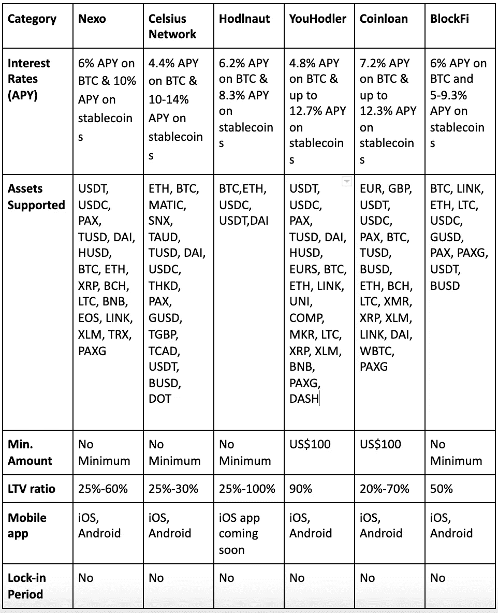
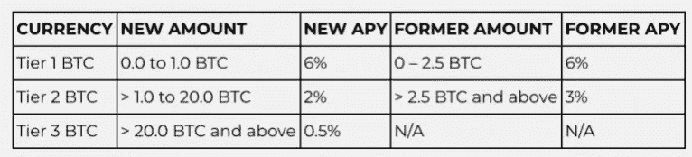
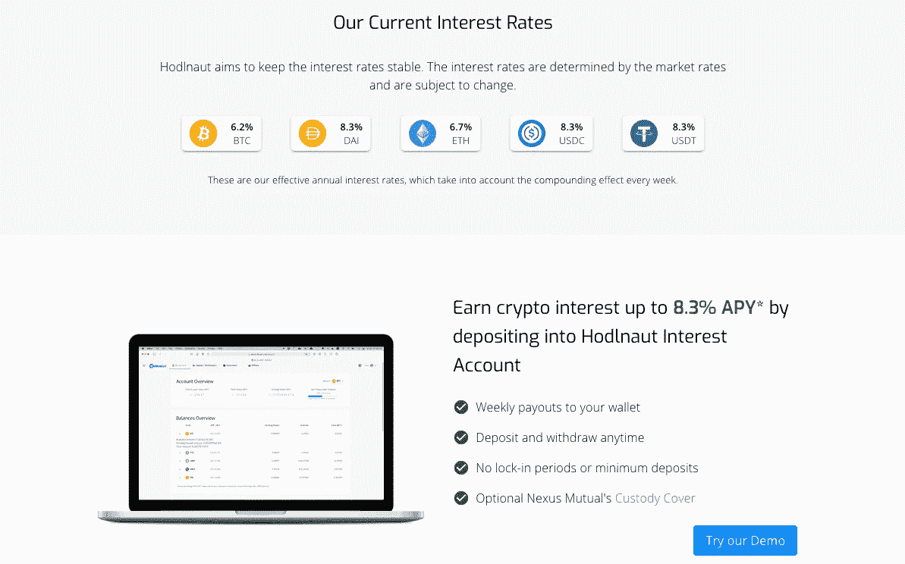
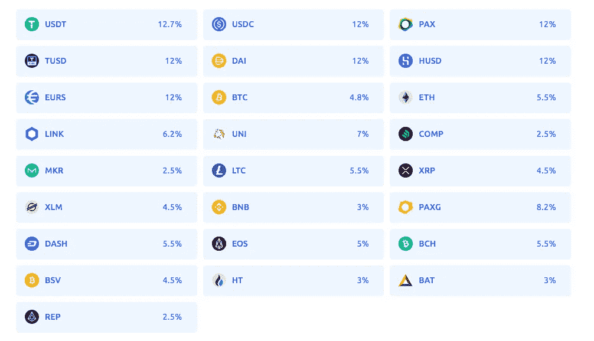
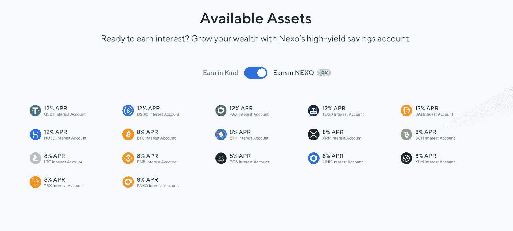
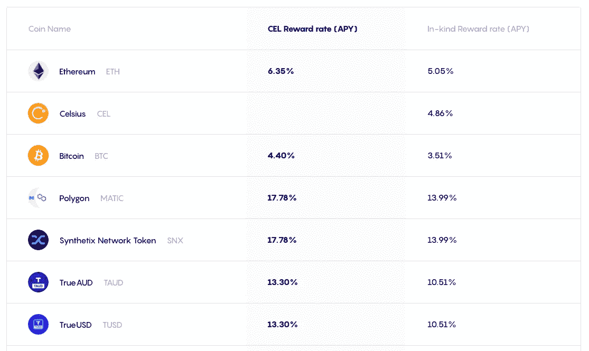
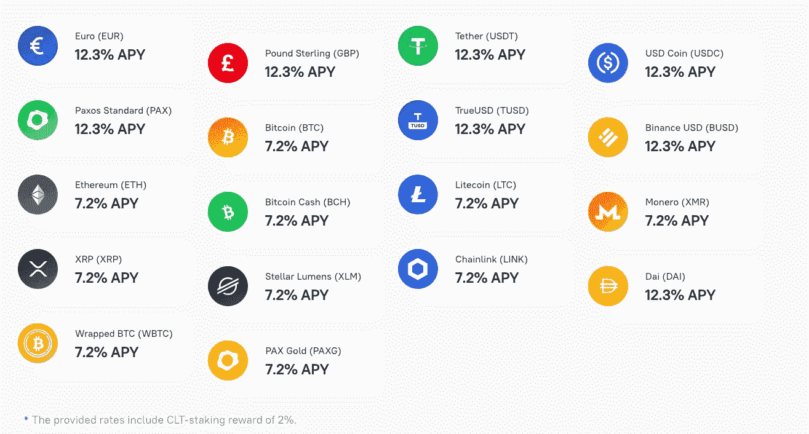
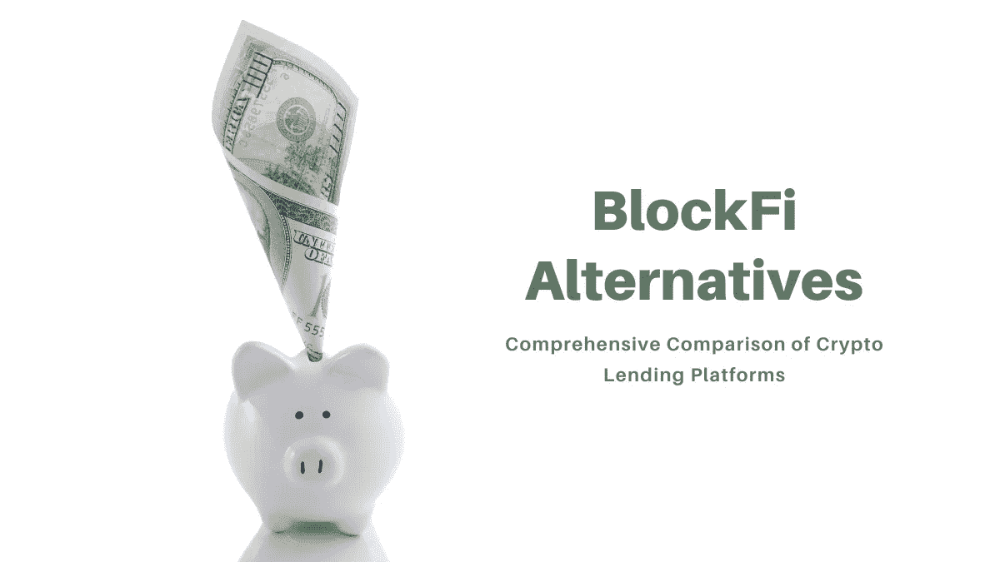

# 您应该考虑的 5 大 BlockFi 替代方案

> 原文：<https://medium.com/coinmonks/blockfi-alternatives-7197ac7ccce9?source=collection_archive---------6----------------------->

加密贷款在过去几年里变得非常流行。个人投资者可以从他们的加密资产中赚钱，并通过投资加密支持的贷款获得利息。去年，我们见证了比特币 4.1 万美元的历史新高，本月早些时候，比特币新的自动取款机以 6.3 万美元的价格超过了这个数字。很明显，加密货币正在蓬勃发展，并将继续吸引更多的投资者。用户普遍担心加密货币的波动性。这就是为什么通过 [crypto lending](https://blog.coincodecap.com/top-5-crypto-lending-platforms) 持有加密货币是明智之举，因为这将帮助他们赚取利息并充分利用他们的加密。

随着加密贷款的快速增长，市场上有很多贷款人可供选择。 [**BlockFi**](https://blog.coincodecap.com/go/blockfi) 就是这样一个成熟的平台，它得到了一些顶级加密货币机构的支持，如梵拉风险投资公司、Kenetic Capital、摩根克里克资本、雅芳风险投资公司和 Hash key 等。诚然，BlockFi 拥有最长的加密贷款记录，你可以阅读我们全面的 [BlockFi 评论](https://blog.coincodecap.com/blockfi-review)。他们也有 [BlockFi 信用卡](https://blog.coincodecap.com/blockfi-credit-card)，每次购物都会返还比特币。然而，他们的服务也有一些缺点。

例如，借款人只能在 20%的 LTV 比率下获得 4.5%的年化利率。APR 本质上是你每年为借钱而支付的成本。用户每月可以获得两次免费提款，一旦资产价值超过某个门槛，利率就会大幅下降。

此外， [**BlockFi**](https://blog.coincodecap.com/go/blockfi) 最近也将持有 1 至 20 个 BTC 的[比特币储蓄账户](https://blog.coincodecap.com/bitcoin-savings-account)的年收益率(APY)从 3% APY 下调至 2% APY。它还为持有 20 个 BTC 及以上的账户引入了一个新的等级，APY 为 0.5%。这里的 APY 指的是存款账户一年的利息总额。

此外，BlockFi 并不是在所有地方都可用，其条件可以更好，这就是为什么我们为您列出了 5 大 BlockFi 替代方案: [Nexo](https://blog.coincodecap.com/go/nexo) 、 [Celsius Network](https://blog.coincodecap.com/go/celsiusnetwork) 、 [Hodlnaut](https://blog.coincodecap.com/go/hodlnaut) 、 [YouHodler](https://blog.coincodecap.com/go/youhodler) 和 [CoinLoan](https://blog.coincodecap.com/go/coinloan) 。下表将向您概述五种 BlockFi 替代方案。让我们更深入地了解一下这些平台提供了什么。

# BlockFi 的分级新 APY 费率

# 五大 BlockFi 替代方案

# 1.[霍德瑙特](https://blog.coincodecap.com/go/hodlnaut)

[**Hodlnaut**](https://blog.coincodecap.com/go/hodlnaut) 是一个加密货币生息和借贷平台，由两位来自新加坡的企业家和自称比特币最大主义者创办。通过 Hodlnaut，用户可以通过将加密货币借给机构来获得丰厚的利息，否则这些机构将很难获得加密贷款。它为提供 6.2%的利率，为 ETH 提供 6.7%的利率，为戴、、提供 8.3%的利率。

你也可以在 Hodlnaut 平台上用他们新推出的**令牌交换功能**进行交易。它允许用户在平台上的资产对之间无缝交换。这意味着用户可以在 Hodlnaut 平台上提供的 5 种资产之间即时执行交易——BTC、瑞士联邦理工大学、戴、和。

霍德瑙特 是 block fi**的绝佳替代品，因为它提供了更高的利率。此外，用户可以随时取款，没有最低存款额或锁定期。霍德纳特是一个新兴的球员在加密贷款的空间，你当然可以考虑它霍德林你的密码。**

**提供的贷款起价为 50，000 美元，LTV 为 25%-100%，用户可以选择定期贷款或 3 个月以上的定期贷款。Hodlnaut 有一些值得注意的投资者，如鹿角，三箭资本，新加坡管理大学，麻雀和 BitGo。你也可以仔细阅读我们的 [Hodlnaut 评论](https://blog.coincodecap.com/hodlnaut-review)来了解这个平台是如何工作的。看看霍德瑙特的利弊，做出明智的决定。**

## **赞成的意见**

*   **提供高利率**
*   **没有最低存款额或锁定期**
*   **VIP 定期存款利率更高**

## **骗局**

*   **没有应用程序版本**
*   **仅支持少数加密货币**
*   **取款是手工处理的**

# **2.[尤霍德勒](https://blog.coincodecap.com/go/youhodler)**

****

**[**优霍德勒**](https://blog.coincodecap.com/go/youhodler) 提供大量加密法定金融服务，无需主动交易硬币。投资者可以考虑加密专属储蓄账户以及计息贷款来扩大你的投资组合。它在 BTC 上提供 4.8%的 APY，在瑞士联邦银行上提供 5.5%的 APY，在稳定债券上提供高达 12.7%的 APY。客户可以使用前 20 个硬币作为抵押，获得 LTV 为 90%的加密贷款。最低贷款额为 100 美元。YouHodler 还提供欧元、美元、英镑和瑞士法郎贷款。**

**如果你已经从你的比特币上赚了一些钱，并希望休息一下，你也可以开一个 YouHodler 储蓄账户，支付 12%的 APY。因此，你可以在 [YouHodler 平台](https://blog.coincodecap.com/go/youhodler)上用 2%的手续费将[比特币](https://blog.coincodecap.com/a-candid-explanation-of-bitcoin)兑换成菲亚特币，然后将菲亚特币兑换成稳定币开始赚取利息。鉴于其多种多样的金融选择，它是 BlockFi 的一个很好的替代品。我们列出了你的优点和缺点，供你参考。**

## **赞成的意见**

*   **提供 90%的 LTV(业界最高之一)**
*   **法定货币期权(美元、欧元、瑞士法郎和英镑)**
*   **没有任何信用检查的即时贷款**

## **骗局**

*   **平台在美国或中国不可用**
*   **长期贷款的高利率**
*   **缺乏用户资金的保险托管人**

# **3. [Nexo](https://blog.coincodecap.com/go/nexo)**

****

**[**Nexo**](https://blog.coincodecap.com/go/nexo) 是最早涉足 P2P 借贷的少数公司之一，是一个可靠的[加密借贷平台](https://blog.coincodecap.com/top-5-crypto-lending-platforms)。Nexo 当然有一些关键特性，这使它成为了 BlockFi 的一个很好的替代品。尽管如此，Nexo 和 BlockFi 一样拥有数年的金融科技经验。除了现金之外，Nexo 还能让你借入稳定货币和加密货币。**

**Nexo 在加密投资上提供 5%的 APY，在稳定存款和现金上提供 10%的 APY。但是，应该注意的是，10%的 APY 税率仅适用于持有至少 10% NEXO 代币账户价值的投资者。因此，如果你选择赚取 Nexo 代币，你可以在 crypto 上获得 8%的 APY，在 stablecoins 上获得 12%的 APY。虽然 Nexo 不提供 24 小时的电话支持，但它有一个很好的客户支持系统，具有消息功能和实时聊天选项。我们来看看 Nexo 的利弊。**

## **赞成的意见**

*   **充分的灵活性—没有锁定期，可随时提取。**
*   **使用 Nexo 代币赚取 30%的额外利息。**
*   **在 200 多个司法管辖区提供 40 多种法定货币。**

## **骗局**

*   **Nexo 授权 hodling NEXO tokens 获得最佳储蓄和贷款利率。**
*   **在某些情况下，贷款利率高于借款利率。**
*   **Nexo 的 3.75 亿美元保险对所有客户都是累积的，并且只适用于保存在冷[分类账金库钱包](https://blog.coincodecap.com/ledger-nano-s-vs-x)中的资产。**

# **4.[摄氏网络](https://blog.coincodecap.com/go/celsiusnetwork)**

****

****有点类似于 Nexo 作为 [**BlockFi**](https://blog.coincodecap.com/go/blockfi) 的替代品。它有一个类似的商业模式，有一个[加密利息账户](https://blog.coincodecap.com/cryptocurrency-savings-accounts)和借款。此外，就像 Nexo tokens 一样，Celsius 也有自己的 [CEL token](https://celsius.network/cel-token-explained/) 从而为 CEL token 的持有者提供更好的利率。Celsius 的优势在于，他们为借款人提供接近 1%的超低贷款利率。然而，他们的 LTV 率一般在 25%到 30%左右(你可以借的抵押品价值的百分比)。Celsius Network 在 BTC 提供 4.4%的 APY，在 ETH 提供 6.35%的 APY，在 stablecoins 提供 10-14%的 APY。同样，您需要 hodl CEL 才能获得最优惠的价格。就像 Nexo 一样，Celsius Network 为其投资者提供的灵活性非常有限。BTC 和 ETH 等加密货币的 APY 不超过 5.5%，除非你收到 CEL 币的利息。摄氏每周支付复利。以下是摄氏网的利与弊，供大家参考。****

## ****赞成的意见****

*   ****APY 每周支付高达 15%的奖励****
*   ****易于使用的移动平台****
*   ****使用 CelPay 进行即时、免费支付****

## ****骗局****

*   ****需要存入 CEL 代币以获得更高的利率****
*   ****仅限于加密货币，没有网络应用****
*   ****利率会有很大的波动****

# ****5.[信用贷款](https://blog.coincodecap.com/go/coinloan)****

********

****[**CoinLoan**](https://blog.coincodecap.com/go/coinloan) 是一家总部位于爱沙尼亚的[加密贷款平台](https://blog.coincodecap.com/top-5-crypto-lending-platforms)，向全球客户提供加密贷款。你可以把它想象成借贷双方的 P2P 市场。与 [BlockFi](https://blog.coincodecap.com/go/blockfi) ， [**Coinloan**](https://blog.coincodecap.com/go/coinloan) **不设提现费**。借款人需要存放用作抵押品的加密资产，而贷款人需要存放稳定的存款或固定资金。一旦贷款人和借款人被匹配，一个智能合同将被绘制以确保贷款的及时偿还，这样借款人就不会丢失他们的密码。贷款全部偿还后，贷款人获得本金和利息，而借款人获得资产。年利率低至 4.5%。****

****[CoinLoan](https://blog.coincodecap.com/go/coinloan) 允许投资者向拥有经过验证的加密抵押品的借款人提供贷款。贷款期限从七天到三年，没有任何提前还款的罚款。它为 BTC 和 ETH 提供了 7.2%的 APY，比 BlockFi 高，因此是一个很好的选择。它提供高达 12.3%的稳定 APY。尽管需要注意的是，APY 的价格包含了 CLT 2%的赌注奖励。所以像[摄氏网络](https://blog.coincodecap.com/go/celsiusnetwork)和 [Nexo](https://blog.coincodecap.com/go/nexo) ， [CoinLoan](https://blog.coincodecap.com/go/coinloan) 给那些持有硬币贷款代币的人提供最好的利率。在这一点上，让我们看看硬币贷款的利与弊。****

## ****赞成的意见****

*   ****拥有欧洲虚拟货币提供商许可证****
*   ****过去四年成功运营****
*   ****用 CoinLoan token 提供高利率****

## ****骗局****

*   ****不透明****
*   ****贷款量有时会减少****
*   ****交易对手风险高****

# ****BlockFi 替代方案:哪个最好？****

****无论你是投资者还是借款者，了解一个平台能提供什么是至关重要的。一个平台可以在你选择的密码中提供更好的贷款，但投资利率很低。因此，详尽的分析对充分利用您的加密资产大有帮助。也就是说，仅仅因为你在一个平台上填写了 KYC，并不一定会阻止你探索所有的选项。****

****我们希望这里列出的 [BlockFi](https://blog.coincodecap.com/go/blockfi) 备选方案能够帮助您做出明智的选择。 [Nexo](https://blog.coincodecap.com/go/nexo) 拥有多年的经验和雄厚的资金支持，而 [CoinLoan](https://blog.coincodecap.com/go/coinloan) 拥有欧洲金融牌照。 [Celsius](https://blog.coincodecap.com/go/celsiusnetwork) 为借款人提供 1%的超低年利率，而 [YouHodler](https://blog.coincodecap.com/go/youhodler) 让用户可以轻松地从他们的密码中借款、交换和获利。最后， [Hodlnaut](https://blog.coincodecap.com/go/hodlnaut) 凭借可观的 6.2% APY，帮助霍德勒夫妇充分利用他们的 BTC。****

****作为一般的最佳实践，您应该在投资上述任何平台之前仔细研究。没有完美的平台，但您会找到最能满足您特定需求的平台。****

> *****加入 Coinmonks* [*电报频道*](https://t.me/coincodecap) *和* [*Youtube 频道*](https://www.youtube.com/c/coinmonks/videos) *获取每日* [*加密新闻*](http://coincodecap.com/)****

# ****另外，阅读****

*   ****[复制交易](/coinmonks/top-10-crypto-copy-trading-platforms-for-beginners-d0c37c7d698c) | [加密税务软件](/coinmonks/crypto-tax-software-ed4b4810e338)****
*   ****[网格交易](https://coincodecap.com/grid-trading) | [加密硬件钱包](/coinmonks/the-best-cryptocurrency-hardware-wallets-of-2020-e28b1c124069)****
*   ****[密码电报信号](/coinmonks/top-3-telegram-channels-for-crypto-traders-in-2021-8385f4411ff4) | [密码交易机器人](/coinmonks/crypto-trading-bot-c2ffce8acb2a)****
*   ****[最佳加密交易所](/coinmonks/crypto-exchange-dd2f9d6f3769) | [印度最佳加密交易所](/coinmonks/bitcoin-exchange-in-india-7f1fe79715c9)****
*   ****[开发者最佳加密 API](/coinmonks/best-crypto-apis-for-developers-5efe3a597a9f)****
*   ****最佳[密码借贷平台](/coinmonks/top-5-crypto-lending-platforms-in-2020-that-you-need-to-know-a1b675cec3fa)****
*   ****[免费加密信号](/coinmonks/free-crypto-signals-48b25e61a8da) | [加密交易机器人](/coinmonks/crypto-trading-bot-c2ffce8acb2a)****
*   ****杠杆代币的终极指南****

********