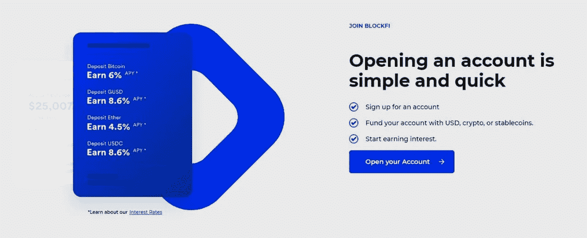

# BlockFi 信用卡回顾 2021 |你拿到最好的卡了吗？

> 原文：<https://medium.com/coinmonks/blockfi-credit-card-review-35b0a680f320?source=collection_archive---------8----------------------->

[**BlockFi**](https://blog.coincodecap.com/go/blockfi) 是一个加密货币管理平台，帮助您将加密货币存入账户，赚取利息，并有效地使用它们。[扎克·普林斯](https://www.linkedin.com/in/zacprince/)和[弗洛里·马尔克斯](https://www.linkedin.com/in/flori-marquez-5020a021/)在 2017 年创立了这家总部位于新泽西的公司，它已经发展成为一个著名的提供类似银行服务的平台。他们是第一个提供[加密利息账户](https://blog.coincodecap.com/cryptocurrency-savings-accounts)持有系统的公司。有了 [BlockFi 利息账户](https://blog.coincodecap.com/go/blockfi)，你可以购买、出售、交易加密货币，同时**每年赚取高达 8.6%的利息**。2019 年末，BlockFi 确认拥有 22.5 万用户。BlockFi 不仅管理着超过 80 亿美元的资产，还为客户创造了价值数千万美元的利益。

# BlockFi 想达到什么目的？

[**BlockFi**](https://blog.coincodecap.com/go/blockfi) 旨在模糊传统金融和区块链科技之间的界限。

它努力在全球范围内为客户赋权，并从每一笔交易中获得巨大利益。它是安全的，因为它符合美国联邦和州的准则。

BlockFi 不断推出创新产品，现在已经设计了一款名为' [**BlockFi 信用卡**](https://blog.coincodecap.com/go/blockfi-credit-card) **的新产品。这在密码市场上是新的，我们将在本文中详细讨论它。然而，如果你想了解更多关于 BlockFi 利息账户的信息，请阅读我们全面的 [BlockFi 评论](https://blog.coincodecap.com/blockfi-review)。**

> 报名 [**BlockFi 信用卡等候名单**](https://blog.coincodecap.com/go/blockfi-credit-card) 。

# 什么是 BlockFi 比特币奖励信用卡？

[**BlockFi**](https://blog.coincodecap.com/go/blockfi) 正在推出世界上第一张比特币奖励信用卡。它将于 2021 年春天向有资格的美国居民提供。BlockFi 与 Visa 合作，信用卡公司[应得](https://www.deserve.com/)，以及[进化银行](https://www.getevolved.com/)推出这款惊心动魄的奖励信用卡。虽然有很多比特币奖励卡，但 BlockFi 推出奖励“信用卡”无疑是在做一些诱人的事情，尤其是在一个充满里程、现金返还和积分的商业行业。2021 年 1 月面向公众开放的 [**BlockFi 信用卡等候名单**](https://blog.coincodecap.com/go/blockfi-credit-card) 。一旦获得批准，您将获得美元信用额度。从今以后，在你的每一笔交易中，你将立即获得 1.5%的比特币返现。BlockFi 不仅提供这个，还提供各种其他服务来帮助你管理和获得加密利益。

# 总结(TL；博士)

> *“我们对 BlockFi 的目标一直是让它促进加密货币成为主流——每天都有更多的证据证明正在发生的事情，”*
> 
> *马尔克斯公司总裁 SVP*

他们接连推出不同的加密产品和方案，这无疑表明他们在提供安全、高效平台的同时将加密货币纳入主流的愿望是真实的。 [**BlockFi**](https://blog.coincodecap.com/go/blockfi) ，一个相对年轻的媒体，在全球 100 多个国家拥有强大的业务和零售客户。

BlockFi 的创新[比特币奖励信用卡](https://blog.coincodecap.com/go/blockfi-credit-card)提供了很多东西。我们在这里对它们进行了总结。

*   每笔交易立即获得 1.5%的比特币返现。
*   持有信用卡的年费是 200 美元。
*   如果你在头三个月内消费 3000 美元，你将获得 250 美元的比特币注册奖金。
*   信用卡由金属制成，设计时尚。
*   你可以在任何接受 Visa 的地方使用这张信用卡。
*   它还向用户提供奖金、额外的 APY、额外的激励和几种返现。
*   目前适用于美国居民，纽约除外(由于法规问题/限制)
*   在任何接受 Visa 的地方使用比特币轻松快捷地支付。
*   即使您在 BlockFi 中没有帐户，您也可以 [**加入等待名单**](https://blog.coincodecap.com/go/blockfi-credit-card) 。
*   信用卡的发货将于 2021 年春季开始。
*   BlockFi 符合美国联邦和州的指导原则，并受纽约金融服务局(NYDFS)的监管。
*   如果你遇到麻烦，BlockFi 会采取快速、实用的步骤来解决，因为它以各种方式向所有类型的用户提供帮助。
*   据报道，截至 2019 年底， [BlockFi 拥有 22.5 万用户](https://www.coindesk.com/crypto-lender-blockfi-raises-350m-at-a-3b-valuation)。著名的加密和保险公司也支持 BlockFi。
*   BlockFi 有一个移动应用程序，可以在 [Android](https://play.google.com/store/apps/details?id=com.blockfi.mobile&hl=en) 和 [iOS](https://apps.apple.com/us/app/blockfi/id1506274532) 上使用。

# 为什么选择 BlockFi？

随着对比特币需求的增加，对安全且易于访问的[加密货币利息账户](https://blog.coincodecap.com/cryptocurrency-savings-accounts)的需求也在增加。这就是 BlockFi 帮助你的地方，它提供了市场上[最好的比特币储蓄账户](https://blog.coincodecap.com/bitcoin-savings-account)。

# BlockFi 适合我吗？

如果你像 BlockFi 的创始人兼首席执行官扎克·普林斯(Zac Prince)所说的那样对加密很感兴趣，那么这张信用卡将会吸引你。如果你热衷于加密，并且不打算立即花掉你的奖励，那么是的，这张信用卡对你有好处。

# 如何加入 BlockFi 信用卡等候名单？

如果你决定[申请 BlockFi 比特币奖励信用卡](https://blog.coincodecap.com/go/blockfi-credit-card)，你应该知道快速简单的步骤。因此，如果您已经在 [BlockFi](https://blog.coincodecap.com/go/blockfi) 中拥有一个帐户，那么您可以通过您的帐户加入等候名单。**但是如果你没有 BlockFi 利息账户(BIA)呢？**

# 如果你还没有 BlockFi 利息账户，该如何加入？

即使你没有 BlockFi 利息账户，也没有任何担忧，因为等待名单将于 2021 年 1 月面向普通公众开放。所以，你可以很容易地访问他们的主要网站，提交你的姓名，电子邮件地址，你都完成了。但是不是每个申请的人都有资格。

# 批量奖励信用卡复查:资格

[**BlockFi**](https://blog.coincodecap.com/go/blockfi) 在你获得资格之前会考察地理、监管、承保等因素。因为许多人会申请信用卡，所以最好提高你在队伍中的位置。

## 如何提高你在候选名单中的位置？

BlockFi 表示，资格是基于“先入先出”越早申请，获得资格的机会就越大。虽然，最终的决定因素是你推荐的人数。因此，通过尽早加入并成功推荐，您可以增加获得资格的机会。

现在我们已经了解了公司的目标和申请流程，我们可以看看这个平台的核心特性。BlockFi 到底给你提供了什么？

# BlockFi 信用卡评论:功能

你将有一个信用额度，如果你每个月都支付账单余额，它不会对余额收取任何利息。你可以从你的比特币奖励中赚取利息，通过 [**BlockFi**](https://blog.coincodecap.com/go/blockfi) 给你的所有优惠，你可以获得价值 750 美元或以上的比特币奖励奖金。

*   持有信用卡的年费是 200 美元。
*   你将在每笔交易中获得 1.5%的比特币返现。返现将在您的账户中累积，并每月定期转换为比特币。
*   这个 1.5%的返现率是市场上任何卡产品提供的最高比特币奖励率。
*   如果你在头三个月内消费 3000 美元，你将获得 250 美元的比特币注册奖金。
*   您在今年第二季度购买的所有商品将获得 3.5%的比特币奖励(最多 100 美元比特币)。
*   如果你在你的 BIA 持有[稳定硬币](https://blog.coincodecap.com/stablecoins-a-simple-overview)资产，如 USDC、GUSD、派克斯，那么在你拥有信用卡的第一年，你将在平均每日稳定硬币余额上获得额外的 2% APY。这到底是怎么回事？奖金将在一年中累积，在每年的续期中，它将支付您奖金。这 2%的 APY 奖金相当于 200 美元的比特币。
*   在所有授权交易中，你将获得 0.25%的比特币回报。这意味着你每月最多可以获得 500 美元的比特币。
*   根据“推荐朋友计划”，你每成功推荐一个朋友，就可以额外获得 30 美元的比特币。
*   信用卡由金属制成，设计时尚。
*   你可以在任何接受 Visa 的地方使用这张信用卡。

# BlockFi 信用卡审查:安全性

[**BlockFi**](https://blog.coincodecap.com/go/blockfi) 正在跨多个平台持续扩展，具有透明度并积极进行风险管理。纽约金融服务部门( [NYDFS](https://www.dfs.ny.gov/) )监管 BlockFi，它由知名机构投资者支持，没有公用事业令牌。BlockFi 的主要托管人是著名的数字货币交易所 [Gemini](https://blog.coincodecap.com/go/gemini) 。[著名保险公司怡安](https://www.aon.com/home/index.html)为[双子星](https://blog.coincodecap.com/go/gemini)的存储资金提供保险，双子星 95%的资产在冷库，5%在热钱包。德勤已经给 BlockFi 一个 [SOC2](https://www.aicpa.org/interestareas/frc/assuranceadvisoryservices/serviceorganization-smanagement.html) Type 1 合规审计。

数据传输通过可靠的加密进行。 [**BlockFi**](https://blog.coincodecap.com/go/blockfi) 拥有双因素认证、PII 验证、允许列表等安全工具。他们与世界领先的身份管理公司 Auth0 携手合作，以确保安全、可信和可访问的加密业务。

BlockFi 声称将客户资金置于亏损的股权或员工资金之前，以最大限度地降低风险。为了不断提高安全性，BlockFi 让外部安全公司进行渗透测试并提供建议。

此外，BlockFi 有一个坚实的基础，因为它得到了主要行业投资者的支持，即梵拉风险投资公司、[比特币基地](https://blog.coincodecap.com/go/coinbase)风险投资公司、摩根克里克资本管理公司、萨斯奎汉纳政府产品公司、银河数字公司、文克莱沃斯资本公司等等。

# BlockFi 信用卡审查:客户支持

如果你是受资助的活跃客户，你可以拨打 [+1 646 779 9688](https://blockfi.com/contact/) 寻求帮助。

BlockFi 的支持服务站点是[support@blockfi.com](mailto:support@blockfi.com)。BlockFi 有一个 [youtube 频道](https://www.youtube.com/blockfi)，提供 BlockFi 工作人员解决各种问题的采访。他们也有一个[推特](https://twitter.com/blockfi)账号。

BlockFi 声称其**人工智能智能助手 BotFi**将帮助你立即找到问题的答案。然而，如果由于任何原因，你的问题没有得到解决，那么在机器人的帮助下，你可以提交一张说明你的问题的票。客户服务代表将检查并立即回复。

如果你在最坏的情况下得到一个被攻破的账户， [**BlockFi**](https://blog.coincodecap.com/go/blockfi) 会冻结它一个星期。BlockFi 将安排与您进行视频通话，以验证您的身份。完成验证后，您必须更改您的电子邮件地址和密码。很快，你就会重新控制你的账户。

# BlockFi 移动应用

[**BlockFi**](https://blog.coincodecap.com/go/blockfi) 手机应用在[安卓](https://play.google.com/store/apps/details?id=com.blockfi.mobile&hl=en)和 [iOS](https://apps.apple.com/us/app/blockfi/id1506274532) 上均有。

他们有一个简单直观的用户界面。他们的应用程序很容易使用。您可以通过生物识别登录的全面安全功能访问您的帐户。你可以管理你的账户，关注余额，借钱，交易，赚取利息。

# BlockFi 信用卡评论:利弊

虽然 [**BlockFi**](https://blog.coincodecap.com/go/blockfi) 确实为每笔购买提供了出色的奖励积分，但它也有其缺点。我们已经在一个表格中总结了优点和缺点。你可以快速浏览一下，以便有一个清晰的概念。

# BlockFi 信用卡审查:结论

最重要的是，我们可以说 [**BlockFi**](https://blog.coincodecap.com/go/blockfi) 是一个值得信赖的、高效的、盈利的[密码借贷平台](https://blog.coincodecap.com/top-5-crypto-lending-platforms)。著名的密码商业公司支持它；它遵守美国的法律和金融法规，并提供大量创新的比特币奖励以及高收益和相对较低的风险。你不会有使用该应用程序的麻烦，因为它非常用户友好，而且他们也有广泛的，支持性的客户服务。

我们还可以得出结论， [**BlockFi 的比特币奖励信用卡**](https://blog.coincodecap.com/go/blockfi-credit-card) 是一款独一无二的产品，提供诱人、丰硕的利息优惠。这项服务很简单，显然没有隐藏的费用。只要您年满 18 岁，您就可以通过提供您的姓名和电子邮件地址直接申请奖励信用卡。该平台更适合精通加密货币业务的人，甚至是对加密好奇并想探索比特币世界的人。

虽然 [FDIC](https://www.fdic.gov/) 或 [SIPC](https://www.sipc.org/) 不为 BlockFi 投保，但[双子星](https://blog.coincodecap.com/go/gemini)采用严格的安全措施来降低风险。如果你支付滞纳金或利息，这些回报和优势不会让你受益。如果你只能花时间，那么你应该考虑申请这张奖励信用卡。毫无疑问，即使在这里也存在风险，因为奖励积分取决于比特币当时的市场价值。但是如果你正在考虑选择这张信用卡，我们认为你必须意识到所有的加密业务都有风险。

所以，总的来说，如果你不想马上花光，比特币信用卡确实非常有益。此外，市场上的许多公司也希望很快推出这种加密奖励信用卡。所以以后可能会有更好的选择，但是 [**BlockFi 的奖励信用卡**](https://blog.coincodecap.com/go/blockfi-credit-card) 是目前最好的选择。BlockFi 干净、透明的服务和优惠足够有竞争力，肯定能帮你收获更高回报率的好处。

# 常见问题

**block fi 安全合法吗？**

是的，因为它符合美国的金融法律，并由纽约金融服务局(NYDFS)监管。

**block fi 信用卡******waitlist 如何工作？****

**如果您还没有 BlockFi 利息账户，那么您仍然可以加入等候名单。等候名单于 2021 年 1 月向公众开放。你可以访问他们的主网站，提交你的姓名和电子邮件地址，你就大功告成了。**

****如何查看我在信用卡等候名单上的状态？****

**在您注册等候名单后，您将收到一封电子邮件，说明您的自定义状态链接。您可以将该链接加入书签，以检查您在该行中的位置。**

****[**BlockFi 信用卡**](https://blog.coincodecap.com/go/blockfi-credit-card) **什么时候可以用？******

****比特币奖励信用卡将于 2021 年春天向合格的美国公民开放。欲知详情，请访问 blockfi.com。****

****如何知道我是否在 BlockFi 信用卡的等候名单上？****

****注册后，当您在电子邮件中收到确认链接时，您就会知道了。或者你也可以登录 app.blockfi.com，点击顶部的促销横幅。如果你看到“你在名单上！”页面上，然后你就一切就绪了。如果没有，你可以点击“上榜”选项申请上榜。****

****加入候补名单需要支付任何费用吗？****

****不。你可以加入等候名单，无需支付任何费用。****

****怎样才算成功的推荐？****

****成功加入等候名单后，您将收到一个唯一的推荐链接。使用此唯一推荐链接加入候选人名单的人将被视为成功推荐。****

******比特币奖励什么时候发放？******

****比特币奖励返现将在您的账户中累积，转换为比特币，并定期支付。****

*   ****[BlockFi 评论 2021 |赚取高达 8.6%的加密利息](https://blog.coincodecap.com/blockfi-review)****
*   ****[Celsius Network vs block fi vs Hodlnaut |利率、费用和风险](https://blog.coincodecap.com/blockfi-vs-celsius-vs-hodlnaut)****
*   ****[如何选购以太坊？【2021 年版】](https://blog.coincodecap.com/how-to-buy-ethereum)****
*   ****[2021 年前 6 大密码借贷平台【已验证】](https://blog.coincodecap.com/top-5-crypto-lending-platforms)****
*   ****[2021 年 6 大最佳比特币储蓄账户](https://blog.coincodecap.com/bitcoin-savings-account)****

> ****加入 Coinmonks [电报集团](https://t.me/joinchat/PmKOYQ9NNKZlZGNl)，了解加密交易和投资****

## ****另外，阅读****

*   ****[什么是融资融券交易](https://blog.coincodecap.com/margin-trading) | [成本平均法](https://blog.coincodecap.com/dca)****
*   ****最好的[加密交易机器人](/coinmonks/crypto-trading-bot-c2ffce8acb2a) | [网格交易机器人](https://blog.coincodecap.com/grid-trading)****
*   ****[3 商业评论](/coinmonks/3commas-review-an-excellent-crypto-trading-bot-2020-1313a58bec92) | [Pionex 评论](/coinmonks/pionex-review-exchange-with-crypto-trading-bot-1e459d0191ea) | [Coinrule 评论](/coinmonks/coinrule-review-2021-a-beginner-friendly-crypto-trading-bot-daf0504848ba)****
*   ****[AAX 交易所评论](/coinmonks/aax-exchange-review-2021-67c5ea09330c) | [德里比特评论](/coinmonks/deribit-review-options-fees-apis-and-testnet-2ca16c4bbdb2) | [FTX 交易所评论](/coinmonks/ftx-crypto-exchange-review-53664ac1198f)****
*   ****[n 零复习](/coinmonks/ngrave-zero-review-c465cf8307fc) | [Phemex 复习](/coinmonks/phemex-review-4cfba0b49e28) | [PrimeXBT 复习](/coinmonks/primexbt-review-88e0815be858)****
*   ****[Bybit Exchange 审查](/coinmonks/bybit-exchange-review-dbd570019b71) | [Bityard 审查](/coinmonks/bityard-review-7d104239be35) | [CoinSpot 审查](https://blog.coincodecap.com/coinspot-review)****
*   ****[3 commas vs crypto hopper](/coinmonks/3commas-vs-pionex-vs-cryptohopper-best-crypto-bot-6a98d2baa203)|[赚取加密利息](/coinmonks/earn-crypto-interest-b10b810fdda3)****
*   ****最好的比特币[硬件钱包](/coinmonks/the-best-cryptocurrency-hardware-wallets-of-2020-e28b1c124069?source=friends_link&sk=324dd9ff8556ab578d71e7ad7658ad7c) | [BitBox02 回顾](/coinmonks/bitbox02-review-your-swiss-bitcoin-hardware-wallet-c36c88fff29)****
*   ****[莱杰 vs Ngrave](/coinmonks/ledger-vs-ngrave-zero-7e40f0c1d694) | [莱杰 nano s vs x](/coinmonks/ledger-nano-s-vs-x-battery-hardware-price-storage-59a6663fe3b0) | [币安评论](/coinmonks/binance-review-ee10d3bf3b6e)****
*   ****[加密复制交易平台](/coinmonks/top-10-crypto-copy-trading-platforms-for-beginners-d0c37c7d698c) | [Coinmama 审核](/coinmonks/coinmama-review-ace5641bde6e)****
*   ****[CoinLoan 审查](/coinmonks/coinloan-review-18128b9badc4) | [YouHodler 审查](/coinmonks/youhodler-4-easy-ways-to-make-money-98969b9689f2) | [BlockFi 审查](/coinmonks/blockfi-review-53096053c097)****
*   ****最好的[加密税务软件](/coinmonks/best-crypto-tax-tool-for-my-money-72d4b430816b) | [硬币追踪评论](/coinmonks/cointracking-review-a-reliable-cryptocurrency-tax-software-5114e3eb5737)****
*   ****最佳[加密借贷平台](/coinmonks/top-5-crypto-lending-platforms-in-2020-that-you-need-to-know-a1b675cec3fa) | [杠杆代币](/coinmonks/leveraged-token-3f5257808b22)****
*   ****[BlockFi vs 摄氏度](/coinmonks/blockfi-vs-celsius-vs-hodlnaut-8a1cc8c26630) | [Hodlnaut 审核](/coinmonks/hodlnaut-review-best-way-to-hodl-is-to-earn-interest-on-your-bitcoin-6658a8c19edf) | [KuCoin 审核](https://blog.coincodecap.com/kucoin-review)****
*   ****[Bitsgap 审查](/coinmonks/bitsgap-review-a-crypto-trading-bot-that-makes-easy-money-a5d88a336df2) | [Quadency 审查](/coinmonks/quadency-review-a-crypto-trading-automation-platform-3068eaa374e1) | [Bitbns 审查](/coinmonks/bitbns-review-38256a07e161)****
*   ****[埃利帕尔泰坦评论](/coinmonks/ellipal-titan-review-85e9071dd029) | [塞克斯斯通评论](/coinmonks/secux-stone-hardware-wallet-review-15-discount-coupon-2020-7577032faa6e)****
*   ****[本地比特币审核](/coinmonks/localbitcoins-review-6cc001c6ed56) | [加密货币储蓄账户](https://blog.coincodecap.com/cryptocurrency-savings-accounts)****
*   ****最佳[区块链分析](https://bitquery.io/blog/best-blockchain-analysis-tools-and-software)工具| [赚比特币](/coinmonks/earn-bitcoin-6e8bd3c592d9)****
*   ****[加密套利](/coinmonks/crypto-arbitrage-guide-how-to-make-money-as-a-beginner-62bfe5c868f6)指南| [如何做空比特币](/coinmonks/how-to-short-bitcoin-568a2d0b4ae5)****
*   ****最佳[加密制图工具](/coinmonks/what-are-the-best-charting-platforms-for-cryptocurrency-trading-85aade584d80) | [最佳加密交易所](/coinmonks/crypto-exchange-dd2f9d6f3769)****
*   ****[如何在印度购买比特币？](/coinmonks/buy-bitcoin-in-india-feb50ddfef94) | [瓦济克斯审查](/coinmonks/wazirx-review-5c811b074f5b)****
*   ****[印度比特币交易所](/coinmonks/bitcoin-exchange-in-india-7f1fe79715c9) | [比特币储蓄账户](/coinmonks/bitcoin-savings-account-e65b13f92451)****
*   ****[CoinDCX 评论](/coinmonks/coindcx-review-8444db3621a2) | [加密保证金交易交易所](https://blog.coincodecap.com/crypto-margin-trading-exchanges)****

*****原载于 2021 年 4 月 25 日 https://blog.coincodecap.com**[*。*](https://blog.coincodecap.com/blockfi-credit-card)*****