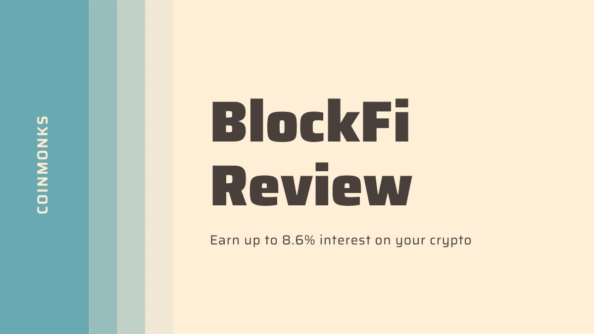
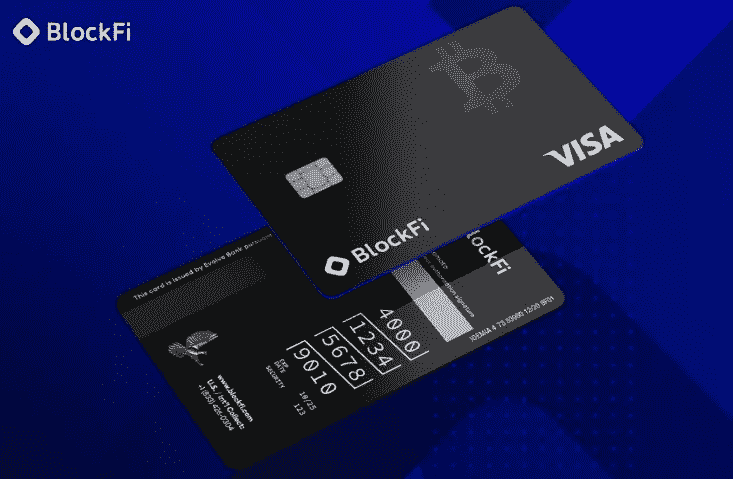
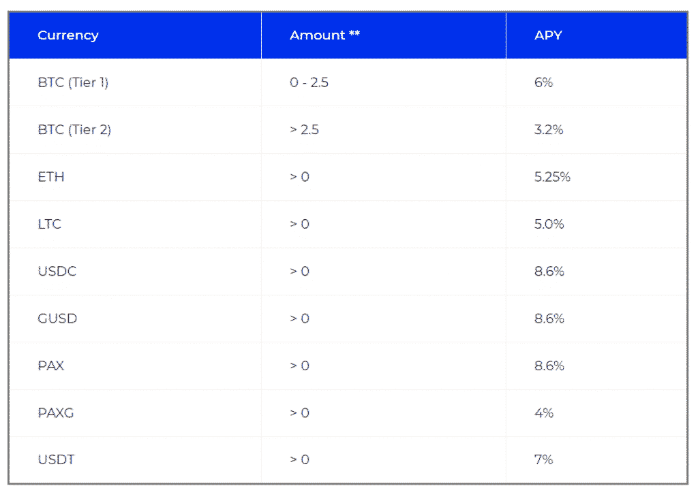
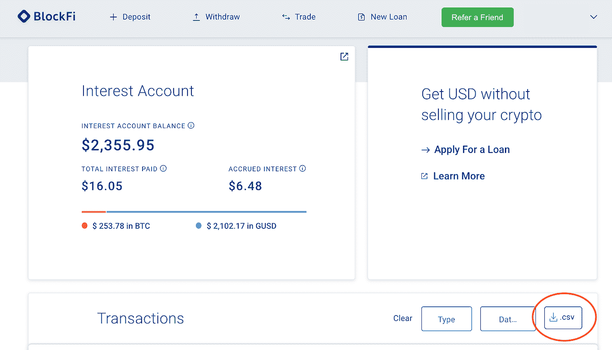
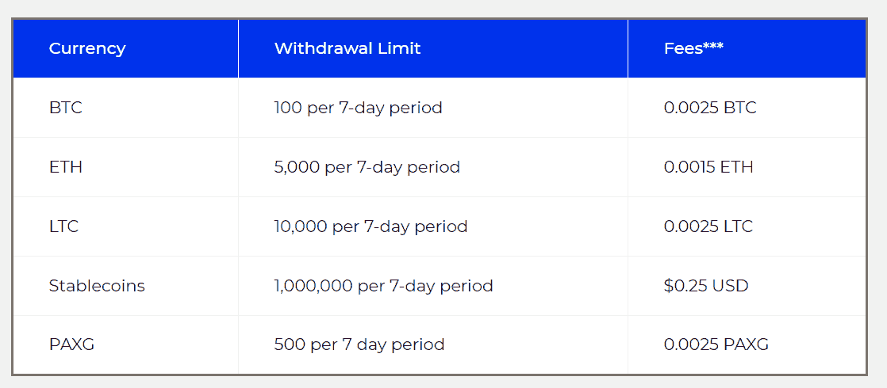
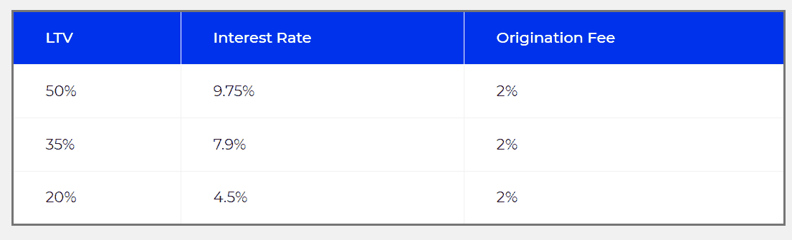

# BlockFi 评论-赚取 8.6%的加密利率

> 原文：<https://medium.com/coinmonks/blockfi-review-53096053c097?source=collection_archive---------0----------------------->

Block Fi review

## 让你的密码发挥作用，获得比特币和其他加密货币的最佳利率

今天，我们写了一篇全面的 BlockFi 评论，这是一家成立于 2017 年的[加密借贷](/coinmonks/top-5-crypto-lending-platforms-in-2020-that-you-need-to-know-a1b675cec3fa)平台，总部位于纽约。使用 [**BlockFi**](https://blockfi.mxuy67.net/c/2458937/907782/10568) ，通过出借加密货币，可以获得高达 8.6%的年回报率(APY)。BlockFi 在全球几乎所有国家都可以使用。

BlockFi 在美国联邦和州的指导方针下运行。BlockFi 的投资者包括一些密码行业的大腕，如[银河数码](https://www.galaxydigital.io/)、[梵拉风险投资](https://valar.com/)、[阿库那资本](https://akunacapital.com/)。

> BlockFi 首次推出**加密奖励信用卡。**使用 [BlockFi 加密信用卡](/coinmonks/blockfi-credit-card-review-35b0a680f320)在日常购物中获得 1.5%的比特币奖励。
> 
> [现在加入等候名单](http://blockfi.mxuy67.net/qn2xay)。

Block Fi Card

## 什么是 BlockFi？

[**BlockFi**](https://blockfi.mxuy67.net/c/2458937/907782/10568) 是一项加密贷款服务，通过 BlockFi 储蓄账户为您的比特币和其他加密资产(包括 Stablecoins)提供[利息。换句话说，BlockFi 是一种加密银行。](https://coincodecap.com/cryptocurrency-savings-accounts)

## **如何创建** BlockFi **利息账户？**

我们来了解一下 Blockfi 是如何工作的？

您可以通过访问 [**BlockFi 网站**](https://blockfi.mxuy67.net/c/2458937/907782/10568) 或拨打客服电话 888–978–6139 创建 BlockFi 利息账户。你应该至少十八岁。

你必须通过一个 BlockFi KYC 流程，你需要上传一张清晰的证件照片进行身份验证。如果所有的细节是正确的，你的帐户在几分钟内被批准。如果您的帐户在 48 小时内没有被批准，您可以通过[onboarding@blockfi.com](mailto:onboarding@blockfi.com)给他们写信。

对于企业账户，您必须提交企业经理和股东的身份信息。

BlockFi 还提供促销活动来吸引客户，目前提供高达 250 美元的注册奖金，以及 25 美元或更高的 crypto 存款。

首先，你需要登录你的 blockfi 账户。然后，您需要完成[了解您的客户(KYC)](https://en.wikipedia.org/wiki/Know_your_customer) 。它有助于组织防止洗钱活动和其他类似行为。

> BlockFi 推广——使用[此链接](https://blockfi.mxuy67.net/c/2458937/907782/10568),在 crypto 中存入 25 美元或更高金额，即可获得 250 美元的注册奖励。

# **利率**

**BlockFi** 利息账户在每月第一个营业日提供存款复利。赚取利息不需要最低余额。

BlockFi rates and Blockfi Interest Calculator

如果你没有上述任何硬币，你可以电汇美元到你的 BlockFi 利息账户(BIA)。你的法币将被转换成你选择的上述任何一种硬币。这些利率可能会改变，记住其他因素，但你会得到事先的信息。此外，与其他每周改变利率的平台相比，它们两三个月改变一次。因此，BlockFi 提供了一致的收益。

[**BlockFi**](https://blockfi.mxuy67.net/c/2458937/907782/10568) 提供支付灵活性。如果您将资金存入特定的加密货币，您可以从您选择的加密货币中赚取利息。例如，如果你存了 BTC。您可以在 BTC、ETH、LTC、GUSD、PAX、PAXG、USDC 或 USDT 赢取积分。

您必须在该月最后一个工作日之前至少两个工作日调整此信息。如果你没有这样做，你将获得你存入的加密货币类型的利息。

[**BlockFi**](https://blockfi.mxuy67.net/c/2458937/907782/10568) 还提供月结单，说明你持有的资金，你已经赚到的利息，以及预计下个月可以赚到的利息。BlockFi 会把月结单电邮给你，你也可以从平台下载 PDF 格式的。

您也可以在您的帐户部分下载 CSV 文件格式的交易历史记录。此外，您还可以过滤特定日期范围内的交易并相应地下载。

BlockFi reviews: Download your transactions history

[**BlockFi**](https://blockfi.mxuy67.net/c/2458937/907782/10568) 通过将其资金借给受信任的企业和机构借款人，并购买 ETF 和其他证券来产生利息。然而，在借钱给任何人之前，它会进行彻底的信用分析。

# **区块链取款手续费**

您每个月可以免费提取一次加密币和稳定币，并且您可以随时提取。每个月的每笔免费取款都适用于一种加密货币。在您发出请求后，您的加密货币将首先被转移到[**block fi Trading LLC**](https://blockfi.mxuy67.net/c/2458937/907782/10568)然后被转移到所需的地址。如果您想额外取款，将按以下方式收费。

BlockFi fees & BlockFi trading fees

BlockFi 账户受 Gemini 的最低提款金额限制，最低提款金额为 0.003 BTC 和 0.056 ETH。如果您的提款金额小于这个数目，可能需要 30 天才能完成这个过程。如果您使用电汇，您将有 5000 美元的限额。

# **小额信贷**

贷款金额取决于你的贷款抵押存款。此外，20%的 LTV 仅适用于 BTC 支持的高达 2 万美元的贷款。

BlockFi Loan to value

## **销户**

你可以随时关闭你的账户。如果你的钱包里有加密货币，你可以把它连同利息一起转移到另一个账户。如果您在开户后的六十天内没有存入任何金额，账户将自动关闭。

# **区块链保险和安全**

[**BlockFi**](https://blockfi.mxuy67.net/c/2458937/907782/10568) 使用[双子星](https://gemini.sjv.io/gbP2q2)作为其主要托管人，以保护其受[纽约金融服务局](https://digitalguardian.com/blog/what-nydfs-cybersecurity-regulation-new-cybersecurity-compliance-requirement-financial)监管的资金。它已经接受了德勤的 SOC2 Type 1 合规性审计。双子座将 95%的资金存放在冷钱包里，即离线和安全的钱包，其余 5%存放在热钱包里，由怡安保险。 [**BlockFi**](http://blog.coincodecap.com/go/blockfi) 还声明其客户资金先于员工资金或股权出现亏损。

以防你的账户被泄露，它将被冻结一周。BlockFi 将与您进行视频通话，并验证您的身份。验证您的帐户后，您可以更改您的电子邮件地址和密码，并重新控制您的帐户。

[**BlockFi**](https://blockfi.mxuy67.net/c/2458937/907782/10568) 使用[双因素认证(2 FA)](https://en.wikipedia.org/wiki/Multi-factor_authentication) 来保护您的帐户。一旦你输入密码，你必须从谷歌认证应用程序输入一个验证码。要启用双因素身份验证，您必须在配置文件设置下单击安全。

BlockFi 还提供了一个钱包地址簿，允许您保存经常使用的加密地址。它们还提供 Allowlisting，这又增加了一层安全性。Allowlisting 允许您的 BlockFi 帐户中的加密货币只能转移到已知取款地址的列表中。您可以在这里配置您的允许列表设置[。此外，还可以标注取款地址。如果您的存款单是空的，您就不能取款。要取款，你必须在你的钱包里添加有效地址。你的地址需要七天才能获得批准；因此你可以考虑提前做这件事。您只能通过 web 平台进行允许列表更改。BlockFi 移动应用程序提供只读信息。](https://app.blockfi.com/settings/crypto-addresses)

您也可以启用 PII 验证。它们受到各种因素的影响，如金额、交易速度和地理位置。它有一个全天候监控的自动化风险管理系统。

# **区块链引荐激励**

如果你将 [**BlockFi**](https://blockfi.mxuy67.net/c/2458937/907782/10568) 推荐给你的任何一个关系人，他们会将 100 美元或更多存入他们的 BlockFi 利息账户(BIA)，你和你的关系人都可以在 BTC 获得 10 美元。这 100 美元应存入账户，直到下一个利息支付日才能获得收益。

要参考，你必须遵循以下三个步骤-

1.  登录您的 BlockFi 帐户。转到您的仪表板。
2.  点击右上角的“推荐朋友”。
3.  现在你将你的连接分享网址。

在您完成五次推荐后，您将获得 20 美元 BTC，而您的连接将继续获得 10 美元 BTC。

# **BlockFi 附属合作伙伴计划**

您可以通过加入 [BlockFi 附属合作伙伴计划](https://blockfi.com/become-an-affiliate)获得被动收入。你必须向你的观众介绍 BlockFi 金融工具。我们将为您提供培训，并联系专门的合作伙伴经理为您提供指导。

您将有 30 天的 cookie 窗口。所有营销和促销资源都可以在仪表板中找到，您还可以在仪表板中跟踪您的绩效和收入。

你将从你的网络投资于 [BlockFi](https://blockfi.mxuy67.net/c/2458937/907782/10568) 的所有存款中赚取 0 . 5%的佣金，每推荐一个人最高可获得 1000 美元的佣金。您将通过 PayPal 或直接在您的银行账户中获得电子付款。推荐人数没有限制。

您可以通过多种方式在 BlockFi 中进行营销，例如-

1.  在你的文章中链接 [BlockFi](https://blockfi.mxuy67.net/c/2458937/907782/10568)
2.  你网站上的广告
3.  社交媒体帖子
4.  创建新内容

# **区块链机构服务**

[**BlockFi**](https://blockfi.mxuy67.net/c/2458937/907782/10568) 提供稳定币、加密货币、美元等可定制借贷等机构服务。它根据客户的业务战略定制贷款产品。BlockFi 支持快速入职、快速交易执行和企业级报告。他们通过成为你的战略伙伴来帮助你发展洞察力。要了解更多详情，您可以通过填写此[表格](https://blockfi.com/institutions/)与他们联系。

# **BlockFi 客户支持**

您可以拨打 [+1 646 779 9688](https://blockfi.com/contact/#) 联系 BlockFi 支持。你也可以在 support@blockfi.com 给他们写信。

BlockFi 还运营着一个 youtube 频道，他们在那里采访 BlockFi 的工作人员，并提供更多关于该平台的信息。他们也活跃在推特上。

# BlockFi 评论:利弊

我们来总结一下 BlockFi 的利弊。

## **优点**

1.  机构优质金融服务。
2.  你每月赚取利息和复利。
3.  他们提供反应迅速的客户支持。
4.  不需要实用程序令牌。
5.  他们提供稳定的收入。
6.  基金由[怡安](https://www.aon.com/home/index.html)保险，由[双子星](http://blog.coincodecap.com/go/Gemini)监管。
7.  块状 APY——8.6%

## **缺点**

1.  与其他平台相比，BlockFi 的加密资产选项有限。
2.  KYC 是强制性的。
3.  较低价值的提款需要很多时间。

# BlockFi 评论:结论

[**BlockFi**](https://blockfi.mxuy67.net/c/2458937/907782/10568) App 在 Android 和 iOS 上也有，界面直观。它们提供了一个用户友好的界面，可以通过生物识别登录功能快速安全地访问。

我们可以得出结论，BlockFi 是一个值得信赖的平台，因为它得到了加密领域知名人士的支持，并得到了 Aon 的保险。它由纽约金融服务局监管，并使用各种技术来保护平台。BlockFi 拥有有竞争力的利率、用户友好的平台和广泛的客户支持。

你还在等什么？立即使用 Blockfi 获得比特币贷款。

# 常见问题(FAQ)

**BlockFi 怎么赚钱？**

BlockFi 通过将其资金借给受信任的公司和机构借款人以及购买 ETF 和其他证券来产生利息。

**BlockFi 安全吗？BlockFi 有保险吗？blockfi 有多安全？**

数字货币不是法定货币，不受任何政府支持，BlockFi 利息账户不是银行账户，也不是经纪账户，不受 FDIC、SIPC 或其他类似保护的约束。利率、取款限额和费用可能会发生变化，并且在很大程度上取决于市场状况。这不是一个无风险的产品，本金损失是可能的。

BlockFi 合法吗？

BlockFi 在美国联邦和各州的指导方针下运营，并由纽约金融服务局(NYDFS)监管。

**有 Blockfi 股票吗？**

BlockFi 不是上市公司，在那里你买不到 BlockFi 的股票。

**block fi FDIC 有保险吗？**

不，BlockFi 不是美联储成员银行，不托管任何美元或数字资产。

**block fi 总部在哪里？**

BlockFi 纽约是其主要的总部办公室。

**谁拥有 blockfi？**

BlockFi 是一家由 Flori Marquez 和 Zac Prince 创建的私人公司，它已经从各种[投资者](https://www.crunchbase.com/organization/blockfi-inc)那里筹集了资金。

**如何在 BlockFi 找工作？**

查看 [BlockFi 职业](https://boards.greenhouse.io/blockfi)页面，查看空缺职位。

**什么是 GUSD？**

双子星币( **GUSD)** ，是由美国最大的加密货币交易所之一双子星发行的稳定货币。

> 加入 Coinmonks [电报频道](https://t.me/coincodecap)和 [Youtube 频道](https://www.youtube.com/c/coinmonks/videos)了解加密交易和投资

## 另外，阅读

*   [有哪些交易信号？](https://coincodecap.com/trading-signal) | [Bitstamp vs 比特币基地](https://coincodecap.com/bitstamp-coinbase) | [买索拉纳](https://coincodecap.com/buy-solana)
*   [ProfitFarmers 回顾](https://coincodecap.com/profitfarmers-review) | [如何使用 Cornix Trading Bot](https://coincodecap.com/cornix-trading-bot)
*   [十大最佳加密货币博客](https://coincodecap.com/best-cryptocurrency-blogs) | [YouHodler 评论](https://coincodecap.com/youhodler-review)
*   [my constant Review](https://coincodecap.com/myconstant-review)|[8 款最佳摇摆交易机器人](https://coincodecap.com/best-swing-trading-bots)
*   [MXC 交易所评论](/coinmonks/mxc-exchange-review-3af0ec1cba8c) | [Pionex vs 币安](https://coincodecap.com/pionex-vs-binance) | [Pionex 套利机器人](https://coincodecap.com/pionex-arbitrage-bot)
*   [我的加密副本交易经历](/coinmonks/my-experience-with-crypto-copy-trading-d6feb2ce3ac5) | [比特币基地评论](/coinmonks/coinbase-review-6ef4e0f56064)
*   [CoinFLEX 评论](https://coincodecap.com/coinflex-review) | [AEX 交易所评论](https://coincodecap.com/aex-exchange-review) | [UPbit 评论](https://coincodecap.com/upbit-review)
*   [AscendEx 保证金交易](https://coincodecap.com/ascendex-margin-trading) | [Bitfinex 赌注](https://coincodecap.com/bitfinex-staking) | [bitFlyer 审核](https://coincodecap.com/bitflyer-review)
*   [麻雀交换评论](https://coincodecap.com/sparrow-exchange-review) | [纳什交换评论](https://coincodecap.com/nash-exchange-review)
*   [支持卡审核](https://coincodecap.com/uphold-card-review) | [信任钱包 vs MetaMask](https://coincodecap.com/trust-wallet-vs-metamask)