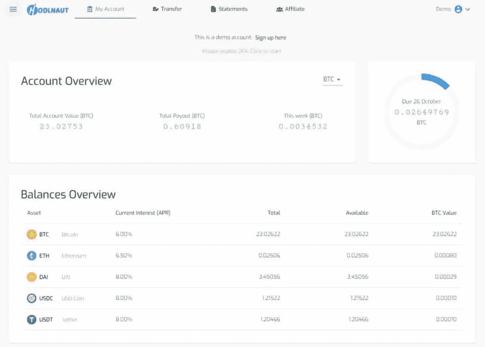

# BlockFi vs Celsius vs Hodlnaut

> 原文：<https://medium.com/coinmonks/blockfi-vs-celsius-vs-hodlnaut-8a1cc8c26630?source=collection_archive---------0----------------------->

本文回顾了三个集中金融(CeFi)加密借贷平台: [BlockFi](https://blockfi.mxuy67.net/c/2458937/907782/10568) vs [摄氏度](https://celsiusnetwork.app.link/175494d45b) vs [霍德瑙特](https://www.hodlnaut.com/hnap54)。

BlockFi vs Celsius vs Hodlnaut

# [BlockFi](https://blockfi.mxuy67.net/c/2458937/907782/10568)

BlockFi 是[加密贷款领域](https://coincodecap.com/crypto-lending)的主要参与者，并在最近的[5000 万美元投资回合](https://www.coindesk.com/blockfi-50m-series-c)中得到巩固。这是一种金融管理平台，提供市场领先的金融工具，帮助加密投资者[赚取加密利息](https://coincodecap.com/crypto-lending)并通过加密支持贷款获得美元资金。

BlockFi 成立于 2017 年，旨在成为加密市场上最负盛名的金融服务提供商之一。该公司通过其利息账户提供市场领先的利率和机构利益，该账户支持多种加密货币，如 BTC、瑞士联邦储蓄银行、长期资本、USDC、GUSD 和 PAX。

## 特征

BlockFi 在其平台上提供三种产品: [BlockFi 利息账户](https://blockfi.mxuy67.net/c/2458937/907782/10568)、交易账户和[加密支持贷款](https://coincodecap.com/cryptocurrency-savings-accounts)。通过 BlockFi 利息账户，用户在存入加密货币时可以获得高达 8.3%的收益。利息在每个月初支付，由于它是复利，年收益率增加。BlockFi 通过以抵押条款将利息账户中的资产借给公司借款人来产生利息。

交易账户允许用户在各种加密货币之间进行交易，并在交易进行时赚取利息。例如，用户可以在月初存入 1 BTC，并在月中将其转换为 ETH，那么获得的总利息一半来自 BTC，一半来自交易的加密(ETH)。

BlockFi 的另一个特点是加密贷款。用户不必出售他们的密码来获得贷款；相反，他们可以用加密资产作为抵押来借款。这样，他们可以在继续持有的同时获得贷款。此外，利息支付灵活功能允许用户选择利息支付货币并使其投资组合多样化，而无需购买新的加密资产。

## 大宗利率

[BlockFi](https://blockfi.mxuy67.net/c/2458937/907782/10568) 用户将资产存入 BlockFi 利息账户，即可获得利息。每月初支付复利，从而增加我们客户的年收益。

BlockFi interest Rates

## 账户提款

用户可以随时提取资金。他们还有权获得 1 次免费的加密提款和 1 次免费的[稳定币](https://coincodecap.com/stablecoins-a-simple-overview)提款。任何更多的将被收取费用如下:

BlockFi vs Celsius vs Hodlnaut: BlockFi Account Withdraw

## BlockFi 的加密贷款利率

[BlockFi](https://blockfi.mxuy67.net/c/2458937/907782/10568) 允许用户以[加密资产作为抵押](https://coincodecap.com/blockfi-vs-coinloan-vs-nexo)并以贷款价值比(LTC)作为担保来借入美元。

BlockFi Crypto-Backed Loan Rates

## 费用表

BlockFi 旨在保持较低的费用，并根据市场情况进行调整。

BlockFi vs Celsius vs Hodlnaut: BlockFi Fees Schedule

如前所述，所有 BlockFi 利息账户用户每个日历月有权获得 1 次免费加密和 1 次免费 stablecoin 提款。

## 安全和风险

和任何金融机构一样，用户问“BlockFi 安全吗？”根据我的观察和研究，在 [BlockFi](https://blockfi.mxuy67.net/c/2458937/907782/10568) 存款并赚取加密利息是相对安全的。这些资产存放在 Gemini，它是主要的保管人，95%的资产存放在冷库中，其余的存放在有保险的热钱包中。

为了让用户对加密感兴趣，BlockFi 将资产借给机构交易对手。他们被仔细审查，以确保违约风险尽可能低。由于数字货币不是法定货币，它们没有政府支持，也不是没有风险。

[BlockFi](https://blockfi.mxuy67.net/c/2458937/907782/10568) 平台过去曾遭遇数据泄露。[5 月早些时候](https://blockfi.com/wp-content/uploads/2020/05/Incident-Report-05-14-20.pdf)，一名 BlockFi 员工的电话号码被未经授权的第三方攻破并使用。犯罪者获取了个人信息，如姓名、电子邮件地址、出生日期、地址和活动历史记录。此外，黑客试图进行未经授权的取款，但没有成功。

## 易用性

该网站最近经历了一个重新设计的过程，给了这个平台一个新鲜和时尚的外观。总的来说，这个平台非常容易使用，效率也很高。没有那么多复杂的特性，所以你可以很快在平台上找到自己的路。这里要注意的主要一点是，你既可以存款，也可以申请贷款。您还可以在平台内转换您的资产，例如，将 BTC 换成瑞士联邦理工学院。

尽管您可以随时退出，但该过程可能需要 3 天才能完成。如果需要的话，他们可能还会要求进行另一次验证，尤其是在您提取大量加密资产的情况下。

另一件令人沮丧的事情是 [**BlockFi**](https://blockfi.mxuy67.net/c/2458937/907782/10568) 显示了 BTC 的美元金额。此外，它们在显示外币方面没有太大的灵活性，这可能会给国际用户带来困难。

您可能还会对以下内容感兴趣:

*   [顶级加密贷款平台](/coinmonks/top-5-crypto-lending-platforms-in-2020-that-you-need-to-know-a1b675cec3fa)
*   [霍德瑙特评论](/coinmonks/hodlnaut-review-best-way-to-hodl-is-to-earn-interest-on-your-bitcoin-6658a8c19edf)
*   [优霍德勒评论](https://coincodecap.com/youhodler-review)

# [摄氏度](https://celsiusnetwork.app.link/175494d45b)

根据你的条件加密。这是 [Celsius Network](https://celsiusnetwork.app.link/175494d45b) 一直向其用户介绍的口号。作为加密领域利息账户和贷款的领先提供商之一，Celsius 凭借其动态功能和利率为其他加密贷款平台设立了高标准。

使用 Celsius 进行存款时，一个独特且值得进一步研究的地方是它的本机加密(称为 CEL token)的用法。它为利息账户和贷款提供了更具竞争力的利率。

> 使用推荐代码 **175494d45b** 获得激动人心的奖励

## 特征

Celsius 平台上有一系列产品。除了加密利息账户，Celsius 还提供黄金利息账户、购买加密、加密贷款、CelPay(它自己的加密钱包)、CEL Token 和商品。

摄氏是初学者友好的，它专注于使借贷密码尽可能容易。就可用资产而言，Celsius 在平台上提供 25 种不同的加密货币，超过了 [BlockFi](https://blockfi.mxuy67.net/c/2458937/907782/10568) 。Celsius 的头条特性显然是它自己的 CEL 标记。有了它，用户可以获得更便宜的贷款和更有吸引力的利息账户。此外，CEL 持有人还可以分享公司的利润。

## 摄氏价格和费用

Celsius 不收取任何服务费用，包括取款、存款、交易、提前终止或发起费用。Celsius 拥有市场上最高的利率，尤其是其稳定的 11.55% APY(实物)。

## 摄氏网络利率

BlockFi vs Celsius vs Hodlnaut: Celsius Network Interest Rates

## 安全性和风险

[Fireblocks](https://www.fireblocks.com/) 和 [PrimeTrust](https://www.primetrust.com/) 是 Celsius 的托管人，它们都为存储的资产提供保险。他们在加密资产安全方面受到高度信任。与 BlockFi 不同， [Celsius](https://blog.coincodecap.com/go/celsiusnetwork) 也没有严重的数据泄露或安全事故。但是，重要的是要知道，当 Celsius 将资产借给第三方时，上述资产并没有保险。

Celsius 声称会负责任地从他们的资产池中放贷。资产贷款的抵押高达 150%,借款人接受审查。在破产或特殊情况下，阻止 Celsius 维持资产，公司将使用其资产负债表来弥补损失。

## 易用性

Celsius 的注册过程既快又简单。用户需要提供基本信息来创建帐户。为了使用其他功能，如开立利息账户或申请贷款，用户需要通过一个完整的 KYC(了解你的客户)验证过程。

BlockFi vs Celsius vs Hodlnaut

虽然他们的网站有一个清新多彩的外观，但 Celsius 主要通过他们的移动应用程序提供移动优先的体验，没有像 [BlockFi](https://blockfi.mxuy67.net/c/2458937/907782/10568) 这样的网络浏览器登录选项。

这些移动应用程序提供了一系列功能，包括购买密码、获得奖励和贷款等。取款快捷方便，超过 50，000 美元的取款会有进一步验证的延迟。

# [霍德瑙特](https://www.hodlnaut.com/hnap54)

来自新加坡的 Hodlnaut 是一个来自香港的[加密借贷平台](https://coincodecap.com/crypto-lending-hong-kong)，为个人投资者和加密爱好者提供金融服务。由两位比特币狂热分子祝俊涛和西蒙·李创立的 Hodlnaut 旨在帮助用户轻松地充分利用他们的加密资产。该公司提供支持加密资产的利息账户，如、ETH、戴、&、。此外，Hodlnaut 还提供条款灵活、可根据客户需求定制的企业贷款。

[Hodlnaut](https://www.hodlnaut.com/hnap54) 于 2019 年 4 月推出，目前拥有超过 650 名用户和近 800 BTC 的资产。该公司是安特尔投资组合公司的一部分，该公司是一家支持早期创业公司的全球风险投资公司。霍德瑙特为霍德勒公司提供了市场上最高的价格，以发展和多样化他们的加密产品组合。让我们来看看特性和其他变量。

## 特征

Hodlnaut 有两大特色:利息账户和公司贷款。Hodlnaut Interest Account 拥有 5 个主要资产类别，为用户提供了以市场上最高利率增长投资组合的机会。以高达 8.3%的有效年收益率支持、ETH、戴、、。

利息账户没有最低存款或锁定期。在 Hodlnaut 注册一个账户需要几分钟。一旦用户通过了强制性的 KYC(了解你的客户)验证过程，他们可以立即开始赚取利息。Hodlnaut 会在每周一把应计利息打入用户账户。此外，Hodlnaut 还为每一个成功的推荐提供 10%的佣金。

除了利息账户，Hodlnaut 还提供企业贷款。通过加密贷款，客户可以使用他们的加密资产作为抵押获得信贷额度。Hodlnaut 的贷款起价为 50，000 美元，贷款价值比灵活，为 25%-100%，可以根据客户的业务需求量身定制贷款。

## 霍德瑙特利率

与 BlockFi 类似， [Hodlnaut](https://www.hodlnaut.com/hnap54) 能够以加密贷款的形式将资产借给经过严格审查的保证金交易者，从而向用户提供有吸引力的利率。以下是利息账户的支持资产列表。

Hodlnaut Interest Rates

**这些是 Hodlnaut 的有效年利率，考虑了复利效应*

## 账户提款

[霍德瑙特](https://www.hodlnaut.com/hnap54)的取款费根据区块链的情况定期审查和调整。目前，提取费用保持在最低水平，具体如下:

Hodlnaut Account Withdrawals

## 公司贷款

Hodlnaut 的企业贷款是根据客户的需求量身定制的，具有高度的可定制性。因为根据贷款人的不同，它们的结构更加复杂，所以条款和条件可能会有所不同。一般来说，贷款从 50，000 美元开始，客户可以选择定期贷款或 3 个月以上的定期贷款。此外，贷款价值比灵活，范围从 25%-100%，没有隐藏的费用。

## 安全和风险

作为中央金融(CeFi)加密贷款平台，Hodlnaut 要求其用户通过 KYC(了解你的客户)验证流程。由[新加坡金融科技协会](https://singaporefintech.org/)认证的金融科技公司(新加坡金融管理局的认可证书)，该公司符合数字支付令牌许可证的所有要求，已提交文件，目前正在审核新加坡标准支付机构许可证。

[Hodlnaut](https://www.hodlnaut.com/hnap54) 平台运行在安全的 AWS(亚马逊网络服务)云基础设施上，所有流量均采用 SSL 加密。此外，Hodlnaut 使用行业标准的密码哈希算法和程序，同时鼓励用户为帐户交易启用双因素身份验证(2FA)。采取安全第一的方法，在霍德瑙特没有热钱包。

至于风险，Hodlnaut 采取了一些措施来防止资金损失。通过对交易对手实施严格的资本要求，Hodlnaut 还通过只向授权借入低于其净资产价值 1 倍的资金放贷，将违约风险降至最低。该公司表示，在发生违约的最坏情况下，他们将承担损失，并从他们的股票基金中支付用户。

考虑到以上所有的事情，我的结论是用 [Hodlnaut](https://www.hodlnaut.com/hnap54) 来做 hodl 一般是安全的。当然，用户需要在存款前阅读细则并做出明智的决定。

## 易用性

一眼看去，Hodlnaut 的平台是用户友好和简单明了的。用户可以在仪表板中轻松查看他们的资产余额和交易历史。他们还可以在同一个仪表板中快速存款、取款和查看他们的利息单。

另一件同样方便的事情是，你可以生成并分享你独特的推荐链接。你可以查看你推荐了多少朋友，收到了多少奖金。至于奖励，每成功推荐一个，可以赚 10%的佣金。

BlockFi vs Celsius vs Hodlnaut: Hodlnaut referral

不幸的是， [Hodlnaut](https://www.hodlnaut.com/hnap54) 目前还没有手机应用程序，尽管他们正在努力在未来提供。

# 结论— BlockFi vs Celsius vs Hodlnaut

[BlockFi](https://blockfi.mxuy67.net/c/2458937/907782/10568) 、[摄氏](https://celsiusnetwork.app.link/175494d45b)、和 [Hodlnaut](https://www.hodlnaut.com/hnap54) 提供有竞争力的产品，然而也有差异。BlockFi 在 BTC 有一个等级系统，你存的钱越多，利率就越低。如果你选择用 CEL 币支付，Celsius 会提供更高的利率。至于霍德瑙特，无论金额多少，利率仍保持在 6.2%的 APY。

BlockFi 在过去遭受过数据泄露，尽管应急计划已经到位，而 Celsius 没有记录在案的安全事件。Hodlnaut 目前正在申请新加坡标准支付机构许可证。

所有这些都有直观的平台，对用户友好，并为不同的资产类别提供有吸引力的利率。虽然 BlockFi 在最近的投资回合中成功地进一步扩大了规模，并且 Celsius 不断创新他们的金融服务范围，但 Hodlnaut 也在快速增长，用户在 hodling 期间享受到了有吸引力的利率和他们紧密团结的团队的专门支持。

## 顶级加密借贷平台

*   [BlockFi](https://blockfi.mxuy67.net/c/2458937/907782/10568)
*   [霍德瑙特](https://www.hodlnaut.com/hnap54)
*   [优霍德勒](https://blog.coincodecap.com/go/youhodler)

> 加入 Coinmonks [电报频道](https://t.me/coincodecap)和 [Youtube 频道](https://www.youtube.com/c/coinmonks/videos)了解加密交易和投资

## 另外，阅读

*   [去中心化交易所](https://coincodecap.com/what-are-decentralized-exchanges) | [比特恩斯 FIP](https://coincodecap.com/bitbns-fip) | [Pionex 评论](https://coincodecap.com/pionex-review-exchange-with-crypto-trading-bot)
*   [用信用卡购买密码的 10 个最佳地点](https://coincodecap.com/buy-crypto-with-credit-card)
*   [OKEx 回顾](/coinmonks/okex-review-6b369304110f) | [Kucoin 交易机器人](/coinmonks/kucoin-trading-bot-automate-your-trades-8cf0ca2138e0) | [期货交易机器人](/coinmonks/futures-trading-bots-5a282ccee3f5)
*   [AscendEx Staking](https://coincodecap.com/ascendex-staking)|[Bot Ocean Review](https://coincodecap.com/bot-ocean-review)|[最佳比特币钱包](https://coincodecap.com/bitcoin-wallets-india)
*   [Crypto.com 收费](/coinmonks/binance-fees-8588ec17965) | [僵尸密码审查](/coinmonks/botcrypto-review-2021-build-your-own-trading-bot-coincodecap-6b8332d736c7) | [另类](https://coincodecap.com/crypto-com-alternatives)
*   [免费加密信号](/coinmonks/free-crypto-signals-48b25e61a8da) | [加密交易机器人](/coinmonks/crypto-trading-bot-c2ffce8acb2a)
*   [非洲最佳加密交易所](https://coincodecap.com/crypto-exchange-africa) | [胡交易所评论](https://coincodecap.com/hoo-exchange-review)
*   [eToro vs robin hood](https://coincodecap.com/etoro-robinhood)|[MoonXBT vs by bit vs Bityard](https://coincodecap.com/bybit-bityard-moonxbt)
*   [Stormgain 回顾](https://coincodecap.com/stormgain-review) | [Bexplus 回顾](https://coincodecap.com/bexplus-review) | [币安 vs Bittrex](https://coincodecap.com/binance-vs-bittrex)
*   [Bookmap 点评](https://coincodecap.com/bookmap-review-2021-best-trading-software) | [美国 5 大最佳加密交易所](https://coincodecap.com/crypto-exchange-usa)
*   [如何在 FTX 交易所交易期货](https://coincodecap.com/ftx-futures-trading) | [OKEx vs 币安](https://coincodecap.com/okex-vs-binance)
*   [如何在势不可挡的域名上购买域名？](https://coincodecap.com/buy-domain-on-unstoppable-domains)
*   [印度的加密税](https://coincodecap.com/crypto-tax-india) | [altFINS 审查](https://coincodecap.com/altfins-review) | [Prokey 审查](/coinmonks/prokey-review-26611173c13c)
*   [布洛克菲 vs 比特币基地](https://coincodecap.com/blockfi-vs-coinbase) | [比特坎评论](https://coincodecap.com/bitkan-review) | [币安评论](/coinmonks/binance-review-ee10d3bf3b6e)