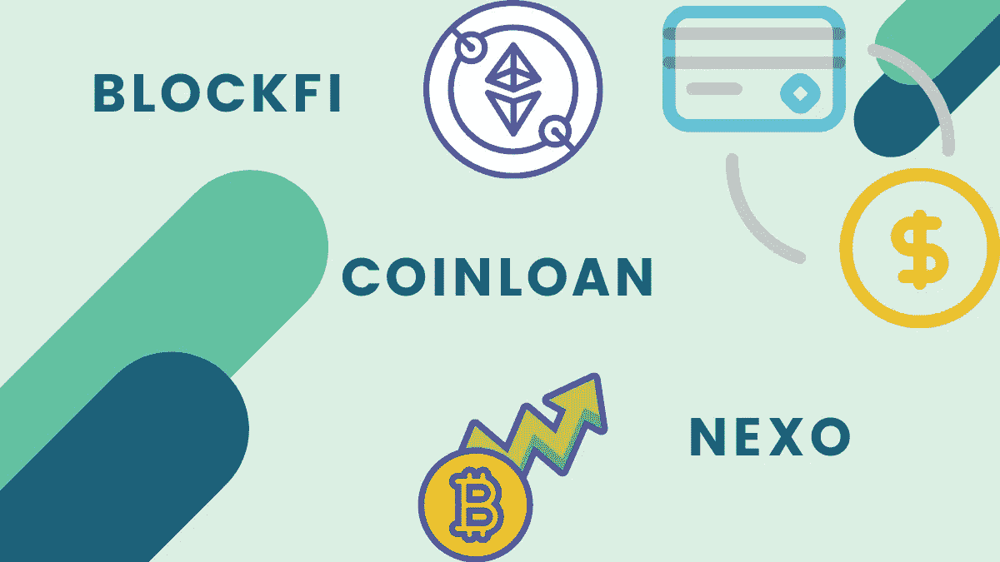
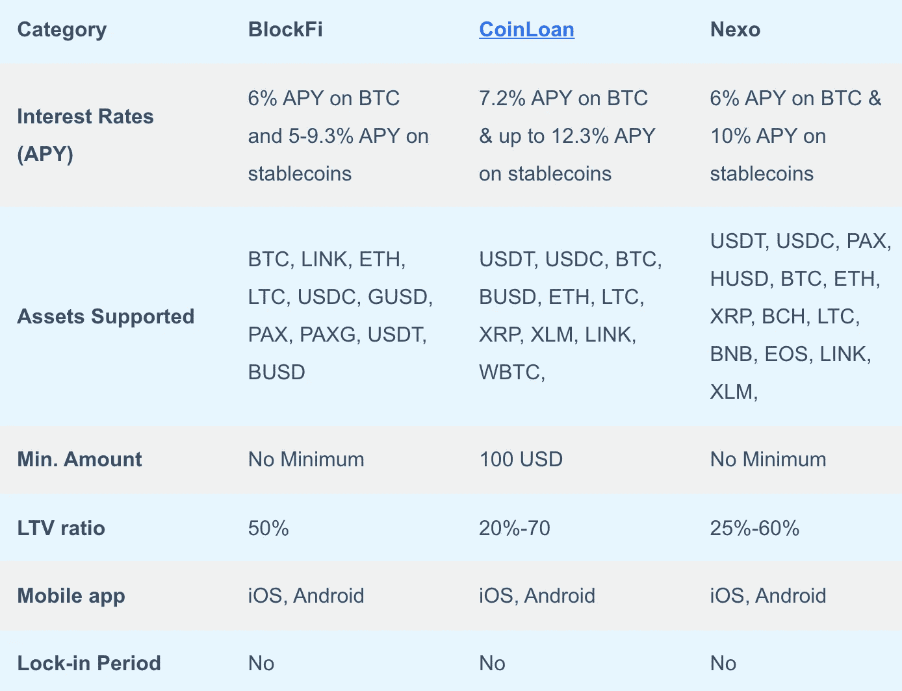
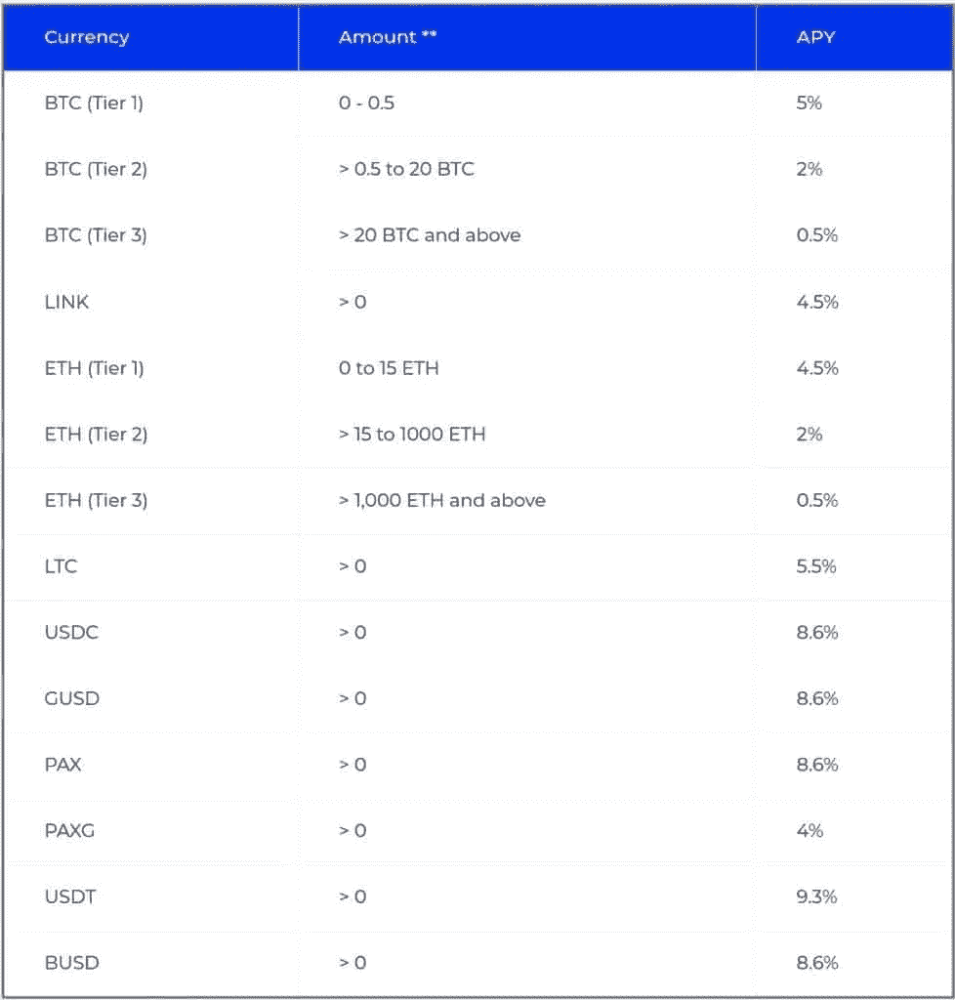
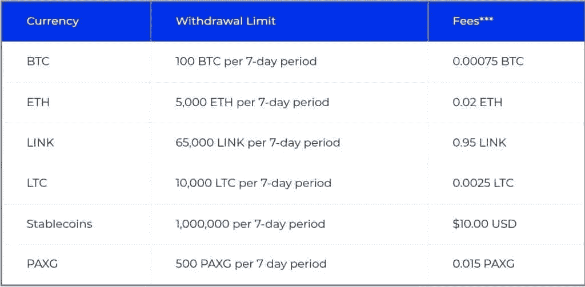
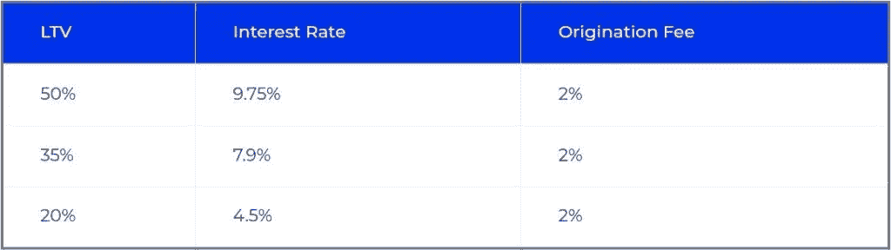
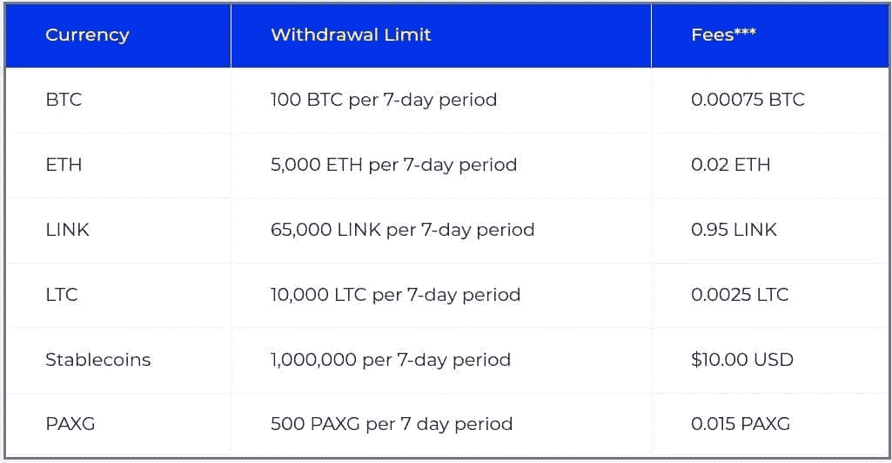
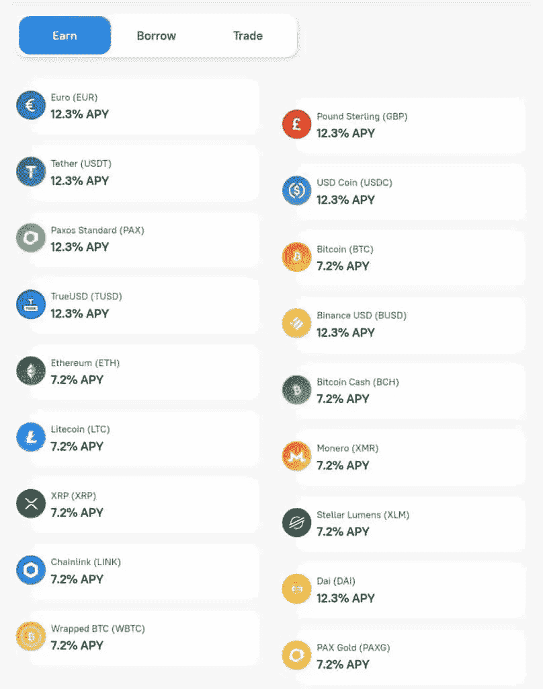
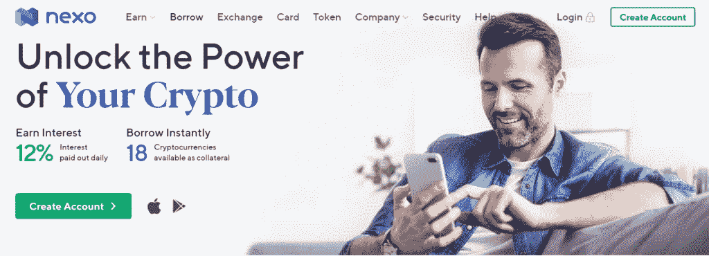

# BlockFi vs CoinLoan vs Nexo —最佳借贷平台？

> 原文：<https://medium.com/coinmonks/blockfi-vs-coinloan-vs-nexo-cb624635230d?source=collection_archive---------2----------------------->

重要的是选择[最适合你需求的](https://blog.coincodecap.com/top-5-crypto-lending-platforms)最佳密码借贷。所以今天我们就来看看异同点，对比一下[**BlockFi**](https://blog.coincodecap.com/go/blockfi)vs[**coin loan**](https://blog.coincodecap.com/go/coinloan)vs[**Nexo**](https://blog.coincodecap.com/go/nexo)，市面上最好的密码借贷平台。

# BlockFi vs CoinLoan vs Nexo:摘要

BlockFi vs [CoinLoan](https://blog.coincodecap.com/go/coinloan) vs Nexo

# 什么是加密贷款？

市面上有很多密码[借贷](https://blog.coincodecap.com/lending)平台提供这项服务。这些平台在固定期限内锁定你的资产，并为锁定的资产支付利息。它们就像是你的加密货币的储蓄账户

# 加密贷款是如何工作的？

你把你的资产借给中央金融(CeFi)平台。它就像是你资产的保管人。然后，上述资产通过抵押贷款借给经过审查的机构借款人或不同的第三方。作为交换，你将获得存款资产的高利率。

现在我们知道了加密贷款平台，因此，让我们逐一比较。

# BlockFi

## 什么是 BlockFi？

[**BlockFi**](https://blog.coincodecap.com/go/blockfi)**是著名的密码借贷平台，提供市场上最好的金融工具。因此，加密投资者可以从他们的加密中获得利息，并通过加密支持贷款获得美元资金。**

**BlockFi 成立于 2017 年。它打算成为领先的金融服务提供商。BlockFi 的利息账户提供最高利率和机构收益。其利息账户支持加密货币，如 BTC、瑞士法郎、长期货币、USDC、GUSD 和 PAX。**

**要了解更多信息，你可以阅读我们的 [BlockFi 评论](https://blog.coincodecap.com/blockfi-review)文章。你也可以获得 [BlockFi 信用卡](https://blog.coincodecap.com/go/blockfi-credit-card)，要了解更多信息，请访问我们的 [BlockFi 信用卡评论](https://blog.coincodecap.com/blockfi-credit-card)。**

## **BlockFi 产品**

*   ****BlockFi 利息账户:** BlockFi 利息账户允许用户在存入加密货币的同时获得最高 8.3%的收益。这个平台月初付息。因此，利息不断复利，年收益率增加。BlockFi 的工作方式类似于传统的银行账户。用户可以从他们的加密资产中获得利息，也可以用他们的加密抵押品获得贷款。**
*   ****交易账户:**交易账户使用户能够在众多加密货币之间进行交易，并在交易完成时获得利息。例如，在月初，用户可以存入 1 BTC，并在月中将其转换为 ETH。因此，一半的利息来自 BTC，另一半来自 ETH。**
*   **加密支持贷款: BlockFi 提供加密支持贷款。用户可以用加密资产作为抵押来借款，而不是出售加密。这样，用户可以继续持有，同时获得贷款。此外，利息支付 Flex 允许用户选择利息支付货币，并使他们的投资组合多样化。**

## **大宗利率**

**当用户将资产存入 [**BlockFi**](https://blog.coincodecap.com/go/blockfi) 利息账户，就获得了利息。每月初支付复利。因此，这增加了用户的年收益。以下是各种加密资产的利率列表:**

****

## **BlockFi 取款费**

**[**BlockFi**](https://blog.coincodecap.com/go/blockfi) 让用户在任何给定时间提取资金。这个平台还提供一个免费提取密码和稳定币的机会。所有其他提款的收费如下:**

****

## **加密贷款利率**

**你的抵押金额决定了你可以借多少美元。此外，抵押品的数量也决定了你获得的贷款价值比。**

****

## **区块费**

**[**BlockFi**](https://blog.coincodecap.com/go/blockfi) 收费较低，根据市场情况有所变化。查看下表:**

****

## **BlockFi 安全吗？**

**该平台是安全的存款和赚取加密利息。双子、[比特戈](https://blog.coincodecap.com/go/bitgo)和[比特币基地](https://blog.coincodecap.com/go/coinbase)有相当数量的数字资产可供提取。block fi 95%的资产存放在冷库里，剩下的资产放在有保险的热钱包里。**

**[**BlockFi**](https://blog.coincodecap.com/go/blockfi) 向机构交易对手出借资产，提供加密权益。由于严格的检查和审查，损失的风险很低。然而，数字货币不是无风险的，它们的价值会随着市场的变化而变化。**

**值得注意的是， [BlockFi 过去曾经历过一次数据泄露](https://blockfi-s3-static-prod.s3.amazonaws.com/pdf/Incident+Post+Mortem%2C+May+14%2C+2020.pdf)。尽管如此，这名黑客未能成功进行未经授权的取款。**

## **BlockFi:易于使用**

**BlockFi 最近经历了重新设计的过程，赋予了它新的优雅外观。这个平台简单易用且高效。它没有很多复杂的功能。因此，用户可以在平台上轻松找到自己的路。最重要的是，用户可以存入资金并申请贷款。你也可以在平台上转换你的资产。例如，你可以把 BTC 换成瑞士联邦理工学院。**

**BlockFi 的取款过程可能需要三天时间。如果用户正在提取大量加密资产，BlockFi 还可能要求用户进行另一次验证。**

**BlockFi [iOS](https://apps.apple.com/us/app/blockfi/id1506274532) 和 [Android](https://play.google.com/store/apps/details?id=com.blockfi.mobile&hl=en_IN&gl=US) 应用程序使得在旅途中访问平台变得更加简单。**

## **BlockFi:利弊**

****赞成者****

*   **BlockFi 为加密贷款的期限提供了极大的灵活性。**
*   **它还对用户持有的密码提供高利率。**
*   **这是一个众所周知的平台，其基地在美国。**
*   **比特币和以太都有高息。**

****缺点****

*   **第一次取款后，每次取款都要收费。**
*   **平台上只有少数加密资产可用。**
*   **戒断时间长。**

# **硬币贷款**

## **什么是 CoinLoan？**

**[**CoinLoan**](https://blog.coincodecap.com/go/coinloan) 始于 2016 年。这是一个位于爱沙尼亚的加密贷款平台。该平台表示，它是第一个由加密资产支持的点对点贷款平台。CoinLoan 向投资者和借款者提供金融服务，并让用户借出他们的钱以获得回报。要了解更多，请阅读我们的 [CoinLoan 评论](https://blog.coincodecap.com/coinloan-review)。**

## **CoinLoan 是如何工作的？**

**贷方存放稳定的硬币或纸币，借方存放作为抵押品的加密资产。当贷款人和借款人匹配时，就会创建一个智能合同。这份合同确保借款人及时付款。当贷款得到支付时，贷方将收到本金和利息。**

**CoinLoan 的贷款价值受市场条件变化的影响。值得注意的是，截至目前，该平台的最高 LTV 为 70%。如果 LTV 发生变化，借款人会收到通知。这是整个过程，Coinloan 就像是资金的保管人。**

## **CoinLoan 功能**

**[**Coinloan**](https://blog.coincodecap.com/go/coinloan) 由三个关键特性组成，借、赚、交易。借款是一个简单的过程与 CoinLoan。用户必须抵押他们的硬币来借款，而且他们的借款不能超过抵押品价值的 70%。**

**CoinLoan 提供三种不同的贷款；加密到法定、加密到加密和法定到加密贷款。最低贷款额是 100 美元，用 CoinLoan 借款有 30 天的贷款期。除了借给借款人，投资者还可以通过他们的加密资产 CoinLoan 利息账户获得更多收益。**

**目前，Coinloan 支持 18 种加密和法定资产，利率高达 12.3% APY。请注意，这些价格中包含 2%的 CLT (CoinLoan native token) [赌注](https://blog.coincodecap.com/staking-crypto)奖励。在 CoinLoan 上，用户可以在支持的资产内进行令牌交换。**

## **共同贷款费用**

**法定货币和加密货币存款不收费。此外，菲亚特和加密提款也是免费的。 [**CoinLoan**](https://blog.coincodecap.com/go/coinloan) 为 BTC 提供 7.2% (APY)，为 ETH 提供 7.2% (APY)，为 stablecoins 提供高达 12.3% (APY)。**

**这些利率包括 2%的赌注奖励。每天，利息在每个月的第一天累积并存入用户的利息账户。**

****

## **信用贷款:安全性和风险**

**CoinLoan 将加密资产存储在冷、离线、[多签名钱包](https://blog.coincodecap.com/multi-signature-wallet)中。此外， [**CoinLoan**](https://blog.coincodecap.com/go/coinloan) 利用市场领先的云服务提供商，通过全球严格的安全标准认证，受到各大金融机构的信赖。然而，CoinLoan 没有提到云服务提供商的名称。**

**该网站提到 BitGo 为数字资产支付了 1 亿美元。该保险适用于保险，涵盖客户的资产。**

**最后，CoinLoan 确实有三张爱沙尼亚金融牌照(FVR000111、FRK000091 和 FFA000241)。由于这些许可证，他们可以在全球范围内操作加密、法定和替代支付手段。**

## **CoinLoan:易于使用**

**CoinLoan 有一个相对更简单的注册流程。KYC(了解你的客户)流程是使用 CoinLoan 服务的强制性要求。**

**此外，CoinLoan [iOS](https://apps.apple.com/us/app/coinloan-crypto-asset-wallet/id1506572788) 和 [Android](https://play.google.com/store/apps/details?id=com.app.coinloan) 应用程序使得在旅途中访问平台变得更加简单。**

## **硬币贷款:利弊**

****优点****

*   **UI 设计看起来很简洁，这使得设置和注册过程很简单。**
*   **[CoinLoan](https://blog.coincodecap.com/go/coinloan) 拥有欧洲金融牌照，在爱沙尼亚接受监管。**
*   **这个平台支持不同类型的资产。**
*   **该平台既有固定/加密收入，也有贷款。**

****缺点****

*   **没有关于资产储存、财务报告和贷款总额的信息。**
*   **只有少量关于所有者和股东的信息。**
*   **下注 CLT 对获得更好的利息回报至关重要。**

# **Nexo**

## **Nexo 是什么？**

****Nexo** 于 2017 年推出，是一个优秀的即时[密码贷款](https://blog.coincodecap.com/top-5-crypto-lending-platforms)平台。此外，Nexo 是唯一一家在多达 200 个司法管辖区提供 40 多种法定货币的区块链公司。Nexo 为用户提供即时获取现金的途径，并让用户保留其资产的所有权。**

**用户可以享受流畅的用户体验与 256 位加密的军用级安全性的结合。用户的资金保存在单独分配的多签名钱包中，存放在高盛支持的托管机构 BitGo。**

## **Nexo:产品和功能**

****获得即时现金贷款****

**用户可以通过出借加密资产获得即时现金贷款。用户可以借出少至 10 美元，多至 200 万美元。此外，Nexo 的借款或现金费用为零。此外，它还款灵活，没有信用检查。这使得 **Nexo** 非常容易被一大批密码持有者获取。**

****补交 12%的年息****

**Nexo 上的高息储蓄账户可用于加密货币和法定货币，如欧元、美元和英镑。有一份保护客户资金的保险单。因此，用户可以安心，同时赚取高达 12%的利息。资金可以随时从储蓄钱包中取出或存入。用户不需要等一个月才会感兴趣，因为 **Nexo** 每天都在赠送利息。最后，用户不必坚持存入任何最低金额的加密货币就可以开始赚取利息。**

****Nexo 卡****

**用户可以利用 [Nexo 卡](https://blog.coincodecap.com/nexo-card-review)像传统借记卡一样消费加密资产。全球 4000 多万商家接受 [Nexo 卡](https://blog.coincodecap.com/go/nexo-card)。此外，该卡在支持的供应商处购买某些商品可获得 2%的返现。最重要的是， [Nexo 卡](https://blog.coincodecap.com/go/nexo-card)让用户不用出售数字货币就能消费。**

****Nexo 交易所****

**Nexo 确实有一个交换，让用户可以在 75 个以上的数字资产和菲亚特对之间即时交换。与经纪人类似，Nexo 交易所同时与 5 个以上的交易所连接，以找到最佳价格。**

****

## **Nexo 费用**

**平台在 Nexo 上不收取任何账户维护费。此外，用户可以在任何给定时间自由提取他们的加密货币，而无需支付费用。**

**Nexo 支付用户账户上的所有交易费用。因此，用户只需支付经纪费。同时，他们直接从 exchange 钱包向自己的 Nexo 账户转账。根据经纪人的不同，费用也不同，而且用户没有最低存款限额。**

**Nexo 对用户借款金额收取 5.9%的年利率利息。用户需要存入作为抵押品的加密货币的数量将会不同。因此，这个数额取决于用户用来支持其贷款的硬币或代币。**

## **Nexo 安全吗？**

**Nexo 是每笔存款的保管人。它使用加密货币保管解决方案 [BitGo](https://blog.coincodecap.com/go/bitgo) 存储用户的数字资产。Nexo 的安全基础设施通过了 ISO/IEC 27001:2013 认证。**

**由于公司的责任限制，Nexo 的钱包服务免受篡改、黑客攻击或计算机病毒传播的影响。**

**由于许多加密货币利息账户平台是托管平台，这些责任限制是标准的。此外，这些公司通常与托管解决方案合作，以保护用户的资金。比如加密货币平台[双子星](https://blog.coincodecap.com/go/gemini)就是 BlockFi 的托管人。**

**Nexo 的所有资产都保存在冰冷的钱包里，私人密钥离线保存。Nexo 与 Ledger Vault 和 BitGo 的合作为 Nexo 的存款提供了 3.75 亿美元的保险保护。虽然，不清楚有百分之几投保，存放在冷库里。**

## **Nexo:易于使用**

**在 Nexo 上创建一个账户非常简单，只需要几分钟。用户只需点击几下鼠标，就可以立即查看他们的可用信用、资产，并偿还他们借的任何东西。**

**一旦用户的 Nexo 帐户建立起来，他们就可以放心了，因为 Nexo 每天会自动计算他们的利息，并将利息直接存入用户的帐户。**

**最后，Nexo [iOS](https://apps.apple.com/us/app/nexo-crypto-banking-account/id1455341917) 和 [Android](https://play.google.com/store/apps/details?id=com.nexowallet) 应用程序使得在旅途中访问平台变得更加简单。**

## **Nexo:利弊**

****优点****

*   **Nexo 提供了完全的灵活性。随时都有可能退出，而且没有锁定期。**
*   **用户可以在用 Nexo 代币赚取的同时获得 30%的额外利息。**
*   **Nexo 在 200 多个司法管辖区提供 40 多种货币。**

****缺点****

*   **在少数情况下，贷款利率明显高于借款利率。**
*   **Nexo 的 3.75 亿美元保险是为每个客户集体投保的。它只适用于储存在 cold Ledger Vault 钱包中的资产。**

# **BlockFi vs CoinLoan vs Nexo:结论**

**如果你寻找利息账户的最高利率或贷款账户的最低利率，那么 [**Blockfi**](https://blog.coincodecap.com/go/blockfi) 是你正确的选择。然而，如果你想要一张可以返现或赚取稳定利息的借记卡， **Nexo** 正适合你。此外，Nexo 提供了许多功能，如更快的申请过程和数据验证。**

**[**CoinLoan**](https://blog.coincodecap.com/go/coinloan) 拥有欧洲金融牌照，因此可以被视为一个值得信赖的借贷和生息平台。它确实提供了高度的安全性，并且是一个受监管的平台。这是一个罕见的组合，如果你是为了安全，那么选择 CoinLoan。**

# **CoinLoan vs BlockFi vs Nexo:常见问题**

****block fi 什么时候付息？****

**在 [BlockFi](https://blog.coincodecap.com/go/blockfi) ，你将有资格在月初收到你的利息。**

****我们如何获得 Nexo 加密贷款？****

**从 Nexo 获得加密贷款非常简单。您可以注册该平台，存放您的加密资产，并根据您自己的资产申请加密贷款。**

****block fi 利息是如何计算的？****

**BlockFi 的利息取决于你借出加密资产的天数。 [BlockFi](https://blog.coincodecap.com/go/blockfi) 提供高达 8.3% APY 的利息，要了解更多，可以阅读 BlockFi 评论文章。**

*   **2021 年 CoinLoan 评论|它对你来说合法和安全吗？**
*   **[You hodler vs coin loan vs Hodlnaut 2021【投资前阅读】](https://blog.coincodecap.com/youhodler-coinloan-hodlnaut)**
*   **[您应该考虑的五大 BlockFi 替代方案【2021】](https://blog.coincodecap.com/blockfi-alternatives)**
*   **[Nexo 卡回顾 2021:它是最好的加密卡吗？](https://blog.coincodecap.com/nexo-card-review)**
*   **[BlockFi 评论 2021 |赚取高达 8.6%的加密利息](https://blog.coincodecap.com/blockfi-review)**

*****包括附属链接****

> **加入 [Coinmonks 电报频道](https://t.me/coincodecap)，了解加密交易和投资**

## **另外，阅读**

*   **最好的[密码交易机器人](/coinmonks/crypto-trading-bot-c2ffce8acb2a)**
*   **[尤霍德勒 vs 科恩洛安 vs 霍德诺特](/coinmonks/youhodler-vs-coinloan-vs-hodlnaut-b1050acde55a) | [隐蝠 vs 哈斯博特](https://blog.coincodecap.com/cryptohopper-vs-haasbot)**
*   **[币安 vs 北海巨妖](https://blog.coincodecap.com/binance-vs-kraken) | [美元成本平均交易机器人](https://blog.coincodecap.com/pionex-dca-bot)**
*   **[如何在印度购买比特币？](/coinmonks/buy-bitcoin-in-india-feb50ddfef94) | [WazirX 审核](/coinmonks/wazirx-review-5c811b074f5b) | [BitMEX 审核](https://blog.coincodecap.com/bitmex-review)**
*   **[比特币主根](https://blog.coincodecap.com/bitcoin-taproot) | [Bitso 评论](https://blog.coincodecap.com/bitso-review) | [排名前 6 的比特币信用卡](/coinmonks/bitcoin-credit-card-bc8ab6f377c6)**
*   **[双子座 vs 比特币基地](https://blog.coincodecap.com/gemini-vs-coinbase) | [比特币基地 vs 北海巨妖](https://blog.coincodecap.com/kraken-vs-coinbase) | [硬币罐 vs 硬币点](https://blog.coincodecap.com/coinspot-vs-coinjar)**
*   **[印度比特币交易所](/coinmonks/bitcoin-exchange-in-india-7f1fe79715c9) | [比特币储蓄账户](/coinmonks/bitcoin-savings-account-e65b13f92451) | [Paxful 点评](/coinmonks/paxful-review-4daf2354ab70)**
*   **[杠杆令牌](/coinmonks/leveraged-token-3f5257808b22) | [最佳加密交易所](/coinmonks/crypto-exchange-dd2f9d6f3769)**
*   **[Crypto.com 费用](/coinmonks/binance-fees-8588ec17965) | [僵尸加密审查](/coinmonks/botcrypto-review-2021-build-your-own-trading-bot-coincodecap-6b8332d736c7) | [替代品](https://blog.coincodecap.com/crypto-com-alternatives)**
*   **[MXC 交易所评论](/coinmonks/mxc-exchange-review-3af0ec1cba8c) | [Pionex vs 币安](https://blog.coincodecap.com/pionex-vs-binance) | [Pionex 套利机器人](https://blog.coincodecap.com/pionex-arbitrage-bot)**
*   **[我的密码交易经验](/coinmonks/my-experience-with-crypto-copy-trading-d6feb2ce3ac5) | [比特币基地评论](/coinmonks/coinbase-review-6ef4e0f56064)**
*   **[加密货币储蓄账户](/coinmonks/cryptocurrency-savings-accounts-be3bc0feffbf) | [赌注加密](https://blog.coincodecap.com/staking-crypto) | [CEX。IO 审查](https://blog.coincodecap.com/cex-io-review)**

***原载于 2021 年 6 月 7 日*[*https://blog.coincodecap.com*](https://blog.coincodecap.com/blockfi-vs-coinloan-vs-nexo)T22。**