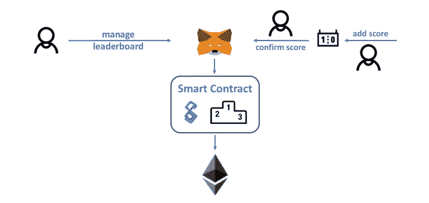
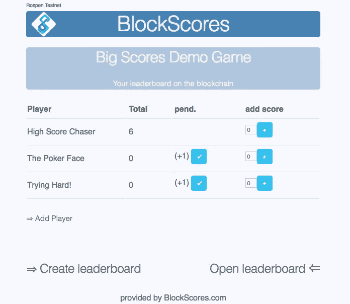

# 智能合同如何为游戏分数提供最佳安全性

> 原文：<https://medium.com/coinmonks/blockscores-45e0c062de5e?source=collection_archive---------3----------------------->

最近的技术趋势是区块链。自从第一次接触智能合约以来，一直有一个问题:“很好，但现在，为了什么？”一方面，区块链的好处，如防篡改和透明，非常有用。但是数据库会更便宜，现有的知识更先进。

抛开金融科技的明显用例(如贷款、土地登记、身份识别),未来还有哪些应用可以享受这些好处？虚拟现实等最新创新首次出现在游戏领域。现在，这部分人也能从区块链中获利。

# 想法

标准区块链不适合交互式游戏，因为它的延迟和游戏物品或虚拟商品的交易已经在许多分布式应用程序中存在(DApp)。所以我关注的是游戏链的末端:结果或排行榜。

> 使用以太坊区块链上的智能合约来托管分散式排行榜，以跟踪分数、排名和多签名安全性



# 挑战

## **可用性**

采用区块链的缺点是可用性不足。它的互动并不那么直接。像钱包、私人钥匙和 DApp 浏览器这样的术语吓跑了那些拥有简单用户界面和单点登录等简单功能的用户。
block scores 的第一个原型始于[的非钱包版本](https://github.com/Rello/BlockScores/blob/master/nonWallet/blockscores.sol)。所有交易都是从一个有硬编码密码的地址签署的。但这肯定只能在本地测试网上使用。
真实条件下，web3 注入器如 [Metamask](https://metamask.io/) 、 [Toshi](https://www.toshi.org/) 、 [MIST](https://github.com/ethereum/mist) 或[Cipher](https://www.cipherbrowser.com/)(iOS；包括 testnet)是唯一的出路。除非您想运行自己的区块链节点，包括 web3 node.js 实现。

## **令牌或以太(ETH)**

ico 和 tokens 是目前的流行词汇。但我们的目标是通过使用基于 ETH 的标准交易，使排行榜尽可能简单。

## **成本**

在 mainnet 上部署智能合同并不是免费的。举个例子:BlockScores 契约的第一个版本仅为其部署的 0.1 ETH。
但交易成本也需要尽可能低。因此，合同存储器及其功能必须以节约成本的方式设计。一个例子:存储字符串在设计上可能很简单。但是相比 byte32(需要用 *web3.fromAscii()* 和*转换)。(T4)它更贵。最终用户在使用您的应用程序时，会注意到气体使用量的差异。*

## **特色 vs 简单**

DApp 的功能应该丰富到什么程度？排行榜的一次性创建？还是应该让用户接受复杂的用户界面？包括像自定义 CSS 样式这样的个性化？玩家可以改名甚至添加头像吗？
我的目标是减少用户界面，使其适合移动设备上的单页页面。另一个选择是在分布式存储上发布 DApp，比如 IPFS。在这种情况下，您还需要质疑使用 jQuery 这样的库来减少内存占用。

# 智能合同

在下面的部分中，我想描述我的智能合同的基本结构。这可以托管许多独立排行榜。
代码可以在这里找到:[https://github . com/Rello/block scores/blob/master/solidity/block scores _ v 0.1 . sol](https://github.com/Rello/BlockScores/blob/master/solidity/BlockScores_v0.1.sol)

## **表头**

BlockScores 的智能合约建立在两种数据结构之上。一个映射将不同的玩家分配到一个游戏中，并通过玩家的公共地址来识别每个玩家。它有两个计分器。一个 ***未确认*** 和最终(确认)分数。另外，每个玩家需要有一个 ***isActive*** 指示器。原因是，不可能删除协定存储中的映射。因此，应用程序逻辑必须确定记录是否是活动的。

```
**struct** Player {
    **bytes32** playerName;
    **address** playerAddress;
    **uint** score;
    **uint** score_unconfirmed;
    **uint** isActive;
}
**struct** Game {
    **bytes32** gameName;
    **string** gameDescription;
    **uint** numPlayers;
    **address** gameOwner;
    **mapping** (**uint** => Player) players;
}
**mapping** (**bytes32** => Game) games;
```

## **板卡功能**

通过根据电路板的标题和创建者的地址计算的散列来识别电路板。电路板散列是前端访问其数据的 URL 参数。此 URL 只有创建者知道。为了以后的维护目的，板的创建者也是板的唯一所有者。

```
**function** addNewGame(**bytes32** name, **string** gameDescription) **public returns**(**bytes32** gameHash){
    gameHash = keccak256(name, msg.sender);
    numGames++;
    games[gameHash] = Game(name, gameDescription, 0, msg.sender);
    emit newGameCreated(gameHash, name);
}
```

基于板卡哈希，可以通过 ***常量*** 函数调用来检索元数据。 ***常量*** 在坚固性上意味着它是非事务性的，不消耗任何气体。

```
**function** getGameByHash(**bytes32** gameHash) **constant public returns**(**bytes32**,**string**,**uint**){
    **return** (games[gameHash].gameName, games[gameHash].gameDescription, games[gameHash].numPlayers);
}
```

有更多的功能来提供最低程度的灵活性。他们可用游戏维护作为例子。

## 播放器功能

玩家自己添加，合同将这些链接到他们的地址。在这种情况下，通过存储分配来访问 board 对象。此外，该功能每次都会增加玩家数量。这是强制性的，因为存储映射在创建期间保存所有可能的组合。因此，该函数需要知道哪些已经被使用。

```
**function** addPlayerToGame(**bytes32** gameHash, **bytes32** playerName) **public returns** (**bool**) {
    Game **storage** g = games[gameHash];
    **uint** newPlayerID = g.numPlayers++;
    g.players[newPlayerID] = Player(playerName, msg.sender,0,0,1);
    **return true**;
}
```

在以后的 UI 中，玩家的数量需要循环递增。然后每个 ***活跃的*** 玩家一次返回一个。由于 solidity 不能返回数组，web3 必须调用这个函数***num players***-次。

```
**function** getPlayerByGame(**bytes32** gameHash, **uint8** playerID) **constant public returns** (**bytes32**, **uint**, **uint**){
    Player **storage** p = games[gameHash].players[playerID];
    require(p.isActive == 1);
    **return** (p.playerName, p.score, p.score_unconfirmed);
}
```

## 得分函数

任何知道排行榜哈希的用户都可以添加分数。这个函数必须接收一个有效的玩家名字。出于安全原因，玩家的地址不可用。
当玩家处于活动状态并且是棋盘的一部分时，该功能存储一个未确认的分数。

```
**function** addGameScore(**bytes32** gameHash, **bytes32** playerName, **uint** score) **public returns** (**bool**){
    **uint8** playerID = getPlayerId (gameHash, playerName, 0);
    **if** (playerID < 255 ) {
        games[gameHash].players[playerID].score_unconfirmed = score;
        **return true**;
    } **else** {
        **return false**;
    }
}
```

此功能将未确认的分数添加到决赛分数存储中。要添加 4 眼层，玩家不能确认自己的分数。确认只能由同一个棋盘的另一个 ***有效*** 玩家执行。

```
**function** confirmGameScore(**bytes32** gameHash, **bytes32** playerName) **public returns** (**bool**){
    **uint8** playerID = getPlayerId (gameHash, playerName, 0);
    **uint8** confirmerID = getPlayerId (gameHash, **""**, msg.sender);
    require(playerID < 255); *// player needs to be active* require(confirmerID < 255); *// confirmer needs to be active* require(games[gameHash].players[playerID].playerAddress != msg.sender); *//confirm only other players* games[gameHash].players[playerID].score += games[gameHash].players[playerID].score_unconfirmed;
    games[gameHash].players[playerID].score_unconfirmed = 0;
    **return true**;
}
```

完整的可靠性合同可在 GitHub 上获得。

# 概念证明

基本的 UI/UX 实现使用纯 HTML/JS 来创建响应性布局。它使用一个简单的表格显示球员，总数和未决分数。对于每个玩家的一排，可以通过按钮进行交互。

如果您想测试工作 PoC，请查看此处的。

我将在以后的文章中分享我在 web3 实现方面学到的经验。



# 观点

[BlockScores](http://blockscores.com/) 托管智能合约和各种设备和平台的用户界面。这些合同允许任何用户创建和管理排行榜。
目前，Rospen 上已经有了[概念验证](http://blockscores.com/services/demo)。最终版本将很快发布，届时 UI 设计完成。下一个开发 sprints 计划交付公共 API 或 BlockScores 集成。例如，私有服务器中的集成应用程序，如 [Nextcloud](https://nextcloud.com/) 或 [ownCloud](https://owncloud.org/) 可以提供集成的排行榜管理。

你喜欢这个主意吗？如果是的话，下面鼓掌或者在 [**推特**](https://twitter.com/BlockScores) **上连线。
这是我基于我的第一个 DApp 实现的第一篇文章。任何反馈都会帮助我提高。谢谢你。**