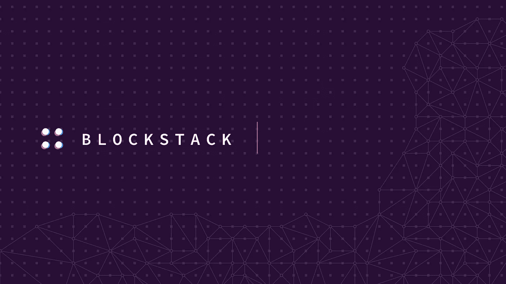
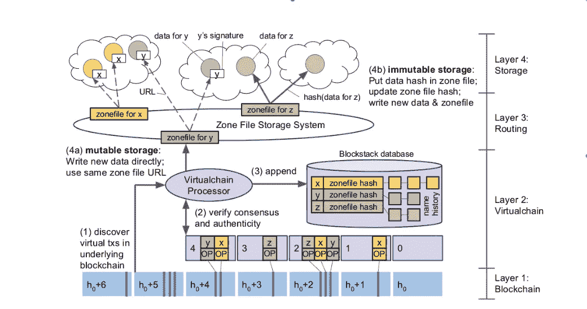
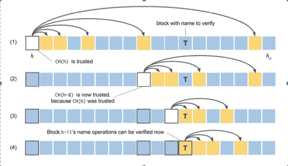

# Blockstack:使用区块链的分散命名和存储系统

> 原文：<https://medium.com/coinmonks/blockstack-a-decentralized-naming-and-storage-system-using-blockchain-445ff60190f7?source=collection_archive---------4----------------------->

[Image source](https://www.google.co.in/url?sa=i&source=images&cd=&cad=rja&uact=8&ved=2ahUKEwi187HU69fcAhVKKY8KHXBqB_UQjxx6BAgBEAI&url=https%3A%2F%2Fblockstack.org%2F&psig=AOvVaw0CDdcVBdmeek5KWHHgnjod&ust=1533624739700322)

## 介绍

在这篇文章中，我打算介绍一下 [Blockstack](https://blockstack.org/) ，一家公益公司和他们的[基础论文之一](https://pdfs.semanticscholar.org/21cd/6c0fd16282b560a7d8172f9fa44af262ab8c.pdf)。Blockstack 已经在 DApp 领域开拓了相当一段时间，并且一直在使用区块链来构建 DNS 等价物和 PKI/CA 等价物，而不依赖于根服务器或中央机构。我最终发现了他们的工作，因为 union square ventures 发表了一篇关于[胖协议和瘦客户端](http://www.usv.com/blog/fat-protocols)的文章——想法是当前形式的网络由 TCP/IP 这样的瘦协议和 facebook、google 这样的胖应用组成。大部分的价值都被运行在顶层的应用程序所获取。

区块链和令牌机制可以激励在分散网络中创建 fat 协议，其中数据是在 fat 协议层本身捕获的。顶层的应用程序可以更薄，没有应用程序最终拥有大部分价值，例如，社交网络中的价值可能是用户数据。在 DApp 世界，重要的用户数据可能在不同的应用程序之间保持更大的移动性。

在继续之前，这篇文章假设读者对比特币有一些技术上的了解。如果你愿意，你也可以在这里阅读更多。

## 使用区块链的应用程序

受益于去中心化的两个自然应用是 DNS 和身份/PKI 基础设施。DNS 将域名映射到 IP 地址记录。身份服务向用户发布一个全局标识符，然后将加密密钥与该身份相关联。另一个是将存储与这些身份相关联。

## 使用区块链建立名称-价值所有权

像区块链这样的比特币提供了一种方法，可以在一个由不可信节点组成的网络中，就一个仅附加的日志建立全球共识。在比特币网络中，节点网络被激励来建立仅附加日志的全局视图。这种只添加日志可以模拟系统的状态转换。每个转换都被记录在日志中，然后通过建立共识被网络接受。

DNS 和身份服务都将密钥映射到值。这种键-值对的所有权分配和转移可以在仅附加日志中建模。日志基本上记录了所有这类带有一些操作的事务。然后，系统可以读取日志并重建这个键值映射的最新状态。

以仅附加日志(区块链)为基础，有可能有一个类似 DNS 的命名服务，其中域名被映射到 IP/DNS 记录。域名到 ip 的所有权的分配或转移可以由网络的区块链同意，并记录在区块链中，即仅附加日志中。这种系统的明显优点是没有发布和维护这种映射的中央权威机构——因为如果不能访问域所有者的私钥，就不能容易地获得域所有权。此外，我们不必担心根服务器上的攻击，因为这是故障的中心点。更改系统中的任何名称也需要工作证明，因此成本更高。

在本文之前，使用区块链的常见方法是分叉它，然后用它来构建您自己的区块链网络。虽然作者在运行 Namecoin(相当于 DNS)时使用了这种方法，但他们在运行自己的网络时遇到了许多挑战。

## 运营自己的区块链网络的挑战

这篇论文很好地强调了引导和维护你自己的网络的挑战。这里简要总结了他们使用 Namecoin 的运营经验所带来的挑战(这也与 BlockStack 选择的设计方案紧密相关)。

1.  **安全**:他们经常发现什么矿工把他们的资源集中在一起，经常对网络发动 51%的攻击，从而有效地控制了网络的行为。 ***虽然分叉区块链并引入自己的特性很有吸引力，但在确保网络安全属性的同时往往很难做到*。**
2.  网络可靠性和吞吐量:软件错误导致新域名注册停止。有人发送了包含太多数据字段的事务，导致矿工崩溃。这有效地阻止了对区块链的任何追加。他们遇到的另一个问题是网络吞吐量的降低。一个大的池，无论是有意还是无意，都可以有效地屏蔽大量的事务，并且一个事务只有在到达不在该池中的节点时才能被接受。 ***在撰写*** 时，比特币网络的安全性和稳定性远远优于其他网络。
3.  **自私挖掘:**作者注意到超过 1/3 计算能力的池，以一种方式挖掘他们的优势，即许多块被拒绝，一些块被快速连续地添加。
4.  **共识打破变化:**当重大软件升级需要硬分叉时，所有矿工都需要升级软件否则无法参与网络。但矿商升级的动机可能并不一致，除非它是一个像比特币一样的大网络。作者发现，许多矿工在他们较小的网络中引入这些变化后，再也没有重新上线。 ***这意味着最好将打破共识的升级与其他软件版本分开，并激励矿工进行升级*** 。
5.  合并挖掘的问题:引导一个新的区块链是困难的，因为当没有足够的节点时，在开始时控制它是容易的。比特币激励比特币矿工通过合并采矿来帮助和引导其他区块链。但作者看到了这一失败，比特币矿工可以使用这一辅助动力机制控制这条替代链上的不成比例的资源。

## 块堆栈架构

上面提到的所有这些挑战导致了最基本的决定，即使用像比特币这样成熟的区块链作为控制平面。但是成熟的区块链可能会非常缓慢和昂贵。你不能真正用它来存储大量的数据。

这导致控制层和数据层进一步分离。区块链可用于控制信息，如名称注册或转让，而数据平面可用于存储数据，如 DNS 记录或身份信息。更大容量的数据可以存储(加密)在第三方存储系统中，如 dropbox/AWS。*用户可以信任控制平面。但是他们不需要以任何方式信任数据平面。*

这导致了块堆栈的 4 层架构:

**第一层**:类似区块链的比特币，存储了全球对系统状态的权威共识。

**第 2 层— VirtualChain** :区块链不可知层，接受来自区块链的输入，可以创建任意类型的状态机。例如，DNS 状态机可以不同于身份状态机。此外，这一层可以处理任何你想要的区块链，但可靠性和安全性属性将是底层区块链的衍生物。Virtuachain 还将名称绑定到它们的值。区域文件的散列存储在这一层。

**第 3 层——路由**:这一层实现了一个 DHT，用于存储值的路由信息。Blockstack 使用类似 zonefiles 的 DNS 来指示数据的最终存储位置。基本上，第 3 层的工作是发现与给定名称相关的最终数据。任何用户都可以通过验证存储在第 2 层中的散列来验证区域文件的完整性。

**第 4 层-存储**:这是存储所有值的地方。这可以是在 AWS 或 dropbox 或任何第三方供应商。这里有两种类型。

*快速可变存储*:

该数据由域名所有者的私钥签名。所以写只涉及加密的开销。而验证包括验证第 2 层中的区域文件的完整性，然后使用公共密钥来验证数据。如您所见，写入并不涉及对 zonefile 的任何更改。

*慢速不可变存储*:

在这种情况下，除了将数据写入存储之外，还会修改 zonefile 以向其添加 TXT 记录。这个 TXT 记录包含数据的散列。由于我们修改了区域文件，它触发了存储区域文件散列的 virtualchain 的后续更改。这也意味着对基础区块链的改变。

这是块堆栈架构的示意图:

4-Layer architecture that separates control plane and data plane. Layers 1 and 2 are the control plane. 3 and 4 are the data plane.

## 块堆栈命名系统的控制平面

块堆栈命名系统的第 1 层和第 2 层如下所述。第 3 层和第 4 层对本讨论的目的不太感兴趣。

**第 1 层——比特币区块链**

Blockstack 在其命名系统中使用名称空间，类似于 DNS。这些名字属于比特币区块链上的私钥。对拥有一个名字感兴趣的人会经历两个步骤:先预定，然后注册。第一个在区块链上完成这两个步骤的实体将拥有该名称。在预订的第一步中，人们不需要透露姓名——这自动地使竞相抢注相同姓名的攻击者处于劣势。

**第二层—虚拟链**

Virtualchain 维护命名系统的状态转换。例如，一个新域名的简单注册通过跟随虚拟链上的状态来完成。

*缺席- >预订购- >注册- >撤销*

一旦注册了名字，就可以更新、转让等等。

域名系统中流行域名的抢占土地行为可以通过使用智能定价功能在 Blockstack 命名系统中防止。例如，较小的名称和命名空间更昂贵，因为它们可能更受欢迎。没有数字的名字比有数字的名字更受欢迎。

约翰史密斯

## 简单的姓名验证

如何验证一个名字？核查依赖于区块链，穿越整个区块链的费用极其昂贵。当有人想在移动设备上验证一个名字时，读取整个区块链可能会非常昂贵，因为引导一个新的区块链需要 1-2 天。

Blockstack 基本上是通过按照 2^i 的顺序向后跳转，并验证与区块链中的那些块相对应的哈希以及虚拟链中该块的状态操作来实现这一点的。

假设您想要验证一个名称。因此，首先要做的是找到这个名称的权威交易。SNV 将采取 1、2、4、8，..直到它知道感兴趣的事务在两个块之间的某个地方。然后，它可以在这两个块之间再次重复相同的过程。这是它的示意图:

Verifying a name that is present in transaction T. The first block us a trusted block and then SNV takes backward steps to ensure integrity of previous blocks

## 运行特性

读取和写入都会产生一些性能开销。还有额外的存储成本，但这似乎不是高得令人望而却步。这种设计可以确保尽可能利用 AWS 等第三方云提供商的性能特征。按照作者的说法，有许多低挂起性能优化可以进一步提高读/写性能。

## 结论

我发现这篇论文非常有趣。在运行一个名币一样的网络时，我们观察到了更多的生产问题，这让我们很高兴。随后的控制和数据分离设计决策，可以利用比特币的安全属性和第三方的高性能大容量存储，听起来也是一个很好的方法。