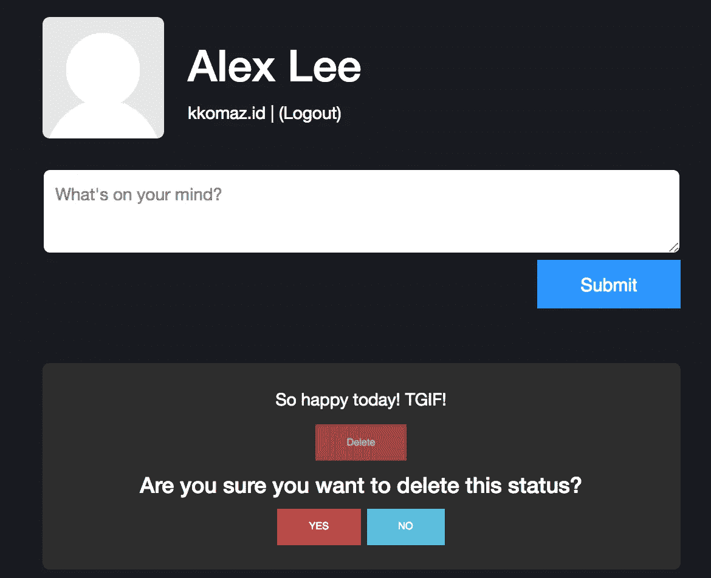
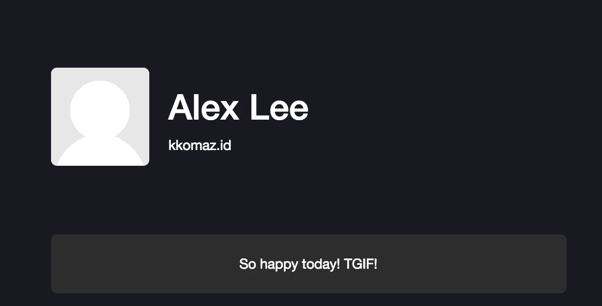

# Blockstack.js 状态多玩家跟进第一部分

> 原文：<https://medium.com/coinmonks/blockstack-js-status-multi-layer-followup-part-i-df560a638e6b?source=collection_archive---------5----------------------->


我关注 Blockstack 生态系统已经有一段时间了，甚至发现自己是 github 的贡献者。最近，该团队创建了一个贡献网站，奖励那些能够通过博客帖子、拉请求等方式为团队做出有意义贡献的个人。([https://contribute.blockstack.org/](https://contribute.blockstack.org/))

如果你不知道 Blockstack 是什么或它们是做什么的，我建议你去看看他们的主要网站[https://blockstack.org/](https://blockstack.org/)并阅读白皮书。这篇文章不会深入团队的目标或愿景，而是使用 blockstack.js 库的技术方法

贡献计划给了我更大的动力去真正深入 blockstack.js 教程。真正脱颖而出的是 Ken Liao 的多层存储帖子。我完成了教程，但感觉它并不完整，还需要一点点来使它完全适用于现实世界。

在你继续之前，我强烈建议(或要求)你在这里浏览一下教程[https://blockstack.org/tutorials/multi-player-storage](https://blockstack.org/tutorials/multi-player-storage)……否则根本没有任何意义！

所以你完成了教程。您现在可以看到您的个人资料和其他资料的状态。如果您想创建一个新的状态，可以通过输入参数来完成。如果您转到另一个人的页面，您将失去创建权限。但是，删除一个状态会怎么样呢？

我在页面的状态显示部分做了一个小的重构。我意识到删除一个状态需要一点逻辑/标准。

标准#1:您必须是删除状态的实际用户

标准 2:你需要显示删除按钮

标准#3:如果有意删除，向用户显示确认文本

我决定在下面的文件`Profile.jsx`中创建一个状态组件

```
// Old
{this.state.statuses.map((status) => (
    <div className="status" key={status.id}>
      {status.text}
    </div>
    )
)}// New
{
  this.state.statuses.map((status) => (
    <Status
      key={status.id}
      status={status}
      handleDelete={this.handleDelete}
      isLocal={this.isLocal}
    />
  ))
}
```

我创建了一个名为`handleDelete`的新函数。与`saveNewStatus`类似，我需要一个函数，该函数能够挂钩到 blockstack.js 库，以过滤和删除想要删除的状态，并使用`putFile`函数创建新的`status.json`。

```
handleDelete(id) {
    const statuses = this.state.statuses.filter((status) => status.id !== id)
    const options = { encrypt: false } putFile(statusFileName, JSON.stringify(statuses), options)
      .then(() => {
        this.setState({
          statuses
        })
      })
  }
}
```

如你所见，函数`handleDelete`与`saveNewStatus`相对相似。该函数需要一个参数`id`。有了这个参数，我们可以比较并过滤掉来自`this.state.statuses`的 id。如果你想知道为什么我使用这种方法而不是传统的 API 删除方法，我推荐你阅读这篇文章【https://blockstack.org/tutorials/managing-data-with-gaia 

这里是完整的`Profile.jsx`文件供参考

```
import React, { Component } from 'react';
import {
  isSignInPending,
  loadUserData,
  Person,
  getFile,
  putFile,
  lookupProfile
} from 'blockstack';
import Status from './Status.jsx';const avatarFallbackImage = '[https://s3.amazonaws.com/onename/avatar-placeholder.png'](https://s3.amazonaws.com/onename/avatar-placeholder.png');
const statusFileName = 'statuses.json'export default class Profile extends Component {
  constructor(props) {
   super(props);this.state = {
     person: {
      name() {
          return 'Anonymous';
        },
      avatarUrl() {
        return avatarFallbackImage;
      },
     },
      username: "",
      newStatus: "",
      statuses: [],
      statusIndex: 0,
      isLoading: false
   };this.handleDelete = this.handleDelete.bind(this);
    this.isLocal = this.isLocal.bind(this);
  }componentDidMount() {
    this.fetchData()
  }handleNewStatusChange(event) {
    this.setState({
      newStatus: event.target.value
    })
  }handleNewStatusSubmit(event) {
    this.saveNewStatus(this.state.newStatus)
    this.setState({
      newStatus: ""
    })
  }handleDelete(id) {
    const statuses = this.state.statuses.filter((status) => status.id !== id)
    const options = { encrypt: false }putFile(statusFileName, JSON.stringify(statuses), options)
      .then(() => {
        this.setState({
          statuses
        })
      })
  }saveNewStatus(statusText) {
    let statuses = this.state.statuseslet status = {
      id: this.state.statusIndex++,
      text: statusText.trim(),
      created_at: Date.now()
    }statuses.unshift(status)
    const options = { encrypt: false }
    putFile(statusFileName, JSON.stringify(statuses), options)
      .then(() => {
        this.setState({
          statuses: statuses
        })
      })
  }fetchData() {
    if (this.isLocal()) {
      this.setState({ isLoading: true })
      const options = { decrypt: false, zoneFileLookupURL: '[https://core.blockstack.org/v1/names/'](https://core.blockstack.org/v1/names/') }
      getFile(statusFileName, options)
        .then((file) => {
          var statuses = JSON.parse(file || '[]')
          this.setState({
            person: new Person(loadUserData().profile),
            username: loadUserData().username,
            statusIndex: statuses.length,
            statuses: statuses,
          })
        })
        .finally(() => {
          this.setState({ isLoading: false })
        })
    } else {
      const username = this.props.match.params.username
      this.setState({ isLoading: true })lookupProfile(username)
        .then((profile) => {
          this.setState({
            person: new Person(profile),
            username: username
          })
        })
        .catch((error) => {
          console.log('could not resolve profile')
        })const options = { username: username, decrypt: false, zoneFileLookupURL: '[https://core.blockstack.org/v1/names/'](https://core.blockstack.org/v1/names/')}getFile(statusFileName, options)
        .then((file) => {
          var statuses = JSON.parse(file || '[]')
          this.setState({
            statusIndex: statuses.length,
            statuses: statuses
          })
        })
        .catch((error) => {
          console.log('could not fetch statuses')
        })
        .finally(() => {
          this.setState({ isLoading: false })
        })
    }
  }isLocal() {
    return this.props.match.params.username ? false : true
  }render() {
    const { handleSignOut } = this.props;
    const { person } = this.state;
    const { username } = this.state;return (
      !isSignInPending() && person ?
      <div className="container">
        <div className="row">
          <div className="col-md-offset-3 col-md-6">
            <div className="col-md-12">
              <div className="avatar-section">
                
                <div className="username">
                  <h1>
                    <span id="heading-name">{ person.name() ? person.name()
                      : 'Nameless Person' }</span>
                  </h1>
                  <span>{username}</span>
                  {this.isLocal() &&
                    <span>
                      &nbsp;|&nbsp;
                      <a onClick={ handleSignOut.bind(this) }>(Logout)</a>
                    </span>
                  }
                </div>
              </div>
            </div>
            {this.isLocal() &&
              <div className="new-status">
                <div className="col-md-12">
                  <textarea className="input-status"
                    value={this.state.newStatus}
                    onChange={e => this.handleNewStatusChange(e)}
                    placeholder="What's on your mind?"
                  />
                </div>
                <div className="col-md-12 text-right">
                  <button
                    className="btn btn-primary btn-lg"
                    onClick={e => this.handleNewStatusSubmit(e)}
                  >
                    Submit
                  </button>
                </div>
              </div>
            }
            <div className="col-md-12 statuses">
            {this.state.isLoading && <span>Loading...</span>}
            {
              this.state.statuses.map((status) => (
                <Status
                  key={status.id}
                  status={status}
                  handleDelete={this.handleDelete}
                  isLocal={this.isLocal}
                />
              ))
            }
            </div>
          </div>
        </div>
      </div> : null
    );
  }
}
```

为了充分利用这个功能，我们需要我们的`Status`组件正常工作。

为了简单起见，我决定用一些要点展示下面的源代码。

```
import React, { Component } from 'react';class Status extends Component {
  constructor(props) {
    super(props);this.state = {
      showDeleteConfirmation: false
    }this.onDeleteClick = this.onDeleteClick.bind(this);
    this.toggleDeleteConfirmation = this.toggleDeleteConfirmation.bind(this);
  }onDeleteClick() {
    const { status } = this.props;
    this.props.handleDelete(status.id);
  }toggleDeleteConfirmation() {
    this.setState({ showDeleteConfirmation: !this.state.showDeleteConfirmation })
  }render() {
    const { status, isLocal } = this.props;if(!isLocal()) {
      return (
        <div className="status">
          <div className="status-text">
            {status.text}
          </div>
        </div>
      )
    }return (
      <div className="status">
        <div className="status-text">
          {status.text}
        </div><div className="status-button-options">
          <button
            className="btn btn-danger status-delete"
            onClick={this.toggleDeleteConfirmation}
            disabled={this.state.showDeleteConfirmation}
          >
              Delete
          </button>
        </div>
        {
          this.state.showDeleteConfirmation &&
          <div className="status-delete-confirmation">
            <h4>ARE YOU SURE?</h4>
            <button className="btn btn-danger status-delete-yes" onClick={this.onDeleteClick}>
              YES
            </button>
            <button className="btn btn-info status-delete-no" onClick={this.toggleDeleteConfirmation}>
              NO
            </button>
          </div>
        }
      </div>
    )
  }
}export default Status;
```

1.  状态属性通过`Profile.jsx`由父节点传递
2.  `isLocal`功能通过`Profile.jsx`由父代传递。如果`isLocal()`为`false`，则呈现状态文本，不能删除。(这意味着您正在查看其他人的个人资料)
3.  `showDeleteConfirmation`是`Status`组件的内部状态，决定是否显示确认文本。如果为真，则显示确认文本。
4.  删除按钮有一个调用`this.toggleDeleteConfirmation`的`onClick`处理程序。该功能负责通过状态变化显示确认文本。
5.  确认文本将呈现如下



3a。删除按钮将通过`this.state.showDeleteConfirmation`禁用

3b。点击否将调用`this.toggleDeleteConfirmation`并重置状态。因此，隐藏了确认按钮。

3b。点击是将调用`this.onDeleteClick`。在该函数内部，它通过 props `this.props.handleDelete(status.id)`调用概要文件的父函数`handleDelete`，其中也包括状态的 id。这样，状态将被删除，`statuses.json`将显示新的结果。

4.如果查看用户，您将不会看到删除选项。

例如:[http://localhost:8080/kkomaz . id](http://localhost:8080/kkomaz.id)



# 次要 CSS 附加组件

我在按钮之间添加了一些空白，让 ui 看起来更整洁，你可以复制并粘贴到`style.css`文件的底部。

```
.status-delete{margin-top: 10px}
.status-delete-confirmation {margin-top: 10px}
.status-delete-yes{margin-right: 5px}
```

# 结论

在我看来，这是初学者开始学习 web 开发时的标准 CRUD 博文。然而，这篇文章是为块堆栈应用程序配置的。

在我们做出更改之前，我们能够创建一个状态并查看其他配置文件的状态。现在我们有能力删除。下一步应该是编辑状态的能力。敬请期待！

Github 链接:

[https://github.com/kkomaz/publik](https://github.com/kkomaz/publik)