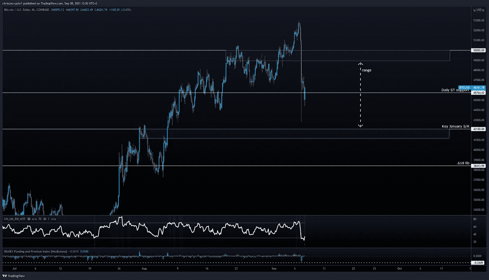

# 34 亿美元多头被清算，血流成河

> 原文：<https://medium.com/coinmonks/blood-in-the-streets-as-3-4-billion-longs-get-liquidated-5d2515001e4e?source=collection_archive---------7----------------------->

就在天空出现晴朗的时候，加密市场转向南方，直到 34 亿美元的多头被清算才停止。抛售导致 10，000 美元的变动，这让许多人措手不及。我们所知的牛市结束了吗？

咱们挖吧。

## 由于 Crytpo 波动影响，34 亿美元头寸被平仓

全球首创的加密货币昨日下跌近 20%，莱特币、以太币和其他货币跌幅更大。波动性峰值导致价值约 34 亿美元的长期交易头寸在 24 小时内被清算。

**查看完整** [文章点击这里](https://chrisoncrypto.com/blog/f/34-billion-positions-liquidated-as-crytpo-volatility-bites) **！**

# 技术上来说

## 比特币分解了

到现在为止，你已经听到了比特币大幅下跌的消息，而且是出乎意料的下跌。巨大的 180 度大转弯在几个小时内有效地抹去了两周的价格上涨，如果买家没有出现在 42，000-43，000 美元的水平，这场大屠杀可能会抹去更多。

这些令人谦卑的时刻提醒我们，在这个市场上，任何事情都有可能发生。虽然赔钱和看到你的投资组合受到负面影响，但在这样的时刻，把大局记在心里是值得的。

事实上，比特币仍比 7 月份的低点上涨了 57%，我们在本期[时事通讯](https://mailchi.mp/fb7d2f334474/btc-market-cap-dips-below-600-billion-after-gbtc-doomsday-scenario-fails-to-materialise?e=%5BUNIQID%5D)中对此进行了报道。但更重要的是，BTC 兑美元汇率同比上涨了 367%。这些游戏最终在大计划中毫无意义，这就是霍德林如此重要的原因。

也就是说，没有时间去纠结什么是可能的，什么是不可能的。

展望未来，BTC/美元将在低位(1 小时)和中位(4 小时)时间框架内盘整。在[日时间框架](https://www.tradingview.com/x/rnONkeod/)中，硬币尚未确认超级趋势指标的下降趋势。收盘低于 45，700 美元将确认这一趋势变化。正如[在电报频道](https://t.me/chrisoncryptochannel/2488)中指出的，周线超级趋势仍然看跌，给买家施加了持仓压力。

总而言之，比特币似乎正处于盘整之中，这可能会占用 9 月的大部分时间，记住盘整并不一定意味着下跌趋势。在写这篇文章的时候，没有趋势可言，只有价格核武器。

假设一个潜在的短期波动情景，BTC/美元可以简单地在支撑位(蓝色)和阻力位(橙色)之间交易。鉴于下跌的力度和关键的低时间框架水平被抹去的事实，没有理由期待本周的新高。事实上，如果一个救济反弹成为现实，标准的技术分析告诉我们，以前的支持成为阻力(48，900 美元和 50，000 美元)。如果比特币收盘时日线高于该阻力，可以认为修正已经结束。

在此之前，多头将看起来捍卫 42，100 美元和下方的潜在偏差(蓝框)。BTC 公牛队的最后一站是 38，400 美元的. 618 金口袋。黄金口袋通常是一个可靠的水平，市场往往会在这里掉头。这发生在 50，000 美元关口，当多头过度使用杠杆时，空头捍卫了这个位置。

# 把所有的放在一起

总而言之，比特币似乎正在进入一个整合期。一般来说，在更大趋势范围内的修正价格行为往往是“ABC”波。在这种情况下，我们可以期待一个重新获得阻力的尝试，如果不成功，表明在该范围内的低点的另一次测试。

从更积极的角度来看，如果多头成功收复 50，000 美元，那么接下来就是所有的历史高点。不管怎样，各种连锁指标表明[霍丁行为](https://twitter.com/WClementeIII/status/1434865524102639616)只会越来越强。这是一个积极的趋势。

此外，如果比特币在可以说是有史以来最糟糕的第二季度没有创下新低，它会仅仅因为健康的整合而进入熊市吗？我非常怀疑。

回头见。

**加入** [电报](https://t.me/chrisoncryptochannel) **频道，实时更新&设置！
关注我** [推特](https://twitter.com/ChrisOnCrypto1) **&** [多嘴多舌](https://gab.com/chrisoncrypto) **下面还有我的社交门户。**

[https://www.paypal.com/donate?hosted_button_id=C9VRLGTBHQX2N](https://www.paypal.com/donate?hosted_button_id=C9VRLGTBHQX2N)

阅读更多:[莱特币智能合约、Dao、令牌化资产& NFT 的在这里](https://chrisoncrypto.com/blog/f/litecoin-smart-contracts-daos-tokenised-assets-nfts-are-here)

你也可以用比特币支持我！
**BTC** 地址:**3 eydseypjhn 68 axkncuqbb 7 ebqcxrejamr**

最诚挚的问候，
**克里斯托·阿塔尔德**
克里斯通密码的创始人
撰稿人[www.cityam.com](https://www.cityam.com)
直接接通:[电报](https://t.me/chrisoncrypto)

*最初发布于*[*https://mailchi . MP*](https://mailchi.mp/56bd5e7c1d04/blood-in-the-streets-as-34-billion-longs-get-liquidated?e=[UNIQID])*。*

> 加入 Coinmonks [电报频道](https://t.me/coincodecap)和 [Youtube 频道](https://www.youtube.com/channel/UCbyDhTbOiKh2iUMKBi4-4Zg)了解加密交易和投资

## 另外，阅读

*   [如何购买 Ripple (XRP)](https://blog.coincodecap.com/buy-ripple-india) | [非洲最好的加密交易所](https://blog.coincodecap.com/crypto-exchange-africa)
*   [非洲最佳加密交易所](https://blog.coincodecap.com/crypto-exchange-africa) | [胡交易所评论](https://blog.coincodecap.com/hoo-exchange-review)
*   [eToro vs robin hood](https://blog.coincodecap.com/etoro-robinhood)|[MoonXBT vs by bit vs Bityard](https://blog.coincodecap.com/bybit-bityard-moonxbt)
*   [Stormgain 回顾](https://blog.coincodecap.com/stormgain-review) | [Bexplus 回顾](https://blog.coincodecap.com/bexplus-review) | [币安 vs Bittrex](https://blog.coincodecap.com/binance-vs-bittrex)
*   [Bookmap 评论](https://blog.coincodecap.com/bookmap-review-2021-best-trading-software) | [美国 5 大最佳加密交易所](https://blog.coincodecap.com/crypto-exchange-usa)
*   [如何在 FTX 交易所交易期货](https://blog.coincodecap.com/ftx-futures-trading) | [OKEx vs 币安](https://blog.coincodecap.com/okex-vs-binance)
*   [如何在势不可挡的域名上购买域名？](https://blog.coincodecap.com/buy-domain-on-unstoppable-domains)
*   [印度的加密税](https://blog.coincodecap.com/crypto-tax-india) | [altFINS 审查](https://blog.coincodecap.com/altfins-review) | [Prokey 审查](/coinmonks/prokey-review-26611173c13c)
*   [布洛克菲 vs 比特币基地](https://blog.coincodecap.com/blockfi-vs-coinbase) | [比特坎评论](https://blog.coincodecap.com/bitkan-review) | [币安评论](/coinmonks/binance-review-ee10d3bf3b6e)
*   [Coldcard 评论](https://blog.coincodecap.com/coldcard-review) | [BOXtradEX 评论](https://blog.coincodecap.com/boxtradex-review)|[uni swap 指南](https://blog.coincodecap.com/uniswap)
*   [阿联酋 5 大最佳加密交易所](https://blog.coincodecap.com/best-crypto-exchanges-in-uae) | [SimpleSwap 评论](https://blog.coincodecap.com/simpleswap-review)
*   [7 种购买 Dogecoin 的最佳方式](https://blog.coincodecap.com/ways-to-buy-dogecoin) | [ZebPay 点评](https://blog.coincodecap.com/zebpay-review)|[matrix export 点评](https://blog.coincodecap.com/matrixport-review)