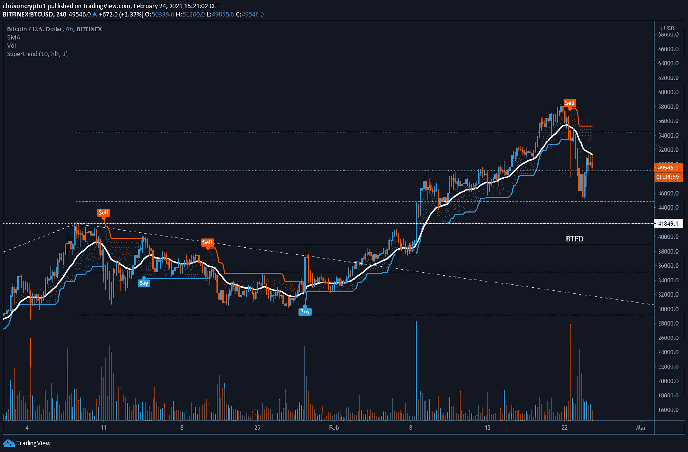

# 街头流血:这对 BTC 意味着什么？

> 原文：<https://medium.com/coinmonks/blood-in-the-streets-what-does-this-mean-for-btc-87fe29c4ab14?source=collection_archive---------4----------------------->

这是多事的一周，今天才星期三。加密市场经历了大幅回调，周二加速，周三早盘持平并略有回升。

首先，我们将回顾一下泰瑟与纽约总检察长办公室达成和解的消息。其次，我们将分析 BTC/美元的短期击穿，并强调宏观趋势延续的更高时间框架点。最后，我们将讨论以太坊重新测试其前历史高点的影响。

我会简明扼要。

让我们开始吃吧。

*source: coingecko.com*

# 比特币忙碌的一周

周一和周二经历了 44 亿美元的长期清算，创下了黑色星期四的历史纪录(发生在去年 3 月)。直截了当地说，期货和现货市场在对另一个微观战略救助的预期中崩溃，直到今天才到来。事实上，Square 和 MicroStrategy 都加倍了他们的比特币持有量，分别购买了 3318 和 19452 BTC。在最近 10 亿美元的比特币购买之后，是时候将微观战略更名为宏观战略了。

周二，据透露，泰瑟和纽约司法部长办公室解决了一场旷日持久的诉讼，同时承认没有任何不当行为，并支付了相对较少的 1850 万美元费用。作为和解协议的一部分，泰瑟自愿向纽约市政府办公室和公众提供 USDT 储备支持的季度更新，这是一项建议。“我们赞同司法部长增加透明度的目标，”霍格纳说。“我们将每季度向总检察长办公室和公众披露更多关于泰瑟石油储量的信息。”

随着加密领域最大的法律纠纷接近尾声，Bitfinex 和 Tether 表示，他们已经向 NYAG 办公室提供了超过 250 万页的文件，以完全封锁此事。

这是可能出现的最好结果，并终结了围绕 USDT-黑洞熊市的“FUD”。

[***获得此通迅发布。订阅邮件列表！***](http://chrisoncrypto.com)

# 大局

尝试准确描绘比特币在最初崩溃后的轨迹被证明是徒劳的。因此，让我们保持简单，描述这一次的情况。

比特币在 48 小时的抛售中修正了 23%，从 58，400 美元升至 44，950 美元。自那以来，该指数已从低点反弹 14%，在发稿时发现 51，400 美元的阻力。

在 1 月份的修正期内，比特币在找到底部并恢复宏观上涨趋势之前暴跌了 30%。2017 年上涨期间的多次抛售也是如此，因此不能排除持续下行的可能性。

打破历史先例，比特币从高点再次下跌 30%，至 40，000 澳元，这与我们的“BTFD”水平以及上个月相对高点(41，850 美元)之后的事件完全一致。

当前的宏观结构是在突破 50，000 美元心理水平后形成的，此后该心理水平一直是一个看跌测试，表明比特币可能即将开始另一个修正或横盘时期，然后才会再次采取任何果断行动。

话虽如此，比特币仍然在 20 日均线和超级趋势指标上方运行。虽然每日时间框架已经过重大压力测试，但它们仍然没有被打破，这为充满偏见的交易系统提供了依据。

较低的时间框架(ltf)讲述了一个不同的故事。在这种情况下，这两个指标都显示出短期内的疲软。

碰巧的是，当前的 LTF 价格走势与 1 月份的抛售几乎一模一样。包括我在内的许多交易者都指出了这种相似性，试图得出分形投影。然而，如果每个人都盯着同样的设置，价格很少会重复。

在我们对比特币的所有报道中，我们都谈到了 20 周均线是支持持续长期牛市的关键区域，在经历了两次高时间框架拒绝和自 10，000 美元(去年 9 月)以来 460%的涨幅后，随着散户的加入，应该更多地关注长期指标。

目前，20 周均线每周稳定增长 8.4%，预计到 3 月的第三周将达到 39，000 美元，我们将密切关注比特币与它的首次预期互动。很自然，这是假设 23%的下跌标志着比特币抛物线式上涨暂时停顿的第一阶段。虽然比特币的价格可能会以几种方式达到这一移动平均水平，但在某个时候价格肯定会与之趋同。

## **以太坊到达拐点**

与比特币相比，以太坊对美元的回调幅度更大。它下跌了 33%，而比特币下跌了 23%。

该平台经历了艰难的几周，上涨时反弹较少，下跌时进一步下跌，截至昨日收盘。

除此之外，ETH/USD 和 ETH/BTC 都处于关键区域，这可能决定 ETH 是否值得持有。

美元对经历了对最初突破点 1400 美元的重新测试——这是比特币在推动其周期性历史高点时没有经历的。分析师们对这一重新测试做出了看涨和看跌的解读，这两种解读都有道理。不管怎样，事实仍然是 1400 美元是支撑以太坊牛市的关键拐点。基本上，如果瑞士联邦理工学院跌破这一水平，瑞士联邦理工学院的多头将不得不扩大他们的心理体操，以支持牛市的继续，至少从技术和价格的角度来看。

这并不理想。

同时，ETH/BTC 已经开发了₿0.03.上方的. 618 fib [黄金口袋](https://www.tradingview.com/x/QJhGxSBM/)到目前为止，最初的反应是 11%的反弹，较低的时间框架表明这可能是这对组合的底部。如果是这样的话，ETH/BTC 的看涨情况仍然需要该对货币将₿0.04 转化为支撑，否则它开始看起来像一个失败的多年突破。

总之，ETH 如履薄冰，需要加大油门。较低的交易费用也将为平台向土星进军提供新的动力。提议的 [EIP-1559](https://coinmarketcap.com/headlines/news/eip-1559-implementation-call/) 解决方案可以刺激我们都非常渴望看到的持续增长。

最终，等待尘埃落定可能是最好的做法。比特币已经达到了具有里程碑意义的 1 万亿美元的估值，这将引发什么样的市场力量还有待观察。与此同时，较低的时间框架范围似乎是每个人清算(或不清算)的场所。

下次再见。

**加入** [电报](https://t.me/chrisoncryptochannel) **频道进行实时更新！
关注我的** [多嘴多舌](https://gab.com/chrisoncrypto) **和我下面的社交门户。**

[https://www.paypal.com/donate?hosted_button_id=C9VRLGTBHQX2N](https://www.paypal.com/donate?hosted_button_id=C9VRLGTBHQX2N)

# 阅读更多内容:Tether 以 1850 万美元解决了与 NYAG 的纠纷

[https://chrisoncrypto.com/blog/f/bullish-tether-settles-dispute-with-nyag-for-185-million](https://chrisoncrypto.com/blog/f/bullish-tether-settles-dispute-with-nyag-for-185-million)

[www.chrisoncrypto.com](http://www.chrisoncrypto.com)

你也可以用比特币支持我！
**BTC** 地址:**3 eydseypjhn 68 axkncuqbb 7 ebqcxrejamr**

最诚挚的问候，
T21【克里斯】阿塔尔德克里斯关于密码的创始人
直接接通:[电报](https://t.me/chrisoncrypto)

*原发布于*[*https://mailchi . MP*](https://mailchi.mp/96c00a8d9750/blood-in-the-streets-what-does-this-mean-for-btc?e=[UNIQID])*。*

> 加入 Coinmonks [Telegram group](https://t.me/joinchat/EPmjKpNYwRMsBI4p) 并了解加密交易和投资

## 另外，阅读

*   什么是[闪贷](https://blog.coincodecap.com/what-are-flash-loans-on-ethereum)？
*   最好的[密码交易机器人](/coinmonks/crypto-trading-bot-c2ffce8acb2a) | [网格交易](https://blog.coincodecap.com/grid-trading)
*   [3 商业评论](/coinmonks/3commas-review-an-excellent-crypto-trading-bot-2020-1313a58bec92) | [Pionex 评论](/coinmonks/pionex-review-exchange-with-crypto-trading-bot-1e459d0191ea) | [Coinrule 评论](https://blog.coincodecap.com/coinrule-review-a-perfect-trading-bot)
*   [AAX 交易所评论](/coinmonks/aax-exchange-review-2021-67c5ea09330c) | [德里比特评论](/coinmonks/deribit-review-options-fees-apis-and-testnet-2ca16c4bbdb2) | [FTX 交易所评论](/coinmonks/ftx-crypto-exchange-review-53664ac1198f)
*   [n 零审核](/coinmonks/ngrave-zero-review-c465cf8307fc) | [Phemex 审核](/coinmonks/phemex-review-4cfba0b49e28) | [PrimeXBT 审核](/coinmonks/primexbt-review-88e0815be858)
*   [Bybit Exchange 审查](/coinmonks/bybit-exchange-review-dbd570019b71) | [Bityard 审查](https://blog.coincodecap.com/bityard-reivew) | [CoinSpot 审查](https://blog.coincodecap.com/coinspot-review)
*   [3 commas vs crypto hopper](/coinmonks/3commas-vs-pionex-vs-cryptohopper-best-crypto-bot-6a98d2baa203)|[赚取加密利息](/coinmonks/earn-crypto-interest-b10b810fdda3)
*   最好的比特币[硬件钱包](/coinmonks/the-best-cryptocurrency-hardware-wallets-of-2020-e28b1c124069?source=friends_link&sk=324dd9ff8556ab578d71e7ad7658ad7c) | [BitBox02 回顾](/coinmonks/bitbox02-review-your-swiss-bitcoin-hardware-wallet-c36c88fff29)
*   [莱杰 vs n rave](https://blog.coincodecap.com/ngrave-vs-ledger)|[莱杰 nano s vs x](https://blog.coincodecap.com/ledger-nano-s-vs-x)
*   [加密复制交易平台](/coinmonks/top-10-crypto-copy-trading-platforms-for-beginners-d0c37c7d698c) | [比特码复制交易](https://blog.coincodecap.com/bityard-copy-trading)
*   [Vauld 评论](https://blog.coincodecap.com/vauld-review) | [YouHodler 评论](/coinmonks/youhodler-4-easy-ways-to-make-money-98969b9689f2) | [BlockFi 评论](/coinmonks/blockfi-review-53096053c097)
*   最好的[加密税务软件](/coinmonks/best-crypto-tax-tool-for-my-money-72d4b430816b) | [CoinTracking 评论](/coinmonks/cointracking-review-a-reliable-cryptocurrency-tax-software-5114e3eb5737)
*   最佳[加密借贷平台](/coinmonks/top-5-crypto-lending-platforms-in-2020-that-you-need-to-know-a1b675cec3fa) | [杠杆代币](/coinmonks/leveraged-token-3f5257808b22)
*   [莱杰纳米 S vs 特雷佐 one vs 特雷佐 T vs 莱杰纳米 X](https://blog.coincodecap.com/ledger-nano-s-vs-trezor-one-ledger-nano-x-trezor-t)
*   [block fi vs Celsius](/coinmonks/blockfi-vs-celsius-vs-hodlnaut-8a1cc8c26630)|[Hodlnaut 评论](https://blog.coincodecap.com/hodlnaut-review)
*   [Bitsgap 审查](https://blog.coincodecap.com/bitsgap-review) | [Quadency 审查](/coinmonks/quadency-review-a-crypto-trading-automation-platform-3068eaa374e1) | [Bitbns 审查](https://blog.coincodecap.com/bitbns-review)
*   [埃利帕尔泰坦评论](/coinmonks/ellipal-titan-review-85e9071dd029) | [赛克斯斯通评论](https://blog.coincodecap.com/secux-stone-hardware-wallet-review)
*   [DEX Explorer](https://explorer.bitquery.io/ethereum/dex)|[w](https://explorer.bitquery.io/graphql)|[local bitcoins 评论](https://blog.coincodecap.com/localbitcoins-review)
*   最佳[区块链分析](https://bitquery.io/blog/best-blockchain-analysis-tools-and-software)工具| [赚比特币](https://blog.coincodecap.com/earn-bitcoin)
*   [加密套利](/coinmonks/crypto-arbitrage-guide-how-to-make-money-as-a-beginner-62bfe5c868f6)指南:新手如何赚钱
*   最佳[加密制图工具](/coinmonks/what-are-the-best-charting-platforms-for-cryptocurrency-trading-85aade584d80) | [最佳加密交易所](/coinmonks/crypto-exchange-dd2f9d6f3769)
*   [如何在印度购买比特币](https://blog.coincodecap.com/buy-bitcoin-app-india)？
*   [印度比特币交易所](/coinmonks/bitcoin-exchange-in-india-7f1fe79715c9) | [比特币储蓄账户](https://blog.coincodecap.com/bitcoin-savings-account)
*   了解比特币的[最佳书籍有哪些？](/coinmonks/what-are-the-best-books-to-learn-bitcoin-409aeb9aff4b)

> [直接在您的收件箱中获得最佳软件交易](/coinmonks/newsletters/coinmonks)

