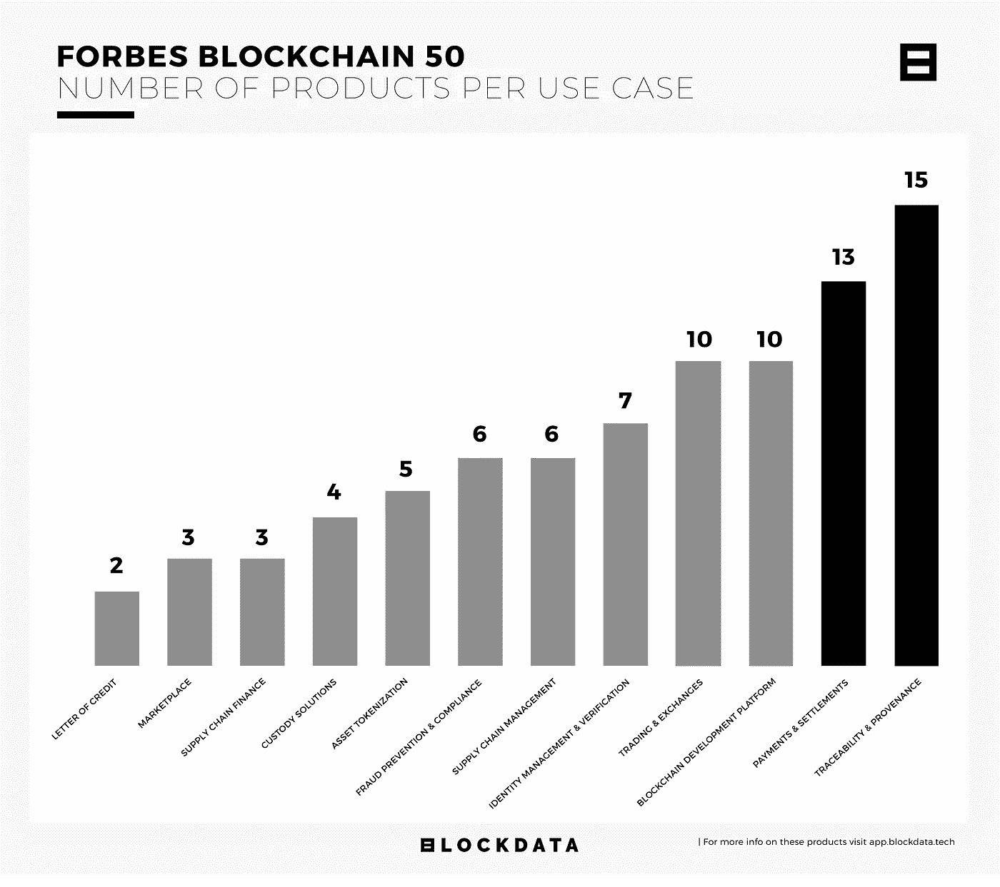
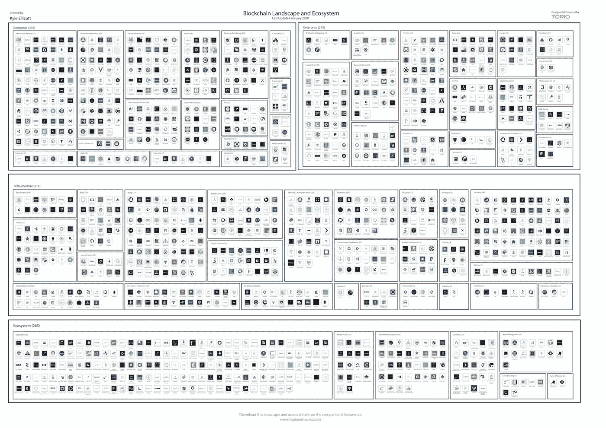

# 宝马区块链解决方案发布/中国国家区块链 4 月上线/日立解决方案开发 DApps

> 原文：<https://medium.com/coinmonks/bmws-blockchain-solution-launching-china-s-national-blockchain-live-in-april-hitachi-33b25d5c61d9?source=collection_archive---------2----------------------->

## *2020 年 4 月 8 日*

*本周，* ***宝马*** *宣布推出其区块链驱动的供应链管理(SCM)解决方案，今年将有 10 家供应商加入。* ***中国*** *预计在本月晚些时候【4 月】推出其国家区块链平台——区块链服务网(BSN)。* ***日立解决方案*** *与****Consensys****合作，简化了分散应用的开发(DApp)。****block data****为我们提供了* ***福布斯区块链 50 强*** *正在打造的产品的深度剖析。中国第二大快递，* ***顺丰快递*** *，正在利用* [*【区块链】*](https://blog.coincodecap.com/tag/blockchain/) *运送疫情境内的关键物资。***币安即将收购****CoinMarketCap****，这笔交易价值可能高达 4 亿美元。***通用汽车公司申请了一项分散的区块链地图专利。* ***雀巢*** *与雨林联盟合作追踪咖啡豆。****block stack****对其单点登录背后的过程申请专利对于每一个 DApp 系统，Blockstack Auth。再加上我们对风险投资在区块链版图上的见解，stablecoins 随着数字货币的应运而生，一个* [*比特币*](https://blog.coincodecap.com/tag/bitcoin/) *拓荒西部的堡垒与* ***凯特琳龙*** *，产品发布会，以及****max dapp****等等。祝你一周愉快！尽情享受吧！***

*****奖金*** *:我最近发布了最新的 Q1 2020 版 my* [*区块链版图*](https://www.linkedin.com/posts/kyleellicott_q12020-blockchain-landscapekyleellicotttopionetworks-activity-6638879840634310656-UNtB) *(包含在下面供下载)，它提供了一个行业概述，突出了 900 多家全球公司、风险基金和工作组。如果这是你看到的第一个版本，就把它当作你在这个行业中进一步导航的路线图。在这里获得高分辨率的免费！***

## **📈[宝马供应链区块链解决方案将于 2020 年推出](https://cointelegraph.com/news/bmws-blockchain-solution-for-supply-chains-to-roll-out-in-2020)**

**宝马集团宣布计划推出其区块链驱动的供应链管理(SCM)解决方案，今年首先关注 10 家供应商。该平台被称为“PartChain”，旨在确保涉及多个国际方的复杂供应链中汽车零部件的可追溯性和即时数据透明。该公司打算与移动开放区块链倡议(MOBI)的其他成员分享 PartChain 解决方案……[阅读更多信息](https://venturebeat.com/2020/03/10/zynga-cofounder-creates-blockchain-game-partners-for-decentralized-gaming/)**

## **🇨🇳 [中国的数字化努力在继续:国家区块链平台将于 4 月上线](https://forklog.media/chinas-digitization-endeavors-continue-national-blockchain-platform-to-go-live-in-april/)**

**随着中国的数字化努力，面向企业和个人的国家区块链基础设施预计将于下个月上线。平台“区块链服务网络(BSN)”是一个跨区域的公共基础设施网络，将为中小企业提供一个更便宜的替代方案，以从头开始构建他们的系统。中国更广泛的区块链计划的重点是利用区块链满足政府的需求。去年，该国采用区块链监控国际边境口岸、处理发票以打击税务欺诈，并为中小企业贷款提供便利……[阅读更多](https://cointelegraph.com/news/toyota-reveals-blockchain-lab-after-11-months-of-research)**

## **📖[日立解决方案公司与 Consensys 合作；做 DApps](https://www.cryptonewsz.com/hitachi-solutions-partners-with-consensys-to-work-on-dapps/)**

**Hitachi Solutions 与 Consensys 合作简化了分散应用的开发，实现了 PegaSys Plus 的无信任安全交易。目的是通过经销商协议将企业以太坊客户端 Hyperledger Besu 引入日本市场，该协议将支持[以太坊](https://blog.coincodecap.com/tag/ethereum/) mainnet 和私有[许可链](https://blog.coincodecap.com/permissionless-and-permissioned-blockchain/)，并提供一些旨在以更好的方式管理客户端的附加功能……[阅读更多信息](https://www.cryptonewsz.com/hitachi-solutions-partners-with-consensys-to-work-on-dapps/)**

## **📖[福布斯区块链 50 强——产品数据深度挖掘](https://blog.blockdata.tech/2020/04/forbes-blockchain-50-products-data-deep-dive/)**

**[BLOCKDATA](https://medium.com/u/279c07ad0b4d?source=post_page-----33b25d5c61d9--------------------------------) 的团队回来了，对福布斯区块链 50 强榜单背后的数据进行了更深入的研究。原来最流行的用例有两类:**可追溯性&出处**；以及**支付&结算**。该团队更深入地向您展示了福布斯 50 强公司在这些领域中的每一个领域的发展。… [阅读更多内容](https://blog.blockdata.tech/2020/04/forbes-blockchain-50-products-data-deep-dive/)并通过[块数据](https://medium.com/u/279c07ad0b4d?source=post_page-----33b25d5c61d9--------------------------------)查看更多内容**

****

**Source: [BLOCKDATA](https://blog.blockdata.tech/2020/04/forbes-blockchain-50-products-data-deep-dive/)**

## **💸[对于区块链的风险投资公司来说，这并不像往常一样](https://www.decentralised.co/open-for-business/)**

**Q1 2020 在区块链生态系统中的股权融资比以往任何一个季度都多。6.86 亿美元的巨额数字很大一部分原因是 Bakkt 最近单独筹集了 3 亿美元。扣除这些，我们大约有 3 . 86 亿英镑。Q1 2018 年奥运会的同等水平。这很有趣，因为 2019 年 Q1 奥运会是在… [阅读更多](https://www.decentralised.co/open-for-business/)**

## **📖[中国火币链的牛市案例](https://decrypt.co/23897/the-bull-case-for-chinas-huobi-chain)**

**集中式交易所可以通过多种方式从推出自己的区块链中受益。有了自己的区块链，交易所可以推出自己的代币，审查代币项目，并建立一个生态系统。交易所开始吞噬代币经济的价值链，摆脱对以太坊等公共区块链的依赖，并为客户提供端到端服务……[阅读更多](https://magazine.cointelegraph.com/2020/03/30/virtual-reality-blockchain-economics-permanence-and-scarcity/)**

## **🇨🇳 [中国第二大快递公司利用区块链在疫情运送重要物资](https://cointelegraph.com/news/chinas-2nd-largest-courier-using-blockchain-to-deliver-key-supplies-amid-pandemic)**

**中国第二大快递公司“顺丰快递”正在探索利用区块链在新冠肺炎疫情期间运输关键物资。该公司正在将区块链与大数据相结合，以构建一个物流网络，该网络支持跟踪、验证和准确记录货物，同时确定供应优先级，并降低假冒或未经许可的产品被分销到各地区的风险……[阅读更多信息](https://cointelegraph.com/news/chinas-2nd-largest-courier-using-blockchain-to-deliver-key-supplies-amid-pandemic)**

## **📖 [Pantami 与 IBM 合作，在区块链、人工智能、云计算和其他 IT 技能方面培训尼日利亚人](https://dailynigerian.com/pantami-partners-ibm-to-train-nigerians-on-blockchain-ai-cloud-computing-other-it-skills/)**

**尼日利亚通信和数字经济部的 Isa Ali Ibrahim Pantami 博士与 IBM 合作，通过 IBM 数字国家非洲计划，在尼日利亚人舒适的家中开始并提供数字培训选项。通过该计划，该部将为尼日利亚人提供超过 280 小时的免费学习和 85 门关于关键新兴技术的课程，如区块链；人工智能；大数据；和云计算。该计划被认为符合穆罕默杜·布哈里总统于 3 月 19 日推出的数字尼日利亚计划……[阅读更多](https://dailynigerian.com/pantami-partners-ibm-to-train-nigerians-on-blockchain-ai-cloud-computing-other-it-skills/)**

## **📖[区块链项目称 5 GB 区块大小将消除拥塞问题](https://cointelegraph.com/news/blockchain-project-says-5-gb-block-size-will-eliminate-congestion-issue)**

**ILCoin 项目已经成功测试了最大 5gb 的块大小，这将消除拥塞问题，在一个活跃的[区块链](https://blog.coincodecap.com/tag/blockchain/)网络“ILCoin Block Explorer”，编号为 310280。该公司通过胖树路由协议(称为 RIFT)实现了这一点，这使得块大小的增加不会影响交易速度。该公司的目标是去中心化的云区块链(DCB)，它允许在透明的基础上实现数据存储和数据交换，“形成所有权和永久性的透明统一。”… [阅读更多](https://cointelegraph.com/news/blockchain-project-says-5-gb-block-size-will-eliminate-congestion-issue)**

# **本周的更多内容:**

**💸[币安将收购 CoinMarketCap，该交易价值可能高达 4 亿美元](https://www.theblockcrypto.com/post/60371/binance-is-set-to-acquire-coinmarketcap-the-deal-could-be-worth-as-much-as-400-million)**

**📈[通用汽车申请去中心化区块链地图专利](https://www.forbes.com/sites/darrynpollock/2020/04/03/general-motors-applies-for-decentralized-blockchain-map-patent/#fefa5bd57073)**

**📈[雀巢与雨林联盟合作追踪咖啡豆](https://www.coindesk.com/nestle-partners-with-rainforest-alliance-to-trace-coffee-beans)**

**📈[区块链公司 Factom 在未能获得额外资金后开始解散流程](https://www.theblockcrypto.com/linked/60885/blockchain-firm-factom-begins-dissolution-process-after-failing-to-source-additional-funding)**

**💸[2020 年第一季度，Stablecoins 的交易额超过 900 亿美元](https://www.theblockcrypto.com/linked/60216/stablecoins-saw-record-transaction-volumes-of-over-90-billion-in-2020s-first-quarter)**

**🎙️ [与](https://youtu.be/cCbIKaXwSRY) [MaxDapp](https://medium.com/u/d123a5d6e54e?source=post_page-----33b25d5c61d9--------------------------------) 的任意提问(AMA)会议**

**💸[为什么美国不应该让中国主导数字货币竞赛](https://fortune.com/2020/04/07/china-us-digital-currency-coronavirus/)**

**💸[狂野西部的比特币堡垒](https://www.forbes.com/sites/michaeldelcastillo/2020/04/01/a-bitcoin-bastion-for-the-wild-west/?subId3=xid:fr1585753010920jei#349971936c4b)主角[凯特琳·龙](https://medium.com/u/7262834671c1?source=post_page-----33b25d5c61d9--------------------------------)**

**⚡ [新区块链项目让用户选择他们的可再生能源](https://cointelegraph.com/news/new-blockchain-project-lets-users-choose-their-renewable-energy-source)**

**📚 [19 种比特币资源帮你通过检疫](https://blog.trezor.io/19-bitcoin-resources-to-get-you-through-the-quarantine-4ff5f030d4ef)由 [SatoshiLabs](https://medium.com/u/b8686215a986?source=post_page-----33b25d5c61d9--------------------------------)**

# **分散式应用程序手表**

## **📖 [Blockstack 因其 Dapp 单点登录产品获得专利](https://www.coindesk.com/blockstack-wins-patent-for-its-dapp-single-sign-on-product)**

**[Blockstack](https://medium.com/u/19349106268a?source=post_page-----33b25d5c61d9--------------------------------) 已经为每个 DApp 系统的单点登录背后的过程申请了专利，Blockstack Auth。这项专利旨在提供一种用单一数字身份加密登录 DApps 的方法，而不需要第三方进行认证，这在功能上类似于谷歌和脸书广受欢迎的一键登录过程。但是 Blockstack 的第一次授权给了公共利益公司的分散网络通用登录工具以法律影响力。这也引发了一些棘手的问题，比如如何在空间中分割思想，以及一家声称将开源放在“我们所做的一切的核心”的公司。… [阅读更多信息](https://www.coindesk.com/blockstack-wins-patent-for-its-dapp-single-sign-on-product)**

## **📖[平衡器的新 dapps 可以重新平衡 DeFi 景观](https://decrypt.co/24106/balancers-new-dapps-could-rebalance-defi-landscape)**

**Balancer 是一家非托管投资组合管理公司和流动性提供商，今天宣布推出其代币交易所和资金池管理 dapps。虽然 Balancer 可以与几个现有的产品相比，但它进入 DeFi 市场仍然值得注意，因为它颠覆了几个传统的投资组合管理概念。… [阅读更多信息](https://decrypt.co/24106/balancers-new-dapps-could-rebalance-defi-landscape)**

**📖[开放应用网](https://medium.com/u/26219f78865e?source=post_page-----33b25d5c61d9--------------------------------) [推出首个 App，移动](https://twitter.com/getmovesapp/status/1247193679003033601)**

**📖[我们的网络:由](https://ournetwork.substack.com/p/our-network-issue-15) [Spencer Noon](https://medium.com/u/55f8de7afe95?source=post_page-----33b25d5c61d9--------------------------------) 撰写的第 15 期更新了关于[比特币](https://blog.coincodecap.com/tag/bitcoin/) ₿、 [Tezos](https://medium.com/u/948dd45fd3d0?source=post_page-----33b25d5c61d9--------------------------------) 、[宇宙网络](https://medium.com/u/e8cb21d22b0b?source=post_page-----33b25d5c61d9--------------------------------)和[法令](https://medium.com/u/98027bccde8a?source=post_page-----33b25d5c61d9--------------------------------)**

**📖[全数字堆栈](/@mattcsnow/the-fully-digital-stack-401a9644228d)由[马特·斯诺](https://medium.com/u/2c00d344154f?source=post_page-----33b25d5c61d9--------------------------------)**

**📖[dsrv 实验室访谈](https://relaynodeseoul.substack.com/p/relaynode-seoul-april-6-2020?token=eyJ1c2VyX2lkIjozMTcxOTQsInBvc3RfaWQiOjM1MjM1OCwiXyI6IkZ5T2N4IiwiaWF0IjoxNTg2MjIzMTYxLCJleHAiOjE1ODYyMjY3NjEsImlzcyI6InB1Yi0zMjY3NSIsInN1YiI6InBvc3QtcmVhY3Rpb24ifQ.-rvq0KBLimueZxh8PkNIRkQ-llADHnH9VuT6O2ALxEo)**

# **🎙️区块链工业状况 2020 年第一季度:**

***现已发售，下载你的高清副本****【Q1】2020****版* [*区块链景观图*](https://www.linkedin.com/posts/kyleellicott_q12020-blockchain-landscapekyleellicotttopionetworks-activity-6638879840634310656-UNtB) *。这是我现在发布的第五版景观，包括****747****家公司(* ***900 多家独特公司*** *包括更广泛的关键生态系统参与者)和超过***2010 年至 2020 年在整个景观中筹集的超过 220 亿美元资金**——自 2010 年以来投资超过 180 亿美元—出现明显的循环，并有完整的分解。****

***一个完整的 60 分钟的景观概述视频现在可以在* [*这里*](https://www.topionetworks.com/markets/blockchain-landscape-5bf43854b9abe4633c1f87da) *免费获得。在视频中，我对 2020 年的前景进行了细分，提供了 2019 年的总结、2020 年的新兴趋势、DeFi、Libra、CDBCs、Stablecoins、DApps 等等！***

****

**Source: [Topio Networks](https://www.topionetworks.com/markets/blockchain-landscape-5bf43854b9abe4633c1f87da)**

> ***👉下载新的* [*区块链基础设施景观 Q1 2020*](https://s3.amazonaws.com/spoke-profiles-prod-assets/uploads/d21d960161f92e629f68bf78b3d148743e4b3f49/original/Blockchain_Landscape_Q1_Feb2020_KyleEllicott.pdf?utm_source=pdf&utm_medium=email&utm_campaign=kyle) *版，了解关于 DeFi、DApps、基础设施、数字货币等的见解！***
> 
> **[直接在您的收件箱中获得最佳软件交易](https://coincodecap.com/?utm_source=coinmonks)**

****

**不想等到下周，[现在就订阅](http://click1.m.readwritelabs.com/xsdqkbbrgsdtqkmntpjlstcnkytvpvphsnhsqlvbrhhd_yfqbfcmslnskglmckvqv.html?source=post_page---------------------------)📥有关区块链、DApps 等的实时行业见解！**

****