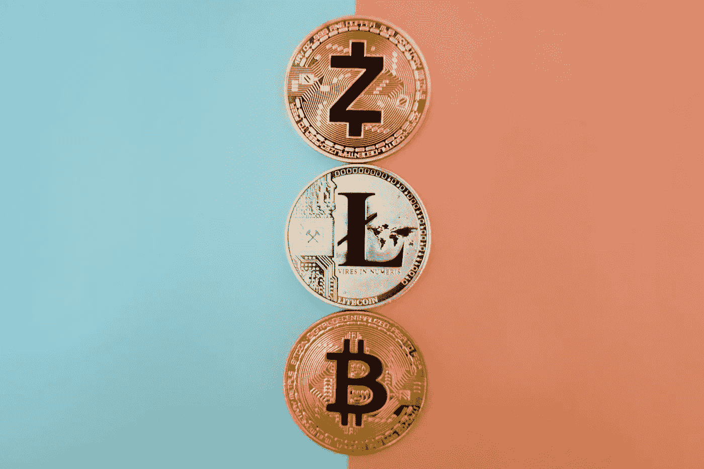
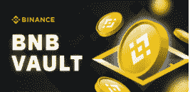
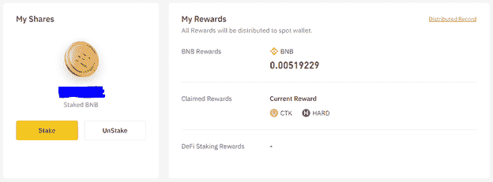
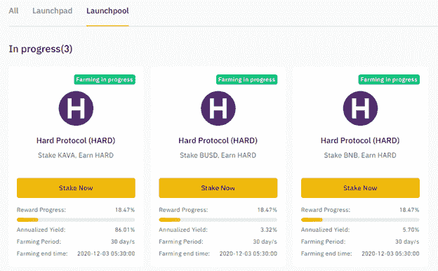
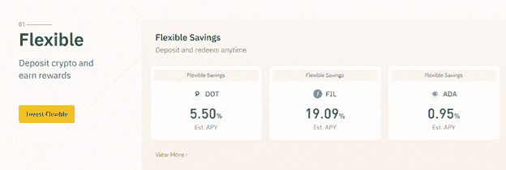
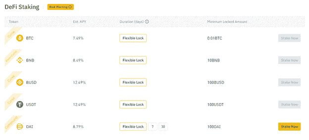

# BNB 金库:为什么它对币安如此重要？

> 原文：<https://medium.com/coinmonks/bnb-vault-why-is-it-so-important-for-binance-43e3581087ca?source=collection_archive---------0----------------------->

在[语音](https://www.voice.com/post/@tulip/bnb-vault-why-is-it-so-important-for-binance-1604860610-1)阅读我的原创文章。

BNB 最初最重要的使用案例是交易费用的折扣。然而，自那时以来，BNB 的角色发生了很大变化。BNB 已经被用于

持有一定数量的 BNB 必须获得**的门票，参加** [**币安发射台**](https://binance.com/en/register?ref=E8PCD3AF) 。

**币安智能链(BSC)费用**在 BNB 支付

**定义定位和灵活定位**的优势

**币安发射池代币**免费赠送给 BNB 赌客

**那么，为什么** [**BNB 金库**](https://binance.com/en/register?ref=E8PCD3AF) **作为一款产品，如此重要呢？**

币安一直在快速建设新的功能。然而，用户使用它们变得非常困惑。以下是一些例子:

1.在 Certik Launchpool 中下注令牌的用户将不会从硬协议 Launchpool 中获得奖励(用户可以选择拆分令牌，但在 Launchpool 中没有双重奖励)

2.将 BNB 置于定义赌注的用户不会获得启动池奖励

BNB 金库解决了这个问题。它是多个币安产品的奖励聚合器。

> 交易新手？尝试[加密交易机器人](/coinmonks/crypto-trading-bot-c2ffce8acb2a)或[复制交易](/coinmonks/top-10-crypto-copy-trading-platforms-for-beginners-d0c37c7d698c)

[**BNB 金库**](https://binance.com/en/register?ref=E8PCD3AF) **用例**

BNB 金库是一个 BNB 收益聚合器。只需一次点击，它就将集中和分散融资结合起来，让 BNB 持有者享受最佳 APY 回报。BNB 金库为赌注者担保资本。集成的产品包括:

**·发射池**

**灵活储蓄**

****需要注意的一些要点是:****

**一键式打桩**

**利息计算将从下注第 2 天的 0:00 AM (UTC)开始。收入将在第 3 天支付。收入每天被分配到 staker 的现货账户**

**灵活拆卸(随时)**

**被标记的 BNB 金库资产将有资格获得诸如空投、发射台保持位置、贵宾权利等利益。**

**当前估计的 APY 在 5%到 8%之间。这是一个灵活的 APY，并根据 BNB 灵活储蓄、DeFi Staking、Launchpool 和未来潜在收益产品的实际收益和风险水平进行调整。**

****发射池****

****

**币安 Launchpool 是一个巨大的成功，它有助于在动荡的市场中保持 BNB 的价格稳定。它始于贝拉协议(BEL)的推出。从那时起，已有 7 个令牌在启动池中启动**

**贝拉协议**

**翼协议(翼)**

**火烈鸟(FLM)**

**金星(XVS)**

**阿尔法金融实验室(阿尔法)**

**Certik (CTK)**

**硬性协议(硬性)**

**一些要点:**

**Launchpool 允许用户免费下注 BNB 并获得一个新令牌。**

**通常，从每个代币中赢取的时间为 30 天。**

**这些代币在耕种 7 天后在 Binance.com 上市。**

**用户可以随时交易这些代币(发行后)。**

**用户获得的代币与其对 Launchpool 的贡献成比例。**

**用户可以随时增加下注金额。**

****建议你在 BNB 金库至少下注 50 BNB。这是为了确保您也能获得币安发射台项目的门票。最初几天，平均每天有 50 名 BNB 下注在 Launchpool，并获得大约 2 美元的奖励。考虑到 Launchpool 令牌的质量，该数字通常会有所波动。目前，50 BNB 正在提供大约 0.5-1 美元。****

***我通常会把我的 Launchpool 代币换成 BNB 币，然后下注。相信我，这是一个巨大的机会！***

****灵活储蓄****

****

**灵活储蓄是通常的加密储蓄账户。用户通过订阅赚取利息。不同的代币有不同的 apy。利息随时可以赎回。**

**但是，可能需要注意的是，每个单独代币获得的 APY 比您在代币平台上直接下注获得的少得多。币安实际上是在拿你的代币，代表你下注，只给你一小部分利润。**

****定义打桩****

****

**币安充当使能者，通过智能合约将用户的密码存放在 DeFi(去中心化金融)中。币安获得并分配已实现的收益，试图获得最大利益。**

**然而，可以注意到，用户不持有私钥，并且币安不对由于智能合同失败而导致的任何损失承担责任。**

****结论****

**币安仍然是集中交易所的领导者。 [BNB 金库](https://binance.com/en/register?ref=E8PCD3AF)是用户需要的产品。它显然解决了聚合器的问题。我相信币安理解区块链的本质，并且正在朝着正确的方向前进。像 BNB 金库这样的产品将确保用户对币安平台的粘性。**

****如果你能在评论中留下你的观点供进一步讨论，我将不胜感激。****

****参考:** [币安](https://binance.com/en/register?ref=E8PCD3AF)**

****看我之前的文章:** [沙盒:万众期待的区块链元宇宙游戏](https://tulip311bit.medium.com/the-sandbox-the-hugely-anticipated-blockchain-metaverse-game-7f5ecea03f86)**

****跟着我****

**https://twitter.com/rumadas123➡推特:**

**https://www.linkedin.com/in/ruma-das-a1439320/➡领英:**

> **加入 Coinmonks [电报频道](https://t.me/coincodecap)和 [Youtube 频道](https://www.youtube.com/c/coinmonks/videos)获取每日[加密新闻](http://coincodecap.com/)**

## **另外，阅读**

*   **[复制交易](/coinmonks/top-10-crypto-copy-trading-platforms-for-beginners-d0c37c7d698c) | [加密税务软件](/coinmonks/crypto-tax-software-ed4b4810e338)**
*   **[网格交易](https://coincodecap.com/grid-trading) | [加密硬件钱包](/coinmonks/the-best-cryptocurrency-hardware-wallets-of-2020-e28b1c124069)**
*   **[密码电报信号](http://Top 4 Telegram Channels for Crypto Traders) | [密码交易机器人](/coinmonks/crypto-trading-bot-c2ffce8acb2a)**
*   **[红狗赌场评论](https://coincodecap.com/red-dog-casino-review) | [Swyftx 评论](https://coincodecap.com/swyftx-review) | [造币厂评论](https://coincodecap.com/coingate-review)**
*   **[Bookmap 评论](https://coincodecap.com/bookmap-review-2021-best-trading-software) | [美国 5 大最佳加密交易所](https://coincodecap.com/crypto-exchange-usa)**
*   **[如何在 FTX 交易所交易期货](https://coincodecap.com/ftx-futures-trading) | [OKEx vs 币安](https://coincodecap.com/okex-vs-binance)**
*   **[CoinLoan 审查](https://coincodecap.com/coinloan-review) | [YouHodler 审查](/coinmonks/youhodler-4-easy-ways-to-make-money-98969b9689f2) | [BlockFi 审查](https://coincodecap.com/blockfi-review)**
*   **[XT.COM 评论](https://coincodecap.com/profittradingapp-for-binance)币安评论 |**
*   **[最佳加密交易所](/coinmonks/crypto-exchange-dd2f9d6f3769) | [印度最佳加密交易所](/coinmonks/bitcoin-exchange-in-india-7f1fe79715c9)**
*   **开发人员的最佳加密 API**
*   **最佳[密码借贷平台](/coinmonks/top-5-crypto-lending-platforms-in-2020-that-you-need-to-know-a1b675cec3fa)**
*   **[杠杆代币](/coinmonks/leveraged-token-3f5257808b22)终极指南**