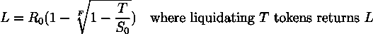

# 粘合曲线和粘合曲线附件

> 原文：<https://medium.com/coinmonks/bonding-curves-and-bonding-curve-accessories-ec38100280cf?source=collection_archive---------1----------------------->

## 连续密码经济学和程序化实现

# 引言和摘要的不恰当混合

不可否认，我对结合曲线的讨论已经很晚了。结合曲线/连续令牌/智能令牌的最初概念是由 [Bancor](https://bancor.network/) 和 [Simon de la Rouviere](/@simondlr) 在 2016 年和 2017 年创造的(尽管 Rouviere 本人在[他的关于结合曲线设计历史的文章](/@simondlr/bancors-smart-tokens-vs-token-bonding-curves-a4f0cdfd3388)中否认了这一点)。我在调研期间看过的大部分文章都是 2018 年或者 19 年的。另一方面，2020 年是违约互换、贷款协议和产量农业之年——到目前为止，2021 年并没有太大的不同。

现在，**连续的秘密经济学**处于“秘密领域”的边缘，但它还远未死亡。例如， [FairMint](https://fairmint.co) 正在积极开发基于连续令牌模型的数字证券，并且目前允许提前进入他们的咖啡馆(连续[安全](https://en.wikipedia.org/wiki/Simple_agreement_for_future_equity) s)。在证券之外， [Truebit](https://truebit.io) 的$TRU 代币使用基于收入的债券曲线和通货紧缩代币组学展示了一个迷人的公用事业代币架构。

在这种情况下，有什么比整理和减少我收集的关于这个主题的所有信息，并在我的 github 中添加一些东西作为奖励更好的方式来度过我的时间呢？

# 术语

## 公开

如果你自己对此进行研究，你会发现其他人对这些术语有不同的定义。例如，在某些情况下,“结合曲线”和“连续令牌”可以互换使用(术语“智能令牌”也可以互换使用),但是在本文中，这两者之间有明显的区别。还有，当人们通常提到“粘合曲线”时，它从“班科尔公式”的推导是隐含的；这里，我将“Bancor Bonding Curve”指定为从公式中导出的定价算法。

我觉得有义务指出，这里的术语和定义是为了个人方便而选择的。我的哲学是，对抽象概念的定义不应该在名字的含义上增加太多；例如，仅从“粘合曲线”这个名称，就不可能预测它是从所谓的“Bancor 公式”中推导出来的。此外，正如后面将要讨论的，“Bancor 公式”导出了一个单项“结合曲线”，它忽略了其他可能的结合曲线算法。

## **粘合曲线**

如果你在谷歌上搜索“结合曲线定义”，那么 [coinmarketcap](https://coinmarketcap.com/alexandria/glossary/bonding-curve) 的定义会作为一个特色片段出现在顶部。所以，我们不妨这样做:

> 一个数学概念，用于描述资产价格和供给之间的关系。

换句话说，**债券曲线**是一个在给定供给下返回价格的函数。它可以直观地表示为供应图曲线:

Simple Bonding Curve Visualization

我们将在定义中再增加一点点:**连续性**，这可以说是隐含在“曲线”中的。然而，重要的是，我们要澄清这一点，因为这将引导我们进入下一个学期。

## 连续令牌

是可替代的代币资产，其价格由债券曲线决定。因此，此类令牌必须具有以下属性:

1.  无限的供应我个人认为我们可以取消这个。只有当结合曲线在所有正实数上连续时，无限供给才有意义。但是，不难想象，一个令牌的结合曲线在上界区间上是连续的，在这种情况下，令牌供应也必须是上界的。
2.  **确定性价格**，从定义上来说是隐含的。
3.  **连续价格**，从定义上也是隐含的。
4.  **即时流动性** 为购买/铸造代币而存入的资金被保存在抵押品储备中，使得即时清算成为可能。因此，债券曲线起到了自动做市商的作用，流动性通过设计总是可用的。储备保存在**储备令牌**中——为了方便起见，我们假设储备令牌是 ETH。

让我们更仔细地看看第四项财产:

让我们考虑一个结合曲线函数， ***P = f(S)*** ，其中 ***P*** 是总供应 ***S*** 代币时的单位代币价格(以 ETH 为单位)。给定初始价格为***【p₀***的 ***S₀*** 的初始供应，购买/铸造*代币的成本为:*

**

*现在，代币供应是 ***S₀ + t*** ，抵押品储备至少有 ***Mₜ*** 的余额。*

**

*Price of minting **t** tokens*

*现在，假设另一个任意令牌所有者希望清算 ***k*** 令牌( ***k ≤ t*** )。在当前供应的****+t***，清算 ***k*** 代币返回:**

********

**Returns for liquidating **k** tokens**

**由于 ***Lₖ ≤ Mₜ*** ，准备金中有足够的资金允许 ***k*** 代币在没有外部流动性提供者的情况下即时清算。这意味着，在任何给定的时间点，储备余额的下限是:**

********

**Total Balance of Collateral Reserve**

**为了方便起见，我们将假设储备金刚好足够进行即时清算。**

## ****班科尔粘合曲线****

**是一条结合曲线，其算法来自 **Bancor 公式**。**

****

****准备金率**或**抵押品权重**或**准备金权重**——我们将坚持最后一个——是代币市值(以 ETH 计)和抵押品准备金余额(也以 ETH 计)之间的固定比率。**

**[Meni Rosen feld 的这篇论文](https://drive.google.com/file/d/0B3HPNP-GDn7aRkVaV3dkVl9NS2M/view?resourcekey=0-mbIgrdd0B9H8dPNRaeB_TA)对 Bancor 公式做了进一步的分析，并推断出以下内容。注意，0 下划线表示初始值。**

****************

**请注意，这需要非零供应和储备。因此，当“初始化”Bancor 粘合曲线时，我们需要设置三个值:**

1.  **初始供应( ***S₀*** )**
2.  **初始储备( ***R₀*** )或价格( ***P₀*** )**
3.  **固定储备重量( ***F*** )**

**如果我们选择 R₀的*而不是 P₀的*供给对价格的等式就变成了:****

******

***请注意，这三个值决定了每笔交易的代币价格需要调整的幅度，即价格敏感度。***

******

***For S₀ = 1, R₀ = F = CW***

******

***For S₀ = 1, F = 1/2***

## *****基于收入的债券曲线(RBBC)*****

***有两条粘合曲线；一个用于**铸造**代币，一个用于**退役** / **焚烧** / **清算**代币。铸造价格(*)总是大于或等于清算收益(*)。总存款(来自铸造)和抵押准备金(用于清算)之间的差额就是**收入**。将 RBBC 作为其收入模式一部分的组织被称为**持续组织**。一个有底层 RBBC 的连续令牌叫做**基于收益的连续令牌** ( **RBCT** )。*****

******

***Visualization of a RBBCs Two Bonding Curves***

***也许最明显的基于收入的债券曲线是 ***Pₘᵢₙₜ*** 和 ***Pᵣₑₜᵢᵣₑ*** 成线性比例的曲线:***

****

**我们姑且称此为**标量 RBBC** ，而**k*k*称为**“薄荷烧(M2B)**比。自然，这意味着:****

********

# **基于收入的债券曲线应用**

## **证券 RRBCs(英尺。[费尔明特](https://fairmint.co/)**

**这里有解释 FairMint 的[持续证券发行](https://github.com/C-ORG/whitepaper#cso)和 [CAFE](https://fairmint.co/cafe-continuous-agreement-for-future-equity/) s(未来股权的持续协议)的页面链接。**

## **公用设施令牌的 RRBCs(英尺。 [Truebit](https://truebit.io/)**

**Truebit 的$TRU 代币根据**标量基于收入的线性债券曲线**定价——债券曲线是线性的，M2B 是 8。美元 TRU 也是一种通货紧缩的公用事业代币——服务是用美元 TRU 代币支付的，一部分付款被烧掉了。理论上，这使得美元 TRU 可以可靠地与瑞士联邦储备银行软挂钩。此外，请注意，$TRU 既不是股权，也不是治理令牌。因此，Truebit 公司本身没有什么动机持有大量的$TRU，就像 LINK 和 GRT 这样受欢迎的公用事业令牌经常出现的情况一样。只要对该协议有需求，就会铸造新的$TRU 代币。**

**如果你能忍受草率的写作，这里有我的文章详细解释$TRU 的象征经济学。**

# **方案实施**

**相关 git 回购[此处](https://github.com/slothmanxyz/bondingcurve)
(待补……)**

## **也阅读**

** [## 令牌绑定曲线解释

### 现在，所有的 ICO 疯狂正在逐渐消失，一种新的代币发行形式似乎突然从…

medium.com](/coinmonks/token-bonding-curves-explained-7a9332198e0e)  [## 代币债券曲线，电影

### 如何使用单一合约制作指数？

medium.com](/coinmonks/token-bonding-curves-the-movie-4f97c8c2b7b6)  [## 2021 年 9 大最佳加密借贷平台

### 当谈到加密货币贷款时，大量因素等同于良好的收入状况。此外，借款的一部分…

blog.coincodecap.co](https://blog.coincodecap.com/crypto-lending)**