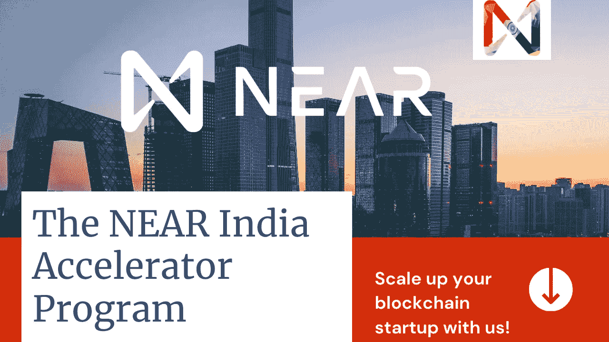

# 通过 NEAR India 加速器计划推动您的区块链创业。

> 原文：<https://medium.com/coinmonks/boost-your-blockchain-startup-with-near-india-accelerator-program-10ac68298fc0?source=collection_archive---------5----------------------->

## NEAR protocol 推出了“NEAR India accelerator program ”,您可以通过 NEAR India 构建出色的业务解决方案，并获得高达 20 万美元的资金支持！

印度是创新和技术的沃土，因为印度在全球创新生态系统中排名第 48 位。随着世界走向 Web3，印度需要专注于区块链技术，印度企业家可以获得双重机会，我相信他们可以为这些产品创新，以满足未来的需求。创建近印度加速器计划是为了选择可以使用区块链技术解决现实世界问题的创新想法，并继续阅读本文以获取有关近印度加速器计划的重要信息{ [Reference](https://pib.gov.in/PressReleasePage.aspx?PRID=1689593) }。

## 为什么要创建近印度加速器计划？

由于 NEAR 协议是下一代高性能区块链，因此它推动开发人员使用 NEAR 区块链进行创新。NEAR protocol 与 [Lumos Labs](https://www.lumoslabs.co/) (一家创新管理初创公司)联合推出了 NEAR India 加速器计划，该计划可以帮助希望在区块链领域取得成功的初创公司打造有影响力的产品，并在快速扩张的行业中找到自己的立足点。

## 你为什么应该注册近印度加速器？

尽管如此，区块链是一项新技术，世界各地的大多数风险投资者都不愿投资，而且很难找到区块链科技的导师。因此，NEAR India Accelerator 计划的目的是提供高达**200，000** 美元的资金，提供创业和区块链领域冠军的指导，提供进入市场的支持，提供 NEAR 生态系统的访问，提供与 NEAR 协议集成的技术支持，您还可以获得营销和公关支持。

## 谁可以申请近印度加速器？

解决现实世界问题的新想法没有限制和障碍，但你的想法应该有与目的驱动团队相关的区块链用例，并且你的项目应该通过 POC 阶段。如果你的想法符合以上描述，那么请申请近印度加速器。

## 谁在支持近印度加速器计划？

1.  **NEAR Protocol:**NEAR Protocol(也称为 NEAR)是一个具有智能合约功能的开源分片区块链。它对开发人员来说是最友好的，有助于开发支持 Web3 的 dApps(分散式应用程序)。NEAR 还可以使用 NEAR 的彩虹桥与区块链以太坊进行互操作{Reference}。
2.  **伍德斯托克:** [伍德斯托克基金](https://woodstockfund.com/)是一家著名的多资产投资基金，投资于分布式账本技术领域的早期和成长期初创公司。他们将通过投资支持和分享他们宝贵的专业知识来帮助创业公司。
3.  **Fracton Ventures:** 这是一家专注于 Web3.0 的 DAO building 公司，作为社区合作伙伴加入加速器，以支持在日本市场拥有上市机会的团队，并为初创公司与日本的投资者网络建立联系铺平道路。他们还将分享他们在区块链领域的专业知识。
4.  **Lumos Labs:** 是一家创新管理公司。这有助于将创新者与大问题联系起来，并使他们能够在解决这些问题的旅程中前进。

## 如何申请近印度加速器项目？

在您申请该计划之前，我建议您了解更多有关该计划的信息，您可以从[**www . near India accelerator . in**](http://www.nearindiaaccelerator.in)获取所有详细信息和关键人物的联系信息，但如果您很急，很快就想申请，那么只需[**单击此处**](https://www.f6s.com/near-india-accelerator/) 获取申请表，并记住 6 月 20 日是注册的最后日期。

-感谢您的阅读，别忘了与您的企业家朋友分享！