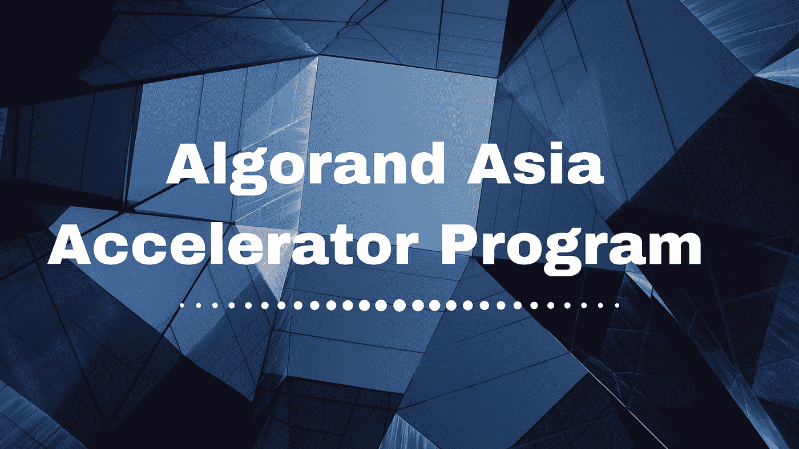
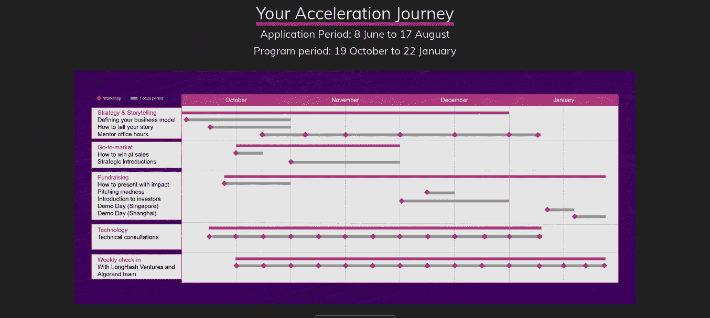
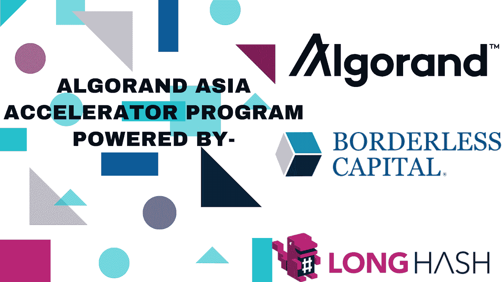
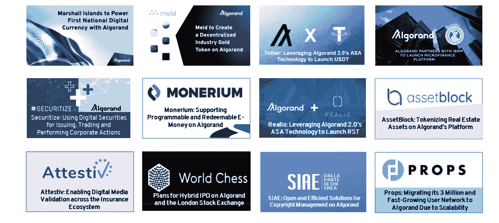

# 通过 AAA 计划促进您的财务 3.0 启动

> 原文：<https://medium.com/coinmonks/boost-your-finance-3-0-startup-by-aaa-program-a3f667517972?source=collection_archive---------5----------------------->

## 阿尔格兰德基金会和无国界资本发起了阿尔格兰德亚洲加速器计划，由 LongHash Ventures 提供支持，旨在帮助金融产品和服务提供商。

例如，在[电信](https://www.investopedia.com/ask/answers/070815/what-telecommunications-sector.asp)中，每个部门都按代升级

[部门](https://www.investopedia.com/ask/answers/070815/what-telecommunications-sector.asp)我们从 [1G 发展到 5G](https://www.researchgate.net/publication/263657708_Digital_Society_from_1G_to_5G_A_Comparative_Study) ，在 1G 的时候，我们只能访问一些设施，如通话和短信，而在 5G，现在我们可以获得无限的设施，如高速互联网、 [IOT](https://internetofthingsagenda.techtarget.com/definition/Internet-of-Things-IoT) (物联网)等。

就像电信部门一样，金融部门正处于发展阶段，我们现在正处于金融 3.0 阶段，它只不过是一种 [DeFi](https://blog.coincodecap.com/the-ultimate-guide-to-defi-decentralized-finance) (分散金融)的形式，正如我们所知，让 5G 服务提供商获得如此多[资本风险投资](https://www.investopedia.com/terms/v/venturecapital.asp)或[投资者](https://www.investopedia.com/terms/i/investor.asp)的资助或支持，并使用该货币服务，提供商创建了一个巨大的基础设施来实施 5G 技术。同样，金融 3.0 初创公司需要一些金融支持、基础设施、区块链网络来发展，并提供金融服务和产品。

传统金融部门不得不面对诸如交易延迟、安全风险、错误、高额交易费用、审计成本、合规风险、增加的软件成本、复杂性等问题。而金融 3.0 是建立在区块链技术基础上的新的金融生态系统，它解决了传统金融部门的所有上述问题。

如果你的创业公司或公司与传统金融体系合作，那么 AAA 计划给了你从传统金融体系进化到金融 3.0 的机会。

基本上，这是一个为期 12 周的项目(**项目周期:10 月 19 日至 1 月 22 日**

)，如果您的项目被选中，您将获得端到端的支持，如战略制定、市场执行和技术指导。

AAA 计划给你一个机会，让 Tether 的首席技术官保罗·阿尔多伊诺、阿尔格兰德公司的首席科学家 T2·陈静、证券公司的首席执行官兼联合创始人 T4·卡洛斯·多明戈以及其他 21 位领导人成为你的导师，帮助你在事业上取得成功。

因此，如果你正在工作或创建一家金融 3.0 创业公司，那么你可以参加[阿尔格兰德亚洲加速器项目](https://algorand.foundation/algorand_asia_accelerator)，并能够获得高达 25 万美元的技术和财务支持。如果你的项目被 AAA 计划选中，那么你将获得 15，000 美元的初始种子资金，你的项目可能有资格获得高达 250，000 美元的后续投资。

**资助 AAA 项目的公司详情**

有三家公司正在为亚洲加速器项目提供支持，在此我将简要介绍一下它们，以激发您对亚洲加速器项目的信心。

**阿尔格兰德基金会:**这是阿尔格兰德平台背后的治理和研究组织，阿尔格兰德平台是一个开源、无许可的下一代区块链平台，属于 coinmarketcap 的[50 强。](https://coinmarketcap.com/currencies/algorand/)

阿尔格兰德区块链平台提供生态系统和工具，在阿尔格兰德网络的基础上创建您的金融服务和产品。

阿尔格兰德平台具有 [ASA](/algorand/algorand-standard-assets-efda8afcfc0a) (阿尔格兰德标准资产)功能，可帮助您在阿尔格兰德区块链的第 1 层创建您的金融资产。

阿尔格兰德区块链公司具有原子转账功能，使用该功能您可以轻松处理复杂的交易，如[循环交易](https://www.investopedia.com/terms/c/circulartrading.asp) : (A 向 B 付款，B 向 C 付款，C 向 A 付款)，团体付款(要么所有人付款，要么没有人付款)，向多个收款人付款，等等。

Algorand 将在 2020 年夏天之前支持智能合同，此后，您可以创建 [dApps](https://blockgeeks.com/guides/dapps/) (分散应用程序)，并且可以将您的物理合同数字化为虚拟合同，这将减少物理存在和腐败的参与。

阿尔格兰德区块链公司使用 [PPoS](https://www.algorand.com/what-we-do/technology/pure-proof-of-stake) (纯粹的利害关系证明)共识，从交易费用、交易速度、安全性、分散性和可持续性的角度来看，这为阿尔格兰德区块链公司提供了无限的可扩展性。

## **你知道吗？**

阿尔格兰德区块链平台为马绍尔群岛的第一种国家数字货币{[Reference](https://cointelegraph.com/news/marshall-islands-sovereign-digital-currency-will-be-based-on-algorand)}提供了动力，Meld 正在使用阿尔格兰德区块链将黄金数字化{[Reference](https://cointelegraph.com/news/australian-startup-offers-new-spin-on-tokenized-gold-trading)}，Tether the popular stable coin 正在使用阿尔格兰德技术午餐 USDT {[Reference](https://cointelegraph.com/news/tether-launches-usdt-stablecoin-on-algorand-blockchain)}，阿尔格兰德帮助 IBRM 午餐小额信贷平台{[Reference](https://cointelegraph.com/news/ibmr-and-blockchain-firm-algorand-launch-microfinance-platform)}，等等。

你可以看看上面的图片，了解阿尔格兰德区块链在金融领域的其他一些活跃的使用案例，这证明了阿尔格兰德可以成为创造你的金融服务和产品的最佳平台。

## **无国界资本:**

这是一家通过 Algorand 无国界经济向金融产品和服务提供商提供金融支持的金融机构。无国界风险投资基金(Borderless VC Fund)是一家顶级风险投资基金，投资于正在利用 Algorand 技术或在无国界经济中创造经济价值的初创公司。无国界资本不仅为公司提供资金，还为取得成功提供指导。想了解无边界资本及其投资组合公司的更多信息，可以访问无边界资本的[官网](https://borderlesscapital.io/)。

## **龙哈什风险投资公司:**

这是一家区块链加速器和投资者，通过提供早期投资来支持全球区块链创业公司，其使命是增强区块链经济的 Web 3.0 能力。

Longhash ventures 在全球范围内为区块链提供启动资金，但主要集中在亚洲地区，如新加坡、中国、香港和日本，要了解更多关于 longash 的信息，请访问 longash 的官方网站。

## **如何申请阿尔格兰德亚洲加速器项目？？**

也许从这个项目的名字中，你可以看出这个项目只针对亚洲地区，但是请放松，任何地区的任何人都可以申请这个项目，并在【2020 年 8 月 17 日 - [之前申请阿尔格兰德亚洲加速器项目，请点击这里](https://www.longhashventures.com/algorandapplication)

但在申请阿尔格兰德亚洲加速器项目之前，我建议您查看这些[在线活动视频](https://www.crowdcast.io/e/stfshxwm)以了解更多关于阿尔格兰德亚洲加速器项目的信息。我还建议您[注册](https://e27.co/event/building-on-better-a-guide-to-algorand-blockchain/)并参加 2020 年 7 月 23 日的下一次在线活动，直接向阿尔格兰德的核心团队成员[陈静](https://www.linkedin.com/in/jing-chen-algorand/)和[杰森·韦瑟斯比](https://www.linkedin.com/in/jasonweathersby/)提问。

任何时候你都可以到达 admin.sg@longhash.com

> **关于作者:**
> 
> **姓名——吉坦德拉·纳伊克**
> 
> **电子邮件-Jitencrackit2@gmail.com**

> [直接在您的收件箱中获得最佳软件交易](https://coincodecap.com/?utm_source=coinmonks)

