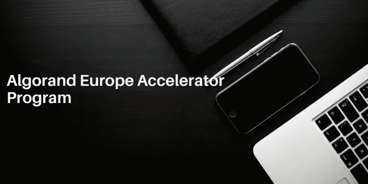

# 通过 AEA 计划促进您的财务 3.0 启动

> 原文：<https://medium.com/coinmonks/boost-your-finance-3-0-startup-with-aea-program-d8fae173df99?source=collection_archive---------4----------------------->

## 继[阿尔格兰德亚洲加速器](/coinmonks/boost-your-finance-3-0-startup-by-aaa-program-a3f667517972)项目成功之后，现在阿尔格兰德欧洲加速器项目启动了，本文将帮助您了解该项目的细节。

Image credit canva.com

在比特币区块链革命之后，人们明白银行可以选择管理个人财务，我们现在处于金融 3.0 时代，你不仅可以控制自己的财务，还可以消除中间人、费用、收费、罚款等。金融 3.0 建立在区块链技术的基础上，以最大限度地提高信任和安全性。如果你是一名开发人员或企业家，想要创建一个金融 3.0 工具或服务，但面临许多问题，包括资金，那么坚持这篇文章，我会告诉你如何申请 AEA(阿尔格兰德欧洲加速器计划)，你会得到什么样的推动？。

如果你看看电信行业，它从 [1G 发展到 5G](https://www.researchgate.net/publication/263657708_Digital_Society_from_1G_to_5G_A_Comparative_Study) ，在那里我们得到了无限的设施，如高速互联网、(物联网)，每个行业都在技术时代发展，但如果你看看金融行业，它只是从线下转移到线上，但仍然是集中的，交易延迟，安全风险，错误，高交易费，审计成本，合规风险，增加的软件成本，复杂性等{ [参考](https://www.sageintacct.com/blog/traditional-financial-management-systems-long-winding-road-nowhere) }。所以现在是金融 3.0 的时候了。

作为一家电信服务提供商，从[资本投资](https://www.investopedia.com/terms/v/venturecapital.asp)或[投资者](https://www.investopedia.com/terms/i/investor.asp)那里获得资金，然后用这些资金创建一个巨大的基础设施来实施 5G 技术。一个金融 3.0 的创业公司也需要一些金融支持，基础设施，区块链网络来增长或为用户创造金融服务和产品。

## **什么是 AEA 计划？**

您的公司或初创公司是一家传统的金融服务/应用程序提供商，它们在传统的金融系统上工作，或者是创建金融 3.0 工具和服务但面临包括融资问题在内的许多问题的早期初创公司，那么 AEA 计划将帮助您从传统的金融系统发展到金融 3.0。

这是一个为期 12 周的加速器计划，如果您的项目被选中，您的项目将获得端到端的支持，包括战略制定、走向市场执行以及技术指导、代币经济、营销和筹款等方面的主题指导。如果你的项目被 AEA 项目选中，那么你将获得 15，000 美元的初始种子资金，然后你可能有资格获得高达 500，000 美元的后续投资资金。

作为导师，你将接触到一些区块链行业的大人物，如 Props 的联合创始人 Adi Sideman、Securitize 的创始人兼首席执行官 Carlos Domingo、Coinlist 的管理合伙人 Adrian Uberto、Generali 的新业务风险投资总监 Pasquale Tuosto、Amazon Web Services 的业务开发人员 Tim Boeckmann 以及 Youbi Capital 的首席执行官陈力。

## 谁在支持 AEA 计划？

这个项目主要由三家公司支持。**阿尔格兰德基金会，** 2。**无国界首都，** 3。现在让我们简单地讨论一下这些公司，以了解这个项目的真实性。

## **阿尔格兰德基金会**

阿尔格兰德基金会是一个非营利组织，其愿景是在区块链分权的基础上建立一个无边界、无摩擦的经济。这是阿尔格兰德平台背后的管理和研究组织，并设想在阿尔格兰德区块链的基础上建立每一个金融应用程序，这就是为什么通过这些类型的辅导计划，它邀请所有令人兴奋的公司和初创公司通过积累种子资金和辅导在这里的平台上发展。

## **无国界资本**

这是一种投资于潜在项目的风险资本，这些项目是使用阿尔格兰德区块链公司创建的，并具有与阿尔格兰德基金会一样的无国界经济的相同愿景，它不仅提供资金，还提供指导以实现成功。

## **永恒资本**

这是一家总部位于伦敦的投资公司，对利用区块链技术建立的初创公司表现出投资兴趣。它支持有大胆创新想法的企业家，并为实现这一目标提供指导。

## **如何申请 AEA 项目？**

继 AAA(阿尔格兰德亚洲加速器)计划取得成功后，AEA 现已启动，申请现已开放，截止日期为**2020 年 12 月 18 日**。你可以在这里提交你的申请。

但是在你申请这个项目之前，我建议你看一下上一个 AAA 项目的视频，这会让你对这个项目有更多的了解。

**最后的想法:**我认为我在本文开头谈到的革命之所以可能，是因为企业家在正确的月份为他们的公司做出了正确的决定，当然，随着比特币和加密的普及，人们不知不觉地走向了金融 3.0，你需要为未来做好准备，如果你是一家金融创业公司的创始人，那么就去申请这个项目吧。

## 另外，阅读

*   最好的[密码交易机器人](/coinmonks/crypto-trading-bot-c2ffce8acb2a)
*   [密码本交易平台](/coinmonks/top-10-crypto-copy-trading-platforms-for-beginners-d0c37c7d698c)
*   最好的[加密税务软件](/coinmonks/best-crypto-tax-tool-for-my-money-72d4b430816b)
*   [最佳加密交易平台](/coinmonks/the-best-crypto-trading-platforms-in-2020-the-definitive-guide-updated-c72f8b874555)
*   最佳[密码借贷平台](/coinmonks/top-5-crypto-lending-platforms-in-2020-that-you-need-to-know-a1b675cec3fa)
*   [最佳区块链分析工具](https://bitquery.io/blog/best-blockchain-analysis-tools-and-software)
*   [加密套利](/coinmonks/crypto-arbitrage-guide-how-to-make-money-as-a-beginner-62bfe5c868f6)指南:新手如何赚钱
*   最佳[加密制图工具](/coinmonks/what-are-the-best-charting-platforms-for-cryptocurrency-trading-85aade584d80)
*   [莱杰 vs 特雷佐](/coinmonks/ledger-vs-trezor-best-hardware-wallet-to-secure-cryptocurrency-22c7a3fd391e)
*   了解比特币的[最佳书籍有哪些？](/coinmonks/what-are-the-best-books-to-learn-bitcoin-409aeb9aff4b)
*   [3 商业评论](/coinmonks/3commas-review-an-excellent-crypto-trading-bot-2020-1313a58bec92)
*   [AAX 交易所评论](/coinmonks/aax-exchange-review-2021-67c5ea09330c) |推荐代码、交易费用、利弊
*   [Deribit 审查](/coinmonks/deribit-review-options-fees-apis-and-testnet-2ca16c4bbdb2) |选项、费用、API 和 Testnet
*   [FTX 密码交易所评论](/coinmonks/ftx-crypto-exchange-review-53664ac1198f)
*   [n 零审核](/coinmonks/ngrave-zero-review-c465cf8307fc)
*   [Bybit 交换审查](/coinmonks/bybit-exchange-review-dbd570019b71)
*   [3Commas vs Cryptohopper](/coinmonks/cryptohopper-vs-3commas-vs-shrimpy-a2c16095b8fe)
*   最好的比特币[硬件钱包](/coinmonks/the-best-cryptocurrency-hardware-wallets-of-2020-e28b1c124069?source=friends_link&sk=324dd9ff8556ab578d71e7ad7658ad7c)
*   最佳 [monero 钱包](https://blog.coincodecap.com/best-monero-wallets)
*   [莱杰 nano s vs x](https://blog.coincodecap.com/ledger-nano-s-vs-x)
*   [Bitsgap vs 3 commas vs quad ency](https://blog.coincodecap.com/bitsgap-3commas-quadency)
*   [莱杰 Nano S vs 特雷佐 one vs 特雷佐 T vs 莱杰 Nano X](https://blog.coincodecap.com/ledger-nano-s-vs-trezor-one-ledger-nano-x-trezor-t)
*   [block fi vs Celsius](/coinmonks/blockfi-vs-celsius-vs-hodlnaut-8a1cc8c26630)vs Hodlnaut
*   [bits gap review](/coinmonks/bitsgap-review-a-crypto-trading-bot-that-makes-easy-money-a5d88a336df2)——一个轻松赚钱的加密交易机器人
*   为专业人士设计的加密交易机器人
*   [PrimeXBT 审查](/coinmonks/primexbt-review-88e0815be858) |杠杆交易、费用和交易
*   [埃利帕尔泰坦评论](/coinmonks/ellipal-titan-review-85e9071dd029)
*   [赛克斯·斯通评论](https://blog.coincodecap.com/secux-stone-hardware-wallet-review)
*   [BlockFi 评论](/coinmonks/blockfi-review-53096053c097) |赚取高达 8.6%的加密利息