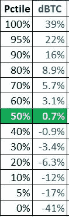
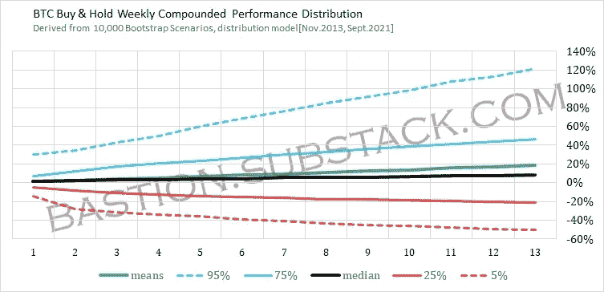
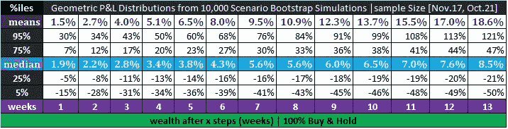

# 提升比特币的波动性

> 原文：<https://medium.com/coinmonks/bootstrapping-bitcoin-volatility-ae0374c9b71f?source=collection_archive---------15----------------------->

有很多关于“[比特币波动性](https://www.forbes.com/sites/cbovaird/2021/07/01/bitcoin-price-volatility-reached-a-14-month-high-in-june/)”的谈论，但头条新闻背后几乎没有什么实质内容。我们如何对比特币投资的未来表现有一个实际的、(可能的)更准确的感觉？

我在网上看到的一些常见问题/假设包括

*   比特币每年能涨 200%吗？
*   比特币会再次暴跌至 10k 美元吗？
*   “到圣诞节时，比特币将达到 10 万美元……”(这是在接近 9 月底时看到的，表明价格可能在 3 个月内获得 100%的回报，即在一个季度内约 400%的年化变动。)

我们如何回应这些问题和假设，至少在我们自己内部？

# 拔靴带

解决这个问题的方法之一是[自举](https://quantdare.com/bootstrapping-time-series-data/)，

> *…我们有效地从与当前样本的经验分布相匹配的分布中取样，这可以被看作是从实际人口分布中取样的近似。*

自采矿以来时间不长，需求增长已走出婴儿期，因此查看历史数据可能是不够的。我采取措施创建了一个 bootstrap 模拟比特币价格表现的大样本。

## 样本分布

我决定使用 11 月 17 日以来的每周 BTC 价格变化，大约是在 [CBOE /芝加哥商业交易所比特币期货](https://www.investopedia.com/news/bitcoin-futures-cboe-vs-cme-whats-difference/)开始交易的时候。我可能错了，只是感觉比特币开始被机构接受，被合法交易所认可。

*我没有包括 11 月 17 日之前的价格数据，因为我认为在比特币生命的这个阶段，不太可能看到爆炸性的需求增长和供应方的再次发展。如果你觉得我错了，就在下面的期待中加一点牛气:)*

以下是样本期(11 月 17 日，10 月 21 日)每周价格变化，分为定义的百分位数:

一些例子有助于理解这些百分点:

*   0%至-41%意味着这段时间最糟糕的一周 BTC 价格下跌了 41%
*   50%在+0.7%意味着在样本中间，基本上大多数周你都有+0.7%的收益
*   95%在+22%意味着在前 5%或样本的 5%中，BTC 有 22%或更多的收益。

## 自举过程

然后，我们可以模拟潜在的周回报，使用随机变量来生成与上述分布完全相同的每周回报。这将是下一部分的 1 个时间步。

然后，我们可以使用 13 个生成的每周步骤(符合样本分布)来创建假设的季度业绩。为了保持假设的投资业绩的实用性，在每一步之间假设[的几何回报](https://studyfinance.com/geometric-average-return/)。

*为什么是几何？因为在现实生活中，我们并不容易得到重置，例如，如果你在任何给定的季度内损失了 50%的投资资本，那么在下一个季度将需要 100%的收益来弥补损失。*

然后，我创建这些季度业绩系列的 10，000 次迭代(相当于 2500 年的假设价格数据)。这些是自举模拟。

## Bootstrap 性能系列统计

来自 10，000 个引导方案的统计数据:

## BTC 买入并持有实际预期

*   每季度预期收益中值约为**8.5%**；这意味着买入并持有的投资者将有理由预期大多数季度将以 8.5%的涨幅结束。在大多数年份，投资者的年化和季度复利预期应该在 38.6%左右。这远远超过了任何传统金融资产的预期收益。
*   对于投资者来说，25%到 75%的范围是最有可能的情况，也就是说，在大多数时间里，每个季度的预期收益在-21%到+47%之间。
*   121%的 95%意味着投资者每个季度都有 5%的机会获得 121%或更多。当它发生的时候会很甜蜜，虽然它大约每 5 年才会发生一次。我们需要问自己，我们的生命中还有多少个 5 年周期？
*   5%的回报率在**-50%**；这意味着每个季度有 5%的机会亏损 50%或更多。换句话说，每 4 年(20 个季度)左右，如果投资者不选择风险管理，他们预计会经历至少 50%的损失。
*   *每个季度的平均/均值收益率在****18.6%****。大多数统计学家、新交易者会把那作为***的期望值，并假定那会是他们“随着时间的推移”而获得的* [*的大数法则*](https://www.probabilitycourse.com/chapter7/7_1_1_law_of_large_numbers.php) *。与此同时，我认为我们需要诚实地问自己，我们真的有几千年的时间来等待“平均”预期吗？**

**本文最初创建于[https://bastion . substack . com/p/bit coin-volatility-expectations](https://bastion.substack.com/p/bitcoin-volatility-expectations)*

> *加入 Coinmonks [电报频道](https://t.me/coincodecap)和 [Youtube 频道](https://www.youtube.com/c/coinmonks/videos)了解加密交易和投资*

## *也阅读*

* [## 最佳加密交易所| 2021 年十大加密货币交易所

### ICON _ PLACEHOLDEREstimated 预计阅读时间:28 分钟加密货币交易所的加密交易需要知识…

blog.coincodecap.com](https://blog.coincodecap.com/crypto-exchange)  [## 2021 年 10 大最佳加密贷款平台| CoinCodeCap

### 当谈到加密货币贷款时，大量因素等同于良好的收入状况。此外，借款的一部分…

blog.coincodecap.com](https://blog.coincodecap.com/crypto-lending)  [## 2021 年最佳免费加密交易机器人

### 2021 年币安、比特币基地、库币和其他密码交易所的最佳密码交易机器人。四进制，位间隙…

medium.com](/coinmonks/crypto-trading-bot-c2ffce8acb2a)  [## 最佳 4 个加密交易信号电报通道

### 这是乏味的找到正确的加密交易信号提供商。因此，在本文中，我们将讨论最好的…

medium.com](/coinmonks/best-crypto-signals-telegram-5785cdbc4b2b)  [## BlockFi 评论 2021:利弊和利率| CoinCodeCap

### 今天，我们提出了一个全面的 BlockFi 评论，这是一个成立于 2017 年的加密贷款平台，拥有其…

blog.coincodecap.com](https://blog.coincodecap.com/blockfi-review)  [## 如何在印度购买比特币？2021 年购买比特币的 7 款最佳应用[手机版]

### 如何使用移动应用程序购买比特币印度

medium.com](/coinmonks/buy-bitcoin-in-india-feb50ddfef94)  [## 加密税务软件——五大最佳比特币税务计算器[2021]

### 不管你是刚接触加密还是已经在这个领域呆了一段时间，你都需要交税。

medium.com](/coinmonks/best-crypto-tax-tool-for-my-money-72d4b430816b)  [## 存储比特币的最佳加密硬件钱包[2021] | CoinCodeCap

### 保管您的数字资产很容易，但找到正确的存储方式却是一项繁琐的任务。在线钱包有一个风险…

blog.coincodecap.com](https://blog.coincodecap.com/best-hardware-wallet-bitcoin)*