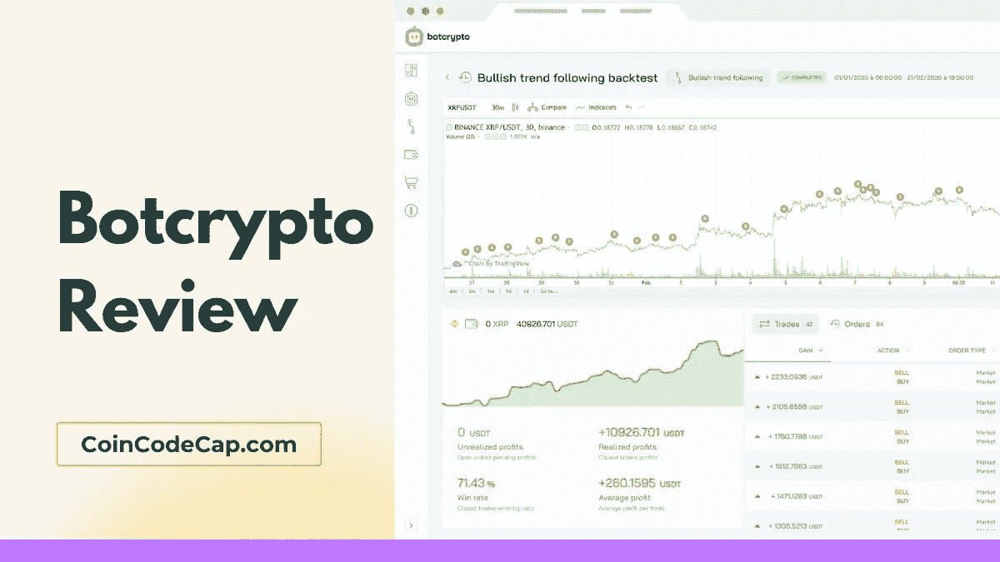
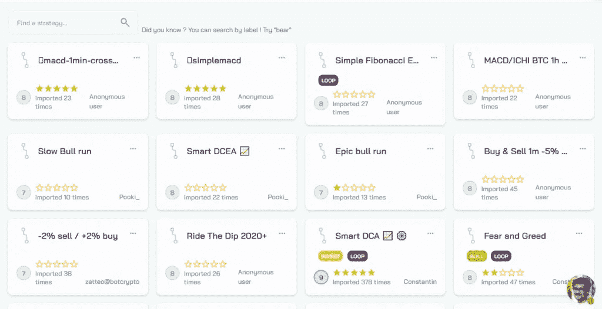
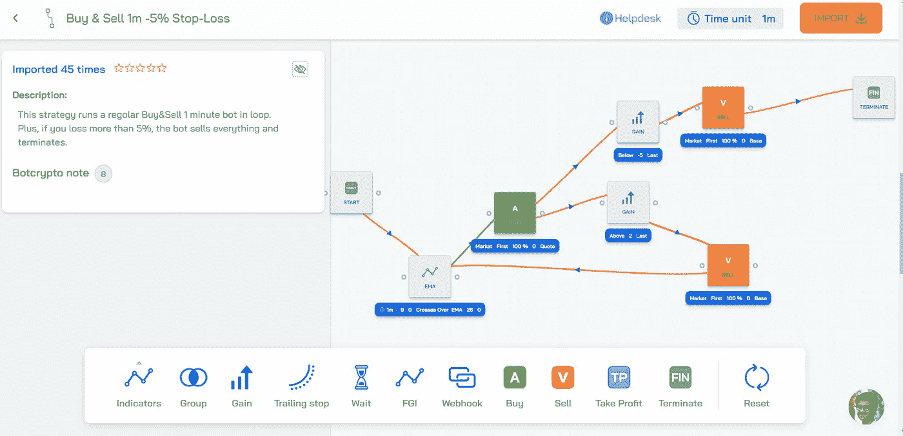
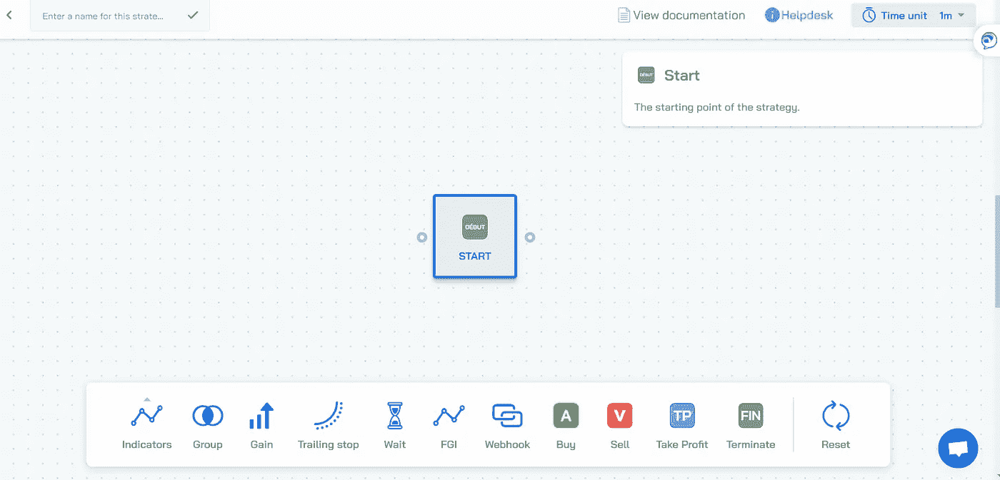
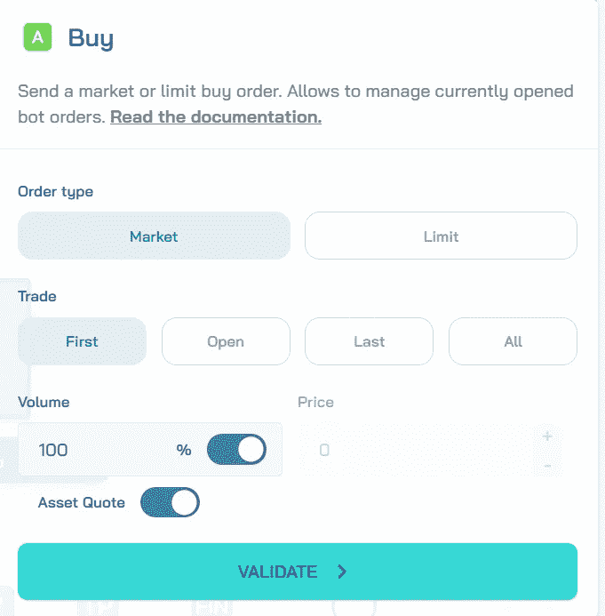
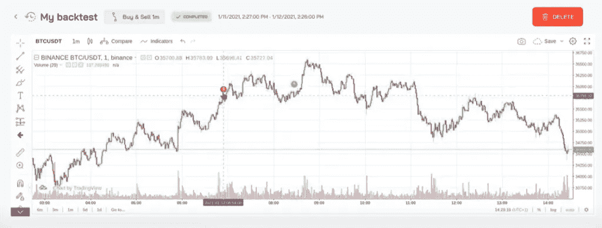
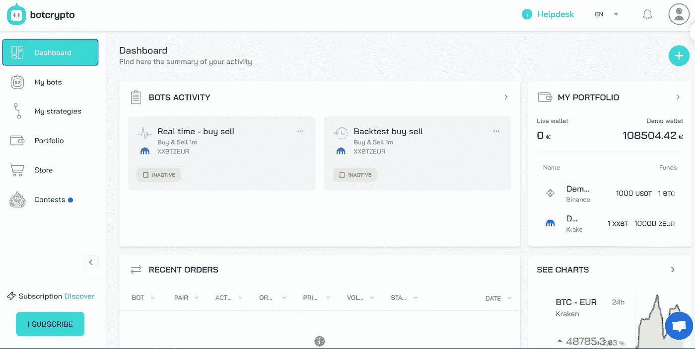
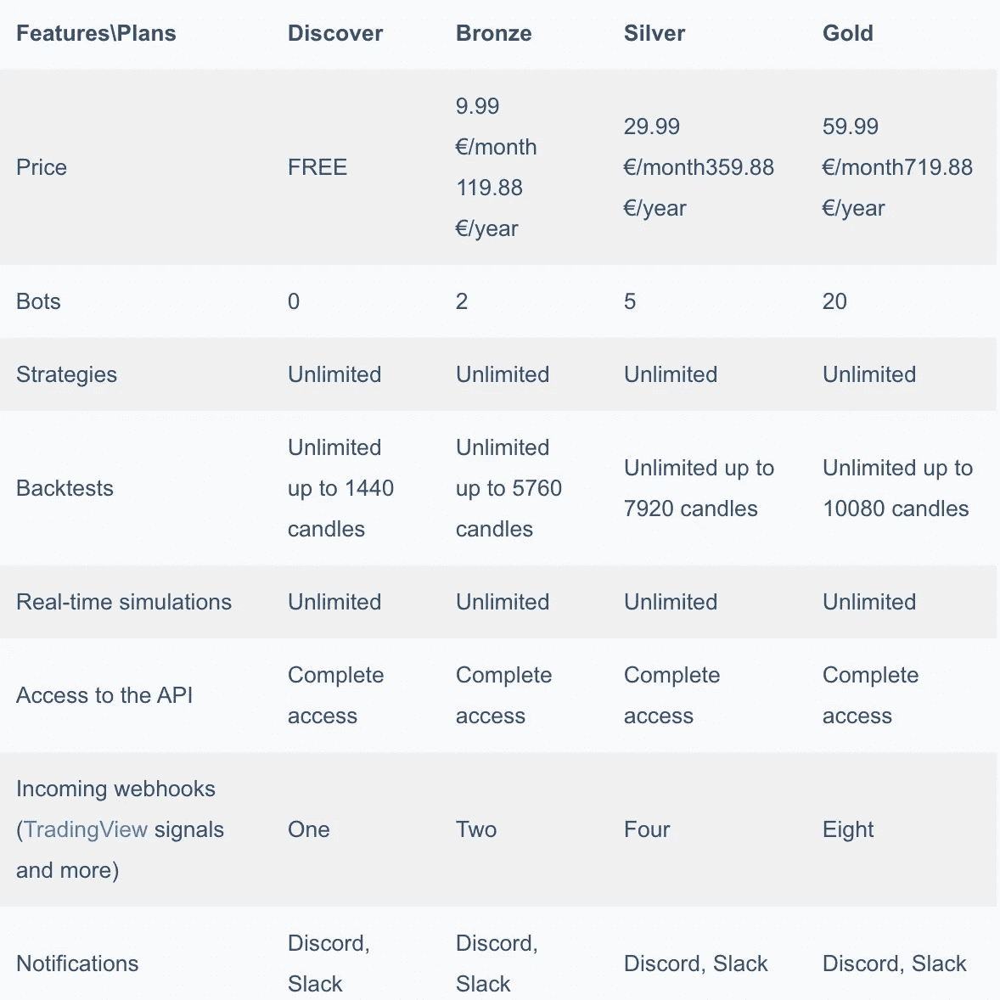

# Botcrypto 评论 2021 |构建您自己的交易机器人

> 原文：<https://medium.com/coinmonks/botcrypto-review-2021-build-your-own-trading-bot-coincodecap-6b8332d736c7?source=collection_archive---------2----------------------->

在本文中，我们将回顾 2017 年成立的交易服务，它提供交易机器人的创建和定制。他们在位于法国斯特拉斯堡的创业孵化器 semi a T1 孵化。

他们获得了多个创业奖项，并在 2020 年获得了[法国公共投资银行(Bpifrance)](https://www.bpifrance.com/) 的支持。

## 总结(TL；博士)

*   [Botcrypto](https://blog.coincodecap.com/go/botcrypto) 提供交易机器人的创建和定制。
*   Botcrypto 商店为初学者提供了六十多种预置策略。
*   您可以使用拖放编辑器[创建您的交易机器人，而无需编码](https://blog.coincodecap.com/best-crypto-trading-bots)。
*   回溯测试允许你在过去的数据上尝试策略。
*   交易内容帮助你从使用虚拟账户的交易者那里学习。

## 为什么要使用加密交易机器人？

对于密码交易，你需要对市场有一个正确的理解。你必须抓住正确的机会，因为它们不会持续太久。

[交易机器人](https://blog.coincodecap.com/best-crypto-trading-bots)是软件程序，使用预定义的算法帮助你在正确的时间对这些机会采取行动。这些算法可以根据您的需要定制。它们让你的交易体验自动化。这些机器人部署在云上，代表你全天候交易。

## 如何入门 Botcrypto？

1.  进入 [**Botcrypto**](https://blog.coincodecap.com/go/botcrypto) 创建一个账号。
2.  您可以从 [Botcrypto](https://blog.coincodecap.com/go/botcrypto) 商店中选择一个策略，或者使用可视化编辑器创建一个策略。
3.  用回溯测试来尝试你的策略。
4.  如果你对结果满意，那就订阅一份，然后真正开始吧。

## 僵尸密码商店

[**Botcrypto**](https://blog.coincodecap.com/go/botcrypto) 商店免费提供六十多种策略，帮助新手入门交易。你可以把这些策略按照流行度、 [Botcrypto](https://blog.coincodecap.com/go/botcrypto) note、大部分导入的来排序。

如果你有策略，也可以分享给社区。

点击一个策略，你可以查看所有的相关信息，如简短的描述，视觉流，它已经被导入的次数，以及 Botcrypto 注释。

你可以看到“eBuy & Sell 100 万-5%止损策略”的流程图示例。

## Botcrypto 评论:如何创建策略？

[**Botcrypto**](https://blog.coincodecap.com/go/botcrypto) 允许您使用可视化编辑器创建没有代码的策略。要创建策略，您需要点击“创建新策略”然后使用拖放，您可以添加块。

## 块的类型

*   开始和终止
*   技术指标—它们支持 20 多个指标。你可以点击查看[的完整列表。](https://botcrypto.crisp.help/en/article/all-about-indicators-4yj57g/)
*   跟踪止损——最大化损失相对于机器人收益的百分比。
*   获利
*   收益——相对于第一笔交易或最近交易的百分比收益。
*   等待 bot 在采取下一个操作之前必须等待的时间。它可以是一分钟、五分钟、十五分钟、三十分钟、一小时、两小时、四小时、六小时、十二小时和一天。
*   组—它们托管多个节点。有不同类型的组，“和”和“或”。若要使用“AND”进行验证，组必须满足“or”的所有条件和任何人条件
*   恐惧和贪婪指数(FGI)是一个多因素秘密市场情绪分析的情绪指标。数值范围从 0(极度恐惧)到 100(极度贪婪)。
*   由 webhooks 触发。它不允许每分钟通话超过一次。你可以阅读[详细指南](https://botcrypto.crisp.help/en/article/how-to-enable-webhook-notifications-8w0je2/)来了解如何配置它们。
*   动作积木——它们是买卖积木。您可以根据需要配置以下参数。

1.  订单类型—限价订单或市价订单。
2.  交易——它们允许你同时管理头寸。

*   第一，如果没有当前交易，它开始新的交易；否则，你必须建立一个订单来完成当前的第一笔交易。
*   打开-要开始新的交易，打开一个订单。
*   最后——如果没有当前交易，它开始一个新的交易，否则你必须建立一个订单来结束最近的交易。
*   全部——如果没有当前交易，它开始一个新的交易，否则你必须建立一个订单来关闭每个当前交易。

3.卷

4.价格

添加完积木后，你只需要用箭头将它们连接起来。单击验证策略，您的策略就准备好了！

## Botcrypto 评论:回溯测试

回溯测试引擎允许您使用过去的数据来尝试您的策略。您必须选择策略名称、交换、对和卷。

此外，您可以使用[预设功能](https://botcrypto.io/presets)来节省回溯测试的时间。它帮助你自动更新上述参数。

最重要的是，它向你展示了有价值的指标，如执行的交易，未实现和已实现的利润，胜率，以及每笔交易的平均利润。

## Botcrypto 交易机器人

在回溯测试显示积极的结果后，你可以创建交易机器人。这些机器人将在云上全天候运行。 [**Botcrypto**](https://blog.coincodecap.com/go/botcrypto) 支持 [**币安**](https://blog.coincodecap.com/go/binance) 和 [**北海巨妖**](https://blog.coincodecap.com/go/kraken) 。

一个 [**TradingView**](https://blog.coincodecap.com/go/tradingview) 小部件显示您的机器人正在实时执行的操作。你可以随时启动、停止和管理你的机器人。此外，您还可以创建人工订单。

它们允许你在一个不和谐的服务器上配置通知(或者每一个支持 webhooks 的服务)。

## 僵尸密码交易竞赛

[**Botcrypto**](https://blog.coincodecap.com/go/botcrypto) 每年都会组织几次比赛。他们使用虚拟账户，所以每个人都可以参与，而不会有丢失东西的风险。这是一个学习与其他交易者交易的绝佳场所。而且大部分时候结尾都有加密货币奖品。

## Botcrypto 评论:用户体验

[**Botcrypto**](https://blog.coincodecap.com/go/botcrypto) 提供了一个用户友好的界面。该网站支持英语和法语。dashboard 包含您所有交易的摘要。

## Botcrypto 评论:安全性

你的资金存放在各自的交易所。 [**Botcrypto**](https://blog.coincodecap.com/go/botcrypto) 使用 API 密钥连接到交换机，这些密钥采用最先进的安全性(AES-256)加密。他们不需要也不想要提款权。API 键)。

他们不使用谷歌分析或其他入侵跟踪器。使用开源分析工具 Matomo 。

此外，它们还支持[双因素认证、](https://en.wikipedia.org/wiki/Multi-factor_authentication)，但这不是强制性的。

## 僵尸加密定价

[**Botcrypto**](https://blog.coincodecap.com/go/botcrypto) 提供三种付费计划和一种免费计划。

此外，他们还提供具有定制功能的专业计划，没有上限。你可以联系他们。

## Botcrypto 客户支持

你可以通过 [support@botcrypto.io](mailto:support@botcrypto.io) 给他们写信。该网站支持实时聊天。您也可以致电+33 7 56 98 92 67 联系他们

他们也可以在推特上找到。他们的 [Youtube](https://www.youtube.com/channel/UCtlZzVEoghpGJM_RcKUw_oQ/videos) 频道有教程帮助你入门僵尸加密。

[**Botcrypto**](https://blog.coincodecap.com/go/botcrypto) 管理着一个 [Discord server](https://discord.com/invite/8xDp3fa) 那里有五百多名交易员。这是一个寻求建议和反馈的绝佳场所。

## Botcrypto 评论:利弊

**优点**

*   易于使用的界面
*   不需要安装
*   免费回溯测试和模拟
*   强大的社区
*   学习交易课程
*   使用可视化编辑器创建策略

**缺点**

*   支持有限的交换。
*   僵尸加密商店提供有限的策略。

## Botcrypto 审查:结论

[**Botcrypto**](https://blog.coincodecap.com/go/botcrypto) 允许你创建和个性化[交易机器人](https://blog.coincodecap.com/best-crypto-trading-bots)。它帮助你不用编码就能自动操作你的交易策略。可视化编辑器有一个拖放编辑器，带有技术指标、webhooks、止盈、跟踪止损、等待等等。

你可以通过回溯测试获得无风险的即时反馈。平台是安全的。如果你是初学者，有许多资源可供你学习。交易比赛帮助你从使用虚拟账户的交易者那里学习。此外，他们有一个非常活跃和有益的社区。

# 常见问题

我可以在 Botcrypto 上做什么？

[**Botcrypto**](https://blog.coincodecap.com/go/botcrypto) 允许你使用可视化编辑器创建和个性化[没有代码的交易机器人](https://blog.coincodecap.com/best-crypto-trading-bots)。回溯测试允许你用过去的数据来测试你的策略。这个平台非常安全。此外，如果你是初学者，有很多学习机会。

我不是交易者；我可以用僵尸密码吗？

如果你不知道如何交易，但想交易，那你来对地方了。Botcrypto 为交易机器人、教育内容和有益的社区提供了预先构建的策略。你将能够学得很快，并开始[创建交易机器人](https://blog.coincodecap.com/best-crypto-trading-bots)。

**支持哪些加密货币和交易所？**

目前，Botcrypto 支持北海巨妖和币安的所有加密货币。他们计划在接下来的几个月增加新的交易所。你可以在网站上投票。

**bot crypto 支持哪些技术指标？**

Botcrypto 支持 20 多个技术指标，如 RSI、MACD、Ichimoku 云、布林线、(指数)移动平均线、漩涡、恐惧和贪婪指数等。

**bot crypto 安全合法吗？我的资金安全吗？**

你的资金存放在各自的交易所。为了连接到您的 exchange 帐户，Botcrypto 使用 API 密钥。他们不需要也不想要退出权。API 密钥使用最先进的安全性(AES-256)进行加密。

【Botcrypto 有手机 app 吗？

Botcrypto 不提供移动应用程序。不过，你可以通过手机访问该网站。webhook 通知可帮助您在旅途中获得通知。

*   [什么是比特币交易机器人？2021 年完整指南](https://blog.coincodecap.com/a-guide-to-cryptocurrency-trading-bots)
*   [2021 年赚钱的最佳加密交易机器人(综述)](https://blog.coincodecap.com/best-crypto-trading-bots)
*   [Trality Review 2021 |免费编写你的下一个盈利交易机器人](https://blog.coincodecap.com/trality-review)

> 加入 Coinmonks [Telegram group](https://t.me/joinchat/EPmjKpNYwRMsBI4p) 并了解加密交易和投资

## 另外，阅读

*   [什么是融资融券交易](https://blog.coincodecap.com/margin-trading)
*   最好的[密码交易机器人](/coinmonks/crypto-trading-bot-c2ffce8acb2a) | [网格交易](https://blog.coincodecap.com/grid-trading)
*   [3 商业评论](/coinmonks/3commas-review-an-excellent-crypto-trading-bot-2020-1313a58bec92) | [Pionex 评论](/coinmonks/pionex-review-exchange-with-crypto-trading-bot-1e459d0191ea) | [Coinrule 评论](/coinmonks/coinrule-review-2021-a-beginner-friendly-crypto-trading-bot-daf0504848ba)
*   [AAX 交易所评论](/coinmonks/aax-exchange-review-2021-67c5ea09330c) | [德里比特评论](/coinmonks/deribit-review-options-fees-apis-and-testnet-2ca16c4bbdb2) | [FTX 交易所评论](/coinmonks/ftx-crypto-exchange-review-53664ac1198f)
*   [n 零审核](/coinmonks/ngrave-zero-review-c465cf8307fc) | [Phemex 审核](/coinmonks/phemex-review-4cfba0b49e28) | [PrimeXBT 审核](/coinmonks/primexbt-review-88e0815be858)
*   [Bybit Exchange 审查](/coinmonks/bybit-exchange-review-dbd570019b71) | [Bityard 审查](/coinmonks/bityard-review-7d104239be35) | [CoinSpot 审查](https://blog.coincodecap.com/coinspot-review)
*   [3 commas vs crypto hopper](/coinmonks/3commas-vs-pionex-vs-cryptohopper-best-crypto-bot-6a98d2baa203)|[赚取加密利息](/coinmonks/earn-crypto-interest-b10b810fdda3)
*   最好的比特币[硬件钱包](/coinmonks/the-best-cryptocurrency-hardware-wallets-of-2020-e28b1c124069?source=friends_link&sk=324dd9ff8556ab578d71e7ad7658ad7c) | [BitBox02 回顾](/coinmonks/bitbox02-review-your-swiss-bitcoin-hardware-wallet-c36c88fff29)
*   [莱杰 vs n rave](/coinmonks/ledger-vs-ngrave-zero-7e40f0c1d694)|[莱杰 nano s vs x](/coinmonks/ledger-nano-s-vs-x-battery-hardware-price-storage-59a6663fe3b0)
*   [密码本交易平台](/coinmonks/top-10-crypto-copy-trading-platforms-for-beginners-d0c37c7d698c)
*   [CoinLoan 评论](/coinmonks/coinloan-review-18128b9badc4) | [YouHodler 评论](/coinmonks/youhodler-4-easy-ways-to-make-money-98969b9689f2) | [BlockFi 评论](/coinmonks/blockfi-review-53096053c097)
*   最好的[加密税务软件](/coinmonks/best-crypto-tax-tool-for-my-money-72d4b430816b) | [硬币追踪评论](/coinmonks/cointracking-review-a-reliable-cryptocurrency-tax-software-5114e3eb5737)
*   最佳[加密借贷平台](/coinmonks/top-5-crypto-lending-platforms-in-2020-that-you-need-to-know-a1b675cec3fa) | [杠杆令牌](/coinmonks/leveraged-token-3f5257808b22)
*   [block fi vs Celsius](/coinmonks/blockfi-vs-celsius-vs-hodlnaut-8a1cc8c26630)|[Hodlnaut 审查](/coinmonks/hodlnaut-review-best-way-to-hodl-is-to-earn-interest-on-your-bitcoin-6658a8c19edf)
*   [Bitsgap 审查](/coinmonks/bitsgap-review-a-crypto-trading-bot-that-makes-easy-money-a5d88a336df2) | [Quadency 审查](/coinmonks/quadency-review-a-crypto-trading-automation-platform-3068eaa374e1) | [Bitbns 审查](/coinmonks/bitbns-review-38256a07e161)
*   [埃利帕尔泰坦评论](/coinmonks/ellipal-titan-review-85e9071dd029) | [赛克斯斯通评论](/coinmonks/secux-stone-hardware-wallet-review-15-discount-coupon-2020-7577032faa6e)
*   [本地比特币评论](/coinmonks/localbitcoins-review-6cc001c6ed56) | [加密货币储蓄账户](https://blog.coincodecap.com/cryptocurrency-savings-accounts)
*   最佳[区块链分析](https://bitquery.io/blog/best-blockchain-analysis-tools-and-software)工具| [赚比特币](/coinmonks/earn-bitcoin-6e8bd3c592d9)
*   [加密套利](/coinmonks/crypto-arbitrage-guide-how-to-make-money-as-a-beginner-62bfe5c868f6)指南| [如何做空比特币](/coinmonks/how-to-short-bitcoin-568a2d0b4ae5)
*   最佳[加密制图工具](/coinmonks/what-are-the-best-charting-platforms-for-cryptocurrency-trading-85aade584d80) | [最佳加密交易所](/coinmonks/crypto-exchange-dd2f9d6f3769)
*   [如何在印度购买比特币？](/coinmonks/buy-bitcoin-in-india-feb50ddfef94) | [瓦济克斯评论](/coinmonks/wazirx-review-5c811b074f5b)
*   [印度比特币交易所](/coinmonks/bitcoin-exchange-in-india-7f1fe79715c9) | [比特币储蓄账户](/coinmonks/bitcoin-savings-account-e65b13f92451)
*   [CoinDCX 评论](/coinmonks/coindcx-review-8444db3621a2) | [加密保证金交易交易所](https://blog.coincodecap.com/crypto-margin-trading-exchanges)

> [直接在您的收件箱中获得最佳软件交易](/coinmonks/newsletters/coinmonks)

*原载于 2021 年 3 月 24 日 https://blog.coincodecap.com***。**