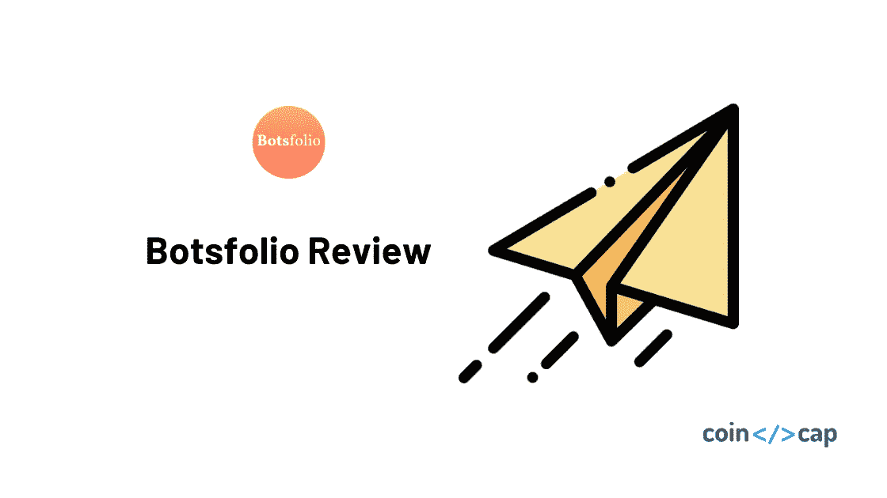
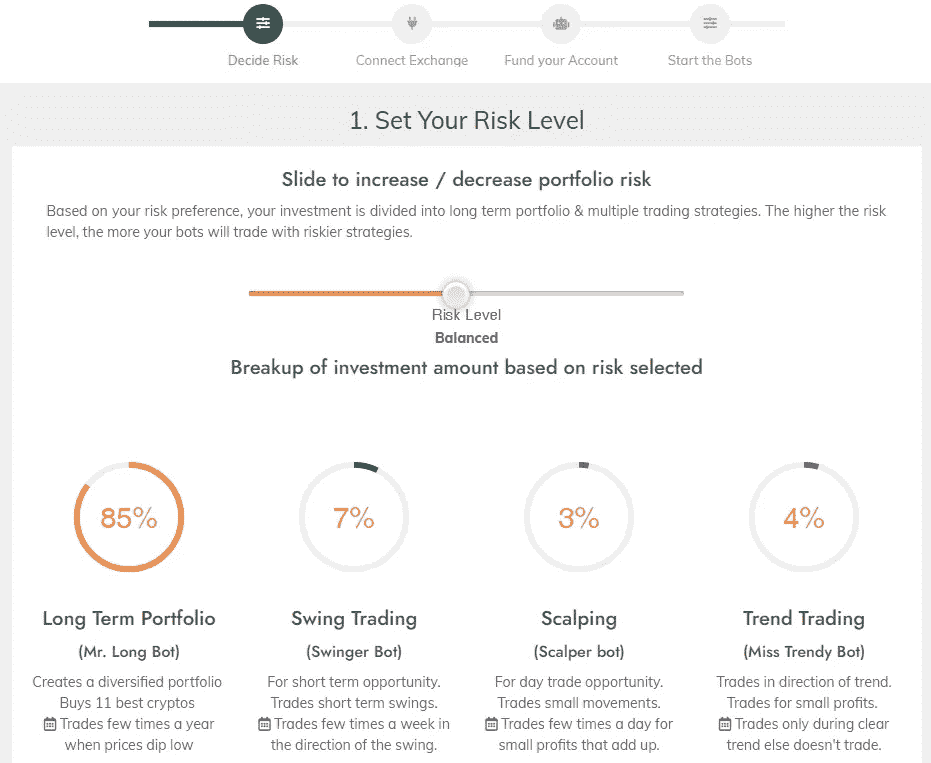
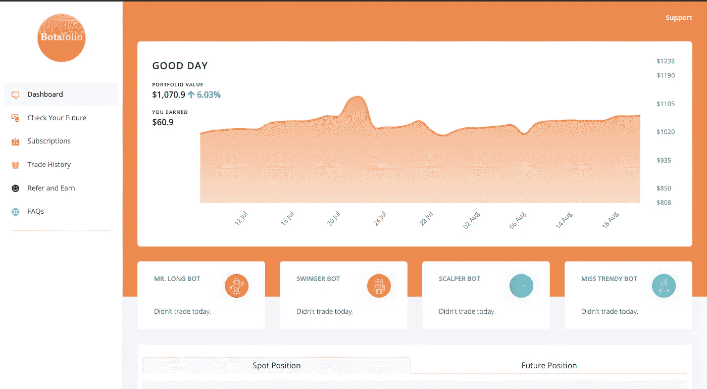
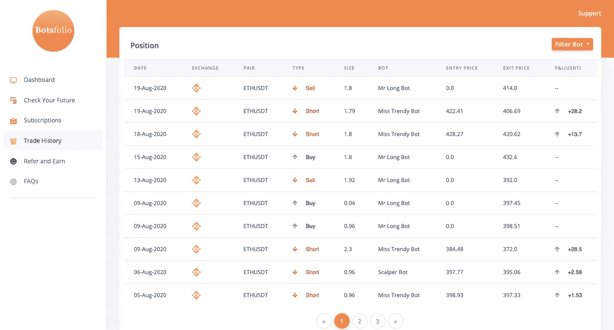

# Botsfolio Review —自动化您的加密投资的简单方法

> 原文：<https://medium.com/coinmonks/botsfolio-review-simple-way-to-automate-your-crypto-investment-6bebea5614af?source=collection_archive---------0----------------------->

Botsfolio review

在这篇文章中，我们将回顾 [Botsfolio](http://botsfolio.com/?coupon=gaurav8) ，它为您提供了预建的交易机器人，以自动化您的加密投资组合回报。

# 总结(TL；博士)

*   [Botsfolio](http://botsfolio.com/?coupon=gaurav8) 在没有任何技术或策略设置的情况下，自动化您的加密资产的投资组合构建和期货交易。
*   不需要配置/输入，设置你的风险等级，机器人就开始为你交易。
*   安全——资金或资产永远不会离开您的交易所。
*   目前只对币安有效。
*   基于由机器人管理的净投资组合的定价。

> [**订购享受七五折优惠**](https://botsfolio.com/?coupon=gaurav8)

# 将加密交易机器人推向大众

如果像[比特币](https://blog.coincodecap.com/a-candid-explanation-of-bitcoin)和以太坊这样的加密货币能够达到苹果或谷歌这样的热门股票的市值。这将要求大众对加密技术进行长期投资，并获得比股票更好的回报。

然而，作为一个动荡的市场，新手投资者和交易者发现很难把握加密货币的进出时机。

更不用说知道你的[加密投资组合](https://coincodecap.com/category/portfolio-management)可能在一天内上涨或下跌 40%,晚上还能睡得着觉的风险偏好。

今天，我们回顾一下这样一个工具，它让加密投资变得更加简单和智能。

并使非交易者能够放心投资，同时降低投资组合的波动性。

# 密码的简单财富

[Botsfolio](http://botsfolio.com/?coupon=gaurav8) 是一个独特的加密投资工具，它为非技术和非交易者社区自动进行交易和投资。

它使投资加密像连接你的币安账户一样简单。一旦链接，你的开箱即用机器人买卖顶级密码(BTC，瑞士联邦理工学院，和其他)，以建立一个多元化的投资组合。

[交易机器人](https://blog.coincodecap.com/a-guide-to-cryptocurrency-trading-bots)在开始或之后不需要任何配置或策略输入。任何拥有币安账户的人都可以使用这些机器人，不需要任何交易或技术技能。

因为 Weathsimple 将您的资金分散到不同的指数基金中。Botsfolio 将你的资金分散到一个机器人投资组合(因此得名——Botsfolio)中，在不同的时间框架内使用不同的交易策略运行。

作为用户，你有 4 个机器人，每个都有自己的交易策略，它们并行运行。这 4 个机器人是

*   **长期投资**——寻找长期买卖机会，用你净投资的 80%到 90%逐步建立你的投资组合。投资约 10 种加密技术，按因素/使用案例进行分类。
*   **黄牛机器人**——利用小机会倒卖，每隔几个小时从非常小的价格波动中赚几美元。
*   **摇摆机器人**——决定一个方向的价格波动，在更长的时间内建立更大的头寸，每周或每月获利几次。
*   时髦机器人 —寻找清晰的价格变动范围，并在市场以清晰的趋势运行时交易。
*   **对冲机器人—** 等待高波动性，以获得对冲头寸并从期货中赚取资金，直到基础资产采取明确的方向，然后取消交易的一部分。

> ***也读作:*** [***不同类型的密码交易僵尸工具***](https://blog.coincodecap.com/different-types-of-crypto-trading-bots)

# 降低普通投资者的风险

为了吸引更多投资者进入 crypto，Botsfolio 采取了一系列措施来降低普通投资者的风险。

Botsfolio 处理加密市场固有的波动性，旨在减少和消除新手投资者经常承担的所有不必要的风险。

*   当市场波动性高时，机器人可以对冲你的投资组合，以保护你的净值(基于你的风险设置)
*   对于低风险偏好的用户，机器人可以进行跨界交易，从你的头寸中赚取固定资金，同时保持价格波动风险为零。
*   这些机器人只使用一小部分资金进行期货交易，以增加回报，同时最大限度地降低资本风险。使用期货时最大的威胁——清算由自动止损单处理。
*   如果投资组合净值低于初始投资，机器人会自动调整风险，以较小的金额进行很少的交易，直到原始投资额恢复。

# 利弊

# 赞成的意见

*   不需要像其他工具如 [TradeSanta](https://blog.coincodecap.com/tradesanta-crypto-trading-bot-review) 或 [3commas](https://blog.coincodecap.com/3commas-review-an-excellent-crypto-trading-bot) 一样在机器人中输入策略和设置机器人参数。
*   建立一个多元化的加密投资组合，逢低买入，高价卖出，让你的净值随着时间自动增长。
*   当市场根据你的风险水平建立了一个明确的趋势，给你的加密投资组合一个优势时，机器人交易期货
*   当市场横向移动以赚取期货资金时，机器人也可以采取对冲头寸。
*   比大多数竞争对手定价更低，同时提供更多价值。

# 骗局

*   只对币安有效。将来可能会添加其他交换。
*   需要最低投资 1000 系绳开始。
*   在我们的测试中，它主要交易 ETHUSDT 对期货。

# 表演

虽然这种工具的性能取决于许多因素(市场条件、投入的资金、风险状况)。

我们只能评估投资组合构建中的期货交易部分。我们发现，对于我们来说，每笔亏损交易的盈利交易都是两倍以上，或者说所有交易中约 70%是盈利的，这给我们带来了 5.5%的净投资回报率(每月)或 66%的年回报率。

上面引用的回报只是来自期货交易机器人，它只使用净投资的 10%到 20%。由于在我们的测试期间没有购买机会，我们大约 80%的资本没有部署并保持流动性。我们猜测，如果我们停留更长时间，机器人会购买一些投资组合硬币，每当这种情况发生时，净回报的上升会高得多。

**免责声明**:请注意，上面引用的回报来自一个小测试期。过去的表现不是未来结果的指标。

> ***也读作:*** [***为你的加密组合制定再平衡策略***](https://blog.coincodecap.com/crypto-portfolio-rebalancing)

# 定价

管理 1000 美元的投资，这项服务的起价为每月 18 美元，但一旦所有资金都投入到投资组合中，价格就会涨到每月 20 美元。

价格比大多数[加密机器人服务](https://coincodecap.com/category/trading-automation)要低，在这些服务中，用户必须设置策略来运行机器人。因此，Botsfolio 显然为您的钱提供了更多的帮助。

价格随着投资组合价值的增加而增加，对于 50，000 美元的投资组合管理，价格上升到每月 72 美元。

# 安全性

虽然所有的交易都在交易所(币安)进行，但资产也保留在交易所。

一个 API 被用来连接币安和机器人，允许他们为你下买卖订单。

该 API 已被禁用，因此任何使用该 API 的人都不能从您的 exchange 帐户中取出加密资产。API 密钥以加密形式存储。

即使被盗(比如在黑客入侵的情况下)，黑客也不可能用这些密钥把你的钱转到另一个钱包里。因此，据我们了解，该系统是相当安全的。

# 最后的想法

Botsfolio 可以在不增加风险的情况下为新手投资者创造奇迹。

即使对于专业投资者来说，这种基于订阅的服务也可以提高他们的投资组合回报，同时节省他们盯着图表的时间。

对于在 2018 年泡沫期间购买 crypto 的用户来说，这也非常有用，他们现在可以使用这项服务来提高他们的回报。

唯一的缺点是，它目前只适用于币安，你没有办法在使用这项服务时转移你的资产，比如说一个冰冷的钱包。但我们希望他们将来会增加对其他交易所的支持。

让我们知道你对 Botsfolio 评论的看法。或者在 CoinCodeCap 上写一篇[评论。](https://coincodecap.com/product/botsfolio-7)

# Botsfolio 替代品

1.  [3commas](https://3commas.io/?c=tc252152) 是一个在线平台，面向对使用自动机器人进行[加密货币交易](https://blog.coincodecap.com/tag/trading/)感兴趣的人。对于没有金融技术背景或没有丰富股市经验的人来说，这尤其具有吸引力。另外，请阅读我们的[3 商业评论](/coinmonks/3commas-review-an-excellent-crypto-trading-bot-2020-1313a58bec92)。
2.  [Bitsgap](https://bitsgap.com/?ref=2cb1231&utm_source=coincodecap&utm_medium=article&utm_campaign=promo) ，满足您所有交易需求的一站式加密交易平台。它允许用户将他们所有的密码交易账户放在同一个屋檐下，通过一个集成的界面进行交易。另外，请阅读我们的 [Bitsgap 评论](/coinmonks/bitsgap-review-a-crypto-trading-bot-that-makes-easy-money-a5d88a336df2)。
3.  [Quadency](https://quadency.com/?r=ea20aa360c45d1f5ad47a19a) ，2018 年推出的密码交易自动化平台。它给你带来了一个更聪明的方式来交易和管理你的密码。另外，请阅读我们的[季度回顾](https://blog.coincodecap.com/quadency-review-a-crypto-trading-automation-platform)。

## 另外，阅读

*   最好的[密码交易机器人](/coinmonks/crypto-trading-bot-c2ffce8acb2a)
*   [密码本交易平台](/coinmonks/top-10-crypto-copy-trading-platforms-for-beginners-d0c37c7d698c)
*   最好的[加密税务软件](/coinmonks/best-crypto-tax-tool-for-my-money-72d4b430816b)
*   [最佳加密交易平台](/coinmonks/the-best-crypto-trading-platforms-in-2020-the-definitive-guide-updated-c72f8b874555)
*   最佳[密码借贷平台](/coinmonks/top-5-crypto-lending-platforms-in-2020-that-you-need-to-know-a1b675cec3fa)
*   [最佳区块链分析工具](https://bitquery.io/blog/best-blockchain-analysis-tools-and-software)
*   [加密套利](/coinmonks/crypto-arbitrage-guide-how-to-make-money-as-a-beginner-62bfe5c868f6)指南:新手如何赚钱
*   最佳[加密制图工具](/coinmonks/what-are-the-best-charting-platforms-for-cryptocurrency-trading-85aade584d80)
*   [莱杰 vs 特雷佐](/coinmonks/ledger-vs-trezor-best-hardware-wallet-to-secure-cryptocurrency-22c7a3fd391e)
*   了解比特币的[最佳书籍有哪些？](/coinmonks/what-are-the-best-books-to-learn-bitcoin-409aeb9aff4b)
*   [3 商业评论](/coinmonks/3commas-review-an-excellent-crypto-trading-bot-2020-1313a58bec92)
*   [AAX 交易所评论](/coinmonks/aax-exchange-review-2021-67c5ea09330c) |推荐代码、交易费用、利弊
*   [Deribit 审查](/coinmonks/deribit-review-options-fees-apis-and-testnet-2ca16c4bbdb2) |选项、费用、API 和 Testnet
*   [FTX 密码交易所评论](/coinmonks/ftx-crypto-exchange-review-53664ac1198f)
*   [n 零审核](/coinmonks/ngrave-zero-review-c465cf8307fc)
*   [Bybit 交换审查](/coinmonks/bybit-exchange-review-dbd570019b71)
*   [3Commas vs Cryptohopper](/coinmonks/cryptohopper-vs-3commas-vs-shrimpy-a2c16095b8fe)
*   最好的比特币[硬件钱包](/coinmonks/the-best-cryptocurrency-hardware-wallets-of-2020-e28b1c124069?source=friends_link&sk=324dd9ff8556ab578d71e7ad7658ad7c)
*   最佳 [monero 钱包](https://blog.coincodecap.com/best-monero-wallets)
*   [莱杰 nano s vs x](https://blog.coincodecap.com/ledger-nano-s-vs-x)
*   [bits gap vs 3 commas vs quad ency](https://blog.coincodecap.com/bitsgap-3commas-quadency)
*   [莱杰纳米 S vs 特雷佐 one vs 特雷佐 T vs 莱杰纳米 X](https://blog.coincodecap.com/ledger-nano-s-vs-trezor-one-ledger-nano-x-trezor-t)
*   [block fi vs Celsius](/coinmonks/blockfi-vs-celsius-vs-hodlnaut-8a1cc8c26630)vs Hodlnaut
*   [Bitsgap 评论](/coinmonks/bitsgap-review-a-crypto-trading-bot-that-makes-easy-money-a5d88a336df2)——一个轻松赚钱的加密交易机器人
*   为专业人士设计的加密交易机器人
*   [PrimeXBT 审查](/coinmonks/primexbt-review-88e0815be858) |杠杆交易、费用和交易
*   [埃利帕尔泰坦评论](/coinmonks/ellipal-titan-review-85e9071dd029)
*   [SecuX Stone 评论](https://blog.coincodecap.com/secux-stone-hardware-wallet-review)
*   [BlockFi 评论](/coinmonks/blockfi-review-53096053c097) |从您的密码中赚取高达 8.6%的利息

*原载于 2020 年 8 月 24 日*[*https://blog.coincodecap.com*](https://blog.coincodecap.com/botsfolio-review-automate-crypto-investment)T22。