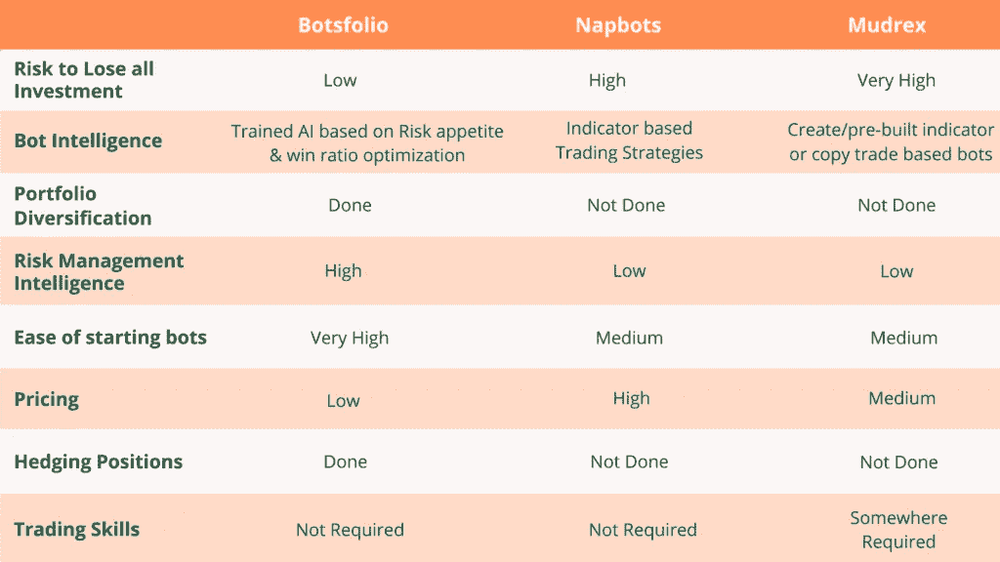
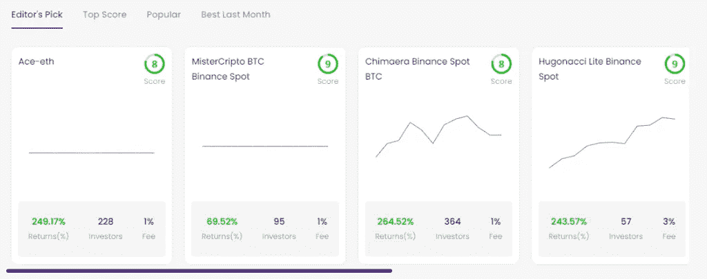
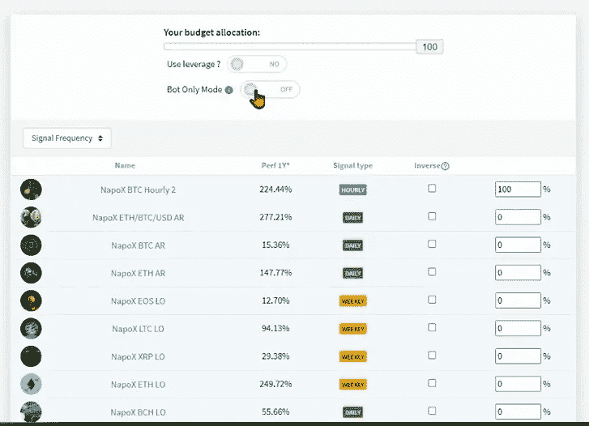
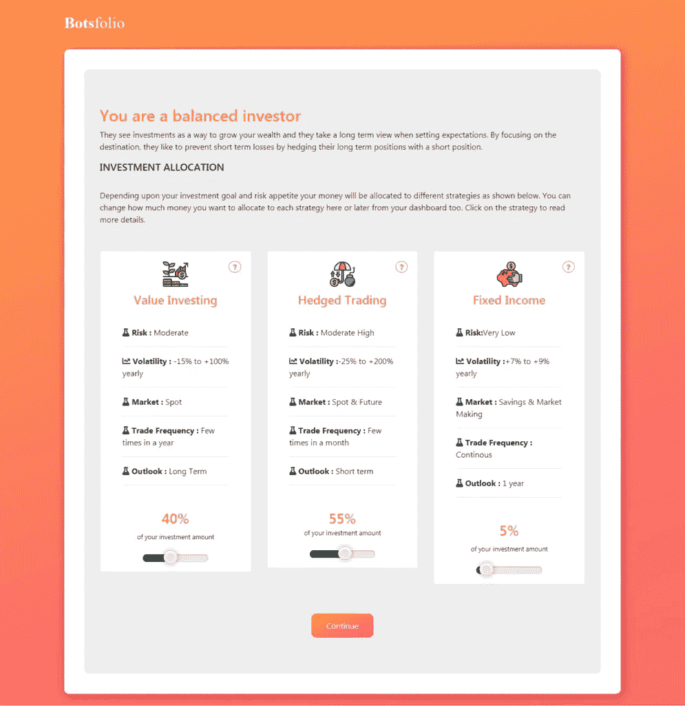
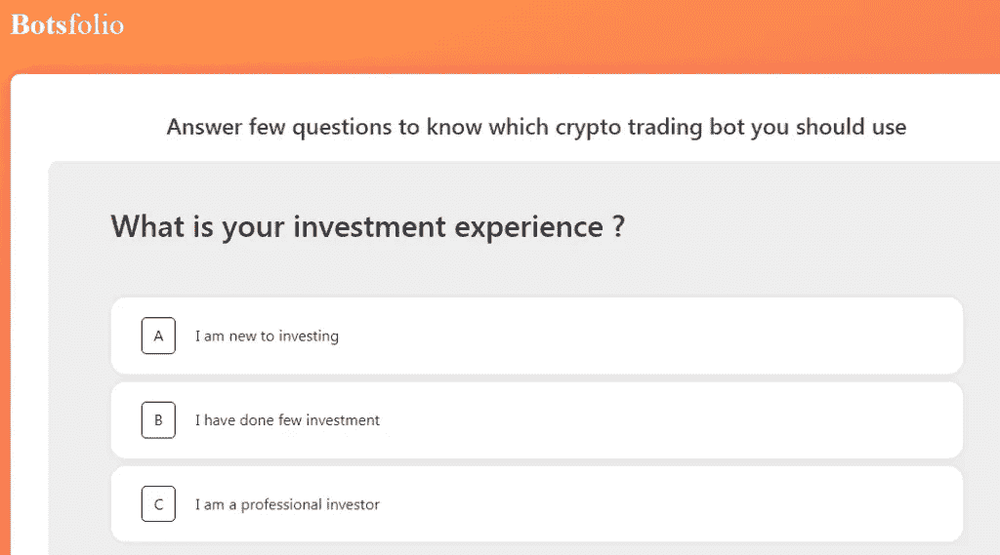
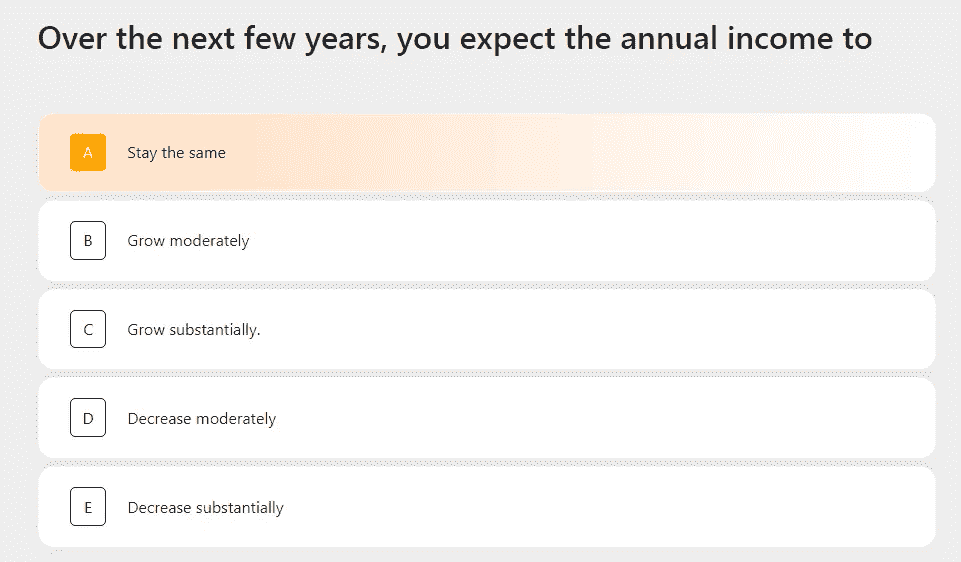
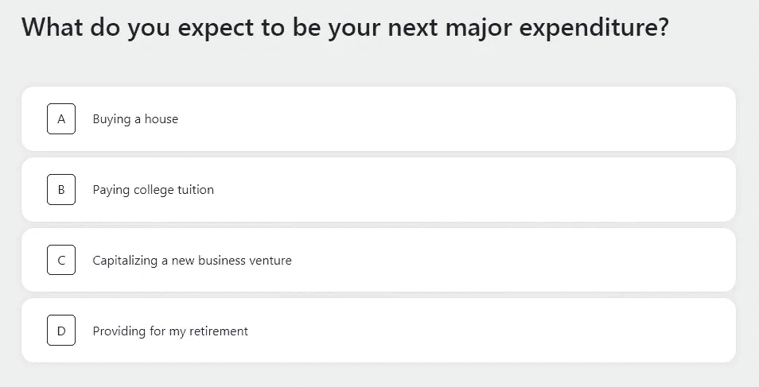
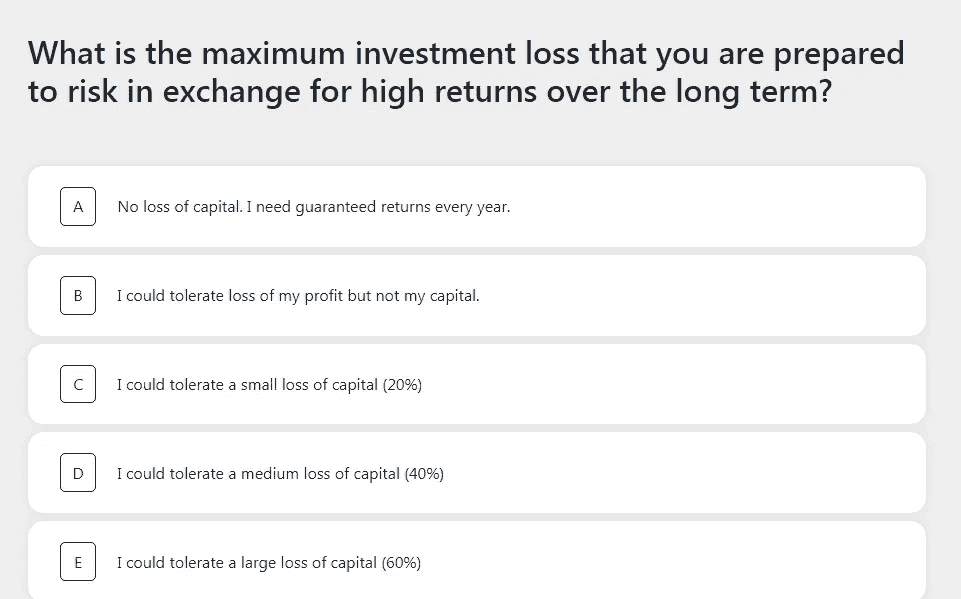
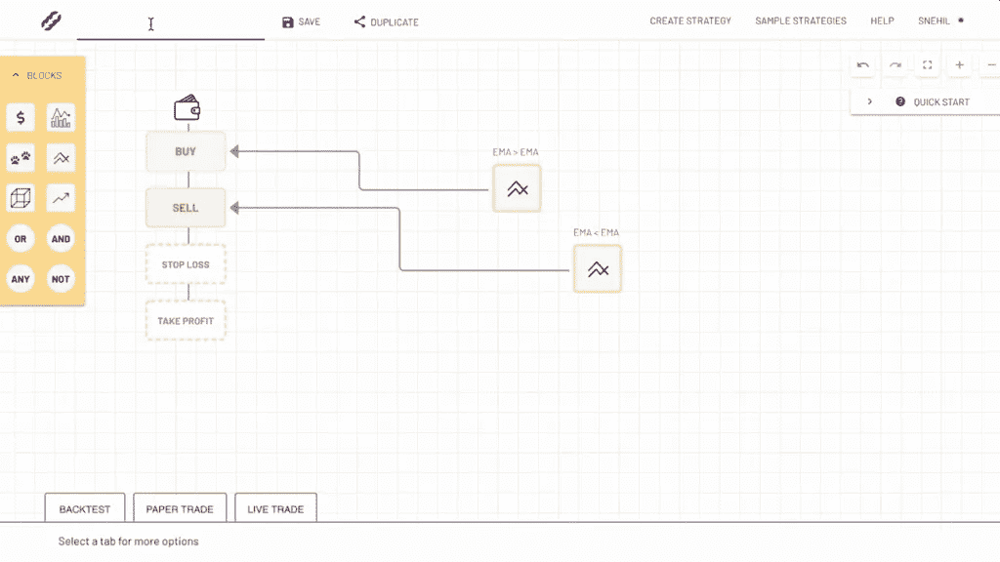

# Botsfolio vs Napbots vs Mudrex |你的钱放在哪里？

> 原文：<https://medium.com/coinmonks/botsfolio-vs-napbots-vs-mudrex-c81344970c02?source=collection_archive---------4----------------------->

我们都听说过这样的故事:加密交易机器人有多神奇，它们如何以最少的麻烦和最少的投资为你带来巨大的利润。需要明确的是，这并不完全正确，甚至从来没有这么简单。但是当然这三个平台( [**Botsfolio**](https://blog.coincodecap.com/go/botsfolio) **，**[**Mudrex**](https://blog.coincodecap.com/go/mudrex)**，** [**Napbots**](https://blog.coincodecap.com/go/napbots) )我们将讨论做一个相当不错的尝试:提供一个可靠、值得信赖且易于使用的自动加密交易机器人服务。

# 总结:Botsfolio vs Mudrex vs Napbots

这些[自动加密机器人交易系统](https://blog.coincodecap.com/best-crypto-trading-bots)中的每一个都接入市场(本质上是[加密交易所](https://blog.coincodecap.com/go/crypto-exchange))，持续监控交易机会。这些加密机器人交易平台采用一系列复杂程度和成功程度不同的算法，试图代表你预测和执行有利可图的交易。

下面让我们粗略地检查一下 [Botsfolio](https://blog.coincodecap.com/go/botsfolio) 、 [Mudrex](https://blog.coincodecap.com/go/mudrex) 和 [Napbots](https://blog.coincodecap.com/go/napbots) 之间的区别，然后再详细检查每一个:

# 失去所有投资的风险

Botsfolio 的一个独特之处在于其风险管理智能。根据你的风险偏好，人工智能将决定是否进入交易，并根据市场波动，硬币的价格，长期机会等决定交易的头寸数量。

它使用对冲而不是止损。在这样一个动荡的市场中，止损要么太大，要么经常被触及，即使从长期来看没有趋势变化。这就确保了即使 Botsfolio 损失了你所有的投资，它也必须在几年内进行数千笔亏损交易。

对于 Napbots 和 T2 mud rex 来说，要么是固定的，要么由你或专业交易者决定。对于预建的&副本交易，每笔交易的持仓金额&止损通常相同。这使得他们的风险更大，因为很少有连续亏损的交易会导致 50%的退款，并最终在几个月内损失 90%。

# 机器人智能

随着时间的推移，加密机器人正在进化，变得越来越聪明。 [**Napbots**](https://blog.coincodecap.com/go/napbots) 提供基于指标的机器人，它们在不同的时间框架内交易，如每小时、每天、每周。这些通常是硬编码的规则，当选择的指标达到特定值时，输出买入或卖出信号。

[**Mudrex Invest**](https://blog.coincodecap.com/go/mudrex) 提供由其他交易者定制或复制他们交易的机器人。这种方法更像是一种混合方法，你可以使用基于指标的机器人，或者只是复制另一个有良好交易历史的交易者的交易。

[**Botsfolio**](https://blog.coincodecap.com/go/botsfolio) 使用人工智能，根据您的风险偏好，优化人工智能以赢得更多交易。它使用历史和实时交易数据来过滤未来有很大胜算的交易。然后，根据你的风险偏好，它将决定特定交易的敞口数量。

# 投资组合多样化

[**Mudrex invest**](https://blog.coincodecap.com/go/mudrex) 有预制的机器人，你可以通过评估它过去的表现来选择。每个机器人交易一个特定的策略，并且只交易一个硬币。

注册后， [**Napbots**](https://blog.coincodecap.com/go/napbots) 希望你选择一个专门针对你的交易所的加密交易机器人，并且在历史交易中表现良好。它显示了性能数字(过去两年)和频率，机器人查询交易所有利可图的交易。你可以将投资分散到不同的机器人上。

[**Botsfolio**](https://blog.coincodecap.com/go/botsfolio) 通过将你的投资分配到不同的交易策略中来提供多样化。他们遵循专业投资银行的投资组合管理策略。这包括长期、短期、对冲、固定收益策略，全部由 Bostfolio 的 AI 组合和管理。

# 启动机器人的简易性

Botsfolio 的目标不仅仅是一个机器人或一项战略。相反，它将战略、技术与您的愿景和财务目标相结合，提供个性化的投资解决方案。一旦你注册，它就开始询问真正的人类问题，以了解你想通过加密交易实现什么样的财务目标，以及如何最好地管理这些愿望和相关风险。

回答这些问题后，基于人工智能的分析会发现并显示符合您需求的最佳策略。

剩下的都是 [**Botsfolio**](https://blog.coincodecap.com/go/botsfolio) 自动化交易智能接管，让您高枕无忧！它将开始执行交易，并像专业对冲基金经理一样管理你的净投资。

[**Napbots**](https://blog.coincodecap.com/go/napbots) 把决策和设置丢给你。你可以浏览不同的机器人，它希望你判断并找到你想要使用的机器人。您可以使用历史性能数据来评估您的决策。

[**Mudrex**](https://blog.coincodecap.com/go/mudrex) 希望你从零开始创建一个机器人，或者使用其他交易者预先构建的机器人。

在创建您自己的 bot 时，它允许您基于各种财务控制为您的 bot 配置购买和销售场景，这些财务控制可以通过在其 Create Strategy 页面上拖放来实现(如上所示)。这需要熟悉一些交易术语，你知道的越多，它就越有意义。

Mudrex Invest，你可以投资他人创造的预制加密机器人和策略(他们称之为捆绑包)。因此，在这个非常整洁的页面上，列出了这些策略和机器人以及一些重要的统计数据，以帮助您找出其中哪一个最适合您。

# Botsfolio vs Napbots vs Mudrex:定价

当你参与加密交易时，会有一系列的费用。您可能需要支付一次性安装费、每月订阅费或简单的利润分成。

[**Botsfolio**](https://blog.coincodecap.com/go/botsfolio) **，** [**Mudrex**](https://blog.coincodecap.com/go/mudrex) **，**或**[**nap bot**](https://blog.coincodecap.com/go/napbots)无法控制他们为执行您的交易而连接到您的[密码交易所](https://blog.coincodecap.com/go/crypto-exchange)账户所收取的费用。然而，他们确实对他们的加密机器人收取订阅费和佣金。**

****基础/入门版 botsfolionapbotsmudrexsubscription 费用** $5.00 /月~$8.5 /月$19 /月**提供**所有 BotsOne 多个 bot**性能费**利润的 15%/季度-投资的 0.5%&每个 bot 每月 1%-2%**

# **对冲头寸**

**这是市场上其他机器人做不到的。我们都经历过仅仅因为波动性就被交易止损的情况。止损理论在高波动性资产中失效。要么你必须保持一个大的止损，这意味着如果它触发的话，你要为巨大的损失做好准备，要么你将以小的损失退出许多交易，这将集体耗尽你的投资。
[**Botsfolio**](https://blog.coincodecap.com/go/botsfolio)利用套期保值，在市场方向下跌或不明朗的情况下，通过期货中的反向头寸来弥补你的损失。[**Mudrex**](https://blog.coincodecap.com/go/mudrex)&[**nap bot**](https://blog.coincodecap.com/go/napbots)不提供此功能。**

# **交易技巧**

**如果你在 Mudrex 上创建了你自己的机器人，那么你肯定应该知道如何交易。要使用 Napbots & Mudrex 的预制机器人，你需要知道使用哪个机器人。何时以及如何使用它们来最大化你的收益并防止巨大的损失。**

**对于 Botsfolio，你不需要任何先验知识。它将根据你的风险决定何时使用何种策略。**

# **Botsfolio vs Napbots vs Mudrex:那么哪个最适合你呢？**

**这三个平台对如何投资密码领域有着不同的理解。从长远来看，基于指标的机器人会在趋势变化上失败，因为 [**Botsfolio**](https://blog.coincodecap.com/go/botsfolio) 有一个系统。但是如果你有很好的交易知识，知道什么时候打开/关闭一个机器人或者换另一个机器人，那么你可以试一试[**nap bot**](https://blog.coincodecap.com/go/napbots)&[**Mudrex**](https://blog.coincodecap.com/go/mudrex)。**

*   **[Botsfolio Review 2021 —币安加密交易机器人](https://blog.coincodecap.com/botsfolio-review-automate-crypto-investment)**
*   **[Mudrex 战略制定者审查](https://blog.coincodecap.com/mudrex-strategy-builder-review)**
*   **[Mudrex Invest——投资密码的简单方法](https://blog.coincodecap.com/mudrex-invest-review-the-best-way-to-invest-in-crypto)**
*   **[Napbots 评论 2021 |提高加密回报的简单方法](https://blog.coincodecap.com/napbots-review-crypto-trading-on-autopilot)**

> **加入 T21 电报集团，学习加密交易和投资**

## **另外，阅读**

*   **最好的[密码交易机器人](/coinmonks/crypto-trading-bot-c2ffce8acb2a) | [网格交易](https://blog.coincodecap.com/grid-trading)**
*   **[3 商业评论](/coinmonks/3commas-review-an-excellent-crypto-trading-bot-2020-1313a58bec92) | [Pionex 评论](/coinmonks/pionex-review-exchange-with-crypto-trading-bot-1e459d0191ea) | [Coinrule 评论](/coinmonks/coinrule-review-2021-a-beginner-friendly-crypto-trading-bot-daf0504848ba)**
*   **[AAX 交易所评论](/coinmonks/aax-exchange-review-2021-67c5ea09330c) | [德里比特评论](/coinmonks/deribit-review-options-fees-apis-and-testnet-2ca16c4bbdb2) | [FTX 交易所评论](/coinmonks/ftx-crypto-exchange-review-53664ac1198f)**
*   **[n rave 零点回顾](/coinmonks/ngrave-zero-review-c465cf8307fc) | [Phemex 回顾](/coinmonks/phemex-review-4cfba0b49e28) | [PrimeXBT 回顾](/coinmonks/primexbt-review-88e0815be858)**
*   **[Bybit Exchange 审查](/coinmonks/bybit-exchange-review-dbd570019b71) | [Bityard 审查](/coinmonks/bityard-review-7d104239be35) | [CoinSpot 审查](https://blog.coincodecap.com/coinspot-review)**
*   **[3 commas vs crypto hopper](/coinmonks/3commas-vs-pionex-vs-cryptohopper-best-crypto-bot-6a98d2baa203)|[赚取加密利息](/coinmonks/earn-crypto-interest-b10b810fdda3)**
*   **最好的比特币[硬件钱包](/coinmonks/the-best-cryptocurrency-hardware-wallets-of-2020-e28b1c124069?source=friends_link&sk=324dd9ff8556ab578d71e7ad7658ad7c) | [BitBox02 回顾](/coinmonks/bitbox02-review-your-swiss-bitcoin-hardware-wallet-c36c88fff29)**
*   **[莱杰 vs n 格拉夫](/coinmonks/ledger-vs-ngrave-zero-7e40f0c1d694) | [莱杰纳米 s vs x](/coinmonks/ledger-nano-s-vs-x-battery-hardware-price-storage-59a6663fe3b0)**
*   **[密码本交易平台](/coinmonks/top-10-crypto-copy-trading-platforms-for-beginners-d0c37c7d698c)**
*   **[Vauld Review](/coinmonks/vauld-review-2021-lend-trade-and-buy-bitcoin-in-india-e37a96374961)|[you hodler Review](/coinmonks/youhodler-4-easy-ways-to-make-money-98969b9689f2)|[BlockFi Review](/coinmonks/blockfi-review-53096053c097)**
*   **最好的[加密税务软件](/coinmonks/best-crypto-tax-tool-for-my-money-72d4b430816b) | [硬币追踪评论](/coinmonks/cointracking-review-a-reliable-cryptocurrency-tax-software-5114e3eb5737)**
*   **最佳[加密借贷平台](/coinmonks/top-5-crypto-lending-platforms-in-2020-that-you-need-to-know-a1b675cec3fa) | [杠杆令牌](/coinmonks/leveraged-token-3f5257808b22)**
*   **[block fi vs Celsius](/coinmonks/blockfi-vs-celsius-vs-hodlnaut-8a1cc8c26630)|[Hodlnaut 评论](/coinmonks/hodlnaut-review-best-way-to-hodl-is-to-earn-interest-on-your-bitcoin-6658a8c19edf)**
*   **[Bitsgap 评审](/coinmonks/bitsgap-review-a-crypto-trading-bot-that-makes-easy-money-a5d88a336df2) | [Quadency 评审](/coinmonks/quadency-review-a-crypto-trading-automation-platform-3068eaa374e1) | [Bitbns 评审](/coinmonks/bitbns-review-38256a07e161)**
*   **[埃利帕尔泰坦评论](/coinmonks/ellipal-titan-review-85e9071dd029) | [赛克斯斯通评论](/coinmonks/secux-stone-hardware-wallet-review-15-discount-coupon-2020-7577032faa6e)**
*   **[本地比特币评论](/coinmonks/localbitcoins-review-6cc001c6ed56)**
*   **最佳[区块链分析](https://bitquery.io/blog/best-blockchain-analysis-tools-and-software)工具| [赚比特币](/coinmonks/earn-bitcoin-6e8bd3c592d9)**
*   **[加密套利](/coinmonks/crypto-arbitrage-guide-how-to-make-money-as-a-beginner-62bfe5c868f6)指南| [如何做空比特币](/coinmonks/how-to-short-bitcoin-568a2d0b4ae5)**
*   **最佳[加密制图工具](/coinmonks/what-are-the-best-charting-platforms-for-cryptocurrency-trading-85aade584d80) | [最佳加密交易所](/coinmonks/crypto-exchange-dd2f9d6f3769)**
*   **[如何在印度购买比特币？](/coinmonks/buy-bitcoin-in-india-feb50ddfef94) | [瓦济克斯审查](/coinmonks/wazirx-review-5c811b074f5b)**
*   **[印度比特币交易所](/coinmonks/bitcoin-exchange-in-india-7f1fe79715c9) | [比特币储蓄账户](/coinmonks/bitcoin-savings-account-e65b13f92451)**
*   **[CoinDCX 审查](/coinmonks/coindcx-review-8444db3621a2)**

> **[直接在您的收件箱中获得最佳软件交易](/coinmonks/newsletters/coinmonks)**

****

***原载于 2021 年 3 月 17 日 https://blog.coincodecap.com**[*。*](https://blog.coincodecap.com/botsfolio-vs-napbots-vs-mudrex)***