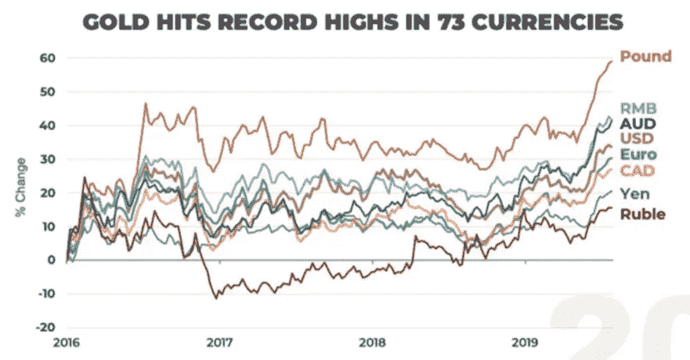
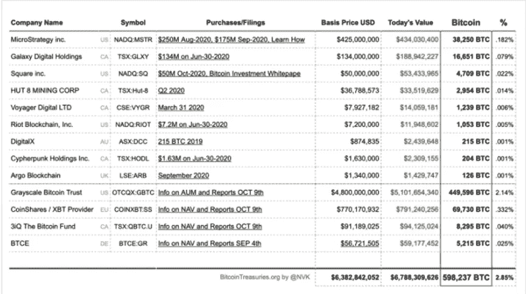

# 菲亚特保龄球

> 原文：<https://medium.com/coinmonks/bowling-for-fiat-a0afc4153dea?source=collection_archive---------1----------------------->

最初发表于[btcm.co](https://btcm.co/)

2019 年夏天，黄金市场发生了一些不寻常的事情。黄金价格对几乎所有全球法定货币都创下历史新高，包括 T2 的主要货币 T3。事实上，在那年的八月初，据报道黄金价格已经达到了 T4 73 种货币的历史新高。其国内经济以外的外部需求的主要全球货币，如英镑、加元、欧元等。所有货币都创下历史新高，巴西雷亚尔和南非兰特等新兴市场货币也是如此。值得注意的是，该集团中没有美元，但这种情况不会持续太久。在下图中，到 2019 年 8 月初，除了人民币(中国)和美元之外，图表中列出的每种货币的黄金价格都创下了历史新高。

As of 29 July 2019\. Source: Bloomberg via Rob McEwen, CEO of McEwen Mining, investor presentation.

正是在观察到全球黄金价格的飙升后，产生了“转向法币”的想法。

保龄球一击通常要求投球手首先击倒领先的瓶，这引发了一系列事件，以所有十个瓶被击倒而结束。Bowling for fiat 以类似的方式运作。根据这一理论，第一个保龄球瓶代表最弱的全球法定货币，当被击中时，会倒塌并击倒由下一组法定货币代表的后续瓶，以此类推，直到所有瓶或法定货币在产生罢工的过程中被击倒。黄金的价格由用来击倒瓶的保龄球来代表。当黄金对法定货币的价格达到历史新高时，这个或那组别针就会被击倒。这个理论通过一系列的步骤起作用，我将在下面概述。

**击倒第一排(包括一个保龄球瓶)**

这是第一个下跌的货币，这意味着这些法定货币是第一个屈服于黄金价格创纪录高位的货币。这类货币包括阿根廷比索、巴西雷亚尔、印度卢比、土耳其里拉等。；没有外部需求的大型新兴市场货币。这些货币率先下跌的原因是，它们的政府大幅贬值了自己的货币单位。这些国家的公民完全有理由逃离本国货币，将财富存放在更安全的地方。即使金价下跌，这些地区的人们也知道这是暂时的，因此更有可能继续持有黄金。尽管这些国家的经济功能失调，但它们在国际黄金市场上仍有很大的影响力，因此将成为价格进一步上涨的催化剂。由于这些更具影响力的新兴市场中的公民的行为，通过他们购买和持有黄金，引发的创纪录的高金价导致第一排大头针或法定货币在我们的第二排崩溃。

**击倒第二排(包括 2 个保龄球瓶)**

下两个倒下的是较小但发达的经济体。这些经济体的本国货币在国际贸易中很少甚至没有市场份额，因此比较大的发达经济体更加脆弱。接下来，这些货币将屈服于创纪录的高金价。这类货币包括澳元、加元、港币等。这些较小但发达的国家中，许多也一直在贬值本国货币，以提高出口的吸引力，只是没有贬值到第一行所列货币的程度。此外，基本上所有发达国家都在人为地将利率降至二战以来的最低水平，造成了极低收益率的环境。这种现象让投资者渴望收益。第一排国家造成的供应受限、货币贬值、历史低利率以及对收益率的追逐，导致黄金价格创纪录，并导致第二排瓶在第三排倒下。

**击倒第三排(包括 3 个保龄球瓶)**

接下来的三根大头针代表了法定货币的上层。这些是主要发达经济体的法定货币。这是一个相当排外的集团，主要包括英镑、欧元和日元。这些特殊的货币出现在世界各地许多中央银行的资产负债表上，并在国际市场上被积极使用。尽管它们很强大，但它们也受到了困扰上述法定货币的相同类型的掠夺，即:货币贬值、高债务水平和人为的低(甚至负)利率。一旦金价对这一组达到历史新高，所有三个大头针在我们的最后一排倒下。

**击倒第四排(包括 4 个保龄球瓶)**

后四针用美元表示。美元是[的世界储备货币](https://en.wikipedia.org/wiki/Reserve_currency)，早在 1944 年的[布雷顿森林](https://en.wikipedia.org/wiki/Bretton_Woods_system)协议中就被赋予了这一特权。这种特权地位允许美元输出通胀，从而使其免受新兴市场货币快速贬值的影响，因为其需求一直存在。事实上，美国之所以能够出现巨额贸易逆差，是因为贸易伙伴只接受美元来换取商品和服务，因为这些贸易伙伴需要美元来进行对外贸易。美元的全球地位通常使其对所有其他法定货币保持相对强势，因此通常是最后一个倒下的货币。事实证明，在 2020 年夏天，美元又花了近一年时间才最终屈服于创纪录的黄金价格，并成为最后一批倒下的钉子。

# 比特币作为一个推论

在上面的步骤中提供的为菲亚特打保龄球的想法在事后看来可能过于简单或可预测，然而，从 2015 年的某个人的角度来看，它会如此可预测吗？这一年，巴西雷亚尔首次创下了无数黄金价格的历史新高，然而，我们距离 2019 年仍有几年时间，届时价格将真正开始下跌。为了获利，投资者需要有一定的先见之明。这需要彻底了解他们所处的时间点。我认为，尽管比特币不稳定，但其行为方式与黄金相似。随着比特币价格开始加速上涨，需要回答的一个重要问题是:我们现在处于这个过程的哪个阶段？证据表明，比特币只是击中了第一根针:

正如你在上面看到的，巴西雷亚尔和土耳其里拉等大型新兴市场货币现在已经下跌，印度卢比、俄罗斯卢布和南非兰特即将贬值。

# 比特币需要什么才能击倒剩余的 pin？

我们的保龄球(现在以比特币为代表)有多种方式可以在短期内成功击倒世界上所有的法定货币，并在每种货币中获得创纪录的高价。我们将在下面介绍其中的一些方法。

**继续从大公司买入**

MicroStrategy 和 Square 等公司最近因其大量购买比特币而成为头条新闻。富达公司代表其客户管理着 8 万亿美元的资产，已经在 T4 活跃了六年的比特币挖掘活动。随着公司继续向比特币投入大量资金，对这种资产的需求只会继续增长。以下是[将比特币及其配置作为储备资产的顶级公司](https://news.bitcoin.com/here-are-the-top-public-companies-that-have-adopted-bitcoin-as-a-reserve-asset/#:~:text=Argo%20Blockchain%2C%20Bitcoin%20reserve%20asset,%2C%20Mike%20Novogratz%2C%20Square%20Inc)名单:

**民族国家**

无论是规避制裁还是避免使用美元，越来越多的国家都有动力至少获得一些比特币。伊朗显然已经为补贴采矿作业铺平了道路，并正在使用新的比特币为该国的进口提供资金。据我们所知，[保加利亚](https://www.investopedia.com/news/which-governments-are-hoarding-bitcoin/)政府在 2017 年一次打击有组织犯罪的行动中没收了大约 20 万枚比特币，目前仍由他们持有。主权国家对比特币的持续兴趣只会进一步支持数字资产向前发展。

**货币和财政政策**

全球债务在过去十年持续膨胀，现在已经达到 GDP 的 320%。由于冠状病毒导致的生产力下降，这一数字甚至更加惊人。对于当前一批全球政治家来说，削减债务无异于自杀，因此扭转债务积累的趋势是不可能的。全球生产率的下降将转化为更高的债务水平，为政府的慷慨提供资金。为了给这一债务融资，政府及其央行将继续走在冠状病毒爆发前已经走过的破坏性道路上，即货币贬值和使用人为的低利率甚至负利率。这些措施只会加速比特币的采用。

**比特币减半，股票继续流动**

每四年，比特币块奖励减半。今年 5 月，区块奖励从 12.5 比特币下调至目前的 6.25 比特币。这一事件在历史上对未来 12-16 个月的比特币价格产生了[重大影响](https://www.coindesk.com/bitcoin-price-may-drop-after-halving-historical-data-shows),通常以比特币兑所有法定货币的最高价和历史新高告终。减半也增加了比特币的存量流量，这是由假名[计划 B](https://twitter.com/100trillionUSD) 推广的一个主题。库存与流量衡量的是一项资产与该资产在给定时期内可以生产的数量之间的关系。资产的存量对流量的比率越高，其价格就越高。更多信息请参考 B 计划最近关于该主题的[文章](/@100trillionUSD/bitcoin-stock-to-flow-cross-asset-model-50d260feed12)。以下是 B 计划关于比特币价格路径的最新推文，用于说明目的:

**投机者和比特币狂热分子**

比特币最大化主义者以其明显的宗教狂热著称。这可能会让一些人望而却步，但最终只会有利于比特币的价格。纳西姆·塔勒布(Nassim Taleb)展示了最不宽容的人是如何通过他们的不妥协最终胜出的。不妥协是比特币最大化主义者的定义特征之一。他们只会继续积累，永远不会出售。爱他们也好，恨他们也罢，他们将永远准备好捍卫比特币的价格。虽然最大化主义者的行为设定了价格下限，但投机者进来推高了价格。在像现在这样比特币价格开始加速上涨的时候，这些投机者尤其值得关注。顺便提一下，随着时间的推移，这些投机者中的许多人最终都加入了比特币最大化者的行列。

# 最后的想法

就像保龄球可以从多个方向击中，但仍然会产生击球一样，法定货币下跌的顺序可以改变，但不太可能出现英镑先于阿根廷比索下跌的情况。使用上面提供的信息来识别我们当前正经历的过程的哪个点是很重要的。需要记住的另一件事是，比特币市场比黄金市场要年轻得多，因此，比特币比黄金更容易遭遇众所周知的打击。据此行动。

## 另外，阅读

*   最好的[加密交易机器人](/coinmonks/crypto-trading-bot-c2ffce8acb2a)
*   [密码本交易平台](/coinmonks/top-10-crypto-copy-trading-platforms-for-beginners-d0c37c7d698c)
*   最好的[加密税务软件](/coinmonks/best-crypto-tax-tool-for-my-money-72d4b430816b)
*   [最佳加密交易平台](/coinmonks/the-best-crypto-trading-platforms-in-2020-the-definitive-guide-updated-c72f8b874555)
*   最佳[密码借贷平台](/coinmonks/top-5-crypto-lending-platforms-in-2020-that-you-need-to-know-a1b675cec3fa)
*   [最佳区块链分析工具](https://bitquery.io/blog/best-blockchain-analysis-tools-and-software)
*   [加密套利](/coinmonks/crypto-arbitrage-guide-how-to-make-money-as-a-beginner-62bfe5c868f6)指南:新手如何赚钱
*   最佳[加密制图工具](/coinmonks/what-are-the-best-charting-platforms-for-cryptocurrency-trading-85aade584d80)
*   [莱杰 vs 特雷佐](/coinmonks/ledger-vs-trezor-best-hardware-wallet-to-secure-cryptocurrency-22c7a3fd391e)
*   了解比特币的[最佳书籍有哪些？](/coinmonks/what-are-the-best-books-to-learn-bitcoin-409aeb9aff4b)
*   [3 商业评论](/coinmonks/3commas-review-an-excellent-crypto-trading-bot-2020-1313a58bec92)
*   [AAX 交易所评论](/coinmonks/aax-exchange-review-2021-67c5ea09330c) |推荐代码、交易费用、利弊
*   [Deribit 审查](/coinmonks/deribit-review-options-fees-apis-and-testnet-2ca16c4bbdb2) |选项、费用、API 和 Testnet
*   [FTX 密码交易所评论](/coinmonks/ftx-crypto-exchange-review-53664ac1198f)
*   [n 零审核](/coinmonks/ngrave-zero-review-c465cf8307fc)
*   [Bybit 交换审查](/coinmonks/bybit-exchange-review-dbd570019b71)
*   [3Commas vs Cryptohopper](/coinmonks/cryptohopper-vs-3commas-vs-shrimpy-a2c16095b8fe)
*   最好的比特币[硬件钱包](/coinmonks/the-best-cryptocurrency-hardware-wallets-of-2020-e28b1c124069?source=friends_link&sk=324dd9ff8556ab578d71e7ad7658ad7c)
*   最佳 [monero 钱包](https://blog.coincodecap.com/best-monero-wallets)
*   [莱杰 nano s vs x](https://blog.coincodecap.com/ledger-nano-s-vs-x)
*   [bits gap vs 3 commas vs quad ency](https://blog.coincodecap.com/bitsgap-3commas-quadency)
*   [莱杰纳米 S vs 特雷佐 one vs 特雷佐 T vs 莱杰纳米 X](https://blog.coincodecap.com/ledger-nano-s-vs-trezor-one-ledger-nano-x-trezor-t)
*   [block fi vs Celsius](/coinmonks/blockfi-vs-celsius-vs-hodlnaut-8a1cc8c26630)vs Hodlnaut
*   [Bitsgap 评论](/coinmonks/bitsgap-review-a-crypto-trading-bot-that-makes-easy-money-a5d88a336df2)——一个轻松赚钱的加密交易机器人
*   为专业人士设计的加密交易机器人
*   [PrimeXBT 审查](/coinmonks/primexbt-review-88e0815be858) |杠杆交易、费用和交易
*   [埃利帕尔泰坦评论](/coinmonks/ellipal-titan-review-85e9071dd029)
*   [SecuX Stone 评论](https://blog.coincodecap.com/secux-stone-hardware-wallet-review)
*   [BlockFi 评论](/coinmonks/blockfi-review-53096053c097) |从您的密码中赚取高达 8.6%的利息