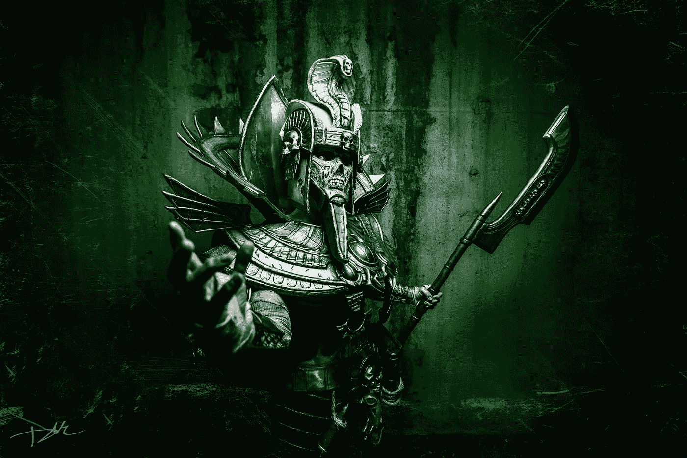

# 封闭街区大小和通往施诺尔的大门:与戈斯博士的简短交谈

> 原文：<https://medium.com/coinmonks/boxing-up-block-size-and-the-door-to-schnorr-a-brief-chat-with-dr-goss-eeb2ff76ff79?source=collection_archive---------7----------------------->

在我被指控招魂术或虐待马匹之前，我要明白，有很多人正在完成他们的第一次 [Antonopoulos](https://www.youtube.com/playlist?list=PLPQwGV1aLnTuN6kdNWlElfr2tzigB9Nnj) 马拉松，他们想知道比特币在 2018 年的地位。这是一篇主要面向读者的文章，试图让初学者级别的对话超越目前看似已经解决的话题。[在这里赶上关于块大小的辩论](https://hackernoon.com/the-great-bitcoin-scaling-debate-a-timeline-6108081dbada)，同时给 [Jameson Lopp 的比特币资源](https://lopp.net/bitcoin.html)加书签。希望，如果你正在阅读这篇文章，你正在抛弃对价格的痴迷，而不是更全面地理解比特币作为一种确保你金融主权的手段所代表的意义。如果没有，相信我——你会睡得更好。完全公开:作为一个坚定的小块倡导者，我的目标是公平地代表相反的观点。也就是说， [Roger Ver 是一个骗子艺术家](https://www.coindesk.com/bitcoin-cash-bitcoin-lawsuits-wont-stop-fight-bitcoins-name/)，他为了个人利益使标签混淆不清。我是不是已经疯了，在背后捅了聪一刀？也许我只是失去了新闻可信度。在推特上宣布我的罪行。

在就职典礼上，一位特殊的客人。如果有比特币 OG 这种东西，布莱恩·戈斯博士绝对有资格。他不仅在 2010 年挖掘出了自己的第一枚比特币(对于那些认为比特币时代很重要的人来说)，而且他还是[比特币基金会](https://bitcoinfoundation.org/forum/index.php?/profile/191-brian-goss/&tab=activity)的早期成员，在 2012 年的选举中一度领先。他仍然活跃在社区中，利用空闲时间从他的水池中取出蝙蝠胎儿。除了他的密码，这个人还是一个执业的放射学家。他参与了街区大小辩论的双方，并友好地详细回答了我的问题。女士们先生们，布莱恩·戈斯。

从根本上说，区块大小的争论是那些相信矿工第一和用户第一的人之间的不和。

2017 年 8 月 1 日，关于可持续扩展的言论像食物大战中的土豆泥一样飙升，注定要分裂比特币和比特币现金之间的社区。随后的湿博洛尼亚，即[纽约州协议](https://coingeek.com/year-review-bitcoin-cash/)和 [Segwit2x](https://www.coindesk.com/opinion-segwit2x-doomed-fail/) (不要与“常规” [Segwit](/@jimmysong/understanding-segwit-block-size-fd901b87c9d4) 混淆)似乎达成了协议，并一劳永逸地解决了这场辩论。正如布莱恩所说，

> “我只是认为讨论转移到了别处。比特币现金在大块土地上到处都是。他们在做自己的事情，这是…我认为这对技术社区来说不再是一个问题。”

但是为什么呢？难道[摩尔定律](https://en.wikipedia.org/wiki/Moore%27s_law)和相关的扩展范例不足以处理更大的块和更大的带宽需求吗？两个字:[创世纪块](https://en.bitcoin.it/wiki/Genesis_block)。

> “我不知道我们是否应该相信互联网会随着时间的推移变得越来越快。但无论如何，带宽不是制约因素。而是你要花多长时间才能发现真相。从无到有，打造整个链条需要多长时间？你想有多真实？”

因此，小区块者抱怨增加区块大小会降低分散性。据称，巨大的区块有利于拥有昂贵、复杂技术能力的矿池。赞成和反对的论点摘要。)小块更可靠地确保小家伙可以在个人设备上拥有整个比特币区块链的副本。罗杰·弗[不同意](https://news.bitcoin.com/bigger-blocks-means-decentralization-bitcoin/)。过了一段时间，[克雷格·赖特](https://en.wikipedia.org/wiki/Craig_Steven_Wright)从[麦斯卡林](https://en.wikipedia.org/wiki/Mescaline)引发的冒险中走了出来，并以矿工第一的态度加入了战斗。

Is that Satoshi?

布莱恩重申了他的观点。

> “关于到底是什么提供了安全，有两种相互竞争的理论。还有“我只想知道我的交易会被接受”的安全级别。为此，除了矿商接受了你的交易之外，你不需要证明任何东西。SPV 钱包在某种程度上是围绕这个概念建立的…如果你真的想在不询问和信任他人的情况下自己确定，你需要能够追溯这些硬币的历史。我是放射学家，对吧？因此，我并不是最好的技术人员来阐述每个级别的真正瓶颈。但我认为 [Peter Rizun](https://twitter.com/PeterRizun) 已经在这方面做了大量工作，这实际上只是承认 [mempool](https://coinsutra.com/bitcoin-mempool/) 的架构很差，你可以在那里获得很多加速。”

至于 Satoshi Maximalism？坚持最初的愿景重要吗？我时常听到这样的话。

> “一点也不。原始代码或多或少都是垃圾，许多初始特性必须立即禁用。一切都是一团乱麻。比特币软件中有很多非常糟糕的选择……很多他没有意识到的东西。没有人坚持原来的代码，我不认为 Satoshi 对比特币的最终游戏有特别深刻的见解。15-20 年后，它会是什么样子？

如果块大小的争论已经结束，下一步是什么？

> 用最接近的术语来说，[sch orr](/@SDWouters/why-schnorr-signatures-will-help-solve-2-of-bitcoins-biggest-problems-today-9b7718e7861c)可能是可能推出的最大真正变化。这是一个真正的 BIP，但我认为现在很高兴有一个熊市，把 Segwit2x 的干扰放在一边，这样人们就可以专注于真正的肉……我们现在才刚刚进入比特币发展的真正的肉。来实际缩放这个东西。其他的一切都是，用大刷子刷，其他的一切都是某种内务处理，为实际的缩放做准备。

Bitcoin does not serve. Thanks to @CheekyCheetahCosplay and @davidlackeymedia

# 施诺尔之门

在下一篇文章中，我们将会得到 Brian 对他真正的意思,“发展的肉”的看法，以及当前的状态 [Schnorr 签名](https://bitcoinist.com/andreas-antonopoulos-4-things-bitcoin-needs-plus-a-hard-fork-in-2018/)。请继续关注；非常感谢您的反馈！