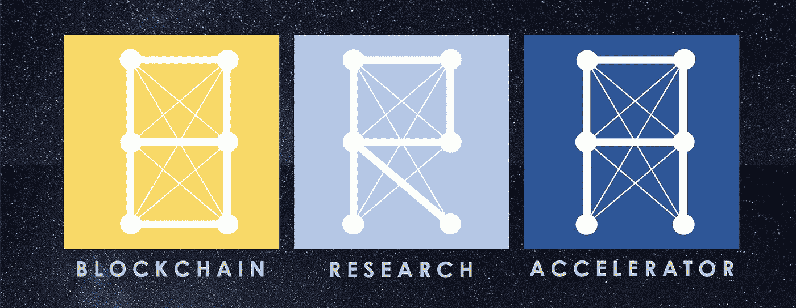
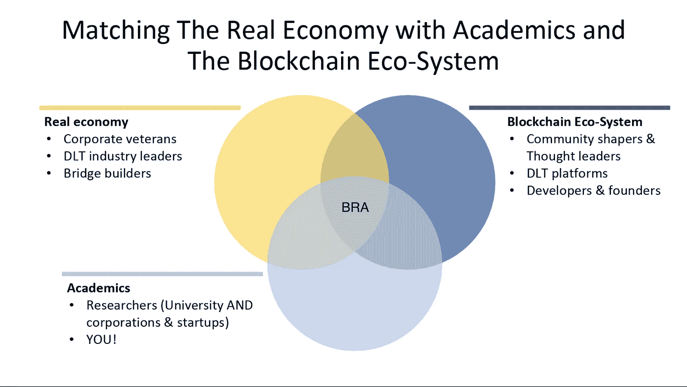
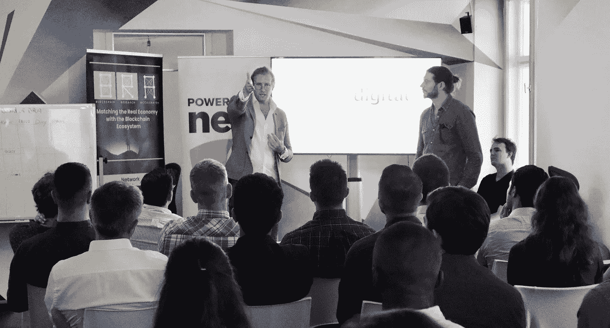
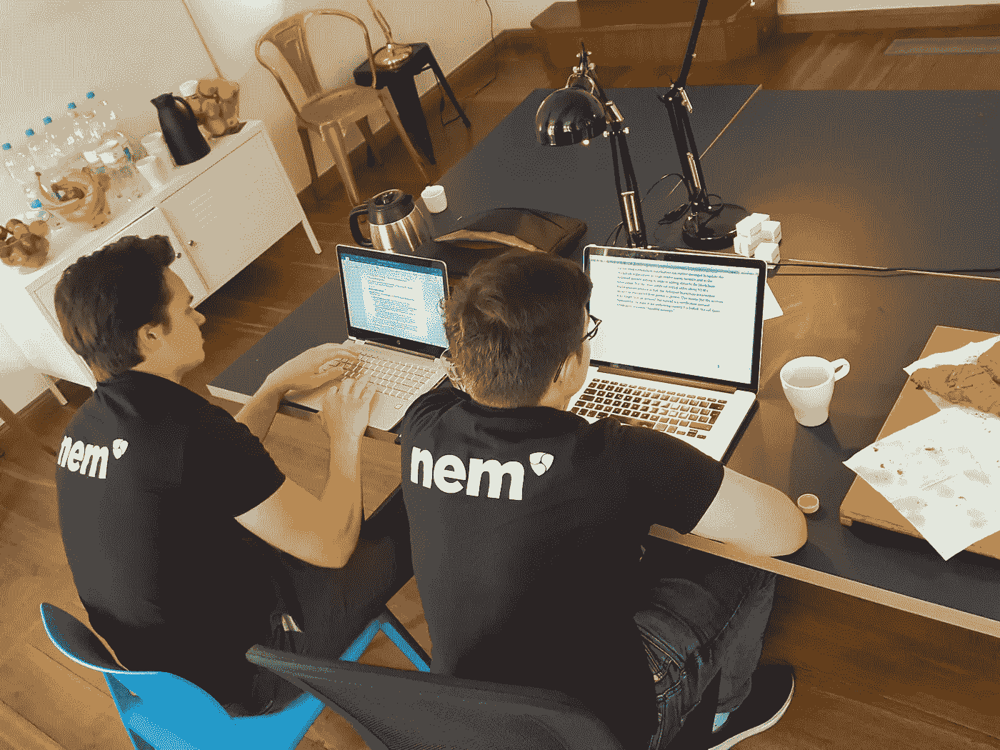
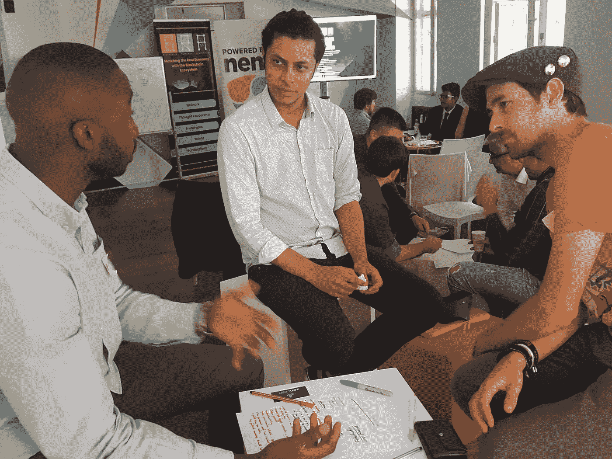
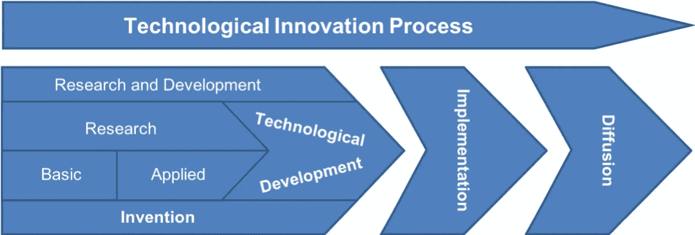
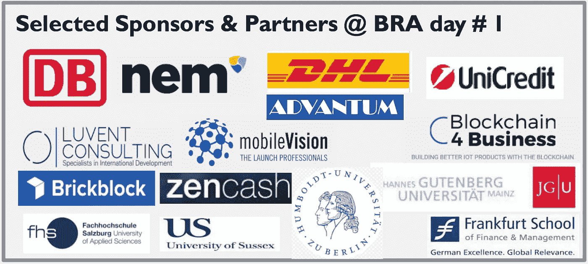
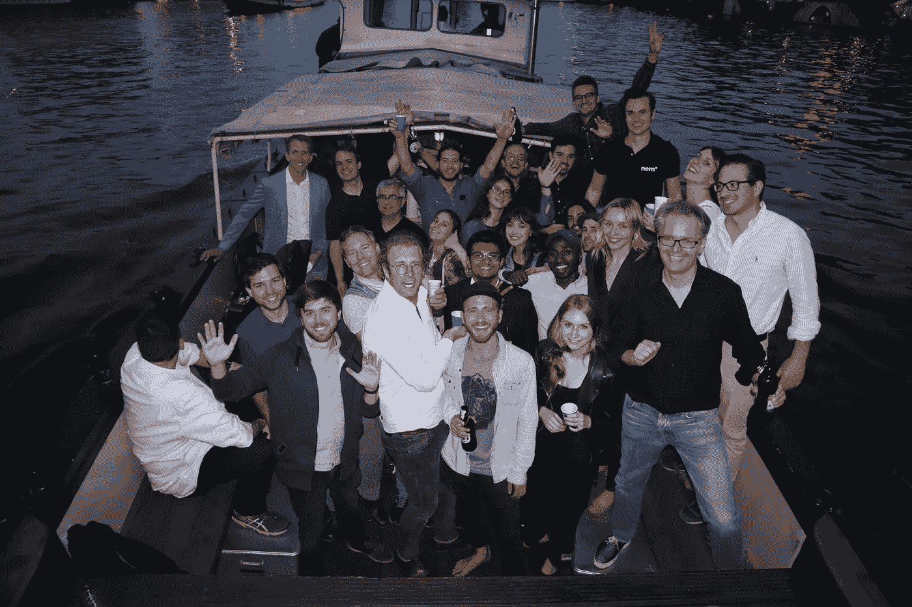

# BRA 将实体经济与区块链生态系统相匹配

> 原文：<https://medium.com/coinmonks/bra-matching-the-real-economy-with-the-blockchain-ecosystem-44a1c682d434?source=collection_archive---------13----------------------->

代表 [ZenCash](https://zencash.com/) 我最近有幸被邀请到柏林的[区块链研究加速器(BRA)](http://www.blockchain-research-accelerator.com/) 。这一切都是从去年我偶然发现一篇很棒的文章开始的，即由[未命名公司分布式经济智库和风险投资](http://www.untitled-inc.com/)整理的“[令牌分类框架](http://www.untitled-inc.com/the-token-classification-framework-a-multi-dimensional-tool-for-understanding-and-classifying-crypto-tokens/)”。我很好奇他们都是些什么，带着我的问题联系了他们。自从我和他们有了很好的接触，尤其是他们的联合创始人之一，彼得。当我被邀请成为他们活动的嘉宾时，我非常高兴和激动。

[Untitled-Inc](http://www.untitled-inc.com/) 目前已经启动了以下项目和计划:

*   [区块链研究加速器——BRA](http://www.blockchain-research-accelerator.com/):是一个非盈利
    项目，目前致力于为硕士和博士论文期间的学生提供指导
    和网络平台，以及为
    企业和创业公司提供人才和思想领导力。
*   [硬币市场监管-CMR](http://coinmarketreg.com/):将加密经济与当地
    司法管辖区联系起来。该计划的目标是提供有关加密资产和区块链技术的全球监管前景的概述，以及基于服务和律师和税务顾问的额外的 T21 服务。
*   ICO 360:一个风险投资等级评估框架，用于识别和推出高质量的 ICO
*   adventum Partners-ACP:为已建立的组织和初创公司提供与加密、区块链和 DLT 相关的咨询和解决方案。他们将自己定位于数字转型中其他创新概念和技术的交叉点，如工业 4.0、人工智能、虚拟现实和 3D 打印。

## 该事件

该活动于 7 月 13 日在柏林的徐创新实验室举行。从 100 多名申请者中挑选出 36 名研究员参加第一批指导计划。BRA 未来的目标是
通过促进学术界、有经验的研究人员以及硕士和博士级学生、成熟组织和区块链生态系统之间的交流和讨论，提供思想领导力和人才库。

One of the slides of the untitled-inc introduction. Thanks for letting me use this Daniel;)

彼得在他的开场白中定义了 BRA 的主要目标:制作有价值的出版物，并通过提供对企业和区块链生态系统的访问来帮助学生定义他们的主题。我真的很喜欢他用来比喻区块链今天的发展状况:

回到没有电的日子，工厂被建造成将最耗电的机器放在蒸汽机所在房间的中央。即使在引入电力之后，这种布局也持续了一段时间，直到今天的工厂采用了更合理的布局。即机器按照使用顺序放置的生产线。

与区块链我们有“电”，但在许多情况下仍在使用旧的“工厂布局”。过渡是一个自然包含时间的过程，像这样的事件，你可以成为设计新布局的一部分。

## 领域内的研究

法兰克福学院区块链中心的 Konstantin Ketz 随后概述了该领域的研究现状。

虽然《比特币白皮书》于 2008 年出版，但第一份提及比特币的出版物直到 2011 年才发布。自那以后，涉及这一主题的出版物稳步增加。他给出的例子旨在让参与者了解学术界目前的状况。

他提到的一些例子有“[跨学科的比特币研究](http://www.blockchainresearchnetwork.org/wp-content/uploads/2018/04/Holub-and-Johnson-2018-Bitcoin-research-across-disciplines.pdf)”(Holub&Johnson，2018 年)和“[一个区块链研究框架](https://link.springer.com/article/10.1007/s12599-017-0506-0)”(risi us&sp hrer，2017 年)。在这种情况下，还应该提到一个独立的国际平台，即[区块链研究网络](http://blockchainresearchnetwork.org/)，它帮助人们了解概况并访问一系列出版物。

他看到的一个主要缺点是许多研究的孤立方法，要么关注技术，商业方面，要么关注社会影响。特别是在区块链领域，多学科的方法对于处理复杂的问题经常是非常重要的。他参加了 BRA，因为他认为这是一种有助于将该领域所有不同团体更紧密地联系在一起的形式。

我想强调维也纳大学在这一点上所做的努力。他们开设了密码经济研究所，考虑到许多申请者都是吴的学生，这个研究所已经得到了回报。

## 洞察企业创新

Martin Fröhlich (left) and Peter Trapp

来自 [DB Digital](http://deutschebahnventures.de/) 的 Martin Frö hlich 接下来将介绍他对该领域当前发展的看法以及德国铁路公司正在进行的努力。即这些是:

*   自主酒店客房
*   Hyplerloops
*   和飞行出租车

听起来很未来？现在是 2018 年，有人需要塑造 2030 年的样子。德国铁路公司是密切关注区块链技术的公司之一，他们最近为[制作了一个很好的视频](https://www.youtube.com/watch?v=D8EFOFTX_NI)。一个主要的障碍，尤其是关于出租车项目，是缺乏监管。实现这些项目的技术并不遥远，但法律框架仍然缺失。

传统上，企业环境在资产方面很强，而初创企业环境在创新方面很强。这一天反复出现的一个主题是，所有各方都将从更多的合作中受益，这可以很好地适用于这一事实。

他还提供了一个很好的例子，说明在什么情况下使用共享账本是有意义的:由于德国铁路是一家私有公司，使用了大量国有基础设施，因此需要公平分配收入。目前，可能需要长达五年的时间来分配资金，特别是对于游客数量和目的地不同的共享机票。通过智能合约实现的自动支付或许能够将这一过程的效率提升到一个全新的水平。有些人可能会说数据库对于这个用例来说会更有效，但是多年来一直在努力使用数据库来解决这个问题，但是都没有成功。也许是时候尝试不同的方法了。

## 以商业为重点的区块链项目

Julian and Istvan preparing for their presentation.

作为此次活动的赞助商之一，NEM 的代表是 NEM.io 基金会欧洲合作伙伴负责人 Julian Richter 和解决方案架构师 Istvan Deak。他们解释说，与他们接洽的公司主要可以分为两类:探索型公司和试图改善现有流程的公司。

他们关注的是用 API 和现有的“智能执行工具”进行开发的容易程度。大公司和初创公司受益于现有系统的无缝集成和较短的开发周期。在他们的平台上，一周之内建立 MVP 是可能的。

它们为公司提供了通过利用一种本地智能执行工具来支付用户交互交易费用的选项:“拉式交易”。如果用户必须在与公司进行第一次互动之前购买任何代币，那么采用将会很困难。

他们的方法是将业务逻辑放在数据中心，并通过 multisig 合同和钱包在链上执行。NEM 有一个公共区块链和一个私人区块链，它们提供相同的内置工具，应该足以满足 80%的用例。如果某个公司需要更多的插件，他们可以付费使用私有链。如果他们在开源许可下构建工具，他们可以免费使用这个平台——工具甚至可以集成到公共链中。

## 甲骨文问题

另一个全天反复出现的主题是 oracle 问题。oracle 实现了将真实世界的数据可靠地引入区块链的功能。总会有一定的相关成本，因为诚实行事需要激励。诚实行事的动机必须大于给定方提交恶意数据的潜在好处。有不同的方法来解决这个问题，但它肯定与成本有关。

# 把舞台移交给伙伴们

在对所有参与者进行简短介绍后，进行了“世界咖啡馆”形式的
深度潜水。每个参与者都坐在一张桌子或“咖啡馆”里，其余的人则分开去和同伴“速配”。通过这种方式，参与者有机会从所有在场的人那里获得信息，询问他们的问题，并获得对他们想法的反馈。

Nathan being a “table captain”. Thomas Euler, one of the Untitled-Inc Co-founders on the right.

对大多数人来说，定义他们的主题是主要目标。通常情况下，他们被建议专注于他们已经考虑过的一个方面，并对此进行深入研究，而不是覆盖广泛的范围，因此只提供一个高层次的概述。

有许多很好的话题，但其中一个特别引起我注意的是卡尼·伦敦和丹尼尔·伯维克的一篇关于“区块链生态系统内的创新”的论文。

## 区块链创新指数

Graphic created by Nika London, Source: Diaconu, M., (2011). Technological Innovation: Concept, Process, Typology and Implications in the Economy. Theoretical and Applied Economics, 18(10), pp. 127–144.

教科书将技术创新定义为三个要素的组合:研发、实施和传播。R&D(主要)是通过分配的预算来衡量的，执行是通过产生的实际产出来衡量的，扩散是通过采用产出来衡量的。

卡尼希望创建一个框架，将这些概念翻译成隐语。这很难做到，但会提供相当大的价值。由于很多项目都是开源的，从预算的角度来看，R&D 很难实现，但也许可以通过 GitHub 指标和适当平台上的社区活动来实现。实施也是如此。扩散可以通过一系列不同的指标来衡量，如链上交易、多货币钱包中的列表和交易所中的列表。我会保持联系，也许在他发表后会写一篇文章总结他的发现。

随着一个关于区块链趋势和研究的小组& DLT，充满内容的这一天结束了。Untitled Inc .的 Daniel Pichler 与 Brickblocks Mark Lasia、Humbolth 大学的 Robin Matzke 和 Untitled Inc .的联合创始人 Oliver Krause 博士一起主持了会议。讨论将协议的治理确定为一个关键主题，以确保长期成功。讨论的第二个主题是资产令牌化，其中创建监管框架，即与资产令牌相关的权利，被认为是需要克服的主要障碍。

# 最后的想法

如果你考虑在区块链范围内写一篇论文，我强烈推荐你关注下一版的 BRA。所有与会者都获得了许多有价值的见解。这种格式真的做到了它设定的目标:帮助人们创造伟大的出版物，连接区块链生态系统、学术界和商界！

我还鼓励研究这项技术的企业与未命名的分布式经济智库和风险投资公司联系。他们做得很好，他们的组织中有非常能干的人。

再次感谢你们邀请我。我希望我能在想法、见解和一些联系上帮上一点忙。我自己肯定学到了很多东西，并且很乐意参加区块链研究加速器的下一次迭代！

Barbecue boat tour to finish the day, always a good idea. Me being center front, black cap.

> [在您的收件箱中直接获得最佳软件交易](https://coincodecap.com/?utm_source=coinmonks)

