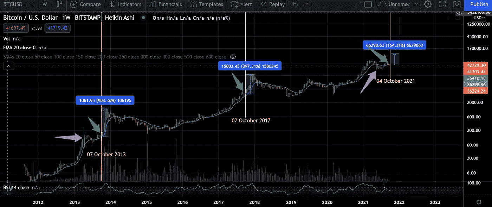
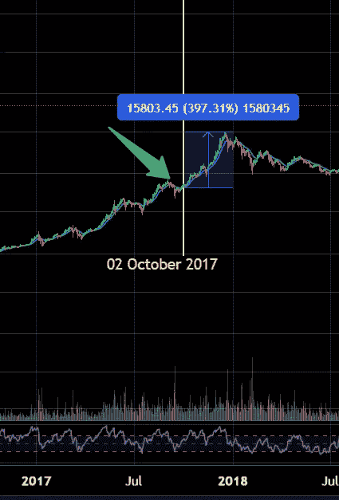
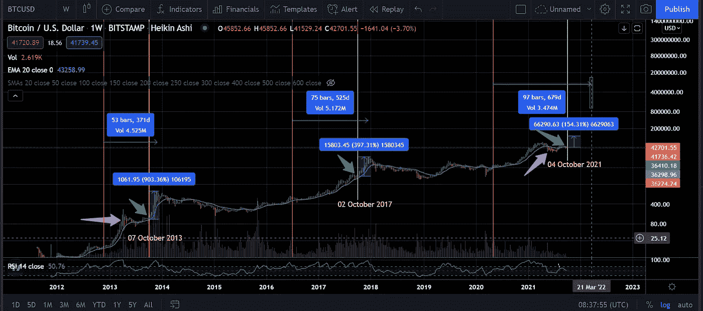

# 比特币将在 2022 年 3 月突破这个周期

> 原文：<https://medium.com/coinmonks/brace-up-for-an-insane-bitcoin-move-c3c9236b3f2b?source=collection_archive---------3----------------------->

## 为比特币的疯狂举动做好准备！！

**简介:**

这篇文章将谈论

1.  为什么 66k 不是这个周期的顶部

2.为什么这个周期会持续到 2022 年 3 月

3.为什么 100k 可能不是实际的顶部

**比特币每周时间框架**

***绿色箭头*** :指向九月修正

***紫色箭头:*** 指向九月前的修正

***黄色竖线:*** 指向比特币最后一次剧烈的上行

2013 年 11 月没有出现大的下降，但 2017 年 11 月出现了适当的下降。因为在大泵的中间可能会有一个小的下降。

仅仅 150%的增长就可以让比特币达到 100k，考虑到之前的井喷，这可能是可行的。

**为什么比特币顶不住了**

以下是原因

**A .延长周期**

**B .减半 vs 放顶**

从第一次减半到顶，为 370 天，但减半与顶吹持续时间在 2017 年周期增加了 154 天左右。

371–525 =154

在之前的 525 天上加上额外的 154 天= 679 天。

这将在 2022 年 3 月的第二周和第四周之间结束这个周期。

**总结:**

这个周期可能会在 2022 年 3 月 2 日到第 4 周结束，在 11 月左右会有一个低谷。

***作者* : Eth！c@l Aka Kumar**

***电报:*t.me/IfWorldGoneCrypto**

***同行评议:*臭 Linky**

*表现出一些爱心:*

**ERC 20:0x 867 ca 4 af 0 EB 86d 48014 D8 ce 344d 096 c 01348 a163**

***邮箱:***[**IfWorldGoneCrypto@gmail.com**](mailto:IfWorldGoneCrypto@gmail.com)

***PS*** *:这既不是付费文章，也不是理财建议。记录下来的是我自己出于对这个领域的热情而进行的研究的结果，这是秘密的*

> 加入 Coinmonks [电报频道](https://t.me/coincodecap)和 [Youtube 频道](https://www.youtube.com/c/coinmonks/videos)了解加密交易和投资

## 另外，阅读

*   [尤霍德勒 vs 科恩洛 vs 霍德诺特](/coinmonks/youhodler-vs-coinloan-vs-hodlnaut-b1050acde55a) | [Cryptohopper vs 哈斯博特](https://blog.coincodecap.com/cryptohopper-vs-haasbot)
*   [币安 vs 北海巨妖](https://blog.coincodecap.com/binance-vs-kraken) | [美元成本平均交易机器人](https://blog.coincodecap.com/pionex-dca-bot)
*   [用信用卡购买密码的 10 个最佳地点](https://blog.coincodecap.com/buy-crypto-with-credit-card)
*   [OKEx 回顾](/coinmonks/okex-review-6b369304110f) | [Kucoin 交易机器人](/coinmonks/kucoin-trading-bot-automate-your-trades-8cf0ca2138e0) | [期货交易机器人](/coinmonks/futures-trading-bots-5a282ccee3f5)
*   [AscendEx Staking](https://blog.coincodecap.com/ascendex-staking)|[Bot Ocean Review](https://blog.coincodecap.com/bot-ocean-review)|[最佳比特币钱包](https://blog.coincodecap.com/bitcoin-wallets-india)
*   [霍比评论](https://blog.coincodecap.com/huobi-review) | [OKEx 保证金交易](https://blog.coincodecap.com/okex-margin-trading) | [期货交易](https://blog.coincodecap.com/futures-trading)
*   [Godex.io 审核](/coinmonks/godex-io-review-7366086519fb) | [邀请审核](/coinmonks/invity-review-70f3030c0502) | [BitForex 审核](https://blog.coincodecap.com/bitforex-review)
*   [Crypto.com 费用](/coinmonks/binance-fees-8588ec17965) | [僵尸加密审查](/coinmonks/botcrypto-review-2021-build-your-own-trading-bot-coincodecap-6b8332d736c7) | [替代品](https://blog.coincodecap.com/crypto-com-alternatives)
*   [有哪些交易信号？](https://blog.coincodecap.com/trading-signal) | [Bitstamp vs 比特币基地](https://blog.coincodecap.com/bitstamp-coinbase) | [买索拉纳](https://blog.coincodecap.com/buy-solana)
*   [ProfitFarmers 回顾](https://blog.coincodecap.com/profitfarmers-review) | [如何使用 Cornix 交易机器人](https://blog.coincodecap.com/cornix-trading-bot)