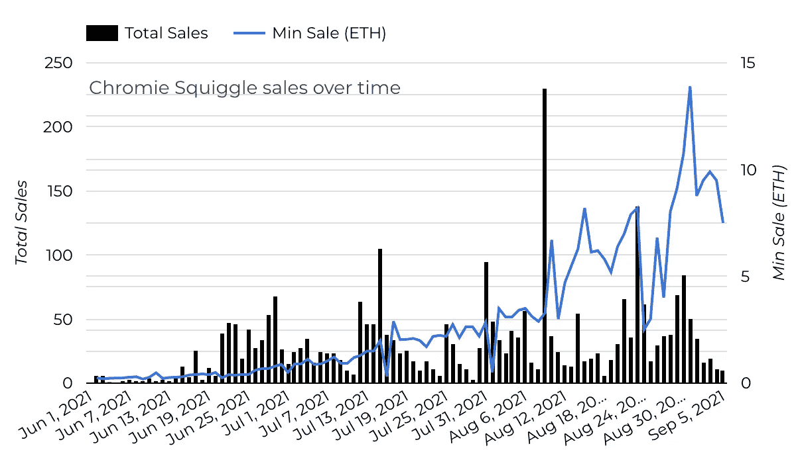
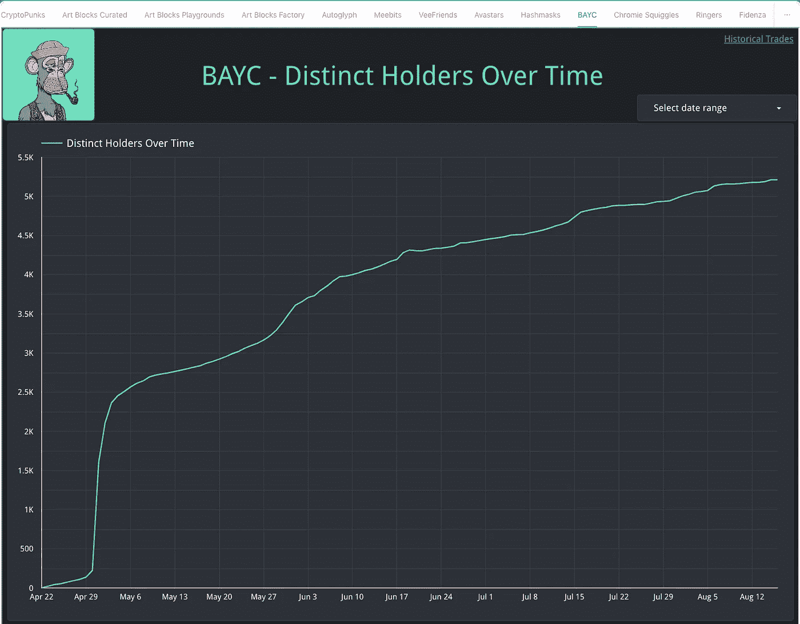
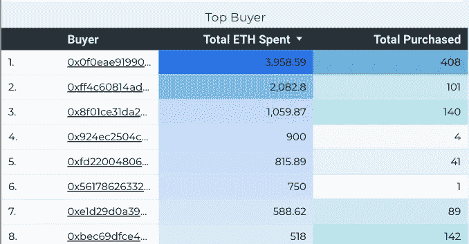
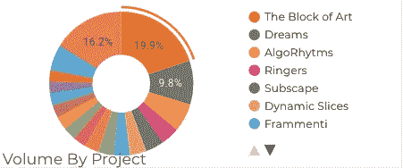
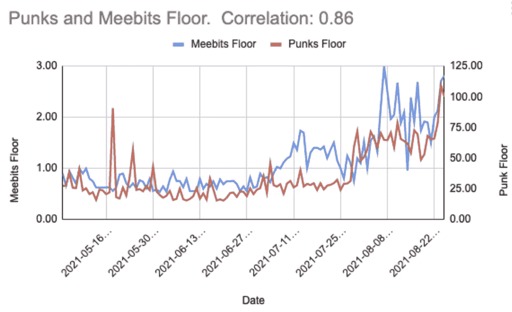
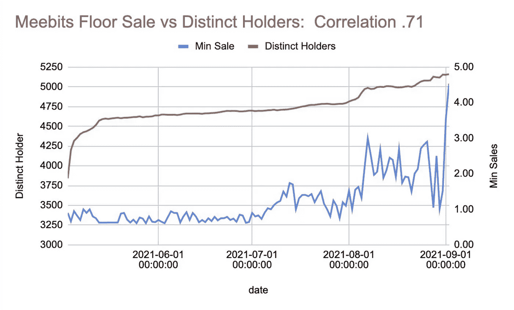

# 用 DegenData 分解 NFT 贸易分析

> 原文：<https://medium.com/coinmonks/breaking-down-nft-trade-analytics-with-degendata-c17e2dabbea4?source=collection_archive---------2----------------------->

## NFT 交易令人兴奋。这是毫无疑问的。

在 [DegenData](https://degendata.io/project/cryptopunks) 我们正在努力工作，通过为交易者、收藏家和爱好者提供适当的工具，帮助推动不断增长的 NFT 市场向前发展，这样他们就不会得到 [rekt](https://www.urbandictionary.com/define.php?term=Rekt) 。NFT 周围的市场动态有点不同，没有适当的信息，你会盲目飞行。

在研究参与什么项目时，我们将分解一些重要的指标和其他要考虑的事情。这些都不是财务建议。

在开始之前，记得支持你喜欢的艺术家和 NFT 项目！买你喜欢的东西和你联系的东西。

如果你觉得 FOMO 开始了，你想参与一些项目，那么是时候做一些研究了。恰如其分的猿。恰当地说。

我们将把它分成两部分。定性的和定量的。

让我们从定性的东西开始。

# 定性的东西

1.  **加入不和的团体。关于 NFT，有太多的东西需要了解。Discord 社区是与在 NFT 空间旅行的人聊天的最佳场所。社区成员乐于助人，通常愿意教育新人。**
2.  上推特。加密 Twitter 充满了 NFT 空间的最新事件。有太多的东西需要学习和了解。下面是几个上手手柄:[安德鲁·斯坦沃尔德](https://twitter.com/AndrewSteinwold)，[格莫尼](https://twitter.com/gmoneyNFT)，[贾斯汀](https://twitter.com/justintrimble)，[加里五世](https://twitter.com/garyvee)，[凯文·罗斯](https://twitter.com/kevinrose)，[数码艺术小妞](https://twitter.com/digitalartchick)，[里奇德](https://twitter.com/richerd)和[比尼](https://twitter.com/beaniemaxi)。这些只是提供有趣见解的一些人的名字。在 NFT 的推特空间里，有如此多的聪明人让我们无比尊敬。但是希望这个列表是你的一个起点。
3.  跳进一些推特空间。倾听社区成员谈论对他们来说什么是重要的，以及他们对 NFT 未来发展的看法。
4.  **听播客**，订阅时事通讯和 Youtube 频道。[马孜红](https://anchor.fm/andrew-steinwold)、[现代财经](https://modern.finance/)、[打样 XYZ](https://www.proof.xyz/) 、[艺术街区快讯](https://artblocksinc.eo.page/subscribe)、[晨薄荷](https://www.youtube.com/user/HunterOrrell/videos)是我们的几个最爱。

# 定量的东西

让我们分解几个数据点，以便在研究 NFT 项目时密切关注。

# 地板

“地板”是一个系列中价格最低的物品。

这一指标成为所有项目关注的焦点。上升的楼层表明兴趣越来越大，项目背后有强大的叙事，以及一个可能推动 NFT 所代表的界限的社区。

下面是铬黄花体“地板”的销售价格。

Chromie Squiggles 地板在 2021 年 6 月初开始上涨，当时地板价格在. 2 ETH 左右。撰写本文时的最低价格为 11.2 ETH。

注意底价趋势，以及它们如何随成交量变化。

# 唯一的持有者数量

许多 NFT 项目关注的一个关键因素是，随着时间的推移，独立持有人的总数会增加。这一指标非常重要，原因如下:

1.  它显示了社区的成长。越来越多的社区参与进来。一个积极参与的社区有助于进一步发展，有助于加快项目路线图，并有助于推动 NFT 所代表的极限。
2.  总持有人越多，单个“鲸鱼”对市场活动的影响就越小。
3.  社区发展的速度。新收藏家进入一个项目的速度有多快？缓慢而稳定还是呈尖峰状？围绕项目的事件如何影响新持有者？

下面你可以看到无聊猿游艇俱乐部持有者的增长。在最初的积累之后(在造币期间),持有者有了强劲、持续的增长。

# 钱包活动

监视在项目上赚得盆满钵满的钱包是另一个确定有强烈信念的地址的好方法。这些钱包对于探索其他具有潜在价值的项目也很有意思。

让我们来看看哪些钱包在购买最多的艺术作品。

我们可以看到地址[0x 0 f 0e AE 91990140 c 560d 4156 db 4 f 00 c 854d c8 f 09 e](https://etherscan.io/address/0x0f0eae91990140c560d4156db4f00c854dc8f09e)在过去 30 天里已经在 408 个艺术街区 NFT 上花费了近 4，000 ETH。

如果我们只从上面的地址中过滤活动，我们可以看到他们在感兴趣的时间段内累积了哪些片段。最近，它已经成为“艺术块”，“梦想”和“算法”。

另一方面，你可以看到某些钱包的销售情况，哪些项目以及它们与底价的关系。

# 其他想法

没有单一的指标可以告诉你答案。记住，这些都是要一起使用的。每个项目都有独特的方式来推动价值。

这里有一些相关性指标，可以让你思考所有这些指标是如何协同工作的。

Meetbits and CryptoPunks Floor coorelations

Meebits Floor and Distinct Holder

请务必在 [Twitter](https://twitter.com/degendata) 上查看我们的更多更新！

> 加入 Coinmonks [电报频道](https://t.me/coincodecap)和 [Youtube 频道](https://www.youtube.com/c/coinmonks/videos)了解加密交易和投资

## 另外，阅读

*   [尤霍德勒 vs 科恩洛 vs 霍德诺特](/coinmonks/youhodler-vs-coinloan-vs-hodlnaut-b1050acde55a) | [Cryptohopper vs 哈斯博特](https://blog.coincodecap.com/cryptohopper-vs-haasbot)
*   [币安 vs 北海巨妖](https://blog.coincodecap.com/binance-vs-kraken) | [美元成本平均交易机器人](https://blog.coincodecap.com/pionex-dca-bot)
*   [新加坡十大最佳加密交易所](https://blog.coincodecap.com/crypto-exchange-in-singapore) | [购买 AXS](https://blog.coincodecap.com/buy-axs-token)
*   [投资印度的最佳密码](https://blog.coincodecap.com/best-crypto-to-invest-in-india-in-2021) | [HitBTC 评论](/coinmonks/hitbtc-review-c5143c5d53c2)
*   [加拿大最好的加密交易机器人](https://blog.coincodecap.com/5-best-crypto-trading-bots-in-canada) | [赌注加密](https://blog.coincodecap.com/staking-crypto)
*   [如何在印度购买比特币？](/coinmonks/buy-bitcoin-in-india-feb50ddfef94) | [瓦济克斯审查](/coinmonks/wazirx-review-5c811b074f5b)
*   [比特币主根](https://blog.coincodecap.com/bitcoin-taproot) | [Bitso 回顾](https://blog.coincodecap.com/bitso-review) | [排名前 6 的比特币信用卡](/coinmonks/bitcoin-credit-card-bc8ab6f377c6)
*   [最佳免费加密信号](https://blog.coincodecap.com/free-crypto-signals) | [YoBit 评论](/coinmonks/yobit-review-175464162c62) | [Bitbns 评论](/coinmonks/bitbns-review-38256a07e161)
*   [huo bi 的加密交易信号](https://blog.coincodecap.com/huobi-crypto-trading-signals) | [BitMEX 评论](https://blog.coincodecap.com/bitmex-review)
*   [7 个最佳零费用加密交易平台](https://blog.coincodecap.com/zero-fee-crypto-exchanges)
*   [分散交易所](https://blog.coincodecap.com/what-are-decentralized-exchanges) | [比特 FIP](https://blog.coincodecap.com/bitbns-fip) | [Pionex 评论](https://blog.coincodecap.com/pionex-review-exchange-with-crypto-trading-bot)
*   [用信用卡购买密码的 10 个最佳地点](https://blog.coincodecap.com/buy-crypto-with-credit-card)
*   [OKEx 回顾](/coinmonks/okex-review-6b369304110f) | [Kucoin 交易机器人](/coinmonks/kucoin-trading-bot-automate-your-trades-8cf0ca2138e0) | [期货交易机器人](/coinmonks/futures-trading-bots-5a282ccee3f5)
*   [AscendEx Staking](https://blog.coincodecap.com/ascendex-staking)|[Bot Ocean Review](https://blog.coincodecap.com/bot-ocean-review)|[最佳比特币钱包](https://blog.coincodecap.com/bitcoin-wallets-india)
*   [霍比评论](https://blog.coincodecap.com/huobi-review) | [OKEx 保证金交易](https://blog.coincodecap.com/okex-margin-trading) | [期货交易](https://blog.coincodecap.com/futures-trading)
*   [Godex.io 审核](/coinmonks/godex-io-review-7366086519fb) | [邀请审核](/coinmonks/invity-review-70f3030c0502) | [BitForex 审核](https://blog.coincodecap.com/bitforex-review)
*   [Crypto.com 费用](/coinmonks/binance-fees-8588ec17965) | [僵尸加密审查](/coinmonks/botcrypto-review-2021-build-your-own-trading-bot-coincodecap-6b8332d736c7) | [替代品](https://blog.coincodecap.com/crypto-com-alternatives)
*   [有哪些交易信号？](https://blog.coincodecap.com/trading-signal) | [Bitstamp vs 比特币基地](https://blog.coincodecap.com/bitstamp-coinbase) | [买索拉纳](https://blog.coincodecap.com/buy-solana)
*   [ProfitFarmers 点评](https://blog.coincodecap.com/profitfarmers-review) | [如何使用 Cornix 交易机器人](https://blog.coincodecap.com/cornix-trading-bot)
*   [MXC 交易所评论](/coinmonks/mxc-exchange-review-3af0ec1cba8c) | [Pionex vs 币安](https://blog.coincodecap.com/pionex-vs-binance) | [Pionex 套利机器人](https://blog.coincodecap.com/pionex-arbitrage-bot)