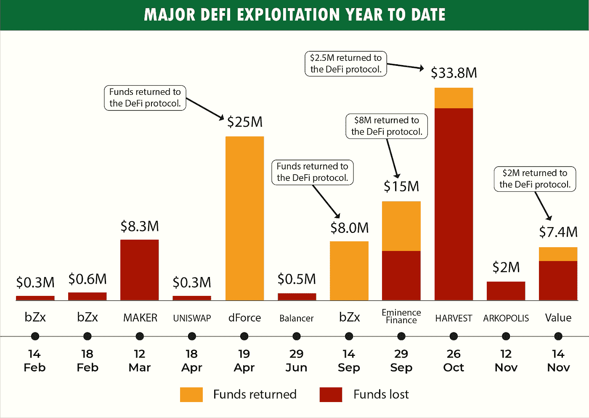
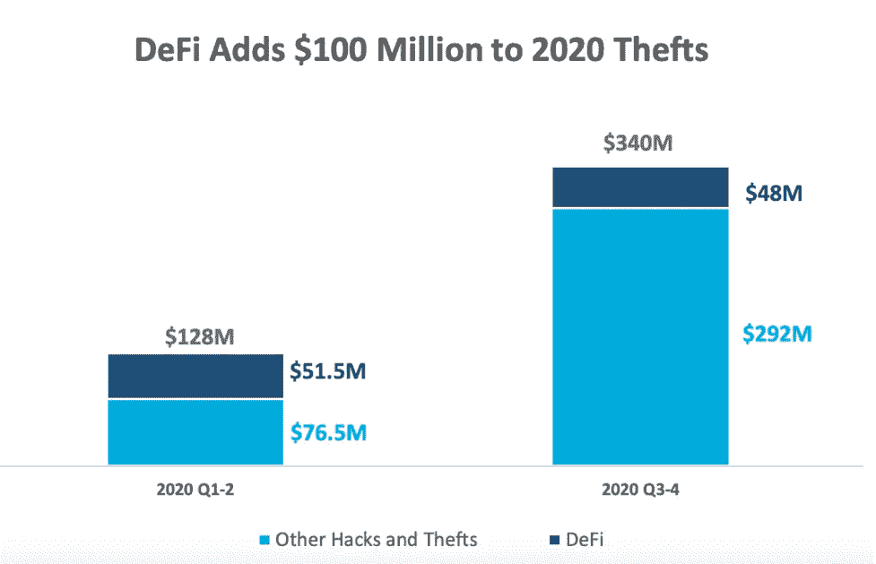
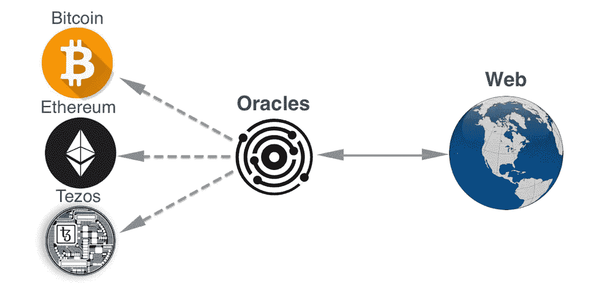
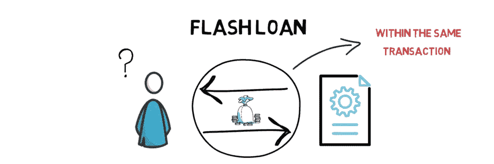
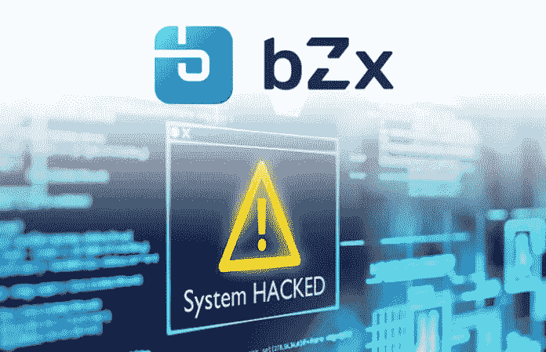

# 解密 Defi 攻击:确保去中心化金融未来的一步

> 原文：<https://medium.com/coinmonks/breaking-down-the-complex-defi-attacks-securing-the-future-of-decentralized-finance-f7dcd179c9bc?source=collection_archive---------2----------------------->

嘿，范姆👋🏻

欢迎阅读*解密系列*中的另一篇文章，在这篇文章中，我们将选取一个特定的智能合约/Web3 主题并深入了解它。

Y2020 年无疑是去中心化金融历史上最重要的一年。根据 [**Defi 脉冲**](https://defipulse.com/)**的统计，Defi 协议锁定的总价值从年初的**7 亿**美元急剧扩大到目前的**133.1 亿**亿美元。**

**不言而喻，由于利害攸关，defi 不仅吸引了新投资者的注意，也吸引了市场中的恶意参与者。**

****

**这就是为什么 2020 年也成为世界目睹一些最著名的协议如 **bZx、Cheese Bank、Harvest Finance、Value Defi 等遭受大规模攻击的一个最重要的原因。****

****

**Source: [https://ciphertrace.com/cryptocurrency-intelligence/](https://ciphertrace.com/cryptocurrency-intelligence/)**

**今年年初，Defi 黑客攻击损失了大约*5000 万美元，到 12 月，在 Defi 攻击中损失的资金总额约为*1 亿美元。是的，损失翻倍了。****

****2020 年的 DeFi 攻击中最令人惊讶的因素之一是，其中一些攻击非常惊人，因为它们涉及一种全新的 Defi 攻击模式。****

****虽然社区很清楚像 Re-entrance 这样的攻击，但用价格神谕或快速贷款攻击操纵整个市场确实让我们最初感到震惊。****

****考虑到 Defi 世界目前的情况，我们必须至少对这种攻击、它们的模式以及它们的影响有一个基本的了解。****

****让我们深入了解一下，这些攻击究竟是如何从一些最著名的 Defi 协议中抹去数百万条数据的。****

# ****Oracle 价格操纵****

****讨论 2020 年的 **Defi 攻击**几乎不可能不考虑今年见证的最令人震惊的攻击之一，即 ***价格甲骨文操纵*** 。****

****尽管我们非常清楚地认识到，为了执行充分智能的合同，完全依赖于准确的数据，但说实话，以最大的安全性和可靠性获得准确的数据仍然是分散社区的一个巨大关注点。****

********

****Source: Decenter****

****就目前的场景而言，智能合同严重依赖 Oracless，Oracle 在合同和外部数据源之间提供了一个有效的接口来推送所需的数据。****

****考虑到智能契约在本质上是不可变的，如果 oracles 将不准确的数据推给契约，那么契约无疑将导致错误的执行，并最终有利于某些恶意参与者，并且实际上没有什么可以撤销这个过程。****

****此外，在这些智能合同中锁定了如此多的资金，必须记住，总是存在一些恶意行为者😈他们不断试图操纵或破坏这些数据。随着今年一些最大的 Defi 黑客攻击，如 ***bZx 黑客、Harvest、Cheese Bank 黑客、*** 等，分散价格先知的操纵不能再被忽视了。****

## ****价格甲骨文操纵攻击背后的故事****

****今年，甲骨文操纵攻击的价格显著上升。****

****为了确保我们未来将要构建的 defi 协议的最大安全性，理解这些攻击者如何能够通过简单地操纵神谕来抹去数百万美元的整个过程对我们来说是极其重要的。****

> ****因为我们特别关注 Oracle 的分散版本，所以必须记住，这种 Oracle 使用完全在线的数据来计算价格。****

****为了有效地理解 oracle 价格操纵实际上是如何工作的，让我们考虑一个简单的分散式 ***借贷协议的例子。*** 该借贷平台允许用户存放特定资产/令牌作为抵押，并在一定比例(*抵押率*)内借入任何其他资产。****

****现在，假设 Sam 想通过锁他的 ETH 来借一些蝙蝠代币。****

****简单来说，考虑到 ETH 目前的价格是 400 BAT 代币(*1****ETH = 400 BAT***)。因此，只要 SAM 存入 375 ETH，他就会得到 100，000 个 BAT 代币作为回报，记住抵押率。****

****但是**等一下** *。*****

****《贷款协议》如何确保 1 ETH 的当前价格等于 400 BAT😕？****

****贷款协议查询一个分散的 oracle 来获得 ETH 的当前价格。****

****假设借出协议联系 Uniswap 并寻找 ETH/BAT 对。****

****来自 Uniswap 的当前 ETH/BAT 对显示，有 8000 个 ETH 和 3200000 个 BAT。换句话说，它表明 1 ETH 等于 400 个 BAT 令牌。****

## ****操纵开始了****

****一旦 SAM 意识到贷款协议严重依赖于链上 oracle 价格数据，他就发现该合同容易受到 oracle 价格操纵，并决定利用这一点😈。****

****Sam 的最终目标是提高 ETH 的价格，这样他就可以从租借协议中获得更多的 BAT 代币来换取和以前一样多的 ETH。****

****现在，为了增加 Uniswap 的 ETH/BAT 对中的 ETH 价格，他必须通过增加 BAT 的数量来减少该对中的 ETH 的数量。最有效的方法是从 ETH/BAT 对中购买大部分 ETH。****

****因此，SAM 从 ETH/BAT 对中交换 5000 个 ETH。从而减少该对中 ETH 的数量并增加 BAT 标记的数量。****

****困惑😳？****

****好了，让我们来详细了解这些步骤。****

****让我们分三个关键步骤来观察这整个操纵过程，以弄清楚这种价格变化究竟是如何影响贷款协议的。****

******a .初始场景:******

*   ******unis WAP 中的 ETH/BAT** 对有 8000 ETH 和 3200,000 BAT。****
*   ****因此， **1 ETH = 400 蝙蝠令牌。******

******b .操纵价格期间:******

*   ****首先，Sam 在 Uniswap 上用 5000 ETH 换 200 万 BAT。****

> ******注意**Sam 是如何从 ETH/BAT 对拿走大部分 ETH 的(*超过 50%* )。****

*   ******ETH/BAT 对**现在有 3000 ETH 和 5200,000 BAT。****
*   ****因此，ETH 的**当前价格变为 1 ETH = 1，1,733.33 BAT tokens。******
*   ****因此，山姆已经能够将 ETH 的价格从仅仅 ***400 蝙蝠(1 ETH = 400 蝙蝠)提高到 1733 蝙蝠代币(1 ETH = 1733 蝙蝠)。*******
*   ****现在，他转到租借协议，并存入相同数量的 ETH，即 **375 ETH，以获得 BAT 令牌。******
*   ****但是，由于现在 ETH 的价格高了很多，所以山姆没有获得 **10 万 BAT 代币，而是获得 **433，333.33 BAT** 代币换取相同数量的 **ETH，即 375 ETH。********

******c .最终阶段******

*   ****一旦萨姆攫取了所有的高额利润，💰他可以简单地将 ETH 交换回配对中。****
*   ****或者，如果他借了一笔快速贷款来启动这整个价格甲骨文操纵黑客，他可以简单地偿还贷款，仍然带着更高的利润离开。****

# ****快速提问****

> ****在价格操纵示例中，攻击者 SAM 简单地从 Uniswap 购买 5000 ETH。****
> 
> ****但是，山姆是如何接触到如此大量的 ETH 的呢？****

****嗯，支持这种说法的一个可能的理由是，山姆足够富有。****

****然而，这种可能性很低，因为 5000 ETH 是一个难以置信的大数目。因此，SAM 是否有其他方法可以即时访问 5K ETH 来实施这一攻击？****

> ****你猜对了，闪贷。****

# ****快速贷款攻击****

****首先，我们先来了解一下**闪贷到底是什么。******

****说到贷款，非常明显的种类有**担保贷款** & **无担保贷款。******

****担保贷款要求借款人提供抵押品。此外，担保贷款总是希望确保最小的风险，由于沉重的贷款往往不被接受。****

****然而，另一方面，无担保贷款并不真正要求任何抵押品，也接受大量贷款，但同时对贷方来说风险极大。****

****那么，闪贷属于哪一类呢？😕****

****简单来说，快速贷款是一种无担保贷款。你可以在不提供任何抵押品或通过任何信用检查的情况下借入任何金额。****

> ****是的，就这么简单。😃****

****然而，有一个问题。****

****乍一看，快速贷款确保安全的方式可能不是很直观。****

## ****快速贷款确保借款和偿还贷款的整个过程必须在同一笔交易中完成。****

****因此，你可以通过快速贷款借尽可能多的钱，使用它，但必须在同一笔交易中偿还所借的钱。****

********

****Source: Finematics****

******如果你不还贷款怎么办？******

****说实话，那不是一个真正的选择。😄****

****这是因为 ***闪贷必须在同一笔交易中偿还，否则全部将被还原。*******

****换句话说，如果贷款没有在同一笔交易中偿还，就好像贷款给了用户。一切都恢复了原样。****

*****不太直观，对吧？*****

****嗯，这是区块链世界中智能合约可执行和可实现的许多有趣功能之一。准确地说， [**EIP 140**](https://eips.ethereum.org/EIPS/eip-140) **确实有这种魔力。******

****现在你可能会想到的一个非常明显的问题是:****

> ****如果闪贷保证了这么有效的安全层，怎么会有闪贷攻击呢？****

******深陷闪贷攻击******

****了解快速贷款攻击是如何执行的最佳方式是观察真实世界的快速贷款攻击。****

****非常有趣的是，今年有两起引人注目的闪贷攻击，模式几乎相同。****

****在我们评估闪贷攻击之前，必须注意到📝****

> ****特别是闪贷，没有任何问题。它们本身并不脆弱，但却是一些大规模攻击背后的众多原因之一。****

****万一你没有真正理解上面这句话的要点，请耐心听我说。当我解释闪贷攻击的程序时，你的大脑肯定会突然灵光一闪，你就会明白这一切。****

****我保证😐 *。*****

****好吧，我们现在开始吧。****

## ****了解 bZx 攻击:****

****保证金交易协议 bZx 今年见证了 2 次大规模闪贷攻击。因为这两种攻击都遵循几乎相同的模式，所以让我们理解第一种攻击，以了解它是如何执行的要点。****

********

****Source: BitcoinExchangeGuide****

1.  ****首先，攻击者从 dYdX 处拿走了**一万 ETH** 的巨额 ***乙醚闪贷*** 。****
2.  ****一旦攻击者获得了这笔巨量的 ETH，这笔巨量的 ETH 就会被分割并发送到另外两个借贷平台，即 Fulcrum & Compound。****
3.  ****攻击者使用 **5500 ETH 作为抵押**从 Compound 获得 **112 WBTC** 的贷款。****
4.  ****这笔贷款金额的一小部分，即 **1300** 被发送到 Bzx 的支点交易平台。这样做是为了做空 **ETH** 对抗 **WBTC。******
5.  ****攻击者现在准备开始他的下一步行动，在市场内造成巨大的滑点。因此， **5637 ETH** 被凯博的 Uniswap 借用了近 51 WBTC。****

> ******注:**滑点可以简单的理解为**预期价格和实际执行交易的价格之间的差额。******

****还记得攻击者最初从化合物中拿走了一些 WBTC(*步骤 3* )？好了，终于到了用这些 WBTC 赚钱的时候了。****

****6.因此，攻击者简单地交换了 Uniswap 上的 112 WBTC。虽然 112 WBTC 的贷款被拿走了 5500 ETH( *第三步*)，但是在大规模滑点之后， ***攻击者能够在 Uniswap 上将其换成 6871 ETH。*******

****在整个攻击过程中，攻击者获得了大量的 1193 ETH。换句话说，攻击者能够获得大约 318，000 美元的高额利润。****

****7.最后**dYdX**的 10,000 ETH 闪贷还了。****

****哇哦。我想这是一个很大的消耗。😫。如果你第一眼看不到整个交易，不要紧张。****

****这里最需要注意的是，闪贷的工作机制没有任何问题。他们按预期执行。****

****问题在于，快速贷款让任何人都能够在没有任何抵押品的情况下获得巨额资金。这些资金很容易被用来操纵整个市场，导致大规模的滑点等等。****

# ****外部呼叫****

****在密码世界历史上最著名的黑客攻击之一，即 2016 年 6 月 17 日**的**道黑客攻击**之后，智能合约中外部调用的邪恶一面得到了极大的关注。**攻击者能够在攻击的最初几个小时内窃取 360 万 ETH，方法是一次又一次地采样重新进入合同。****

****这种攻击就是我们现在所说的 ***再入攻击。*******

****谁也不能否认，在谈论*外部呼叫*时，我们大脑中首先弹出的是*重入攻击*。然而，在处理外部电话时，有一个重要的细节必须记住。****

****在进行外部调用时，您实际上将执行控制权转移给了外部方。现在，这里必须注意的最关键的部分之一是，重新输入合同只是攻击者可以利用外部。****

****更简单地说，考虑到当前的契约场景及其可组合性，外部调用不仅会导致重入，而且如果处理不当，还可能导致大范围的攻击。****

****虽然外部调用的问题非常令人担忧，但我们不能简单地停止使用外部调用，因为它们有自己的重要性。****

****因此，最机智的方法是遵循一个程序，有效地将外部电话的破坏性影响降至最低。****

## ****我们如何才能在智能合约中最大限度地减少外部调用的影响？****

****虽然这是一个非常具有挑战性的问题，但安全审计界一些最著名的名字，如 Samczun、Scott Bigelow，已经尽力提供了一些可以实现的真正有效的技术。****

> ****更简单地说，只有当我们明白如何在第一时间准确地发现我们在进行外部通话时犯的错误时，我们才能有效地将外部通话在合同中的影响降至最低。****

1.  ******识别外部呼叫******

****第一步是识别契约中存在的外部调用。在一份极其庞大的合同中找出漏洞无疑是相当麻烦的。****

****因此，为了简化所涉及的复杂性，定位契约中出现的所有外部调用总是一个更好的主意。****

******2。通话可以被操控吗？******

****一旦我们识别了外部调用，现在是时候弄清楚这些外部调用是否为恶意参与者提供了获得执行控制权的途径。****

****不可否认的事实是，在使用低级调用时，总是存在潜在的利用场景，攻击者可以使用回退功能来做他们想做的所有坏事。经典的重返场景…不是吗😎？****

****虽然这种外部调用的实例一眼就能捕捉到，但是还有大量其他这种调用的实例没有被注意到。****

****例如，在读取一个简单的公共字段的情况下，人们可能会认为这样的调用是不可能被钩住的。****

****然而，在使用旧版本的 Solidity 时，有一个有趣的事实经常被忽略。****

****非常有趣的是，比 0.5.0 更老的某些版本的 solidity 使用一个简单的**调用操作码**，即使你调用一个**视图函数。**简单来说，在旧版本的 solidity 中，即使读取一个公共字段也可能导致不安全的外部调用，这些调用很容易被操纵。****

****然而，在新版本的 solidity 中，这个问题得到了有效的解决。这是因为 Solidity 的新版本(*0 . 5 . 0*之后的版本)在读取这些字段时使用了**静态调用操作码**。这意味着 EVM 严格确保在任何**视图函数中不发生状态修改。******

> ****因此，总是使用稳定和更新版本的可靠性📝****

******3。使用外部调用**时，检查是否存在这些不良模式****

*******a .外部调用前状态变化*******

****必须注意的第一部分是，在进行外部调用之前是否有状态变化。由于状态改变只发生在函数(*和外部调用*)被调用之后，攻击者很有可能在对函数调用方的外部调用中利用它。****

******b .外部调用后正在读取的数据(*以及是否可能对其进行操作* )******

****其次，必须检查在外部调用之后是否有任何数据读取。****

****例如，让我们考虑在执行某个逻辑的外部调用之后，数据已经准备好了。****

****但是，由于在读取数据之前有一个外部调用，并且对执行的控制被稍微转移到了另一方，所以数据很有可能被操纵。****

****攻击恶意行为者可以利用在外部调用后读取的*数据，并可能以自己想要的方式执行该逻辑。*****

******c .数据在外部调用前被读取，但在调用执行后被修改。******

****这无疑是你可能注意到的最糟糕的模式之一，因为这是导致**重入攻击的模式。😔******

****让我们以下面的例子来理解这个模式****

```
**1\. function badWithdrawFunction() external {
2\.    uint256 amount = balances[msg.sender];
3\.    require(msg.sender.call.value(amount)());
4\.    balances[msg.sender] = 0;
}**
```

****从上面的例子中可以非常清楚地看出:****

*   ****第 2 行:正在读取用户的**余额。******
*   ****第 3 行:发出**外部呼叫******
*   ****第 4 行:正在修改**相同数据。******

******amount** 变量存储攻击者的当前余额，并在外部调用期间发送给用户，但是余额在外部调用之前从不更新**。******

****现在，一旦攻击者到达第 4 行，外部调用就给了他对执行的控制权。仅仅通过一个简单的回退函数，攻击者就可以再次调用同一个 **badWithdrawFunction** 。****

****由于攻击者一次又一次地调用函数，所以执行永远不会到达第 4 行，攻击者的余额永远不会更新到**零。**因此，由于一个**错误的代码模式，攻击者可以轻易地耗尽他合同的所有资金。******

# ****智能合同审计的重要性****

****分散金融的兴起是不可避免的。DeFi 市场正以令人难以置信的指数速度增长。****

****然而，这一年已经非常清楚地证明了，在风险如此之大的情况下，在开发智能合约或构建整个分散式应用程序时，考虑最佳安全实践是非常必要的。****

****最重要的是，是时候让我们明白智能合同审计不能再被忽视了。****

****由于对智能合同的高度依赖，DeFi 审计变得至关重要，第三方审查每一行代码并帮助识别错误和瓶颈。****

****如果未经审计，DeFi 合同可能会导致挫折，包括资金损失和操纵系统。有时候，还可能导致公司倒闭。****

****因此，有必要检查审计 DeFi 合同的团队的质量，并熟悉他们的审计过程。****

# ****关于我自己****

## ****我是谁？🙋🏻‍♂️****

****𝙃𝙞, 𝙄 𝙖𝙢 𝙕𝙖𝙧𝙮𝙖𝙗 👋🏻
我是一名精通区块链和智能合同的工程师，我的愿景是用 Web3 去中心化和保护传统 Web。主要从事智能合约工作，在开发和智能合约安全方面都有丰富的经验。****

## ****我做什么🧑🏼‍💻****

*   ****我撰写安全和优化的智能合同****
*   ****我对智能合同进行安全审计，并提高 EVM 连锁店智能合同的整体安全性****
*   ****我撰写和谈论 Web3 和智能合约&为扩展 Web3 的边界贡献我的一份力量。****

## ****打声招呼，保持联系🤝****

****[领英](https://www.linkedin.com/in/zaryab-afser-97085b157/)。| [推特](https://twitter.com/zaryab_eth)。| [Github](https://github.com/zaryab2000) 。| [邀请我参加 Web3 活动](https://zaryab2000.notion.site/Invite-me-to-your-Next-Web3-Event-78bcd204b866426687e1afbcdc61c5c7)****