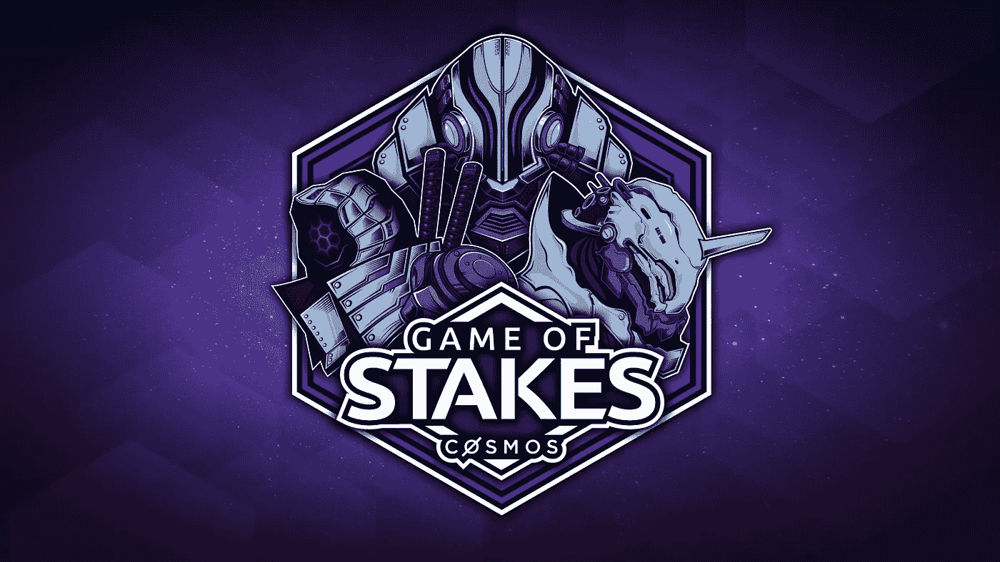

# 打破宇宙赌注游戏

> 原文：<https://medium.com/coinmonks/breaking-down-the-cosmos-game-of-stakes-5cbc538bcedb?source=collection_archive---------1----------------------->

## 敌对条件下基于分散利害关系证明的 BFT 网络

# 关键要点

*   “赌注游戏”正在运行一个完全分布式的测试网，使 Tendermint 软件受到可能的 mainnet 问题的影响。
*   该链停止了四次，各种问题得到了解决和修复，包括关键的 Tendermint 核心和 Cosmos SDK 错误。
*   一个卡特尔形成了(讽刺的是，被种植了)并被分叉出去，因为 Certus One 协调了一个链外社区分叉，将 validator 卡特尔从 GoS 网络的第 5 版中移除。
*   Cosmos mainnet 预计将于 2 月底/3 月初推出。
*   Staked 将在 mainnet 发布时支持 Cosmos，并可供代表团使用。

# 概观

Cosmos 计划推出第一个基于拜占庭容错(BFT)共识机制(Tendermint)的公共利益证明(PoS)区块链。Cosmos Game of Stakes (GoS)是分散式 BFT 网络的第一个实现，它拥有大约 195 个全球分布的验证器、激励性的对抗条件和严厉的惩罚。

# 游戏状态

Cosmos 中的奖励(块奖励和交易费)在协议级别自动分配。然而，验证者不能自动绑定这些奖励，需要单独的交易来提取和再委托它们。由于 GoS 的手动重新绑定要求和激励机制，率先制定撤销和重新授权流程的验证人能够在积累股份和投票权方面建立早期领先优势。虽然脚本可以用来自动化 GoS 中的重新绑定过程，但是它们会给 mainnet 操作带来潜在的安全风险。根据 Cosmos 团队的说法，新的 F1 费用分配提案解决了 mainnet 运营的各种费用分配改进。

截至 2019 年 1 月下旬，GoS 网络已达到功能有限的状态，在这种状态下，主要策略是验证者进入“掩体模式”，在这种模式下，他们审查除自己的撤销和奖励授权之外的所有交易。这导致块被限制为仅包括提议的验证者撤销和奖励委托交易。bunker 模式使用 min_fees 函数来部署一个有效的防御型费用防火墙，防止其他验证者发动内存池攻击并使提议者离线。然而，即使有了 bunker 模式和有效的费用防火墙，验证者在执行奖励交易时也有困难，因为 mempool 垃圾交易攻击会延迟提议者的块创建时间。该游戏已经达到了没有动机接受来自其他网络参与者的交易的游戏状态。因此，很难在 mainnet 预期的操作条件和事务负载下确定验证器和网络性能。乐观地说，这些类型的事务阻塞攻击在实际的 Cosmos mainnet 上是不可行的。

在计划于 1 月下旬发布 GoS v4 之前，GoS 验证程序 Certus One [在对用于在 12 月发布 GoS v1 的原始 genesis 事务进行分析后，确定初始验证程序注册流程已被成功 sybil 攻击。180 个 genesis 交易中的 73 个，代表了最初验证集的 40%和截止到 GoS v3 的投票权的 53%,被追溯到一个组织。在拜占庭容错 PoS 网络中，33%以上的控制是链停止审查攻击所需的阈值。Certus One 调查结果公布后不久，GoS 验证者 Bitfish 公开](/certus-one/uncovering-a-game-of-stakes-cartel-f895d9591da1)[证实](/bitfishlabs/bitfish-response-to-gos-5-24eaeeea9876)它通过让朋友和家人注册账户来玩 KYC 进程。根据 Bitfish 的说法，他们的目标是控制 25%的验证器插槽；超过 33%的控制是一个疏忽的错误。由于 33%的卡特尔可以成功否决链上治理提案，validator 社区协调了一个链外分叉，通过提交一个带有 GoS v4 新起源文件的 pull 请求来删除卡特尔。GoS 的最终版本预计将于 2 月 11 日发布，并在 GoS 获奖者确定之前运行 1 周。

# 共识失败/连锁停顿

*   **Pre-GoS 启动活跃度失败:** [Github](https://github.com/tendermint/tendermint/issues/3003) 。在 12/11/18，Genki 3000 testnet 经历了一次活动失败，因为他们运行的 Cosmos SDK 版本不正确。无效块导致所有验证器冻结，并阻止下一轮开始。
*   **费用分配逻辑+块大小限制:** [Github](https://github.com/cosmos/game-of-stakes/pull/247) 。2018 年 12 月 19 日，在 11443 地块高度，由于 Cosmos SDK 的解除绑定和费用分配逻辑中的一个错误导致一致失败，GoS 链暂停。此外，由于数据块大小限制，该链遇到了性能问题。50kb 的初始块大小被 199 个验证者的签名消耗，使得验证者很难要求和委托奖励。因此，网络进行了升级，增加了块大小，并重新启动。
*   **双标志/导出逻辑:** [Github](https://github.com/cosmos/cosmos-sdk/issues/3187) **。**2018 年 12 月 21 日，在验证程序对块进行了双重签名并且在导出逻辑中删除了斜线句点之后，由于状态不一致，GoS 链 v2.0 出现了链暂停。在 genesis，该链被期望为每个验证器创建一个斜杠周期。这种情况没有发生，导致链在提交双符号时停止，并且斜线号丢失。因此，GoS 在假期暂停，直到 2019 年 3 月 1 日重新启动。
*   **预投票失败:**2019 年 1 月 4 日，GoS 链 3.0 版在验证器子集未能进行预投票且大部分验证器离线后，在即将到达 10k 块时停止。

# 关键错误

*   **令牌打印 Bug:** [Github](https://github.com/cosmos/cosmos-sdk/pull/3207) 。
*   **气虫。**Cosmos SDK 中的一个错误导致交易消耗过多的气体并失败。该错误将网络限制在每个区块约 7 笔提款+委托交易，需要升级软件来修复。
*   **模拟代码**:2019 年 1 月 22 日，Cosmos 团队在模拟代码中发现了一个 bug，该 bug 揭露了软件中各种以前未被发现的错误。已经确定模拟在过去 18 天中没有正常运行。结果，新的 testnet 发布被暂停，直到错误被解决。
*   **授权错误**:奖励授权逻辑中的一个错误导致收费交易失败，需要打破共识的更新来修复。

## 关于[被押](http://staked.us)

Staked 为领先的利益证明(PoS)协议运营高可用性和高安全性的机构级利益基础设施。Staked 基础设施部署在多层签名和监听云配置中，该配置结合了跨内部数据中心和云提供商的地理多样性和冗余性。我们使用 Google 的 Kubernetes 容器编排来实现近乎无限的规模、自我修复和硬件去中心化。

如果你喜欢这首曲子，请在[**Twitter**](https://twitter.com/staked_us)[**LinkedIn**](https://www.linkedin.com/company/staked/)上告诉我们，或者分享给你的朋友和同事。

