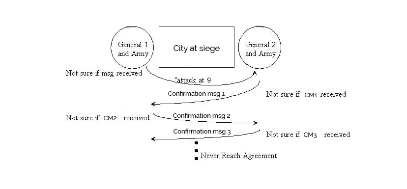
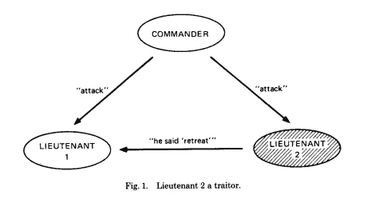
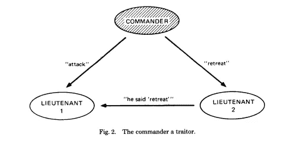
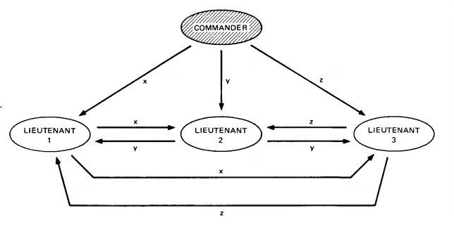
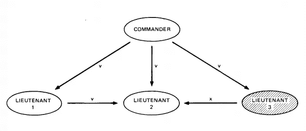

# 分解它:拜占庭容错

> 原文：<https://medium.com/coinmonks/breaking-it-down-byzantine-fault-tolerance-a8301bef5986?source=collection_archive---------2----------------------->

## 您需要的 Eli 5(…或更像 ELI17)

随着分布式分类帐网络的蓬勃发展，像你我这样的普通门外汉试图深入那些厚厚的白皮书以获得更好的理解，通常会很难理解所有深奥的术语。

拜占庭容错可能是你经常听说的一种方法；但是，当一个分布式网络是拜占庭容错时，它真正意味着什么？为什么它如此重要，以至于被认为是区块链的一个基本特征？

拜占庭容错基于[拜占庭将军问题](http://citeseerx.ist.psu.edu/viewdoc/download?doi=10.1.1.126.9525&rep=rep1&type=pdf)。这是跨越分布式元素网络的系统的普遍问题，其中一些元素的故障不能可靠地传递到系统的其余部分。基本上，当系统中的一些元素没有传递正确的信息时，我们如何就决策达成共识？

> 拜占庭故障被认为是分布式计算系统中最困难的故障类型，因为不是一个元素简单地失效，实际上**看起来**对一些元素有效，而**对其他元素无效。**

在我们深入研究多边拜占庭将军问题之前，让我们从经典的两位将军问题开始。

## 两位将军的问题

假设你有两支军队 1 和 2 计划攻击一个敌对城市。如果两支军队和他们所有忠诚的士兵同时进攻，他们肯定会赢。否则，他们就会失败。因此，他们必须就一个简单的决定达成共识:进攻，还是撤退。

这里有一个问题:这两支军队被他们计划占领的城市分开，为了相互交流，他们必须通过敌对的城市发送信使。信使很容易被拦截。

因此，为了解决这个问题，我们通常会采取以下措施:

[Source](https://www.zeonlab.com/blog/byzantine-fault-tolerance/)

首先，**军 1** (A1)向**军 2** (A2)发送消息，称 *A1 将攻击* ***，前提是*** *A2 确认他们已经收到消息*并同意攻击。A2 收到消息并发回一个回复。

简单吧？不尽然:A2 仍然不知道他们的消息是否真的到达了 A1，因为消息可能会被敌对的公民截获。如果 A1 从未收到确认消息，而 A2 认为他们收到了，那么 A2 将独自攻击，并因此以失败告终。

所以这就是 A2 所做的抵消:在确认回复中，A2 声明如果 A1 发送另一条消息说他们已经看到 A2 的确认，A2 将继续攻击。随之而来的是同样的接收消息的不确定性问题。

你可能已经看到确认信息的链条一直延伸到永远。这就是“解决方案”最终的样子:

[Source](https://www.zeonlab.com/blog/byzantine-fault-tolerance/)

事实上，在 1975 年[就已经证明](http://hydra.infosys.tuwien.ac.at/teaching/courses/AdvancedDistributedSystems/download/1975_Akkoyunlu,%20Ekanadham,%20Huber_Some%20constraints%20and%20tradeoffs%20in%20the%20design%20of%20network%20communications.pdf)*两位将军的问题没有可能的“完美”解决方案。*

## 但是还不要气馁！

让我们试着把问题**改为多边**。

假设我们有一些将军。所有这些单独的将军将不得不以与两个将军的问题相同的远程方式相互通信，并因此以某种方式达成共识。此外，这些将军中一定数量的人是叛徒。

基本上，我们只需要确保所有忠诚的将军们最终在决策上达成共识；我们并不关心叛徒做了什么。我们只关心叛徒将军*和其他将军*交流了什么。如果叛徒有选择地向不同的将军传达关于他们决定的不同信息，这将严重影响军队做出一致和协调决定的能力。

所以在我们做任何事情之前，我们需要多少忠诚的将军才能达成共识？

嗯，显然不仅仅是一个将军。那就没有达成共识，因为只有一个人。

如果总共有两个人，其中一个是叛徒，那也没关系，因为仍然只有一个忠诚的将军。没有共识。叛徒的意见最终不会影响军队的最终决定。

现在我们来看看总共三个人。假设我们有一个指挥官和两个中尉，等待接收指挥官的决定，以便将它添加到他们各自的从整个军队接收的决定集合中(收集这些决定的原因是每个人都需要根据大多数决定来找出一致意见是什么)。

[Source](https://people.eecs.berkeley.edu/~luca/cs174/byzantine.pdf)

在上图中，考虑我们目前正处于上尉 1 号的视角。我们接到指挥官的一个“攻击”命令。由于我们不知道指挥官是否忠诚，我们所做的是建立一个系统，中尉们互相交换指挥官告诉他们的东西。所以 L1 收到了 L2 的“确认”,他们确实收到了指挥官下达的“撤退”命令。等等，什么？

很明显，从图表中我们已经知道 L2 实际上是叛徒，但是 L1 对此一无所知；他们盲目地进去了。好吧，在我们继续之前，让我们看看这种情况的另一个可能的方面；*指挥官*是叛徒的案子。

[Source](http://citeseerx.ist.psu.edu/viewdoc/download?doi=10.1.1.126.9525&rep=rep1&type=pdf)

从这个案例中我们可以看到，无论谁是叛徒，可怜的 L1 最终都会得到同样的结果；他们的结果永远不是["进攻"、"撤退"]就是["撤退"、"进攻"]。

最终，很难确定 L1 收到的哪个信息是真实有效的。

这让我们想到了当前流行的理论；如果军队中有三分之一或更多的人是叛徒，军队就不能抵抗叛徒。换句话说，只有不到 1/3 的 ***军队是汉奸*** 军队才能达成共识。

[Source](http://citeseerx.ist.psu.edu/viewdoc/download?doi=10.1.1.126.9525&rep=rep1&type=pdf)

作为证明这一理论的例子，考虑我们这次有一个指挥官和三个中尉。如果这些人中只有一个是叛徒，军方就有可能达成一致意见。

[Case 1](http://citeseerx.ist.psu.edu/viewdoc/download?doi=10.1.1.126.9525&rep=rep1&type=pdf): The commander is the traitor.

说指挥官是本案中的叛徒。指挥官会给每个中尉发不同的命令来迷惑他们。我们将这些命令命名为 *x* 、 *y* 和 *z.* ，使用与之前相同的信息共享确认方法，因为所有的中尉都是忠诚的，所以他们将彼此共享相同的命令 *x、y* 和 *z.*

这为每个中尉创建了相同的命令集合，这将是["*x*"，"*y*"，"*z*"]顺序的一些变化。您可能会惊慌地注意到，所有这些命令都是不同的，但实际上，只要大多数中尉接收到相同的命令集合，他们就可以达成共识。中尉们可以简单地预先设定某种规则，比如，“如果你收到一组三个不同的命令，就默认撤退”。

让我们来看看一个中尉是叛徒的例子:

[Case 2](http://citeseerx.ist.psu.edu/viewdoc/download?doi=10.1.1.126.9525&rep=rep1&type=pdf): L3 was a traitor.

因为指挥官是忠诚的，并且向所有的中尉发出同样的命令，所以每个中尉至少会收到一个命令。

此外，由于 2/3 的中尉是忠诚的，每个中尉至少会收到两个命令 *v* 。最后，由于叛徒 L3 会偏离指挥官发出的命令，他们会向另外两个中尉 L1 和 L2 发出命令 *x* 。

结果，大多数(2/3)的中尉会收到这组命令[" *对*"，"*对*"，" *x* "]。因为只有忠诚的中尉们的决定才重要，他们已经达成共识，因此会听从指挥 *v* 。

酷！现在，既然我们有证据证明少于 1/3 的叛徒= >共识是可能的，让我们继续讨论区块链(特别是像比特币一样的工作证明区块链)如何能够变得拜占庭容错(也就是“抵抗叛徒”的军队)。

## 回到比特币

在中本聪写给詹姆斯·a·唐纳德的这封电子邮件中，智雄辩地解释了工作共识算法如何为拜占庭将军的问题提供了一个概率解决方案。我强烈建议您在继续之前阅读这封电子邮件，它并不长！

因此，换一种方式来说，假设拜占庭将军问题中的所有各方现在都可以使用大量的计算能力。这一次，我们通过两军唯一要做的就是**达成共识**的视角来聚焦问题。就是这样。他们不在乎是进攻，还是撤退，或者什么时候进攻，只在乎他们都在同一时间做同一件事。

这样，将军们决定第一个随机广播给军队其他人的命令将是他们遵循的命令。当然，不幸的是，事情没那么简单；由于所有的将军都在遥远的地方，他们会根据所在位置在不同的时间收到不同的命令。因此，如果将军 1 在将军 12 广播消息“午夜攻击”之前几秒广播消息“拂晓攻击”，那么更靠近 G12 的将军将接收“午夜攻击”作为他们的第一个命令，尽管 G1 是第一个广播命令的。

为了抵消这一点，将军们使用他们的计算能力来解决一个极其困难的加密问题，称为工作证明问题。这个问题太难了，每个将军至少要花 10 分钟才能解决。

这个工作验证问题迫使每个将军从他们收到的第一个命令开始，以一定的难度计算散列值。(需要什么是加密哈希函数的入门知识？查看[这篇文章](/@ramyjzh/cryptographic-hash-functions-wait-what-35128a8960a6)出来！)这个难度级别对所有将军都一样。它基本上确认了消息确实来自他们军队的一位将军(把困难想象成代表军队的独特的蜡制徽章，该徽章非常难以复制)。

举个例子，假设所有的将军都必须以这样一种方式来解决这个工作证明问题，他们获得的散列前面必须有 5 个零:00000e7f89a892…你可以把这 5 个零想象成军队的“标志”，困难。这种类型的散列很难获得，如前所述，每个将军至少需要 10 分钟来解决它。

那么它是如何工作的呢？让我们放大到一个特定将军的视角。假设 G2 首先收到“拂晓攻击”的消息。他们立即开始工作，并在消息后添加一个名为*随机数*的数字。现在看起来大概是这样的:“拂晓进攻 218ef761g3”。使用他们的计算机，他们将这个信息输入加密哈希函数，得到一个*前面没有五个零的哈希。因此，他们稍微改变一下随机数，并一遍又一遍地重复整个过程，直到他们获得命令“在黎明时攻击”和某个随机数的组合，该随机数给他们一个前面有五个零的散列。*

能够成功获得该散列的第一个将军然后将该散列和它们的原始消息广播给网络的其余部分。所有其他收到它的忠诚将军现在都将这个工作证明包含到他们正在工作的散列中。如果一些将军以前正在执行不同的“第一命令”，他们会立即放弃它，跟随所有其他人，因为现在“拂晓攻击”命令的工作证明链更长了(这意味着你可以看出大多数军队现在都在执行这个命令)。

在所有的将军们都提交了他们的工作证明之后，他们将对“拂晓进攻”的行动计划达成一致意见。

但是等等——我们如何确定这些命令没有被篡改？好吧，因为所有的将军都可以访问工作证明分类账的相同副本，一个敌对的公民试图在将军们没有意识到的情况下改变消息，将不得不进入链并改变每个将军的工作证明，这将需要 10 分钟*军队中将军的数量-当这个公民完成编辑命令时，将军们将已经决定了一个共同的行动计划。

瞧！这就是拜占庭将军们的问题，以及拜占庭式的容错在其令人头痛的荣耀中。

> 我希望这有所帮助！请让我知道你在评论中可能有的任何问题，以及如果我歪曲了任何信息的任何反馈。感谢您的阅读！请务必关注这个媒体页面，以获取更多类似的文章。