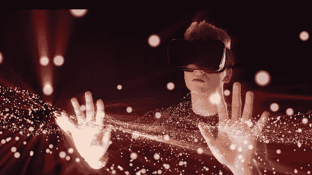

# 打破所有权，创造者经济的 Web3.0 之旅

> 原文：<https://medium.com/coinmonks/breaking-ownership-the-web3-0-journey-of-creator-economy-362a9a4f6dc?source=collection_archive---------5----------------------->

> 创作者被封了好几年，我们让垄断伤害了他们。

# Web 3.0 转型

Web 1.0:互联网

Web 2.0:社交媒体/移动互联网

Web 3.0:区块链/人工智能

我们正处于互联网的第三阶段。许多 Web 3.0 怀疑论者认为去中心化不会改变任何事情。我不同意。

比特币基地首席执行官 Brian Armstrong 认为 Web 3.0 并不新鲜。他说我们正在重新去中心化互联网，也就是互联网最开始是什么样的，为什么？

他说，我们需要“测试大型科技公司的力量”，也是因为许多国家被排除在创造者的经济繁荣之外。问问像我在非洲的朋友 Chinedu 这样的创造者。他们很难通过 PayPal 和 Stripe 赚钱。然而，像我这样的人，一直认为这是理所当然的。出生地的运气应该不会影响你能否加入创造者经济，并以此为生。

创意不受原产国限制。Web 2.0 让我们认为它是。

# **“转化率”说明对创作者的剥削**

像 Twitter、Instagram 和抖音这样的社交媒体平台有 100%的转化率——它们根本不与创作者分享任何收入！这对他们来说是好事，但对用户来说是坏事。——克里斯·狄克逊

在这里我将进一步麻烦迪克森。在首席执行官杰克·多西看到 Web 3.0 的力量之前，Twitter 从未与其创造者分享收入，现在他再次起航了。他公开宣布，他将把 Twitter 去中心化，变成一个 Web 3.0 产品。此外，Twitter 刚刚推出了“超级关注”功能，允许创作者从内容中赚钱。

此外，还有一个新的时事通讯功能，允许创作者为付费时事通讯收费。这还不是全部。最近推出了最好的功能。Twitter 现在已经开放了加密货币服务。你可以在推特上用比特币转账。例如，如果你曾经试图从美国向萨尔瓦多汇款，这就是游戏的新规则。Twitter 证明了向 Web 3.0 的迁移将 100%发生，尽管很慢。

然而，脸书、Instagram 和抖音还没有理解这种转变。他们允许内容创作者像奴隶一样工作。创作者建立了一个追随者，并获得了一个由算法控制的视图，该算法可以决定明天是否喜欢你的帽衫颜色。他们用这些内容吸引消费者，给他们看广告。广告收入的 0 美元将与创作者分享。请再读一遍。

内容平台刚出现的时候，我们只是很乐意不用花一分钱就用。现在我们已经习惯了。我们的标准变了。创作者希望公平分享我们内容带来的平台收益。这是合理的。然而，除非扎克伯格被迫出售广告并分享收入，而不是再买一套房子，否则改变不会发生。

如果创作者不再免费提供内容，那么像抖音这样的平台将会破产。请想象一下。

# 平台所有权被打破

Web 3.0 有何不同？所有权。创作者希望拥有自己创造的平台，拥有投票权。平台赚钱了，也就赚钱了。

通过投票权形成内容审查政策。它是通过区块链共识的过程和世界各地成千上万台电脑的强制信任完成的(即使是橙色的总统也无法影响区块链的选举)。

另外还有平台本身的功能。你有没有在一个美好的周六下午打开自己喜欢的 app，发现一切都变了，看起来像是大一 UI/UX 小子设计的？是不是感觉没看到设计从上面给了你脸一拳？这不是孩子的错。他们离造物主的作品太远了。他们是局外人。

Web 3.0 则不同。该功能由用户通过民主程序决定。如果一群用户不喜欢，他们就会创建一个分叉。分叉是指运行同一平台的两个版本，具有不同的特性。

当所有权固定且透明时，动机就会改变。所有权导致用户民主，而不是类似 web 2.0 的独裁哲学“这是最新更新，你这个肮脏的动物。”

# 智能合约促成了这场革命

21 世纪初:做网站。

2010 年代:开发应用。

20 世纪 20 年代:部署智能合同。

很多人误解了以太坊在新创造者经济中的作用。以太坊允许机器代替人类执行智能合约。

企业家迈克·诺沃格拉茨(Mike Novogratz)解释说:“区块链将允许不应该免费的信息，而不是免费的信息。”记得 Napster 吗？你可以免费下载音乐，没有人能阻止你，甚至是乐队的傻瓜金属。

我们正在使用的互联网的 Web 2.0 版本不是为内容所有权而构建的。如果你愿意，你可以从 Youtube 上下载任何视频。这是很难察觉的。该死的，这篇文章很容易被复制粘贴窃取。

智能合约改变了这一点。智能合约告诉每个人谁是该内容的所有者。NFT 的创意在于将你的内容转化为便携式数字资产，这样你就可以在互联网上的任何地方发布。

根据专家埃里克·乔根森(Eric Jorgenson)的说法，当前的 web 3.0 时代仅仅是由于这三个方面的差异:

Web1 =免费发布

Web2 =自由交流

Web3 =自由交易

# 更多赚钱的方法

现在，Web 3.0 解决了内容所有权问题，并使我们的数字资产可移植，我们作为创作者可以找到更多赚钱的方法。

迈克·诺沃格拉茨表示，我们将“看到从商人到创意的转变。”创作者将有办法将他们的创造力货币化。不仅是艺术创意，还有各种创意。

他甚至说我们会把 NFT 穿在 t 恤上，其他人只有戴上 AR/VR 眼镜才能看到。

你可以和多方分享金钱。你可以根据哪个平台更好，把你的内容从一个平台转移到另一个平台。来自世界各地的创作者将能够合作，想出疯狂的方法从我们的工作中赚钱。

当扎克变得富有时，他不再需要在脸书身上赚 0 美元。根据内容的表现，金钱可以秒流入你的口袋。

创作者会加速 Web 3.0 的发展，因为我们只是想得到报酬，这样我们就可以全职从事创作。一旦内容捕获者释放我们，更多的赚钱方式将淹没我们的创意大脑。我不能再等了。

# Web 3.0 改变了每个主要行业

ETH:分散化的硅谷

DeFi:分散化的华尔街

NFTs:去中心化的好莱坞

这种转变并不是创造者经济所独有的。所有行业都将慢慢改变，以反映人类对民主的痴迷。Web 3.0 最早瞄准金融，成为超过 2 万亿美元的行业。这种转变已经转移到了创造者经济。例如，Bitclout 等平台发明了硬币，允许创作者成为他们的用户，以便他们可以投资股票。

下一波去中心化浪潮将会是 Youtube、Spotify 和脸书。现在是成为创造者经济的一部分的最好时机。观察发生在您眼前的转变，将您喜欢的任何内容类型移植到 Web 3.0。这就是你作为一个创造者如何利用这个伟大的机会。

> 加入 Coinmonks [电报频道](https://t.me/coincodecap)和 [Youtube 频道](https://www.youtube.com/c/coinmonks/videos)了解加密交易和投资

## 另外，阅读

*   [如何购买 Monero](https://blog.coincodecap.com/buy-monero) | [IDEX 评论](https://blog.coincodecap.com/idex-review) | [BitKan 交易机器人](https://blog.coincodecap.com/bitkan-trading-bot)
*   [如何在 Bitbns 上购买柴犬(SHIB)币？](https://blog.coincodecap.com/buy-shiba-bitbns) | [印度币安](https://blog.coincodecap.com/binance-in-india)
*   [币安 vs 比特邮票](https://blog.coincodecap.com/binance-vs-bitstamp) | [比特熊猫 vs 比特币基地 vs Coinsbit](https://blog.coincodecap.com/bitpanda-coinbase-coinsbit)
*   [如何购买 Ripple (XRP)](https://blog.coincodecap.com/buy-ripple-india) | [非洲最好的加密交易所](https://blog.coincodecap.com/crypto-exchange-africa)
*   [非洲最佳密码交易所](https://blog.coincodecap.com/crypto-exchange-africa) | [胡交易所评论](https://blog.coincodecap.com/hoo-exchange-review)
*   [eToro vs robin hood](https://blog.coincodecap.com/etoro-robinhood)|[MoonXBT vs Bybit vs Bityard](https://blog.coincodecap.com/bybit-bityard-moonxbt)
*   [Stormgain 回顾](https://blog.coincodecap.com/stormgain-review) | [Bexplus 回顾](https://blog.coincodecap.com/bexplus-review) | [币安 vs Bittrex](https://blog.coincodecap.com/binance-vs-bittrex)
*   [Bookmap 评论](https://blog.coincodecap.com/bookmap-review-2021-best-trading-software) | [美国 5 大最佳加密交易所](https://blog.coincodecap.com/crypto-exchange-usa)
*   [如何在 FTX 交易所交易期货](https://blog.coincodecap.com/ftx-futures-trading) | [OKEx vs 币安](https://blog.coincodecap.com/okex-vs-binance)
*   [如何在势不可挡的域名上购买域名？](https://blog.coincodecap.com/buy-domain-on-unstoppable-domains)
*   [印度的秘密税](https://blog.coincodecap.com/crypto-tax-india) | [altFINS 审查](https://blog.coincodecap.com/altfins-review) | [Prokey 审查](/coinmonks/prokey-review-26611173c13c)
*   [布洛克菲 vs 比特币基地](https://blog.coincodecap.com/blockfi-vs-coinbase) | [比特坎评论](https://blog.coincodecap.com/bitkan-review) | [币安评论](/coinmonks/binance-review-ee10d3bf3b6e)
*   [Coldcard 评论](https://blog.coincodecap.com/coldcard-review) | [BOXtradEX 评论](https://blog.coincodecap.com/boxtradex-review)|[uni swap 指南](https://blog.coincodecap.com/uniswap)
*   [阿联酋 5 大最佳加密交易所](https://blog.coincodecap.com/best-crypto-exchanges-in-uae) | [SimpleSwap 评论](https://blog.coincodecap.com/simpleswap-review)
*   [购买 Dogecoin 的 7 种最佳方式](https://blog.coincodecap.com/ways-to-buy-dogecoin) | [ZebPay 评论](https://blog.coincodecap.com/zebpay-review)
*   [iTop VPN 审查](https://blog.coincodecap.com/itop-vpn-review) | [曼陀罗交易所审查](https://blog.coincodecap.com/mandala-exchange-review)
*   [美国最佳加密交易机器人](https://blog.coincodecap.com/crypto-trading-bots-in-the-us) | [变化回顾](https://blog.coincodecap.com/changelly-review)
*   [A-Ads 审查](https://blog.coincodecap.com/a-ads-review) | [Bingbon 审查](https://blog.coincodecap.com/bingbon-review) | [Mudrex 投资](https://blog.coincodecap.com/mudrex-invest-review-the-best-way-to-invest-in-crypto)