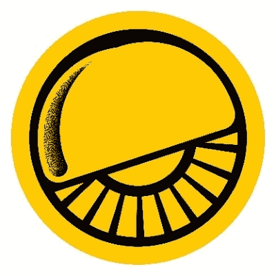
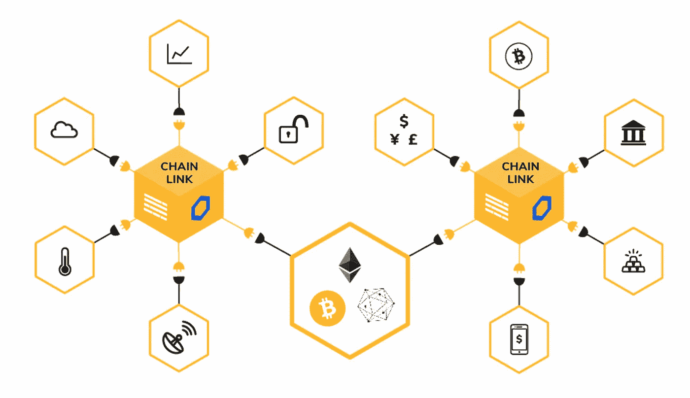

# 链条之间的桥梁:分类学

> 原文：<https://medium.com/coinmonks/bridges-between-chains-a-taxonomy-46bc7ac767fd?source=collection_archive---------8----------------------->

## …和入门指南

Courtesy of [ccoingossip.com](https://ccoingossip.com/blockchain-bridge/)

cryptoverse 将互操作性定义为不同链之间进行通信的能力。

对许多人来说，这是去中心化网络愿景的核心。没有一个链可以适合所有的用例，所以——智慧说——未来将是多链的。*因此，*我们需要健壮的框架来让不同的链进行交流，以免分散的网络变成一个孤立的生态系统。

碰巧的是，这种想法支撑着 Cosmos 和 Polkadot，这两个旗舰项目为区块链国家间的交流构建通用架构。

On Cosmos, Hubs connect different blockchains (Zones) via an inter-blockchain communication protocol. (Courtesy of Gavin Birch on [Figment](https://figment.io/resources/inter-blockchain-communication-ibc-is-coming-to-cosmos/))

然而，随着去中心化金融的兴起，特定链条之间的资产桥梁获得了实际意义。“包装”在以太坊上的比特币已经成为 DeFi 储备资产，替代智能合约生态系统优先考虑以太坊的桥梁，作为其流动性的一种手段。

我最近读了《T4》包装协议(T5)的白皮书，这是 Tezos 和以太坊之间的桥梁。它讨论了创建桥梁的不同方法，并启发我分享一个入门指南。

# **方法一:集中托管**

在这种模式下，一个可信的实体在一条链上接收你的资金，在另一条链上向你发送等值的资金。

锁定总价值超过 60 亿美元的 [WBTC](https://wbtc.network/) (一种与比特币 1:1 支持的 ERC-20 代币)是最明显的例子:BitGo 托管 BTC 储备，并允许“[商户](https://wbtc.network/dashboard/partners)”为 KYC 验证的用户处理造币和赎回操作。

虽然集中托管人可能不符合去中心化网络的纯粹主义观点，但普通用户更倾向于便利而非不信任。随着去中心化解决方案的成熟，这种权衡将会随着时间的推移而减少，但是——目前有超过 18 万个比特币被包装成 WBTC——证据就在布丁里。

然而，WBTC 显然在透明度方面进行了创新，其储备证明机制依赖于去中心化的 oracle 网络 Chainlink。也就是说，Chainlink 节点不断将 BitGo(WBTC)托管钱包的余额推送到以太坊智能合约上，允许任何以太坊 dapp 验证 WBTC 是否完全抵押。

类似地，会计公司[阿玛尼诺·LLP](https://www.armaninollp.com/)已经为菲亚特 stablecoins 部署了准备金证明，这本质上是从菲亚特系统到加密领域的桥梁。目前，他们的[解决方案](https://real-time-attest.trustexplorer.io/trusttoken)允许您实时验证 TrustToken 发行的 stablecoins(即 TrueUSD、TrueGBP)是否得到完全支持，并通过 Chainlink 将此信息提供给智能合约。

# **方法二:联合签名人**

然而，不信任的概念仍然是这个空间的核心，其他桥梁自然选择了更分散的架构。简而言之，这种想法是通过分布式共识来处理交易，并激励共识参与者表现良好。

ren VM(ren BTC 的发行者)是这种方法的先驱。

Learn more about RenVM on [renproject.io](https://renproject.io/)

为了执行跨链传输，RenVM 节点(暗节点)必须建立一个绑定。如果他们恶意行为或导致资金流失，这种债券可以被大幅削减。如果他们操作正确，他们赚取交易费。

这篇文章的灵感来源于包装协议，它也是一个联邦桥。

Read the Wrap Protocol whitepaper [here](https://github.com/bender-labs/docs/blob/main/Wrap%20Protocol%20-%20Whitepaper.pdf).

要将以太坊 ERC-20 包装到 Tezos FA2 中，用户:

*   将 ERC-20 存入以太坊存款合同。
*   等待签名者的阈值(“法定人数”)来发布签名指令，以便在 Tezos 上铸造等量的硬币。
*   将这些签名的指令提交给 Tezos 契约，并接收包装好的令牌。

目前，签名者没有正确行为的硬性激励。然而，大多数人必须相互勾结，恶意行为才能得逞。一个更全面的激励框架正在规划中。

# **方法三:神谕**

一座不可信的桥梁也可能依赖于分散的神谕。参与者将他们的观察提交给 oracle smart contract，而不是在链外达成共识。

Courtesy of [Genesis Block HK](https://genesisblockhk.com/crypto-101-what-is-chainlink/).

然后，该契约负责将观察结果计算成共识，并相应地触发 mint 和 redempt 操作。任何激励框架(即债券和奖励)也将编入 smart 合同。

尽管 Chainlink 可以轻松实现这样的解决方案，但它对智能合同操作的依赖是采用的一个障碍。首先，它与比特币不兼容。第二，今天的桥梁主要连接以太坊，在那里智能合同操作可能是昂贵的。

# **方法四:原子互换**

以前的方法都依赖于不可信或不可信的链外基础设施。然而，原子交换可以在用户之间直接在链上执行。

它们被称为“原子的”,因为它们要么完全执行，要么被还原，任何资金都归还给原始所有者。

散列时间锁定契约(HTLCs)是原子交换的构造块。为了说明 HTLCs，让我们假设爱丽丝和鲍勃想用 ETH 交换 XTZ:

1.  Alice 为事务生成一个密钥，并导出其加密哈希。
2.  Alice 将 ETH 存入以太坊上的智能合约，引用加密哈希和 Bob 的公钥。在指定的时间锁定期间，如果 Bob 提供了 Alice 的秘密密钥，则只有 Bob 可以访问资金。
3.  Bob 将他的 XTZ 存入 Tezos 上的智能合同，引用相同的加密哈希和 Alice 的公钥。在指定的时间锁的持续时间内，如果 Alice 提供了她的秘密密钥，则只有 Alice 可以访问资金。
4.  爱丽丝用她的秘密钥匙赎回了 XTZ，从而把它透露给了鲍勃。
5.  鲍勃用爱丽丝的秘密钥匙赎回了 ETH。

Courtesy of Baking Bad (creators of Atomex) and their solid illustration on [Coinmonks](/coinmonks/atomex-cross-chain-atomic-swaps-on-practice-8139571f0ee5)

如果 Bob 未能存入 XTZ，或者如果 Alice 未能透露她的秘密密钥，则资金可以在时间锁定后由它们各自的所有者收回。这样，交换是原子性的。

尽管没有中介的无信任解决方案当然很好，但没有流动市场，原子互换是不可用的。如果鲍勃想交易，爱丽丝不会凭空出现，所以这个市场必须被创造出来。

Atomex 是一个利用原子互换的实时交易所。

# **方法五:合成资产**

合成资产“模仿”基础资产的价值。例如，戴大约相当于美元的价值。要创建 DAI，用户锁定超额抵押品，即价值 200 美元的 ETH，以创建 100 DAI。如果抵押品的价值下降到超过规定的阈值，它可以被其他用户清算。

Learn more about how DAI works on [makerdao.com](https://makerdao.com/en/whitepaper)

我不愿意将合成资产描述为桥梁。它们是一种在链上表示外部指数的通用方法，无论是以太坊上的美元还是币安智能链上的莱特币。然而，它们不能用来赎回基础资产，它们的价格受制于只能实现软挂钩的经济机制*。*

尽管戴可能具有创新性，但它作为菲亚特 stablecoins 的分散化替代方案提供了价值，而不是作为一座桥梁。

__ __ __ __

我希望这个指南对你有用。安全地漫游隐密体。🚀

*   [3 商业评论](/coinmonks/3commas-review-an-excellent-crypto-trading-bot-2020-1313a58bec92) | [Pionex 评论](/coinmonks/pionex-review-exchange-with-crypto-trading-bot-1e459d0191ea) | [Coinrule 评论](/coinmonks/coinrule-review-2021-a-beginner-friendly-crypto-trading-bot-daf0504848ba)
*   [莱杰 vs Ngrave](/coinmonks/ledger-vs-ngrave-zero-7e40f0c1d694) | [莱杰 nano s vs x](/coinmonks/ledger-nano-s-vs-x-battery-hardware-price-storage-59a6663fe3b0) | [币安评论](/coinmonks/binance-review-ee10d3bf3b6e)