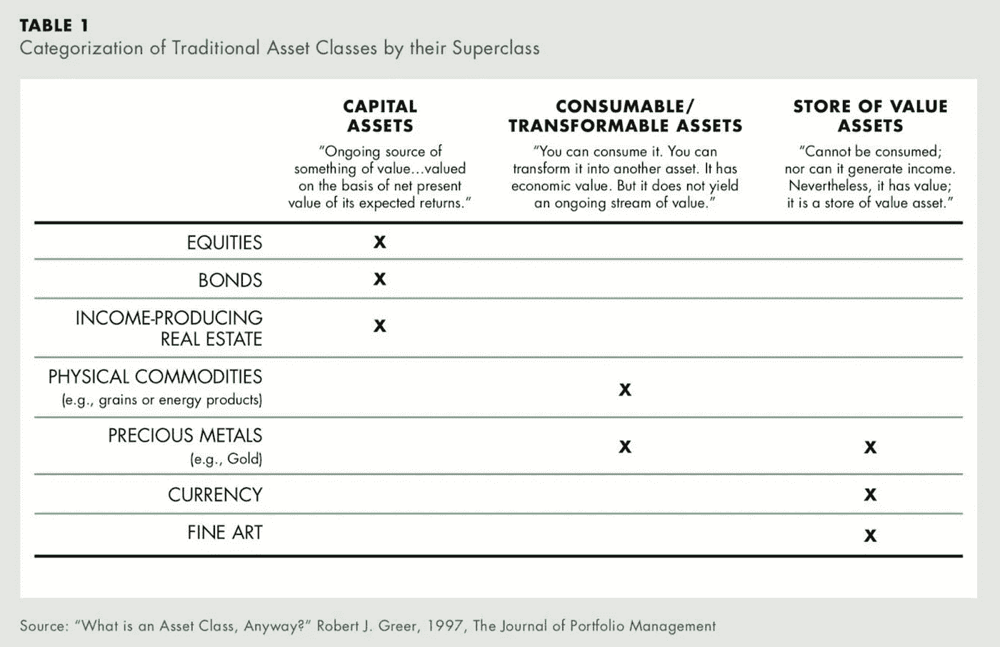
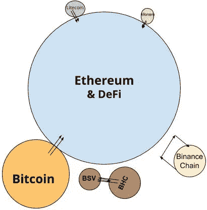

# 将比特币带入以太坊

> 原文：<https://medium.com/coinmonks/bringing-bitcoin-to-ethereum-4c3b561080e7?source=collection_archive---------0----------------------->

## 现在是加密货币对政府货币对科技货币；我们应该合作。

比特币成立于 2009 年，作为从货币集中控制中独立出来的宣言。以太坊成立于 2015 年，是从管理我们生活的机构中独立出来的宣言。**这两个区块链定义了加密货币社区，**和我们持有的价值观；审查阻力、分权和无寻租。

2019 年，脸书成立了 Libra，宣布独立于*政府*资金，但同时保留*集中*管理，以创建一个寻租机制，增加网络利益相关者的财富。Libra 由脸书支持，它的下属技术公司和 24 亿用户组成的军队，希望生成自己的货币系统，同时为自己捕捉网络价值。

虽然密码社区热衷于减少政府对金钱的权力，但把这种权力交给大型科技公司并不是我们想要的。然而，密码爱好者的理想主义并没有得到很好的体现。向普通人宣扬分权和不寻租，会遇到困惑和不耐烦。如果加密货币世界要采取双头九头蛇(政府钱；公司的钱)，它需要合作，组合资源。不仅仅是为了击败我们不认同的货币体系，也是为了创造更好的产品和更大的生态系统。

## 不可信的桥

“桥”描述了一种机制，一个区块链的货币可以通过加密保证系统“迁移”到另一个区块链。这个“桥梁”管理着区块链和区块链的基金，并确保它在 A 上控制的每一个货币单位都能在区块链 B 上产生等量的资金，并允许任何人在区块链转移或赎回他们的基金。

“无信任桥”的有效性在于如何传递“你是真正的加密货币吗？”测试。

一些加密货币不应被视为加密货币，因为它们无法通过“无信任桥”测试。EOS、XRP 和 TRX 没有最大限度地抵制审查或分散化，因此与纯加密货币相比，它们更接近于“公司资金”。来说明；如果可以在 XRP 和以太坊之间建立一座不可信的桥梁，这也不会改变 XRP 的区块链被 Ripple 控制的事实，进出这座桥梁的资金可能会被 Ripple 审查。同样，以太坊和 EOS 之间的桥梁不会改变 EOS 块生产者阻止交易的方式，并且可以审查进入/离开桥梁的 EOS。

通过无信任桥测试的加密货币的简短列表:

*   比特币
*   以太坊
*   莱特币
*   莫内罗
*   总督

所有这些区块链人都说同一种语言。它们都以共同的原则运作，这意味着它们都受益于区块链之间的无信任价值转移和交流。

## 花钱换得价值

将比特币与以太坊连接起来可能是一件相对简单的事情(从大的方面来看)，这会给密码世界带来巨大的回报。

Which is which?

出于下面讨论的原因，以太坊上的比特币将推动开放金融产品和服务的复兴。两个区块链的弱点被另一个互补，并且一起可以加速彼此与外部世界的关联。

# 比特币在以太坊的互惠互利

## 赋予比特币可编程性

比特币最大的弱点是缺乏表现力。将它的区块链减少到最简单的形式是为了减少复杂性和攻击表面积，同时寻求最大化稀缺性。比特币社会契约指出，复杂性和可编程性应该被“推到边缘”，任何“智能签约”功能都应该在第 2 层或更高的层上。

到目前为止，比特币还不能产生任何可编程的第二层。在参加了比特币 2019 并听取了与可编程性和比特币相关的小组讨论后，这里讨论的解决方案都牺牲了去中心化和审查阻力来实现比特币的可表达性，因此未能通过无信任桥测试。像根茎或直根这样的平台代表了比特币与更类似于 EOS 或 TRX 的平台的桥梁，而不是以太坊。我与之交谈过的一些比特币创造者(我的播客主持人，@ck_snarks 和@taiberg)同意这种担忧；它们不是理想的解决方案。

在不牺牲去中心化和审查阻力的情况下，比特币作为资产实现可编程性和实用性的最佳选择是通往以太坊的不可信桥梁。在以太坊最受欢迎的应用上，比特币没有理由不能与以太或戴并驾齐驱；制造商，复合，Uniswap，DYDX，Kyber，SET。无信任桥机制将为比特币持有者提供他们所需要的控制和安全水平，激励他们赚取 BTC %的利息。

## 马克尔岛不可信的 BTC 抵押品

MakerDAO 最重要的附带问题之一是第三方风险。安全代币、现实世界的资产、集中的法币都带有风险，即集中的一方“拔掉插头”，并决定代表资产的 ERC20 代币不拔掉插头。或者钱被没收，房子被烧毁，等等。

比特币在比特币区块链上受到加密保护，并被包裹在以太坊上的一个 ERC20 令牌内，是一种价值 2000 亿美元的抵押品，没有第三方风险。这种品质的唯一其他资产就是以太本身。以太坊上的比特币有能力将 Dai 的增长规模扩大到 10 亿美元的市值。

# 内在流量

以太坊有内外两面。内部是比特币上的 P2P 交易，以及以太坊的开放金融网络。以太坊的所有 dapps 都是“内部”的，而像比特币基地、双子座、Wyre、LocalBitcoins 这样的公司都是中央集权的公司，两边都有脚:接受外部指令，并将值转移到内部加密。

Imagine if there was a source of BTC pouring into this network

当斜坡上的平面倒向圆圈内部时，圆圈的大小(市值)增加。此外，以太坊的开放金融网络也在增长，这既从内到外推动了循环，同时也减少了将您的价值“流出”回加密外部的需要。像我这样在 CDP 中交易量超过银行账户交易量的人都经历过这种情况。

以太坊上的比特币结合了比特币和以太坊的“内部”一面。他们有效地将彼此区块链缝合在一起。就像两个水滴碰到一起，它们结合了它们的大小。

比特币是迄今为止流动性最高的加密货币。流动性也许是以太坊的开放金融最能利用的特点。当以太坊网络(而非币安或比特币基地)有技术来分享比特币的流动性时，我们肯定希望实现它。

## 开放金融为比特币提供了效用

对集中化和第三方风险极度过敏的比特币创造者，最终仍然会信任 Salt 和 Blockfi 等公司持有他们的比特币，以便获得贷款或利息支付。以太坊上的比特币将使 BTC 持有者体验到开放金融的魔力。贷款、借款、杠杆作用；比特币创造者在 Bitmex、Blockfi、Salt 等集中平台上做的所有事情，而是保持对自己比特币的控制。能够在不放弃资产控制权的情况下接触金融工具，将激励大量 BTC 向以太坊区块链迁移，或许永远不会回到基础比特币区块链↓ ↓

开放金融将创造 BTC 到以太坊的单向流动。开放金融会对比特币产生非常强大的引力。当有人可以毫无根据地获得以 BTC 为抵押的贷款，或者根据你提供的 BTC 支付利息时，以太坊-BTC (EBTC)将变得比 BBTC 更有价值。BBTC 将是一项静态资产，而 EBTC 可以赚取利息或以其他方式利用。休眠的 BBTC 还不如迁移到以太坊，以 Compound、DYDX 或 Dharma 贷款，以获得贷款利息。

## 以太坊将对比特币进行规模化

以太坊 2.0 的研发是创造比特币的赛弗朋克研究的自然延续。以太坊的缩放研究，如广义状态通道、等离子体和分片，可以通过无信任桥访问比特币。

事实证明，比特币的闪电网络很难被采用，它对任何参与者都有严格的要求，比如需要运行自己的节点。

**以太坊比闪电网更有可能规模化比特币。**通过一个不可信的桥梁，比特币利用以太坊研究人员和开发人员投入规模研究的所有工时，并利用这些工时，而不是闪电网络的可怕 UX。

## 以太坊将使比特币私有化

EY 的黄昏，以太坊上私人交易的 ZK-斯纳克协议，是以太坊上最适合机构的产品之一。AZTEC 协议是 ERC20 的另一种私有交易协议，也具有私有以太坊令牌交易的能力。这些功能可以让比特币变得完全模糊和可替代。

# 三笔钱

这是一个我越来越有信心的预测。

加密货币将产生**三种货币。**

*   **固定电源，电源**
*   **固定供应发放，位置**
*   **可变供给，稳定价值，抵押**

The future of Money. RIP XRP.

**比特币**——奥地利高度投机的商品货币

**以太** —算法的、基于基本面的资产/股票资金

**戴**——被治理的、非投机的、有担保的稳健货币

这三种货币中的每一种都有自己的用例，以及自己的持有者。

**比特币**，主要以其稀缺性来估价，将永远是全球投机资产。比特币的硬上限将继续其作为一种不相关资产的地位，这种资产是对其他一切资产的对冲。

以太将作为一种资产被购买和持有，其背后有可衡量的和具体的基本面。以太赌注利率及其作为抵押品的价值将为资金管理者提供对其未来资金增长的有根据的预测。可以通过以太的独家所有权收取的费用，以及有限数量的以太赌注者，将产生通常可预测的回报，同时保持其作为以太坊网络的股权令牌的地位

戴将是大多数人选择的货币。它的稳定性和可预测性将使 Dai 成为主要的储值加密货币，因为它能够让人们准确预测他们的 Dai 在遥远未来的价值，这与以太网或比特币不同。它还可以使用 Dai 储蓄利率，这是一个为 Dai 持有人开设的储蓄账户，每年向他们返还利息，它还可以使用 Dai 的其他贷款平台。

货币作为交换媒介、价值储存手段和记账单位的需求，将在很大程度上被这三种货币类型所满足。戴、比特币和以太将处于一场持续的拉锯战中，因为建立在以太坊基础上的金融系统将随着时间的推移产生不同的市场需求。

# 以太:三点资产

Science.jpeg

以太是一种具有独特属性的货币。与“只是钱”的代币或比特币不同，以太作为以太坊的本地货币享有特权地位。

“资产超类”有三个类别，1997 年由 Robert Greer 定义，最近由 Chris Burniske 推广(在加密货币中)。

这三个‘超类’说明了有价值的东西必须归入的各种类别，以太归入所有这些类别，代表以太作为货币的‘叠加’。

> ●资本资产(CA):“有价值的东西的持续来源……根据其预期回报的净现值进行估价。”明显的例子是股票、债券、创收的房地产等等
> 
> ●可消耗/可转换资产(C/T):“你可以消耗它。你可以把它变成另一种资产。它有经济价值。但它不会产生持续的价值流。”石油、小麦、天然气都属于这个范畴，而一些贵金属和稀缺商品是资本资产，但也是社会认可的价值储存手段(与第三个超类重叠)
> 
> ●价值资产储存(SoV):“不能消耗；也不能创收。然而，它有价值；它是一种价值资产储存手段。”像艺术、收藏品和法定货币这样的资产纯粹是不同质量的价值储存，而 SoV 超类也与更稀有的消耗品/可转换物有重叠。

***—克里斯·伯恩斯克，占位符 VC，发现于*** [***他们的博客***](https://static1.squarespace.com/static/5a479ee3b7411c6102f75729/t/5cc4ad03f5a50f00010525e7/1556393220303/Value+Capture+and+Quantification_+Cryptocapital+vs+Cryptocommodities_Final.pdf)

以太，以其以太坊 2.0 的形式，将是现存的唯一能够同时满足所有三种资产类型的标准的资产。

**以太是价值资产的贮藏库**；由于以太坊网络需要以太来提供资金，只要以太坊存在，以太就可以被认为是有价值的。

**乙醚是权益性资产**；以太是对以太坊网络产生的费用的主张。以太网根据网络的健康和发展产生红利。

**以太是一种可消耗/可转化的资产；**以太可以被各种协议(像 MakerDAO)操纵，变成别的东西。通过 EIP 1559，乙醚也作为气体消耗，永久燃烧并停止供应。

人类从未见过这样的资产。乙醚在‘三重位置’运行，乙醚的每一个功能都会拉动乙醚的需求，最终在二级市场上产生其稀缺性。

以太，三重资产，在《科学》中有所阐述:

# 以太坊:全球结算层

无信任桥梁使以太坊成为它所设定的样子；互联网-本地全球结算层。以太坊能够以低成本和高容量结算任何货币和任何逻辑，是将选择权还给用户的金融平台。每个用户不再受到只有一种货币选择的限制，他们可以根据自己的特定需求使用不同的货币。

DeFi — Decentralized finance, aka open finance.

## 不仅仅是钱，全球资产结算

以太坊作为一个令牌化资产平台的优势已经得到了证明。以太坊设计选择背后的审查阻力去中心化首要原则为资产发行者和投资者提供了安全投资和拥有令牌化资产所需的安全性和安心。相关联的私钥的控制者将始终可以获得资产的承诺，以及所有不必要的寻租机制的去除，使得新类型的资产以及用于发行传统资产的新机制成为可能。此外，以太坊作为资产发行平台的网络效应已经进入正反馈循环。在与所有其他资产相同的平台上发行资产的动机正在增加，因为资产之间的互操作性和交换需要一个公共平台。

DeFi — Decentralized finance, aka open finance.

作为资产发行和交易的谢林点，比特币在以太坊的存在变得更加重要。如果你认为越来越多类型的资产将被令牌化和发行，比特币将希望能够被买卖。毕竟，这应该是钱。

# 对比特币区块链的影响

最终，比特币区块链将由收费市场管理。虽然这个日期要到 2140 年才会正式到来，但比特币需要在更早的时间里获得足够的费用保障。在大约 4 到 5 年，也就是 16 到 20 年的时间里，费用将成为比特币安全性的主要部分。

以太坊上的比特币可能会严重降低在比特币上交易的需求。如果分片真的产生了区块链基地所需的规模，那么在以太坊-BTC 交易将比直接在比特币区块链上交易 BTC 便宜得多。据猜测，为了确保比特币区块链的安全，费用需要超过 50 美元，但这是在 EBTC 通过更便宜、更快的费用抓住比特币的交易需求之前。

如果 BTC 供应确实主要转移到以太坊，如果区块链基础上的交易需求减少，而大宗交易回报也减少，那么比特币的安全性还能剩下什么？这有关系吗？如果 BTC 的大部分被锁定，可以在以太坊上交易，那么 BTC 很可能永远不会在比特币区块链上交易。它不会被回滚或重复使用，因为它永远不会从它的地址移走。被削弱的比特币区块链不会真正威胁到以太坊内部的 BTC 吗？

如果所有的 BTC 都在比特币的哈希时间锁定合同中，但在以太坊的经济中移动/交换/交易，比特币区块链是否安全有关系吗？BTC 需要做的就是被转移到桥上，然后在另一边集合。

这一系列的问题是感谢上述论点的逻辑结论。很可能，我没有预料到的事情会发生。

# 你喜欢这篇文章吗？

那你会喜欢我在上面做的这一集播客。

我和 Christian Keroles (@ck_snarks)在我们的播客 POV Crypto 上讨论和辩论这个话题。我们的播客是比特币和以太币交流和辩论的地方，非常有趣。

## 第 60 集:战斗之夜 4，以太坊上的 BTC

## 其他文章:

[**天秤座:分叉美联储**](/coinmonks/libra-forking-the-fed-67dcc376d7fc)——天秤座不仅仅是一种新的加密货币。这是宣布独立于联邦政府的大技术。

[**戴不是 1 美元**](/coinmonks/dai-is-not-1-dollar-470c5e00abd4)——戴是一种旨在对市场力量做出反应的货币。它不是 1 块钱的能力就是它的实力。

[**MakerDAO:比特币，分两个币**](/coinmonks/dai-is-not-1-dollar-470c5e00abd4) —通过智能合约的力量！！马克道的设计师们发现了比特币的各种特性，将它们分离并提炼为两种不同的硬币:戴和。

[**评估 MKR**](/pov-crypto/evaluating-mkr-def6d36092bd)**——MKR 代币有一种新颖的价值捕捉机制，利用博弈论产生价格增长。**

> **[直接在您的收件箱中获得最佳软件交易](https://coincodecap.com/?utm_source=coinmonks)**

****

# **在 Twitter @trustlessstate 上关注我**