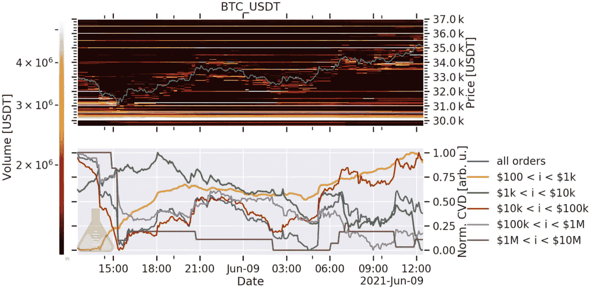

# 破纪录

> 原文：<https://medium.com/coinmonks/broken-record-f94f1bb7ee89?source=collection_archive---------5----------------------->

我倾向于你们中的许多人打开今天的*浓缩咖啡*认为贾维斯实验室的小伙子们可能有一些清晰。

这将是一些类似于“上，上，我们走”的东西。

倒车，卸货。

贪婪地购买市场。

毕竟，我们决定测试一个已经处于研究和设计阶段一个多月的 algo live。我个人称它为“捕刀者”,因为它看起来像是在称底部和顶部……当它到达绝对底部的 300 美元以内时，你会认为它需要原始的清晰度。

但是为了像算法一样在小时间尺度上操作，它使用短期记忆。从中长期来看，它不需要清晰。

这对我们没有帮助，因为我们试图意识到市场何时会从熊市回到牛市。

我没有在这方面给出一些好的指导，我担心我的文章听起来像一张破唱片，因为我们再次提到我们没有获得更多的清晰度。

事实是，我不确定我们会在下周之前对市场状况有更好的了解。在那之前，我们继续在没有风的波涛汹涌的海洋中遨游。

我们跟踪短期机会，因为它们有望演变成广泛的市场动力。

现在，为了解释为什么我们继续听起来像一张破唱片，我们的意思是…

昨天是我们一周以来看到的最大的价格波动。

价格首先下跌，并在 30k-35k 美元附近找到支撑，我们在周一的 onchain 支撑和阻力图中强调了这一点。这个地区是众所周知的最后一道防线。

然后，随着价格反转并跟踪上涨，我们有一个小小的空头挤压。

这是逐小时清算图。在大多数清算发生的那个小时，我们看到价格上涨了大约 2000 美元。把它分解到一个常规图表上，我们可以看到它发生在不到 30 分钟的时间里。

希望你们没人被卷进去。

根据 [Bybit](/coinmonks/bybit-exchange-review-dbd570019b71) 的说法，这有助于在过去 24 小时内总计超过 5 亿美元的清算。即使在这些事件之后，我们也看到 Bitfinex 上有大量职位空缺。

这些位置在多头和空头。昨天你可能已经看到这张图表以各种形式浮动。下面的红线表示比特币空头的数量，而绿色表示比特币多头的数量。

白色垂直线与做空兴趣的巨大变化成对出现。

所以我们能从这个图表中得出的是那些垂直的白线。

做空未平仓合约(OI)的这些重大变化往往与价格的大幅波动相一致。

不幸的是，在预测价格方向方面没有确凿的证据。相反，我们可以推断的是，对 OI 的兴趣越来越大，意味着人们再次对市场感兴趣。

如果我们想让 price 做点什么，这就是我们需要的。

现在熊市延续的主要关注点是线上活动。我们不断看到巴勃罗在这里和那里的交易。也看到一些看跌警报被触发。

事实上，我的战友本杰明(Benjamin)连续工作了近 24 个小时，以发现一些交易。经过这样一段时间后，我们两人都满意地说，我们正处于市场的十字路口。

价格有一个强大的泵，形成了一个强大的 V 型反转。在这种情况下，交易者倾向于进场确认反转。目前看来情况并非如此。

帕布罗看起来还没有完全完成。自周一以来，他一直在周期性地移动，并且仍有另一轮在会议厅中。

此外，稳定的阴线并没有在这次 V 型反转中出现。这意味着干粉的缺乏表明目前需求较低。

最后，鲸鱼还没有升级。

该图表下半部分的 CVD 指示器展示了这一点(h/t:材料指示器)。棕色和紫色的线是两条需要注意的线。他们挂在右下角的事实不是我们想看到的。

这意味着 10 万到 1000 万美元的订单是市场卖出，而右上角的线是市场买入。

这意味着市场推动者并不是价格上涨的幕后推手。他们让价格自由波动。它在哪里着陆，就在哪里着陆。

至于他们什么时候可能会从板凳上站起来，参与这场疯狂的投机是在下周。

下周周三，美联储将试图消除对量化宽松放缓的任何担忧，同时暗示未来将收紧货币政策。

应该是满口胡言乱语。随着 J Pow 成为美联储及其权力机构的精心打扮的发言人，他可能会在一定程度上成功消除对未来紧缩的担忧。

观察市场对这一事件的反应会很有趣。如果 crypto 真的再次下跌，我的直觉告诉我，这可能是最后的主要买入机会之一。

由于 Pablo 仍在移动，市场上缺乏鲸鱼，并且担心美联储的到来，所以最好保持警惕。

你的脉搏在加密，

本·莉莉

> 加入 [Coinmonks 电报频道](https://t.me/coincodecap)，了解加密交易和投资

## 另外，阅读

*   [什么是保证金交易](https://blog.coincodecap.com/margin-trading) | [美元成本平均法](https://blog.coincodecap.com/dca)
*   [3 商业评论](/coinmonks/3commas-review-an-excellent-crypto-trading-bot-2020-1313a58bec92) | [Pionex 评论](/coinmonks/pionex-review-exchange-with-crypto-trading-bot-1e459d0191ea) | [Coinrule 评论](/coinmonks/coinrule-review-2021-a-beginner-friendly-crypto-trading-bot-daf0504848ba)
*   [莱杰 vs n rave](/coinmonks/ledger-vs-ngrave-zero-7e40f0c1d694)|[莱杰 nano s vs x](/coinmonks/ledger-nano-s-vs-x-battery-hardware-price-storage-59a6663fe3b0) | [币安评论](/coinmonks/binance-review-ee10d3bf3b6e)
*   [Bybit Exchange 审查](/coinmonks/bybit-exchange-review-dbd570019b71) | [Bityard 审查](/coinmonks/bityard-review-7d104239be35) | [CoinSpot 审查](https://blog.coincodecap.com/coinspot-review)
*   [3 commas vs Cryptohopper](/coinmonks/3commas-vs-pionex-vs-cryptohopper-best-crypto-bot-6a98d2baa203)|[赚取加密利息](/coinmonks/earn-crypto-interest-b10b810fdda3) | [网格交易机器人](https://blog.coincodecap.com/grid-trading)
*   最好的比特币[硬件钱包](/coinmonks/the-best-cryptocurrency-hardware-wallets-of-2020-e28b1c124069?source=friends_link&sk=324dd9ff8556ab578d71e7ad7658ad7c) | [BitBox02 回顾](/coinmonks/bitbox02-review-your-swiss-bitcoin-hardware-wallet-c36c88fff29)
*   [本地比特币评论](/coinmonks/localbitcoins-review-6cc001c6ed56) | [加密货币储蓄账户](https://blog.coincodecap.com/cryptocurrency-savings-accounts)
*   [比特币基地评论](/coinmonks/coinbase-review-6ef4e0f56064) | [德里比特评论](/coinmonks/deribit-review-options-fees-apis-and-testnet-2ca16c4bbdb2) | [FTX 交易所评论](/coinmonks/ftx-crypto-exchange-review-53664ac1198f)
*   [n 零审核](/coinmonks/ngrave-zero-review-c465cf8307fc) | [Phemex 审核](/coinmonks/phemex-review-4cfba0b49e28) | [PrimeXBT 审核](/coinmonks/primexbt-review-88e0815be858)
*   最佳[区块链分析](https://bitquery.io/blog/best-blockchain-analysis-tools-and-software)工具| [赚比特币](/coinmonks/earn-bitcoin-6e8bd3c592d9)
*   [加密套利](/coinmonks/crypto-arbitrage-guide-how-to-make-money-as-a-beginner-62bfe5c868f6)指南| [如何做空比特币](/coinmonks/how-to-short-bitcoin-568a2d0b4ae5)
*   [最佳加密交易信号电报](/coinmonks/best-crypto-signals-telegram-5785cdbc4b2b) | [MoonXBT 评论](/coinmonks/moonxbt-review-6e4ab26d037)