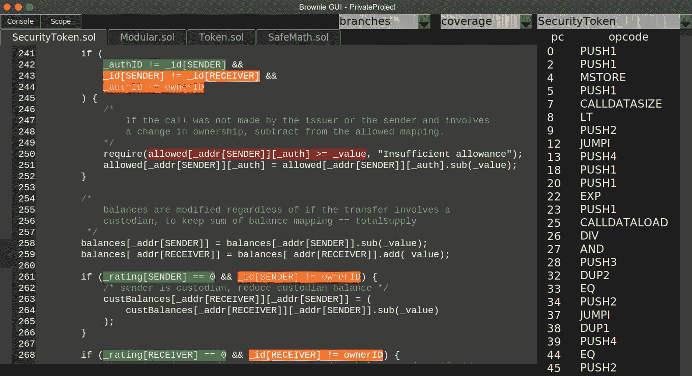

# Brownie:通过跟踪分析评估可靠性代码覆盖率

> 原文：<https://medium.com/coinmonks/brownie-evaluating-solidity-code-coverage-via-opcode-tracing-a7cf5a92d28c?source=collection_archive---------1----------------------->

## 以太坊智能合约的 Python 开发和测试框架


# 介绍

每个开发人员的武器库中的一个重要工具是评估他们测试的代码覆盖率的能力。覆盖率报告提供了一个高层次的概述，可以用来发现你的测试套件中的漏洞，虽然高覆盖率并不能保证高质量的测试，但是它确实提供了一个未被发现的 bug 可能潜伏在哪里的更好的感觉。考虑到智能合约的不可改变性和它们所保护的巨大价值，我们应该欢迎并利用开发过程中的每一个可用工具。

下面的文章讨论了 [Brownie](https://github.com/iamdefinitelyahuman/brownie) 如何通过跟踪分析处理代码覆盖率。它探讨了动机，给出了实现的概要，讨论了好处和挑战，并讨论了我们下一步的方向。

# 这为什么有用？

在我们探索技术细节之前……看，一个样本布朗尼分支覆盖报告！



Branch coverage report as displayed by the [Brownie GUI](https://eth-brownie.readthedocs.io/en/latest/gui.html)

每个突出显示的颜色表示该分支在测试期间的评估情况:

*   **绿色**树枝评估有真有假
*   **黄**枝只如实进行了评价
*   **橙色**分支仅被错误评估
*   **红色**分支未被评估

有了这个报告，您可以快速地看到您的测试是如何与您的合同交互的。它可以帮助您确定项目中哪些区域需要更多的测试，以及定位不可及的代码部分。

# 覆盖评估技术

概括地说，有两种评估覆盖率的方法:

*   **插装**涉及在整个代码中注入数据收集器，这些收集器用于准确地监控执行了哪些行和分支。这就是流行工具[的工作原理。](https://github.com/sc-forks/solidity-coverage)
*   **跟踪**包括在编译代码执行时监控其[程序计数器](https://en.wikipedia.org/wiki/Program_counter)，然后将执行的指令映射回特定的代码行。

检测实现起来要简单得多，也是更常用的方法。与跟踪相比，它的主要缺点是**侵入性的**——为监控执行而添加的功能意味着被评估的代码与将在生产中使用的代码不同。

此外，EVM 在天然气成本方面带来了一系列全新的挑战。每项作业都使用天然气，每个区块都有有限的天然气供应。检测契约意味着添加更多的操作，这又意味着增加部署和执行成本。为了保持在块气体限制内，这有时意味着运行修改的 EVM 规则集。因此，现在我们正在修改的虚拟机中测试一组修改后的代码！

由于这些原因，Brownie 使用跟踪分析而不是检测来执行覆盖率分析。我觉得测试真实代码的好处证明了构建这样一个系统的挑战是值得的。那么，从哪里开始呢？

# 实施基础

通过跟踪实现覆盖率的关键在于 Solidity 编译器返回的两个数据结构:

*   **抽象语法树**，它是源代码语法的标准化表示。布朗尼使用 [py-solc-ast](https://github.com/iamdefinitelyahuman/py-solc-ast) 来遍历 ast。
*   **部署了源代码映射**，其中编译后的操作码被映射到原始源代码。Brownie 将其扩展到自己的[程序计数器图](https://eth-brownie.readthedocs.io/en/latest/compile.html#program-counter-map)中，并在覆盖率分析中广泛使用。

通过分析 AST，我们可以定位语句和分支，然后使用源映射将它们与操作码关联起来。然后，我们查询单元测试期间运行的每个事务上的`[debug_traceTransaction](https://github.com/ethereum/go-ethereum/wiki/Management-APIs#debug_tracetransaction)` RPC 端点，并分析返回的数据以找出哪个代码被命中。对于契约调用，我们将它们作为事务进行广播以获得跟踪，然后立即倒带以确保状态没有改变。很简单，对吧？

让我们进入螺母和螺栓！

# 报表覆盖范围

语句是表达要执行的动作的语法单位。它们是独立的、线性的，在代码中只有一个入口和出口。

在 Solidity 中映射语句覆盖相对简单。首先，我们在 AST 中搜索最深的语句节点(不是另一个语句的父节点)。然后，我们遍历程序计数器映射，寻找具有包含在语句源偏移量内的源偏移量的操作码。只要找到一个，该操作码就与该语句相关联。我们知道，跟踪中出现该操作码意味着该语句已被执行。

# 分支覆盖

分支覆盖是事情变得有趣的地方。

分支是可以使程序执行不同代码的指令。在 EVM 中，分支由`JUMPI`操作码表示。在 Solidity 中，这些发生在 if 语句、require 语句和三元运算中。

为了映射分支覆盖，我们必须首先在 AST 中搜索以下节点:

*   `IfStatement` ( `if (x) {} else {}`)
*   `Conditional` ( `a = x > y ? 1 : 2;`)
*   `FunctionCall`包含一个`require`表达式(`require(x, "oopsie");`)

接下来，我们在这些节点的子节点中搜索`BinaryOperation`表达式(在分支中求值的操作，比如`x > y`或`returnsBoolFn()`)。因为我们还必须考虑嵌套操作，例如`((x > y) || (x — 4 < y))`，所以我们忽略任何包含也是`BinaryOperation`的子节点的`BinaryOperation`节点。

一旦生成了这个节点列表，我们接下来以类似于处理语句映射的方式关联操作码——寻找具有包含在节点偏移内的源偏移的操作码。我们还必须将这些操作码映射到`JUMPI`指令，我们用它来决定如何评估分支。为此，我们找到包含在 ast 源偏移量内的具有源偏移量的**最后一个**操作码，并将其与下一个`JUMPI`指令相关联。我们必须使用 last 操作码的原因与 Solidity 处理嵌套二进制操作中跳转指令的方式有关。

确定`JUMPI`的结果与分支评估为真还是假之间的关系取决于节点的类型及其相对于 AST 中其他节点的位置。有许多规则，也有许多例外。如果你还和我在一起，并且对这是如何处理的感兴趣，我邀请你查看相关的源代码。

所有这一切的最终结果是一个与源偏移量和跳转指令相关的操作码图，它可以用来确定一个分支是否已经执行，以及它的评估是真实的还是错误的！【feelsgoodman.jpg*T21*

# 执行时间

这种技术不是没有限制的，最大的限制是执行时间。对`debug_traceTransaction`的查询很慢！Brownie 试图通过几种方式来缓解这种情况:

1.  覆盖率数据是按每笔交易跟踪的。每当广播与已经评估的事务相同的事务时，结果从缓存中取出，而不是再次评估。有了设计良好的测试套件，这可以显著提高执行速度。
2.  Brownie 与`[pytest-xdist](https://eth-brownie.readthedocs.io/en/stable/tests-pytest-intro.html#using-xdist-for-distributed-testing)`插件兼容，允许并行执行测试。同样，适当的设计原则结合 xdist 的使用可以大大减少执行时间。
3.  Brownie pytest 插件包括一个`[--update](https://eth-brownie.readthedocs.io/en/stable/tests-pytest-intro.html#only-running-updated-tests)`标志，它允许你只运行涉及到已经改变的源文件的测试。Brownie 根据编译的字节码决定哪些文件发生了变化，因此调整注释或重命名变量不需要您重复测试。

# 你自己试试！

如果您想查看 Brownie 的覆盖率评估，您可以使用以下命令来安装 Brownie，下载 [Brownie Mix](https://github.com/brownie-mix) 令牌模板，运行测试，并打开 GUI:

```
pip install eth-brownie
brownie bake token
cd token
brownie test -C
brownie gui
```

如果你觉得这篇文章很有趣，或者你有任何想法、意见或批评，请联系我们！在下面留下评论，给我发一封[电子邮件](mailto:b.hauser@zerolaw.tech)或者在 [Gitter](https://gitter.im/eth-brownie/community) 或 [Telegram](https://t.me/iamdefinitelyahuman) 上找到我。我很想收到你的来信。

> [直接在您的收件箱中获得最佳软件交易](https://coincodecap.com/?utm_source=coinmonks)

[](https://coincodecap.com/?utm_source=coinmonks)