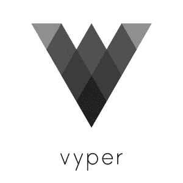

# 布朗尼·❤'s·维普

> 原文：<https://medium.com/coinmonks/brownie-s-vyper-6cb348cd614f?source=collection_archive---------0----------------------->

## …斯奈克也喜欢巧克力的美味。

Go easy on me, I’m a dev not a designer!

# 冗长的序言…

如果你曾经写过一份聪明的合同，你可能对可靠性有一些强烈的看法。这是我们都[喜欢](https://www.youtube.com/watch?v=JaUIxMJAOsA) [到](https://news.ycombinator.com/item?id=14691212) [讨厌](/@aidobreen/how-and-why-developing-for-ethereum-sucks-1ff1a9873527#caf5)的语言——语法接近 JavaScript，足以让你产生一种虚假的安全感，但充满了奇怪的设计选择和隐藏的陷阱。许多开发人员自信地投入其中，编写看似质量良好的代码，然后继续 [get](https://www.newsbtc.com/2017/08/25/rex-loses-1-3m-cryptocurrency-ico-funds-due-coding-error/) [绝对](https://cryptoslate.com/batchoverflow-exploit-creates-trillions-of-ethereum-tokens/) [rekt](https://blog.openzeppelin.com/on-the-parity-wallet-multisig-hack-405a8c12e8f7/) 。但是这些年来，随着我们接受 Solidity 的特性，我们从错误中集体吸取了教训。我们用它构建了金融巨兽，把我们的信任(和我们一生的积蓄)放在不可改变的、深奥的*节能意大利面条*里。

我喜欢认为我能写出最好的[令人困惑的可靠性](https://github.com/iamdefinitelyahuman/nftoken)，并且许多 [Brownie](https://github.com/iamdefinitelyahuman/brownie) 的调试能力是我的经验的结果。但我也经常想，我们是不是做错了？当被发起者使用时，可靠性可能是一个强大的工具，但是在有效的智能合约和可读的智能合约之间存在反向关联。要聪明；但是不要太聪明，否则你可能会失去所有的资金。当大多数智能合约是 ERC20s 或众筹销售，用简单的逻辑处理许多缺乏阅读代码能力的人的非常真实的钱时，我们真的应该聪明吗？

# 输入 Vyper🐍

Vyper 是一种智能合同语言，专注于安全性、可审计性和简单性。这是一个社区驱动的项目，主要受开发人员在编写和审计智能合同方面的经验的启发。

Vyper 的语法和流程旨在最大化可读性和安全性。为了实现这一点，Vyper 包括溢出检查、强键入和定点小数等功能。另一方面，某些功能被有意地限制，以防止出现不安全或难以阅读的代码。修饰符、继承、重载、无限循环；这些在 Vyper 根本不可能。

> “Vyper 并不努力成为在坚固性上可以做到的一切的 100%替代者；如果它认为为了增加安全的目标这样做是合适的，它将故意禁止事情或使事情变得更难。”

归根结底，这是关于拥有合适的工作工具。Vyper 不允许合同像 Solidity 中写的那样复杂，所以有些情况下它不适合。但是对于工作不需要高度复杂性的情况(我说的是 ICO 令牌)，它提供了可读性更好的代码，隐藏的缺陷明显更少。

# 一口钟情！

因此，我很高兴地宣布，截至 [v1.4.0](https://github.com/iamdefinitelyahuman/brownie/releases/tag/v1.4.0) ，[**布朗尼**](https://github.com/iamdefinitelyahuman/brownie) **为 Vyper 智能合约**提供全面支持。[回溯](https://eth-brownie.readthedocs.io/en/stable/core-transactions.html#debugging-failed-transactions)、[覆盖分析](/coinmonks/brownie-evaluating-solidity-code-coverage-via-opcode-tracing-a7cf5a92d28c)、[开发者还原字符串](/coinmonks/effective-smart-contract-testing-developer-revert-comments-c7a6f250df0f)、[状态测试](https://eth-brownie.readthedocs.io/en/stable/tests-hypothesis-stateful.html) —如果 Brownie 在 Solidity 能做到，那在 Vyper 也能做到。我不得不说，我肯定有偏见，但在 Python 智能契约语言上使用 Python 框架感觉非常好。🐍 🐍

我还和 Vyper 团队一起进一步开发这种语言和编译器。没人记分，我知道编码并不意味着竞争，但我目前在[提交计数](https://github.com/vyperlang/vyper/graphs/contributors)中排名第四(去死吧，Vitalik)。我们相处得非常好，他们甚至让我在测试合同的 Vyper 文档中突出布朗尼。

# “…但是我听说 Vyper 编译器错误百出！”

Vyper 编译器仍处于测试阶段，并不是没有问题。不幸的是，由于社区中的一些知名人士决定与它保持距离，它最近受到了媒体的负面报道。虽然我同意我们在编译那些注定要在我们最喜欢的区块链上不朽的代码时需要谨慎，但我认为应该进行一次理智检查。

事情是这样的:构建编译器是一项大工程！这是由人类完成的，那些黏糊糊的粉红色的东西有着被证实的犯错记录。不管你用的是 Vyper 还是 Solidity，假设你的编译器没有错误是一个错误的立场。你应该总是假设编译器*可能是错的*。因此，在实际部署之前对代码进行多层验证是绝对重要的。

审计不是无错代码的万能金章。在外部评审之前，一个开发良好的项目将采用静态分析、全面的单元测试和模糊测试等实践。正如我的一个好朋友所说，这些技术“是让代码*足够好的三重法宝”。*

哪个..哦嘿，你知道什么？布朗尼巧克力蛋糕可以帮你解决所有这些问题😎

现在去写点代码吧！

> [直接在您的收件箱中获得最佳软件交易](https://coincodecap.com/?utm_source=coinmonks)

