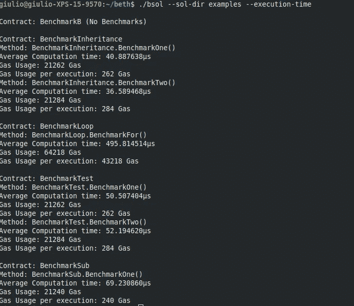

# BSOL:基准可靠性智能合同

> 原文：<https://medium.com/coinmonks/bsol-benchmarking-solidity-smart-contract-acd78f3b259b?source=collection_archive---------3----------------------->



当你编码时，你会做许多重复的动作，这些动作可以自动化，许多人会创建脚本来删除它们，有时他们甚至会向公众发布这些脚本。几周前，我制作了一个工具，可以自动估算智能合同中的天然气用量，这样我就不必为它编写无聊的 Javascript 了，我决定发布它。

我把这个工具叫做 BSOL(又名。基准坚固性)。BSOL 的目标是使估算天然气用量和执行时间变得更容易，并消除在智能合同中编写 Javascript 来估算天然气用量和执行时间的需要。那么现在，为什么它会有用，如何使用它呢？

# 为什么要对智能合同进行基准测试？

首先想到的是跟踪你的智能合同需要多少汽油才能工作，但如果你正在测试 EVM，你可能也会对你的[智能合同](https://blog.coincodecap.com/tag/smart-contact/)执行需要多长时间感兴趣。

任何人都可以通过编写一些 javascript 来估计智能合约需要的气体，而使用 BSOL，你可以不用编写任何 javascript，只需使用你的 Solidity 代码就可以做到这一点。

此外，您还可以检查您的[智能合同](https://blog.coincodecap.com/tag/smart-contact/)平均执行时间。这在研究气体使用和执行时间之间的关系时很有用。例如，它可以用来发现[以太坊](https://blog.coincodecap.com/tag/ethereum/) EVM 中的漏洞和可能的 DDOS 攻击。

# 你如何衡量你的智能合同

首先，你需要实际安装 BSOL:

```
git clone https://github.com/Giulio2002/bsol
cd bsol
sudo sh install.sh
```

一旦安装了 BSOL，我们就可以开始工作了:现在让我们假设以下令牌

token.sol

现在让我们编写以下基准契约:

token_benchmark.sol

BSOL 要做的是，获取每一份名称以“基准”开头的合同，并分析它们以“基准”开头的每一项功能。第一个基准契约在接收者尚未初始化时分析令牌传递函数。第二个基准契约通过在构造函数中初始化接收方来分析令牌传递函数。现在让我们运行我们的基准测试:

```
bsol --sol token_benchmark.solContract: BenchmarkToken
Method: BenchmarkToken.BenchmarkTransfer() # Initialized
Gas Usage: 33367 Gas
Gas Usage per execution: 12367 GasContract: BenchmarkTokenCreate
Method: BenchmarkTokenCreate.BenchmarkTransfer() # Not Initialized
Gas Usage: 48367 Gas
Gas Usage per execution: 27367 Gas
```

如果我们添加标志`--execution-time`,那么我们也得到了代码的平均计算时间(500 次运行):

```
bsol --sol token_benchmark.sol --execution-timeContract: BenchmarkToken
Method: BenchmarkToken.BenchmarkTransfer()
Average Computation time: 353.599576µs
Gas Usage: 33367 Gas
Gas Usage per execution: 12367 GasContract: BenchmarkTokenCreate
Method: BenchmarkTokenCreate.BenchmarkTransfer()
Average Computation time: 327.343436µs
Gas Usage: 48367 Gas
Gas Usage per execution: 27367 Gas
```

# 额外的东西

*   `--runs specifies out of how many runs we get our average`
*   `--sol specify single solidity source`
*   `--sol-dir specify an entire directory + subdirectories of solidity sources`

> [直接在您的收件箱中获取最佳软件交易](https://coincodecap.com/?utm_source=coinmonks)

[](https://coincodecap.com/?utm_source=coinmonks)