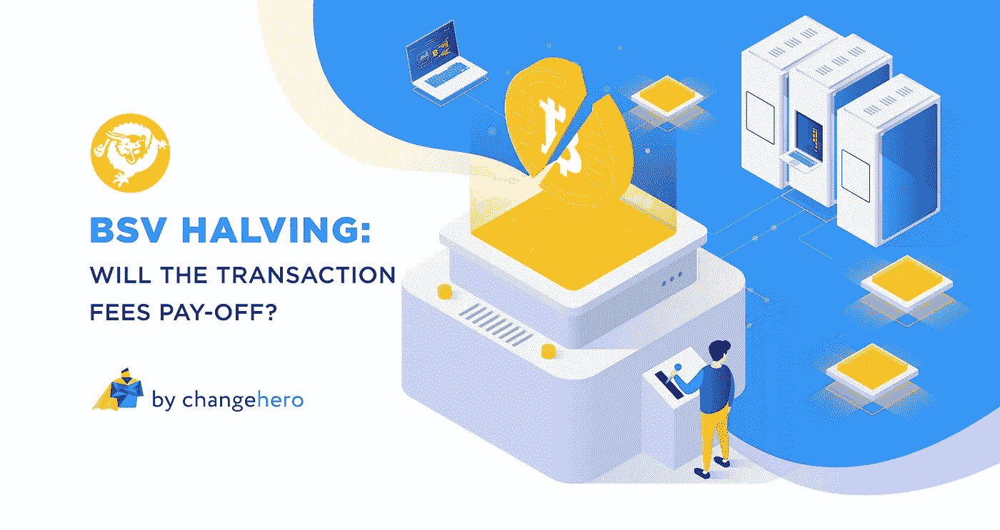

# BSV 减半:交易费会有回报吗？

> 原文：<https://medium.com/coinmonks/bsv-halving-will-the-transaction-fees-pay-off-2eb020787d3a?source=collection_archive---------6----------------------->

1 月初，比特币 SV 价格飙升，震惊了整个加密领域。随着社区中不断的讨论，该团队正准备在未来几周内对网络进行重大升级。减半活动将是一次至关重要的升级，因为这将是 BSV 的第一次，可能会对整个网络产生影响。

在这篇简短的文章中， [ChangeHero](http://changehero.io/) 将向你简要介绍你需要知道的关于 [BSV](https://bitcoinsv.com/en) 减半的一切。

> [发现并回顾最佳加密软件](https://coincodecap.com)

## **处女**

一个关于减半的快速背景故事——作为确认交易的回报，矿工将获得一笔奖励，在这种情况下是新开采的加密货币。这确保了矿工对网络的贡献受到激励。与美元不同，加密货币本质上是通货紧缩的，供应有限，仅指分散的货币。😉为了避免硬币的不当分配，中本聪引入了一种独特的现象，叫做平分。它减少了每 210，000 块的块奖励，并确保硬币的均匀分布，以维持加密货币的价值。寻找更多关于减半的信息？快速浏览[这篇文章](/the-capital/a-quick-guide-to-crypto-halving-3a4fb7d4587c)。

回到主题，BSV 即将经历未来几个月的第一次减半事件，由于创世纪的升级，这一消息受到了关注。虽然我们还没有一个确切的日期，但减半将在 block #630，000 进行，预计在 4 月进行。在首次减半活动后，目前的 12.5 BSV 的街区奖励将减少到 6.25 BSV。

## 矿工周围的一切

2020 年将被载入密码的史册，因为三个基于比特币的链将在三个月内减半。虽然日期可能会有所不同，但预计 BSV 和 BCH 减半将发生在 BTC 之前。另一方面，矿商投入大量资金来获得计算能力和找到区块。随着大宗报酬的减少，矿商最初会寻找其他有利可图的方法。由于所有三个链都运行在 SHA-256 散列算法上，在 BSV 短时间内将额外奖励减半后，矿商很有可能立即转向 BTC 链。不管怎样，现在预测还为时过早，最好等待事情的发展。

此外，有人批评矿工为 BSV 矿业做出了贡献，却无法实现收支平衡。雪上加霜的是，减半的初步印象看起来确实对矿工不利，因为奖励将减半。只有两种方式可以让人们发现采矿是有利可图的——一种是增加密码的价值，另一种是来自区块的交易费。押注硬币的未来价格可能不是最佳选择，因为影响 BSV 价格的因素太多了。BSV 团队旨在通过向矿工支付交易费来应对这一问题，从而将采矿转变为一项有利可图的活动。作为 2 月初 Genesis Hard Fork 的一部分，通过增加块大小和完全取消限制，这将成为可能。快速提醒:快速浏览[这篇文章](/coinmonks/bitcoin-sv-genesis-hard-fork-restoring-satoshis-vision-a58c3a870714?source=your_stories_page---------------------------)以了解更多关于 BSV 创世纪硬叉的信息。

该团队正在 STN 上研究这个特性，最近报告了一些令人印象深刻的数据。1 月 25 日，14893 号数据块的挖掘量超过 1GB，包含 5，449，866 个巨大的事务。作为顶部的樱桃，该块已经在 BSV 产生了 10.73654716 美元的费用，约为 3000 美元。这肯定会引起矿工的注意，让他们留在船上。

截至发稿时，BSV 的交易价格为 301.46 美元，流通供应量为 18，222，577 BSV，大宗交易数量为#619591。由于这是该连锁店有史以来第一次减半，并且没有历史数据可以借鉴，因此预测减半后 BSV 的价格几乎是不可能的。

## **在雷达下飞行**

虽然没有太多关于 BSV 减半的讨论，但这一事件似乎确实引发了网络的重大变化。在短期内，我们可能会看到寻求利润的矿商转移到其他链。相反，从长远来看，通过在一个块中用更多的事务进行补偿来达到减半的目标，完全有可能获得成功。

简而言之，减半的结果与 Genesis 升级密切相关，Genesis 升级提高了块大小限制，允许每个块有更多的事务。这反过来会导致矿商支付更多费用，尽管每笔交易的网络费用很低，最终用户和矿商都是赢家。很明显，BSV 团队选择了一种明智的方式来应对奖励减少，并以可扩展链的愿景为人们和企业建立一个更美好的世界。

一如既往，敬请关注[推特](https://twitter.com/Changehero_io)、[脸书](https://www.facebook.com/Changehero.io)和[媒体](/@changehero)上的 [ChangeHero](https://changehero.io/) ，了解更多此类信息丰富的内容和加密交易所的精彩优惠。

> [直接在您的收件箱中获得最佳软件交易](https://coincodecap.com/?utm_source=coinmonks)

